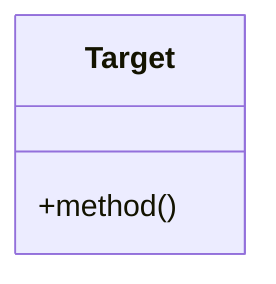

# フォーマット: Hugo Markdown (技術ブログ用)

Hugoで構築された技術ブログ用のMarkdown記事フォーマットです。

## 1. Frontmatter (YAML)

記事の先頭には必ず以下のフォーマットでFrontmatterを含めてください。

```yaml
---
date: {公開日時 (例: 2026-03-05T12:00:00+09:00)}
description: "{SEO最適化されたdescription（120文字以内）}"
draft: false
categories:
  - tech
tags:
  - design-pattern
  - perl
  - {パターン名等のケバブケース}
  - {シリーズタグ}
title: '{SEO最適化されたタイトル}'
toc: true
---
```

**タグのルール:**
- 日本語タグは禁止。すべて英小文字とハイフン（ケバブケース）を使用する。
- 汎用的な単語（`oop`, `programming` など）は避け、具体的で一意なタグにする。
- `design-pattern` はカテゴリではなくタグに設定する。

## 2. 見出し構造

- タイトルはFrontmatterの `title` に記述するため、本文内に `# タイトル` (H1) は含めない。
- 本文は `## 見出し` (H2) から開始し、適宜 `### 小見出し` (H3) を使用して階層化する。

## 3. コードブロック

- コードブロックには必ず言語名（例: `perl`, `yaml`, `bash`）を明記する。
- 重要な部分をハイライトする場合は、Hugoの機能やコメントを活用して目立たせる。
- 必要に応じて、ファイル名やパスをコードブロックの直前にコメント等で示す。

## 4. Mermaid図

- クラス図やシーケンス図など、アーキテクチャの解説には積極的にMermaid図を使用する。
- ブロックの言語指定は `mermaid` とし、正しくレンダリングされる構文を遵守する。


