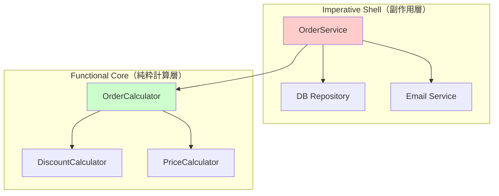

# Phase 5: Mermaid図・挿絵

> 前: `/oop-fp-hybrid-series-nav` または `/oop-fp-hybrid-unified-write` | 次: `/oop-fp-hybrid-review`

---

## Step 1: Mermaid図の追加

構造案に指定された Mermaid 図を追加:

| 回/章 | 図の種類 | 内容 |
|------|---------|------|
| 2 | フロー図 | イミュータブル更新フロー |
| 5 | レイヤー図 | FCISレイヤー図（**必須**） |
| 6 | フロー図 | 型制約フロー図 |
| 7 | 構成図 | テスト戦略図 |
| 8 | アーキテクチャ図 | 全体アーキテクチャ図（**必須**） |

### Mermaid図の例（第5回/章: FCISレイヤー図）



---

## Step 2: 挿絵の生成

`generate_image` ツールを使用して各記事/章に挿絵を生成:

### 共通アイキャッチ画像

- **用途**: 全記事の frontmatter `image:` に指定
- **保存先**: `static/public_images/%Y/oop-fp-hybrid-header.png`
- **内容**: OOPとFPの融合をイメージした抽象的なビジュアル

### 個別挿絵（各回/章）

| 回/章 | ファイル名 | 内容 |
|------|-----------|------|
| 1 | `oop-fp-hybrid-ep1-broken.png` | 壊れたコード、バグのイメージ |
| 2 | `oop-fp-hybrid-ep2-immutable.png` | 固定された安全なオブジェクト |
| 3 | `oop-fp-hybrid-ep3-pure.png` | 純粋関数、入力→出力 |
| 4 | `oop-fp-hybrid-ep4-pipeline.png` | データ変換のパイプライン |
| 5 | `oop-fp-hybrid-ep5-layers.png` | コアとシェルの層構造 |
| 6 | `oop-fp-hybrid-ep6-types.png` | 型による境界線、ガード |
| 7 | `oop-fp-hybrid-ep7-testing.png` | テスト、チェックマーク |
| 8 | `oop-fp-hybrid-ep8-complete.png` | 完成したシステム、調和 |

---

## Step 3: 画像の配置

1. 生成した画像を `static/public_images/%Y/` に保存
2. 記事内の適切な位置に画像を埋め込み:

```markdown

```

---

## 完了後

→ `/oop-fp-hybrid-review` へ進む
