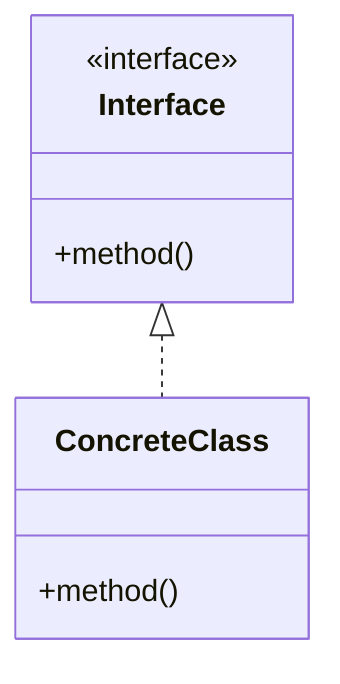

# Phase 3: 原稿作成（汎用）

> 前: `/series-unified-code` | 次: `/series-unified-visual`
> 知見ベース: [workflow-insights.md](../../agents/knowledge/workflow-insights.md)

---

## Step 0: 知見の読み込み

// turbo
1. 知見ファイルの確認:
   ```bash
   grep -A 20 "series-unified-write" agents/knowledge/workflow-insights.md 2>/dev/null
   ```
2. 関連する知見を抽出し、今回の執筆に活かす
3. 特に「成功パターン」と「失敗パターン」に注目

---

## 前提条件

以下がPhase 2で完了済み：

- 全コード例の実装
- テスト実行・全pass

---

## Step 1: 記事ファイルの作成

公開日時に基づきファイルを作成：

```bash
# 例: 2026-02-01T01:51:06+09:00 の場合
# ファイル名: HHMMSS.md
touch content/post/2026/02/01/015106.md
```

---

## Step 1.5: ステータス更新

PLANNING_STATUS.md を更新:

1. ステータスを「⚙️ 執筆中」に変更
2. 更新日を本日に更新

---

## Step 2: frontmatterの作成

以下の形式でfrontmatterを記述：

```yaml
---
date: {公開日時}
description: "{SEO最適化されたdescription（120文字以内）}"
draft: false
tags:
  - {言語タグ}
  - {シリーズタグ}
  - {パターン/技術タグ}
title: '{SEO最適化されたタイトル}'
toc: true
---
```

### タグの選定

構造案の推奨タグを参考に、以下を含める：

- 言語タグ（例: `perl`, `python`）
- シリーズ固有タグ（例: `perl-design-patterns`）
- 技術/パターンタグ（例: `command-pattern`, `factory-pattern`）

---

## Step 3: 導入部の作成

記事冒頭に以下を含める：

1. **フック**: 読者の課題・悩みを提示
2. **解決策の提示**: この記事で何ができるようになるか
3. **習得内容一覧**: パターン/技術の表形式まとめ
4. **対象読者**: 前提知識・推奨スキル
5. **技術スタック**: 使用する言語・ライブラリ

---

## Step 4: 本文の作成（統合版）

構造案の各回を「章」として統合：

### 各章の構成（医療メタファーを使用）

> 詳細は `agents/knowledge/code-doctor-characters.md` を参照

```markdown
## {問診/診断/手術/退院指導}: {章タイトル}

### 前章の振り返り
（第2章以降）

### 動く：最初の実装
```コード例1（問題版）```

### 破綻：問題が発生
問題点の説明

### 完成：パターン導入
```コード例2（改善版）```

### 今回のポイント
- ポイント1
- ポイント2
```

### 章間の接続

- 各章の終わりに次章への誘導
- 前章との関連性を明示
- ストーリーの連続性を維持

---

## Step 5: まとめ章の作成

最終章で以下を含める：

1. **全体の振り返り**: 学んだパターン/技術の一覧
2. **パターン間の関係**: 図やダイアグラムで可視化
3. **なぜこの選択をしたか**: 設計判断の理由
4. **次のステップ**: 発展的な学習への誘導

---

## Step 6: コード例の埋め込み

Phase 2で作成したコードを記事に埋め込み：

1. `agents/tests/{SLUG}/lib/` からコードを参照
2. 必要に応じて説明コメントを追加
3. 長いコードは重要部分のみ抽出

---

## Step 7: Mermaid図の追加

構造案で指定されたMermaid図を追加：



---

## Step 8: 知見の記録

今回の執筆で得た気づきを `agents/knowledge/workflow-insights.md` に追記:

```markdown
## YYYY-MM-DD: <コンテンツ名>

### ワークフロー: series-unified-write

### 知見タイプ: <成功/失敗/発見/フィードバック/改善>

**コンテキスト**: <状況の説明>

**知見**: <学んだこと>

**適用場面**: <今後どんな場面で活用できるか>
```

---

## 完了後

→ `/series-unified-visual` へ進む

---

## 連載版の場合

連載版（複数記事）の場合は以下の追加作業：

1. 各回を個別の記事ファイルとして作成
2. frontmatterに連載情報を追加
3. 前回/次回へのリンクを追加
4. 目次記事を別途作成

→ `/series-article-writing` も参照
