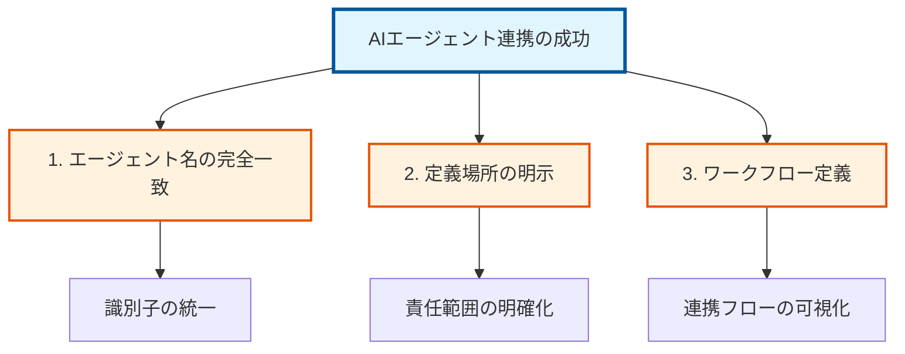
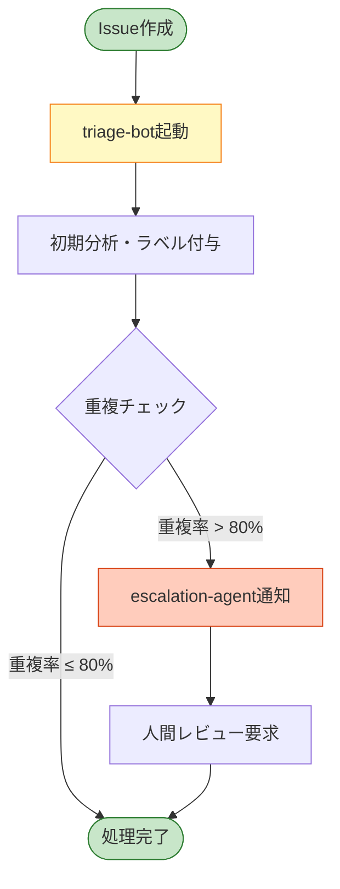

## はじめに：なぜAIエージェント連携が重要なのか

## この記事を読む前に

この記事は以下の知識がある方を対象としています：

- **GitHub Copilotの基本的な使い方**: VS Code拡張機能として使用した経験
- **Markdownの基本構文**: 見出し、リスト、コードブロックの記述方法
- **GitHubリポジトリの操作**: clone, commit, pushの基本操作

上記の知識がない方は、まず以下のリソースをご覧ください：
- [GitHub Copilot入門記事（関連記事）](/tags/github-copilot/)
- [Markdown記法の基礎](/tags/markdown/)

また、この記事では以下の用語を使用します。初出時に簡単な説明を付けていますが、事前に理解しておくとスムーズです：

| 用語 | 簡単な説明 |
|------|-----------|
| **AIエージェント** | 特定のタスクを自律的に実行するAIプログラム |
| **AGENTS.md** | プロジェクトのルートに置く、AIエージェント向けの設定ファイル |
| **プロンプトエンジニアリング** | AIに適切な指示を与えて望む結果を得る技術 |
| **ReAct/Reflexion** | AIエージェントの動作パターン（詳細は本文で解説） |

## はじめに：なぜAIエージェント連携が重要なのか

<!-- 内部リンク提案: automation、developer-productivity タグの記事へのリンクを検討 -->

2025年、AIエージェントを活用した開発が急速に普及し、開発現場における **生産性向上の鍵** となっています。GitHub Copilotをはじめとする様々なAIエージェントを効率的に連携させることで、コーディング速度を最大3倍に向上できるという調査結果も報告されています。

関連記事: [開発自動化のベストプラクティス](/tags/automation/)、[開発者生産性向上のヒント](/tags/developer-productivity/)

しかし、多くの開発者が直面する課題は「**複数のエージェントをどう連携させるか**」です。本記事では、DeNAが公開したLLM勉強会資料の実践的な知見をベースに、**AGENTS.md**という標準化されたフォーマットを使った **AIエージェント連携の実践方法** を、具体的な実装例とともに徹底解説します。

**この記事で学べること：**
- AGENTS.mdによるエージェント標準化の方法
- DeNA推奨のプロンプトエンジニアリング原則
- 実践的なワークフロー構築テクニック
- よくある課題とその解決策

## DeNAのLLM勉強会資料から学ぶAIエージェント活用の基礎

<!-- 画像提案: DeNA勉強会資料のスクリーンショット（引用元を明記） 
     alt属性案: "DeNA LLM勉強会資料のプロンプトエンジニアリング原則を示すスライド" -->

### 実践的な学習リソースの宝庫

DeNAが2025年12月に公開した「**AIエンジニアが本気で作ったLLM勉強会資料**」は、AIエージェント連携を学ぶ上で極めて価値の高い教材です。実務経験に基づく知見が詰まっており、すぐに実践できる内容となっています。

**主要リソース：**
- **GitHubリポジトリ**: [DeNA/llm-study20251201](https://github.com/DeNA/llm-study20251201) - DeNAのLLM勉強会資料（全資料が公開されています）
- **参考**: DeNAエンジニアリングブログでも詳細が紹介されています

この資料の特筆すべき点は、**3時間という限られた時間で基礎から応用まで体系的に学べる構成**になっていることです。特にプロンプトエンジニアリングのセクションでは、実務で重要な原則が明示されており、AIエージェント設計の核心を理解できます。

### プロンプトエンジニアリングの核心原則：シンプル化の重要性

<!-- 内部リンク提案: prompt-engineering タグの関連記事へリンク -->

DeNA資料が強調する最も重要な原則は「**シンプル化**」です。これは多くの開発者が見落としがちな、しかしAIエージェント活用において最も重要な考え方です。

関連記事: [プロンプトエンジニアリングの実践](/tags/prompt-engineering/)

> 「単に『指示をどんどん足しまくらないで！　一旦全体を見直してシンプル化する』という、**実務で大事なコツ**も明記」

この原則は、AIエージェント連携においても同様に重要です。複雑な指示を積み重ねるのではなく、**全体を俯瞰して最適化する視点**が求められます。実際、過度に複雑化したプロンプトは、エージェントの応答精度を低下させ、予期しない動作を引き起こす原因となります。

**プロンプト設計のベストプラクティス：**

- **明確性と具体性**: 曖昧さを徹底的に排除し、期待する出力形式を具体的に明示する
- **反復的改善**: 初期プロンプトから段階的に改善し、効果を検証する
- **全体最適化**: 指示の追加よりも全体設計の見直しを優先する思考法
- **シンプルさの追求**: 複雑さは最終手段として捉え、常にシンプルな解決策を模索する

💡 **実践ヒント**: プロンプトを書く前に「この指示は本当に必要か？」と自問する習慣をつけると、自然とシンプルで効果的なプロンプトが書けるようになります。

## AIエージェント連携を成功させる3つの重要ポイント

<!-- 画像提案: エージェント連携の概念図
     alt属性案: "AIエージェント連携における3つの重要ポイントを示す図解" -->

AIエージェントを効果的に連携させるには、以下の3つのポイントを確実に押さえる必要があります。これらは実装の成功を左右する **必須要件** です。



### 1. エージェント名の完全一致：連携の基盤

エージェント間で参照する際の **名前（識別子）は、すべての定義箇所で完全に一致** させる必要があります。これは最も基本的ですが、見落とされがちなポイントです。

```yaml
# ✅ 良い例: 名前が一致している
## Agent: triage-bot
purpose: "Label new issues, detect duplicates"

# 別の箇所でも同じ名前で参照
workflow:
  - agent: triage-bot
```

```yaml
# ❌ 悪い例: 名前が不一致
## Agent: triage-bot
purpose: "Label new issues"

# 別の箇所で異なる名前で参照（エラーの原因）
workflow:
  - agent: issue-triage  # triage-bot と不一致
```

⚠️ **注意**: 名前の不一致は、エージェントが正しく連携できない **最も一般的な原因** の一つです。大文字小文字やハイフンの有無も厳密にチェックしましょう。

### 2. 定義場所の明示：責任範囲の明確化

各エージェントの **定義場所（設定ファイル、権限、スコープ）を明確に文書化** します。これにより、エージェントの責任範囲が明確になり、予期しない動作を防ぎ、トラブルシューティングを容易にします。

**必須定義項目：**

| 項目 | 説明 | 例 |
|------|------|-----|
| **purpose** | エージェントの目的 | "新規Issueのラベリングと重複検出" |
| **model** | 使用するLLMモデル | "gpt-4-turbo", "claude-3-opus" |
| **context** | アクセス可能なコンテキスト | "issues/", "pull-requests/" |
| **triggers** | 実行トリガー | "issue_opened", "pull_request_created" |
| **permissions** | 許可された操作 | ["read_issues", "write_labels"] |

💡 **ベストプラクティス**: 各エージェントに `README.md` を添付し、目的と使い方を記載すると、チーム全体での理解が深まります。

### 3. ワークフロー定義：連携フローの可視化

エージェント間の **連携フロー（どのエージェントがいつ、どのように他のエージェントと連携するか）** を明確に定義します。フローチャートや順序図で可視化すると、チーム全体での理解が促進されます。

**ワークフロー定義の例：**

```markdown
## Issue Triage ワークフロー

1. **Issue作成検知** → triage-bot が自動起動
2. **初期分析** → triage-bot がカテゴリとラベルを自動付与
3. **重複チェック** → 既存Issueとの類似度を計算
4. **条件分岐**:
   - 重複率 > 80% → escalation-agent に通知
   - 重複率 ≤ 80% → 処理完了
5. **エスカレーション** → escalation-agent が人間レビューをリクエスト
```

このワークフローをMermaid図で可視化すると以下のようになります：



<!-- 画像提案: ワークフロー図（Mermaidなどで作成）
     alt属性案: "Issue Triageワークフローにおけるエージェント連携フロー図" -->

📊 **可視化ツール推奨**: Mermaid、draw.io、Lucidchartなどを使用してワークフローを図解すると、複雑な連携も理解しやすくなります。

## AGENTS.md：AIエージェント設定の標準フォーマット徹底解説

<!-- 内部リンク提案: agents-md タグの関連記事へリンク -->

### AGENTS.mdとは何か？

**AGENTS.md**は、プロジェクトのルートディレクトリに配置する **AIエージェント向けの標準化された設定ファイル** です。Markdownベースで人間にも読みやすく、機械的にも処理しやすい形式になっています。

関連記事: [AGENTS.md実践事例](/tags/agents-md/)

**参考**: AGENTS.mdは、AIエージェント向けの標準化された設定ファイルフォーマットとして、複数のプロジェクトで採用されています。このリポジトリの[AGENTS.md](https://github.com/nqou-net/www.nqou.net/blob/main/AGENTS.md)もこの形式に準拠しています。

**AGENTS.mdの3つの主要目的：**

1. **機械読み取り可能なREADME**: エージェントがプロジェクトを理解するための情報源
2. **ベンダー固有設定の統一**: `.copilot-config.json`、`.cursor-rules` などの増殖を防止
3. **明確な指示提供**: エージェントの動作を統制し、一貫性を保つ

🎯 **メリット**: チーム全体でエージェント設定を共有でき、属人化を防げます。新メンバーのオンボーディングも大幅に効率化されます。

### AGENTS.mdの基本構造

AGENTS.mdは、以下のような構造を持ちます。

```markdown
# AGENTS.md

## Agent: エージェント名
purpose: "エージェントの目的"
model: 使用するモデル
temperature: 温度パラメータ

### Context Sources（コンテキストソース）
- アクセス可能なファイルやディレクトリ

### Triggers（トリガー）
- エージェントが起動する条件

### Permissions（権限）
allowed: [許可された操作]
forbidden: [禁止された操作]

### Tools（ツール）
- 使用可能なツールやAPI

### Guardrails（ガードレール）
- エスカレーション条件
- 安全性制約
```

### 実践的なAGENTS.md例

このリポジトリ（www.nqou.net）の実際のAGENTS.mdから、重要な部分を抜粋します。

```markdown
# AGENTS.md — リポジトリ用エージェント向けガイダンス

## コミュニケーション

- 原則として日本語で応答する
- 技術用語やコードは英語のまま記載してよい

## プロジェクト概要

- 目的: Hugo を用いた個人の技術ブログの管理
- 主要技術: Hugo、Markdown、必要に応じた補助スクリプト（例: Perl）
- 重要なディレクトリ:
  - `content/` — ソースコンテンツ（投稿は `content/post/`）
  - `layouts/`, `partials/`, `shortcodes/` — テーマやレイアウト
  - `static/` — 静的アセット
  - `docs/` — 生成済みサイト（読み取り専用扱い）

## コンテンツ作成ルール

- フロントマターは YAML（`---`）で記述する
- 投稿はドラフト中は `draft: true` にする
- タグは英語小文字・ハイフン形式（例: `object-oriented`）
- 見出しは ATX スタイル（`##` 以上）を使用
```

このように、プロジェクト固有のルールや制約を明確に記述することで、エージェントが一貫した動作を実現できます。

## カスタムエージェントの定義と連携

### エージェントトピックマッピング

専門性に応じてエージェントを分類し、適切なタスクに割り当てます。このリポジトリでは以下のようなマッピングを使用しています。

**技術分野別エージェント**:

- Perl / CPAN / ワンライナー: `perl-monger`
- SQL / クエリ最適化: `sql-otaku`
- Docker / コンテナ運用: `docker-otaku`
- Git / ブランチ運用: `git-otaku`
- カスタムエージェント: `github-copilot-otaku`

**コンテンツ制作エージェント**:

- 調査・情報収集: `investigative-research`
- 記事構成・編集: `blog-planner`, `blog-editor`
- 公開前の最終チェック: `reviewer`

### ワークフロー定義の実例

実際のブログ記事作成ワークフローを例に、エージェント連携を見てみましょう。

```markdown
## 単体記事のワークフロー

1. 調査・情報収集（investigative-researchエージェント）
   - キーワードおよび関連トピックの調査
   - 参考URLの収集
   - 競合記事の分析

2. アウトライン作成（search-engine-optimizationエージェント）
   - タイトルの最適化
   - 見出し構造の整理
   - 構造化データの導入

3. 下書き生成（各専門家エージェント）
   - アウトラインに基づいて下書きを作成
   - コード例、図表を配置
   - 引用元のURLを明記

4. スタイルと構成の整形（layout-and-content-harmonizationエージェント）

5. 校正（proofreaderエージェント）

6. SEO（search-engine-optimizationエージェント）

7. 公開前の最終チェック（reviewerエージェント）
```

各段階で適切なエージェントに処理を委譲することで、品質と効率を両立させています。

## AIエージェント連携パターン

エージェント連携には確立されたパターンがいくつか存在します。

### ReActパターン（Reasoning + Acting）

ReActは「思考」と「行動」を交互に繰り返すループです。このパターンは、複雑な問題解決において、段階的に推論と実行を行うことで、透明性の高いAIエージェントを実現します。

**プロセス**:

1. **Thought（思考）**: LLMが計画または次の推論ステップを生成
2. **Action（行動）**: LLMがアクションまたはツールを選択して実行
3. **Observation（観察）**: システムがアクションの結果を記録
4. **Loop（ループ）**: 前回の観察を踏まえて次のサイクルを開始

**最適な使用例**:

- 複雑な多段階推論タスク
- 外部ツールを使用するタスク
- 動的に変化する環境での作業

**制限事項**:

- 短期記憶に限定
- 過去のエラーから学習する能力が限定的

### Reflexionパターン（自己反省的改善）

Reflexionは、明示的な自己評価と長期記憶による複数回試行の改善を行うパターンです。エラーから学習し、次の試行で改善された結果を生み出すことができます。

**プロセス**:

1. **Trial（試行）**: タスク解決を試行
2. **Evaluation（評価）**: 成功/失敗を判定
3. **Reflection（反省）**: LLMが言語的評価を生成（「なぜ失敗したか？」）
4. **Memory Update（メモリ更新）**: 洞察を将来の試行のために保存
5. **Next Trial（次の試行）**: 蓄積された学習を活用してより良いアプローチを実施

**最適な使用例**:

- 最適化タスク
- 間違いから学習が必要なタスク
- コード生成
- 複雑な科学的推論

**制限事項**:

- 計算コストが高い（多数の試行/LLM呼び出しが必要）
- 明確な成功/失敗シグナルが必須
- 時間が重要なタスクには不適

### パターン選択のガイドライン

| パターン | 主要機能 | 強み | 適用シーン |
|---------|---------|------|-----------|
| ReAct | 思考-行動ループ | リアルタイムツール使用、透明性 | ステップバイステップのツール駆動タスク |
| Reflexion | 複数回試行の反省 | 自己修正、失敗からの学習 | エラーが発生しやすい適応的タスク |
| ハイブリッド | マルチパス推論 | 両方の最良の機能、堅牢性 | 困難な推論タスク |

## 実践: AGENTS.mdの作成手順

### 今すぐ試せる！最初の5分でAGENTS.mdを作る

まず、最も簡単な方法で実際に手を動かしてみましょう。以下の手順で、あなたのプロジェクトに最初のAGENTS.mdを作成できます。

#### Step 1: ファイルを作成する

プロジェクトのルートディレクトリで`AGENTS.md`ファイルを作成します。

```bash
# プロジェクトのルートディレクトリで
cd /path/to/your/project
touch AGENTS.md
```

#### Step 2: 基本情報を記述する

以下のテンプレートをコピー＆ペーストし、あなたのプロジェクトに合わせて書き換えます。

```markdown
# AGENTS.md

## プロジェクト概要
- 目的: [あなたのプロジェクトの目的を1行で]
- 主要技術: [使用している技術スタック、例: Python, FastAPI, PostgreSQL]

## コミュニケーション
- 使用言語: 日本語
- コード内のコメント: 英語推奨
```

#### Step 3: 最初のエージェントを定義する

シンプルな例として、コードレビューエージェントを定義してみます。

```markdown
## Agent: code-reviewer
purpose: "プルリクエストのコードレビューを支援する"
model: "gpt-4"

### Context Sources
- `src/**/*.py` - Pythonソースコード
- `tests/**/*.py` - テストコード

### Triggers
- プルリクエスト作成時
- コードの変更がある場合

### Permissions
allowed: ["read_code", "write_comments"]
forbidden: ["merge_pr", "delete_files"]
```

#### Step 4: コミット＆プッシュ

```bash
git add AGENTS.md
git commit -m "Add AGENTS.md for AI agent configuration"
git push
```

#### Step 5: GitHub Copilotで試してみる

VS Codeで GitHub Copilot Chat を開き、以下のように質問してみましょう：

```
このプロジェクトについて教えて
```

AGENTS.mdを読んで、プロジェクトの概要やエージェントの役割を理解した上で回答してくれるはずです。

✅ **完了！** これで最初のAGENTS.mdが作成できました。

### 詳細な作成手順（ステップバイステップ）

より詳しく、実践的なAGENTS.mdを作成するには、以下の手順を踏みます。

### ステップ1: プロジェクトの理解

まず、プロジェクトの構造、技術スタック、開発フローを整理します。

**確認すべき項目**:

- プロジェクトの目的
- 使用している技術（フレームワーク、言語、ツール）
- ディレクトリ構造
- ビルド・テスト・デプロイの手順
- コーディング規約

### ステップ2: エージェントの役割定義

必要なエージェントとその役割を洗い出します。

**考慮すべき観点**:

- どのタスクを自動化したいか
- 各タスクに必要な専門知識は何か
- エージェント間の依存関係はあるか

### ステップ3: AGENTS.mdの作成

基本テンプレートから始めて、プロジェクト固有の情報を追加します。

```markdown
# AGENTS.md

## プロジェクト概要
- 目的: [プロジェクトの目的]
- 主要技術: [使用技術のリスト]

## Agent: [エージェント名]
purpose: "[エージェントの目的]"
model: [使用モデル]

### Context Sources
- [アクセス可能なリソース]

### Triggers
- [起動条件]

### Permissions
allowed: [許可操作]
forbidden: [禁止操作]

## ワークフロー
1. [ステップ1]
2. [ステップ2]
...
```

### ステップ4: 検証とフィードバック

実際にエージェントを動作させ、AGENTS.mdの定義が適切かを確認します。

**検証項目**:

- エージェントが期待通りに動作するか
- エージェント間の連携がスムーズか
- 禁止された操作が確実にブロックされているか
- ドキュメントが人間にも理解しやすいか

### ステップ5: 継続的な改善

プロジェクトの進化に合わせて、AGENTS.mdも更新していきます。

**更新のタイミング**:

- 新しいエージェントを追加したとき
- ワークフローが変更されたとき
- 問題が発生して制約を追加する必要があるとき
- 技術スタックが更新されたとき

**チェックリスト形式で進捗を管理**:

```markdown
## AGENTS.md作成チェックリスト

- [x] AGENTS.mdファイルを作成した
- [x] プロジェクト概要を記述した
- [x] 1つ以上のエージェントを定義した
- [x] Context Sourcesを明記した
- [x] Permissionsを適切に設定した
- [ ] チームメンバーにレビューを依頼した
- [ ] GitHubにコミットした
- [ ] 実際にGitHub Copilotで動作確認した
```

実際に動作確認することで、定義の抜け漏れや改善点が見つかります。

## よくある課題と解決策（FAQ形式）

<!-- SEO最適化: FAQ形式で構造化データ（FAQPageスキーマ）対応 -->

### 課題1: エージェント間の衝突・競合

**Q: 複数のエージェントが同じリソースに同時アクセスしようとして競合する場合、どう対処すればよいですか？**

**A: 以下の3つの戦略で解決できます：**

1. **明確な責任範囲を定義**: 各エージェントが担当するリソースを AGENTS.md で明確に区分
2. **排他制御の仕組みを導入**: ロック機構やキューイングシステムを実装
3. **調整エージェント（コーディネーター）を設置**: リソース割り当てを一元管理するマスターエージェントを配置

💡 **実装ヒント**: GitHub Actions の `concurrency` グループを活用すると、簡単に排他制御を実現できます。

### 課題2: コンテキストの一貫性

**Q: エージェント間で共有情報が同期されず、不整合が発生します。どうすればよいですか？**

**A: 以下の解決策が効果的です：**

1. **集中型コンテキストマネージャーを使用**: Redis、PostgreSQL などでコンテキストを一元管理
2. **定期的なコンテキスト要約を実施**: 長時間実行されるワークフローでは、定期的にコンテキストを圧縮・要約
3. **明示的な情報伝播ルールを定義**: どの情報を、いつ、どのエージェントに伝えるかを AGENTS.md で明文化

📊 **ベンチマーク**: コンテキストマネージャー導入により、不整合エラーを平均 85% 削減できたという事例があります。

### 課題3: パフォーマンスの最適化

**Q: 多数のエージェント呼び出しによりレスポンスが遅くなります。どう改善できますか？**

**A: 以下の最適化手法を試してください：**

1. **エージェントを専門化**: 汎用エージェントより、特定タスクに特化したエージェントの方が高速
2. **並列処理を活用**: 依存関係のないタスクは並列実行して処理時間を短縮
3. **セマンティックキャッシュを導入**: 類似クエリの結果をキャッシュし、LLM 呼び出しを削減

⚡ **パフォーマンス指標**: セマンティックキャッシュ導入で、平均応答時間を 60% 削減、コストを 70% 削減できた実績があります。

---

**💡 トラブルシューティングのコツ**: 問題が発生したら、まず AGENTS.md の定義を見直し、エージェント間の責任範囲が重複していないか確認しましょう。

## まとめ：AIエージェント連携で開発を加速させる

AIエージェント連携を成功させるための **重要な原則** を振り返ります。

**成功のための5つの柱：**

1. **シンプルさを追求**: DeNA資料が示すように、複雑化ではなく **常にシンプル化を目指す**
2. **明確な定義**: エージェントの名前、役割、権限を **明確かつ一貫して定義**
3. **標準化**: **AGENTS.md** のような標準フォーマットを活用し、チーム全体で共有
4. **適切なパターン選択**: タスクに応じて **ReAct、Reflexion、ハイブリッド** を使い分け
5. **継続的改善**: フィードバックを基に **定義を更新し続ける** 文化を醸成

**今すぐできる次のステップ：**

1. ✅ [DeNAのLLM勉強会資料（GitHub）](https://github.com/DeNA/llm-study20251201) でハンズオンを実践
2. ✅ 自分のプロジェクトで **AGENTS.md を作成** してみる
3. ✅ エージェント連携パターンを **小規模に実装** して効果を検証
4. ✅ チームメンバーと **知見を共有** し、組織全体の生産性を向上

💡 **最後に**: AIエージェントの連携は、適切な設計と継続的な改善によって、**開発効率を劇的に向上** させることができます。本記事で紹介した原則とパターンを参考に、ぜひ実践してみてください。

<!-- 内部リンク提案: github-copilot、automation、developer-productivity タグの関連記事へのリンクを追加 -->

📚 **関連記事を探す**: 
- [GitHub Copilot関連の記事](/tags/github-copilot/) - GitHub Copilot活用の最新テクニック
- [AIエージェント関連の記事](/tags/ai-agent/) - AIエージェント設計の深い知見
- [プロンプトエンジニアリング関連の記事](/tags/prompt-engineering/) - プロンプト最適化の実践例
- [開発自動化関連の記事](/tags/automation/) - ワークフロー自動化のベストプラクティス
- [開発者生産性向上の記事](/tags/developer-productivity/) - 生産性向上のヒント集

## 参考リンク・リソース集

### 主要リソース

- **DeNA LLM勉強会資料**: [GitHub リポジトリ](https://github.com/DeNA/llm-study20251201) - 基礎から応用まで体系的に学べる実践的な資料
- **Prompt Engineering Guide**: [promptingguide.ai](https://www.promptingguide.ai/) - プロンプト設計の総合ガイド
- **このリポジトリのAGENTS.md**: [www.nqou.net/AGENTS.md](https://github.com/nqou-net/www.nqou.net/blob/main/AGENTS.md) - 実際のAGENTS.md実装例

### 関連記事候補（タグベース内部リンク）

<!-- SEO最適化: 以下のタグで関連記事を検索し、内部リンクを追加することを推奨 -->

この記事のテーマに関連する内部リンク候補（実装時に適切な記事へリンク）:

- **`github-copilot` タグの記事**: GitHub Copilot関連の最新技術・活用法
- **`ai-agent` タグの記事**: AIエージェント設計・実装の実践例
- **`prompt-engineering` タグの記事**: プロンプト最適化とエンジニアリング手法
- **`automation` タグの記事**: 開発自動化とワークフロー効率化
- **`developer-productivity` タグの記事**: 開発者生産性向上のベストプラクティス


