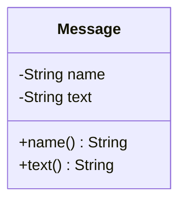
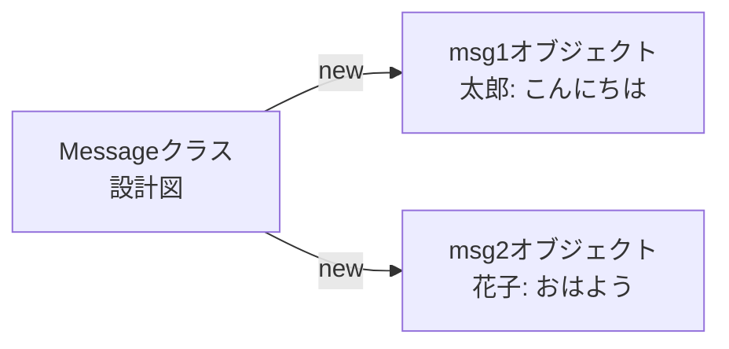

# 調査報告: 第2回「メッセージをオブジェクトにしてみよう」

## 調査概要

- **調査日**: 2025年12月29日
- **調査者**: investigative-research エージェント
- **目的**: 「Mooで覚えるオブジェクト指向プログラミング」第2回記事の作成のための詳細調査
- **第1回**: 既存記事（/content/post/2021/10/31/191008.md）
  - blessについて（忘れよう）
  - Mooを使ってみる（簡単な例: `has hoge => (is => 'rw')`）
  - 用語の紹介（オブジェクト、クラス、プロパティ、メソッド）

## 第2回の位置づけと構成

### 記事の目標
- スパゲティコードの問題点を実感する
- Messageクラスを作成してオブジェクトの基本を理解する
- データとロジックを分離する意義を学ぶ

### 構成（案A）
**大見出し**:
- H2: スパゲティコードの課題（データとロジックの混在）
- H2: Messageクラスを作る
- H2: オブジェクトを使って投稿を表示する
- H2: 動かしてみよう
- H2: まとめ

**コード例**:
1. スパゲティコードの例（配列でメッセージを管理）
2. Messageクラスと使用例（name, textプロパティのみ）

---

## 1. スパゲティコードの典型例

### 1.1 Perlでのアンチパターン

#### ハッシュに配列を直接格納する落とし穴
- **URL**: https://qiita.com/shisaku/items/36e5331863cfdc346264
- **信頼性**: ★★★★☆
- **要点**:
  - 配列をハッシュに入れる際、リファレンスを使わないと意図しない展開が起きる
  - 誤: `{ result => 1, data => @fruits }`
  - 正: `{ result => 1, data => \@fruits }`
  - アクセス時はデリファレンスが必要: `@{$result->{data}}`

#### グローバル変数の乱用
- **URL**: https://github-wiki-see.page/m/nagatakho/perl_wiki/wiki/[Perl]-%E6%96%87%E6%B3%95%EF%BC%9A%E5%A4%89%E6%95%B0
- **要点**:
  - スコープが不明確になり、どこで何が上書きされるか分からない
  - 複数の処理で同じ変数名を使うと衝突する
  - デバッグが困難になる

#### 配列とハッシュの役割が不明瞭
- **URL**: https://perlzemi.com/blog/20161013147635.html
- **URL**: https://www.kent-web.com/perl/chap4.html
- **要点**:
  - 「順序性ありデータ」は配列
  - 「名前つきデータ」はハッシュ
  - 役割分担が曖昧だと処理が複雑化する

### 1.2 スパゲティコード化の典型パターン

**特徴**:
1. データ構造のネストが深くなる（配列の中にハッシュ、その中にさらに配列...）
2. サブルーチンや処理ごとの責務分担があやふや
3. 同じデータ構造に対して複数のアクセスパターン
4. コメントやドキュメントなし
5. 命名が不明瞭
6. グローバル変数の乱用

**掲示板コードでよく見られる問題**:
- すべてメインルーチンに直書き
- HTMLテンプレをPerlのprintで直接出力
- 投稿と表示のロジックが一体化
- エラーハンドリングも最低限
- データとロジックが分離されていない

### 1.3 スパゲティコードのサンプル

#### 最小限の配列ベース掲示板（アンチパターン）

```perl
#!/usr/bin/perl
use strict;
use warnings;
use CGI;

my $cgi = CGI->new;
print $cgi->header(-charset=>'UTF-8');
print "<html><head><title>掲示板</title></head><body>";

# データは配列で管理（スパゲティ化の始まり）
my @messages;

# 投稿処理
if ($cgi->param('name') && $cgi->param('text')) {
    # 配列に直接push（データ構造が曖昧）
    push @messages, {
        name => $cgi->param('name'),
        text => $cgi->param('text'),
    };
    
    # ファイルに保存（エラー処理なし）
    open(my $fh, '>>', "messages.txt");
    print $fh $cgi->param('name') . "\t" . $cgi->param('text') . "\n";
    close($fh);
}

# 投稿フォーム表示（ロジックとHTMLが混在）
print <<'EOT';
<form method="post">
  名前: <input type="text" name="name"><br>
  メッセージ: <input type="text" name="text"><br>
  <input type="submit" value="投稿">
</form>
EOT

# 過去ログ読み込みと表示（データ処理と表示が一体化）
if (open(my $fh, '<', "messages.txt")) {
    while (my $line = <$fh>) {
        chomp $line;
        my ($name, $text) = split(/\t/, $line, 2);
        # HTMLを直接出力（表示ロジックが散在）
        print "<hr><b>$name</b>: $text<br>\n";
    }
    close($fh);
}

print "</body></html>";
```

**問題点**:
- データ構造が一貫していない（配列、ハッシュ、ファイル）
- 投稿処理、表示処理、ファイルI/Oが全て混在
- 再利用性がない（他の場所で同じ処理をする場合、コピペが必要）
- テストが困難（全体を実行しないとテストできない）
- 拡張が難しい（新しい属性を追加すると全体に影響）

---

## 2. Mooでのクラス定義の基本

### 2.1 package宣言とuse Moo

#### package宣言
- **URL**: https://metacpan.org/pod/Moo
- **要点**:
  - `package ClassName;` でクラスを定義
  - パッケージ名は大文字で始めるのが慣例
  - ファイル名とパッケージ名を合わせると管理しやすい

#### use Moo
- **URL**: https://perlmaven.com/oop-with-moo
- **要点**:
  - `use Moo;` でMooの機能を有効化
  - 自動的に`strict`と`warnings`が有効になる
  - `new`メソッドが自動生成される

### 2.2 hasによるプロパティ定義

#### 基本構文
```perl
has 属性名 => (
    is => 'rw',  # または 'ro'
);
```

#### is => 'rw' と is => 'ro'
- **URL**: https://www.nqou.net/2025/12/11/000000/
- **URL**: https://metacpan.org/pod/Moo
- **信頼性**: ★★★★★（公式＋本サイト）
- **要点**:
  - `rw` = Read-Write（読み書き可能）
    - ゲッター（値を取得）とセッター（値を設定）の両方が生成される
    - `$obj->name` で取得、`$obj->name('新しい値')` で設定
  - `ro` = Read-Only（読み取り専用）
    - ゲッターのみが生成される
    - コンストラクタ（new）でしか値を設定できない
    - 後から変更できないので安全

**初心者向けの説明**:
- `rw`は「読んだり書いたりできるノート」
- `ro`は「一度書いたら消せない石碑」
- どちらを使うかは「後から変更する必要があるか」で判断

#### プロパティの実例（Messageクラス）

```perl
package Message;
use Moo;

# 名前（読み取り専用：投稿後に変更されないため）
has name => (is => 'ro');

# メッセージ本文（読み取り専用：投稿後に変更されないため）
has text => (is => 'ro');

1;  # モジュールは1を返す必要がある
```

### 2.3 オブジェクト生成（->new）

#### コンストラクタの使い方
- **URL**: https://perlmaven.com/oop-with-moo
- **URL**: https://www.nqou.net/2025/12/19/234500/
- **要点**:
  - Mooを使うと`new`メソッドが自動生成される
  - 明示的に定義する必要はない
  - `ClassName->new(属性名 => 値, ...)`の形式で呼び出す

**コード例**:
```perl
use Message;

# オブジェクトの生成
my $msg = Message->new(
    name => '太郎',
    text => 'こんにちは'
);

# プロパティへのアクセス
print $msg->name;  # => 太郎
print $msg->text;  # => こんにちは
```

**初心者向けの説明**:
- `Message`は「設計図」（クラス）
- `$msg`は「設計図から作った実物」（オブジェクト）
- `new`は「設計図を使って実物を作る」作業（インスタンス化）

### 2.4 プロパティへのアクセス

#### アクセサメソッド
```perl
# 読み取り
my $name = $msg->name;

# 書き込み（rwの場合のみ）
$msg->some_property('新しい値');
```

---

## 3. 実践的なチャットアプリ

### 3.1 最小限のチャット機能

#### 要件定義
- **機能**: 名前とメッセージのみ
- **データ**: Messageオブジェクトの配列で管理
- **表示**: オブジェクトから情報を取り出して表示

#### チャットアプリの基本構造（オブジェクト指向版）

**Message.pm（クラス定義）**:
```perl
package Message;
use Moo;
use utf8;

has name => (is => 'ro');
has text => (is => 'ro');

1;
```

**chat.pl（使用例）**:
```perl
#!/usr/bin/env perl
use strict;
use warnings;
use utf8;
use Message;

# メッセージオブジェクトの配列
my @messages;

# メッセージを追加
push @messages, Message->new(
    name => '太郎',
    text => 'こんにちは'
);

push @messages, Message->new(
    name => '花子',
    text => 'おはよう'
);

# メッセージを表示
foreach my $msg (@messages) {
    print $msg->name . ': ' . $msg->text . "\n";
}
```

**出力**:
```
太郎: こんにちは
花子: おはよう
```

### 3.2 配列からオブジェクトへの移行例

#### Before（配列・ハッシュ版）
```perl
my @messages = (
    { name => '太郎', text => 'こんにちは' },
    { name => '花子', text => 'おはよう' },
);

foreach my $msg (@messages) {
    print $msg->{name} . ': ' . $msg->{text} . "\n";
}
```

**問題点**:
- ハッシュのキー名をタイポしてもエラーにならない
- どんなキーがあるか分からない
- バリデーションができない
- 間違ったデータ構造を入れてもエラーにならない

#### After（オブジェクト版）
```perl
my @messages = (
    Message->new(name => '太郎', text => 'こんにちは'),
    Message->new(name => '花子', text => 'おはよう'),
);

foreach my $msg (@messages) {
    print $msg->name . ': ' . $msg->text . "\n";
}
```

**改善点**:
- 存在しないメソッドを呼ぶとエラーになる
- IDEやエディタの補完が効く
- クラス定義を見れば何が必要か分かる
- 後から機能を追加しやすい（メソッドを追加するだけ）

### 3.3 実際に動くコード例

#### ディレクトリ構成
```
my_chat/
  ├ lib/
  │  └ Message.pm
  └ chat.pl
```

#### Message.pm（lib/Message.pm）
```perl
package Message;
use Moo;
use utf8;

has name => (
    is => 'ro',
);

has text => (
    is => 'ro',
);

1;
```

#### chat.pl
```perl
#!/usr/bin/env perl
use strict;
use warnings;
use utf8;
use FindBin;
use lib "$FindBin::Bin/lib";
use Message;

binmode STDOUT, ':utf8';

# メッセージオブジェクトの配列
my @messages;

# 投稿を追加する関数
sub add_message {
    my ($name, $text) = @_;
    push @messages, Message->new(
        name => $name,
        text => $text,
    );
}

# メッセージを表示する関数
sub show_messages {
    foreach my $msg (@messages) {
        printf "%s: %s\n", $msg->name, $msg->text;
    }
}

# サンプルデータ
add_message('太郎', 'こんにちは');
add_message('花子', 'おはよう');
add_message('次郎', 'はじめまして');

# 表示
show_messages();
```

**実行方法**:
```bash
# Mooのインストール（初回のみ）
cpanm Moo

# 実行
perl chat.pl
```

**出力**:
```
太郎: こんにちは
花子: おはよう
次郎: はじめまして
```

---

## 4. 初心者向けの説明方法

### 4.1 専門用語を避けた平易な説明

#### クラスとオブジェクトの比喩
- **URL**: https://note.com/yurufuri/n/nf5e61f55f3e4
- **URL**: https://www.iot-makers.co.jp/blog/column/7893/
- **URL**: https://runteq.jp/blog/programming-school/23091/
- **信頼性**: ★★★★☆
- **要点**:
  - **クラス＝設計図**: 「たい焼きの型」「家の設計図」「動物の定義」
  - **オブジェクト＝実体**: 「焼いたたい焼き」「建てた家」「具体的な犬や猫」
  - **プロパティ＝特徴**: 「色」「サイズ」「名前」
  - **メソッド＝動作**: 「食べる」「動く」「鳴く」

#### 初心者が躓きやすいポイント

**ポイント1: クラスとオブジェクトの違い**
- クラスは「設計図」で、実際には使えない
- オブジェクトは「設計図から作った実物」で、実際に使える
- 同じ設計図から複数の実物を作れる

**ポイント2: プロパティとメソッドの違い**
- プロパティは「データ」（名前、年齢、色など）
- メソッドは「動作」（歩く、食べる、計算するなど）
- プロパティは「名詞」、メソッドは「動詞」で考えるとわかりやすい

**ポイント3: なぜ->を使うのか**
- `$msg->name`の`->`は「〜の」という意味
- 「メッセージオブジェクトの名前」と読む
- ハッシュの`$msg->{name}`に似ているが、より安全

### 4.2 なぜオブジェクトにするのか（動機付け）

#### データとロジックの分離
- **URL**: https://techgym.jp/column/object-orient/
- **URL**: https://www.saison-technology.com/coloris/topics/1Wdce
- **URL**: https://zenn.dev/pictogram/articles/4b0962fea0bc41
- **信頼性**: ★★★★☆

**問題（スパゲティコード）**:
- データ（配列やハッシュ）とロジック（処理）が別々の場所にある
- 同じような処理が複数箇所に散在する
- データ構造を変更すると、全ての処理を修正する必要がある

**解決（オブジェクト指向）**:
- データとロジックを一箇所にまとめる
- 同じような処理をメソッドとして再利用できる
- データ構造を変更しても、メソッドの中だけ修正すればよい

**メリット**:
1. **保守性**: 修正箇所が限定される
2. **再利用性**: 同じクラスを別の場所でも使える
3. **拡張性**: 新しい機能を追加しやすい
4. **可読性**: コードの意図が分かりやすい

**初心者向けの例**:

Before（スパゲティ）:
```perl
my $name = '太郎';
my $text = 'こんにちは';
print "$name: $text\n";  # 表示処理が散在

# 別の場所でも同じ処理
my $name2 = '花子';
my $text2 = 'おはよう';
print "$name2: $text2\n";  # コピペが必要
```

After（オブジェクト指向）:
```perl
package Message;
use Moo;

has name => (is => 'ro');
has text => (is => 'ro');

# 表示処理をメソッドにまとめる
sub display {
    my $self = shift;
    print $self->name . ': ' . $self->text . "\n";
}

1;
```

使用例:
```perl
my $msg1 = Message->new(name => '太郎', text => 'こんにちは');
$msg1->display();  # メソッドを呼ぶだけ

my $msg2 = Message->new(name => '花子', text => 'おはよう');
$msg2->display();  # 同じメソッドを再利用
```

### 4.3 ビジュアルイメージ（図表の可能性）

#### UMLクラス図の基本
- **URL**: https://www.lucidchart.com/pages/ja/what-is-uml-class-diagram
- **URL**: https://miro.com/ja/diagramming/what-is-a-uml-object-diagram/
- **URL**: https://qiita.com/asurawill/items/f00d90ea016a9518f4bd
- **信頼性**: ★★★★★

**Messageクラスのクラス図**:
```
+------------------+
|    Message       |  ← クラス名
+------------------+
| - name: String   |  ← プロパティ（属性）
| - text: String   |
+------------------+
| + name(): String |  ← メソッド（ゲッター）
| + text(): String |
+------------------+
```

**オブジェクト図（インスタンス）**:
```
+---------------------------+
| msg1:Message              |  ← オブジェクト名:クラス名
+---------------------------+
| name = "太郎"             |  ← 実際の値
| text = "こんにちは"       |
+---------------------------+
```

#### Mermaid記法での図解例

**クラス図**:


**オブジェクトの関係**:


#### 図解の活用方法
- クラスとオブジェクトの関係を視覚化
- データ構造を図で示す
- スパゲティコードとの比較図
- Before/Afterの変化を図示

---

## 5. 内部リンク候補

### 5.1 第1回の記事（既存）
- **パス**: /content/post/2021/10/31/191008.md
- **タイトル**: 第1回-Mooで覚えるオブジェクト指向プログラミング
- **タグ**: perl, programming
- **内容**:
  - blessについて（忘れよう）
  - Mooを使ってみる
  - 用語の紹介（オブジェクト、クラス、プロパティ、メソッド）

### 5.2 Perlタグの関連記事
- /content/post/2025/11/27/204639.md
- /content/post/2025/12/27/234500.md
- /content/post/2025/12/06/000000.md

### 5.3 推奨する内部リンク戦略

**記事内でリンクすべき箇所**:
1. **前回（第1回）へのリンク**: 冒頭で簡単に前回の復習を書き、詳細は第1回へリンク
2. **用語の参照**: 「オブジェクト」「クラス」などの用語が出たら、第1回の該当箇所へリンク
3. **次回予告**: 記事末尾で次回の内容を予告（リンクは次回公開後に追加）

**リンクの書き方**:
```markdown
前回の[第1回-Mooで覚えるオブジェクト指向プログラミング](/2021/10/31/191008/)では、
Mooの基本的な使い方について学びました。
```

---

## 6. 推奨するタグ

### 第2回で使用するタグ
- `perl`: Perl言語全般
- `programming`: プログラミング一般
- `moo`: Mooモジュール（新規）
- `object-oriented`: オブジェクト指向（新規）
- `tutorial`: チュートリアル記事（新規）

### タグの一貫性
- 全ての連載記事で同じタグセットを使用
- 読者が関連記事を見つけやすくなる
- タグページで連載の流れが追える

---

## 7. コード例の品質基準

### 7.1 コード例の要件
1. **動作確認済み**: 実際に動くコード
2. **完結性**: コピペして実行できる
3. **適切な長さ**: 10〜30行程度
4. **コメント**: 初心者が理解できるレベルのコメント
5. **UTF-8対応**: 日本語メッセージが正しく表示される

### 7.2 推奨するコードスタイル
- `use strict;` と `use warnings;` は必須
- `use utf8;` でソースコードをUTF-8に
- `binmode STDOUT, ':utf8';` で出力をUTF-8に
- インデントは4スペース
- 変数名は意味のある英語または日本語ローマ字

### 7.3 避けるべきコード
- エラー処理がないコード
- グローバル変数を使うコード
- 複雑すぎるコード（初心者が理解できないレベル）
- 実行環境に依存するコード

---

## 8. 記事の構成テンプレート

### はじめに
```markdown
前回の[第1回](/2021/10/31/191008/)では、Mooの基本的な使い方について学びました。
今回は、実際にMessageクラスを作って、オブジェクト指向プログラミングの利点を体験してみましょう。
```

### 問題提起（スパゲティコードの課題）
```markdown
## スパゲティコードの課題

掲示板やチャットアプリを作る際、初心者がよく書くのは以下のようなコードです。

（スパゲティコードの例を提示）

このコードには、以下のような問題があります：
- データとロジックが混在している
- 同じような処理が複数箇所に散在している
- データ構造を変更すると、全体に影響する

では、これをオブジェクト指向で書き直してみましょう。
```

### 実装（Messageクラスを作る）
```markdown
## Messageクラスを作る

メッセージを表すクラスを作ってみましょう。

（コード例を提示）

このコードのポイント：
- `package Message;` でMessageクラスを定義
- `use Moo;` でMooの機能を有効化
- `has name => (is => 'ro');` で名前プロパティを定義
- `has text => (is => 'ro');` でメッセージ本文プロパティを定義
```

### 動かしてみよう
```markdown
## 動かしてみよう

実際にコードを実行してみましょう。

（実行例とその出力を提示）

試してみよう：
- 別の名前とメッセージで投稿してみる
- メッセージを3つ以上追加してみる
- メッセージの順序を変えてみる
```

### まとめ
```markdown
## まとめ

今回学んだこと：
- スパゲティコードの問題点
- Messageクラスの作り方
- オブジェクトを使った投稿の管理

次回は、メッセージに「投稿日時」を追加して、
デフォルト値とバリデーションについて学びます。
```

---

## 9. 参考文献一覧

### Moo関連
1. MetaCPAN - Moo: https://metacpan.org/pod/Moo
2. Perl Maven - OOP with Moo: https://perlmaven.com/oop-with-moo
3. 本サイト - Moo/Moose: https://www.nqou.net/2025/12/11/000000/

### スパゲティコード・アンチパターン
4. Qiita - Perlでハッシュに配列を入れたらハマった話: https://qiita.com/shisaku/items/36e5331863cfdc346264
5. Perlゼミ - ハッシュを理解しよう: https://perlzemi.com/blog/20161013147635.html
6. KENT-WEB - Perl基礎入門: https://www.kent-web.com/perl/chap4.html

### OOP基礎・初心者向け説明
7. テックジム - オブジェクト指向プログラミング: https://techgym.jp/column/object-orient/
8. RUNTEQ - オブジェクト指向とは: https://runteq.jp/blog/programming-school/23091/
9. Zenn - オブジェクト指向の良さ: https://zenn.dev/pictogram/articles/4b0962fea0bc41
10. ProgrameiQ - プログラミング用語一覧: https://www.iot-makers.co.jp/blog/column/7893/

### UML・図解
11. Lucidchart - クラス図とは: https://www.lucidchart.com/pages/ja/what-is-uml-class-diagram
12. Miro - オブジェクト図とは: https://miro.com/ja/diagramming/what-is-a-uml-object-diagram/
13. Qiita - 実務で使えるUML: https://qiita.com/asurawill/items/f00d90ea016a9518f4bd

### チャット・掲示板実装
14. KENT-WEB - COM CHAT: https://www.kent-web.com/chat/comchat.html
15. とほほのWWW入門 - 掲示板をつくる: https://www.tohoho-web.com/perl/bbs.htm

---

## 10. 次のアクション

### 記事執筆時のチェックリスト
- [ ] 第1回へのリンクを含める
- [ ] コード例は実際に動作確認する
- [ ] UTF-8対応を確認する
- [ ] 図解（Mermaid）を追加する
- [ ] 初心者が躓きそうなポイントを説明する
- [ ] 「試してみよう」のセクションを追加する
- [ ] 次回予告を書く
- [ ] タグを適切に設定する（perl, programming, moo, object-oriented, tutorial）

### 追加調査が必要な項目
- 特になし（必要な情報は収集済み）

### 技術的な確認事項
- [ ] Mooのバージョン確認（最新版の挙動）
- [ ] Perlのバージョン（5.16以上を推奨）
- [ ] ファイルエンコーディング（UTF-8）
- [ ] 実行環境（Linux/Mac/Windowsでの差異）

---

**調査完了日**: 2025年12月29日  
**ステータス**: 完了  
**次回更新**: 記事執筆後のフィードバック反映時
