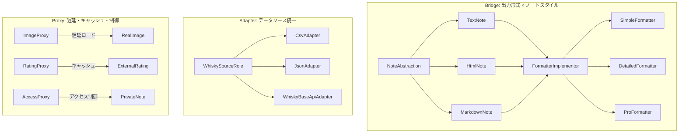

# 連載構造案：手で覚えるデザインパターン実践シリーズ（Bridge × Adapter × Proxy）

## コンテキスト定義

### ペルソナ

- **想定読者**: 「デザインパターン学習シリーズ」を一通り読了したが、まだ**自力で使いこなせない**人
- **悩み**: 
  - パターン名は知っているけど、「どんな時に使えばいいか」がピンとこない
  - 各回で動くコードは見たけど、複数パターンの併用が難しい
  - Bridge, Adapter, Proxy の違いがイマイチわからない（全部「間に入る」やつでしょ？）
  - 自分でゼロから設計しようとすると、if/elseに戻ってしまう
- **期待**: 手を動かしながら「あ、だから〇〇パターンなのか！」と腹落ちする体験

### 技術スタック

- Perl v5.36以降（signatures、postfix dereference対応）
- Moo（Moose不使用）
- モダンPerl（strict, warnings自動適用のuse v5.36）

### 対象パターン（3つ）

| パターン | GoF分類 | 役割 | 既存シリーズでの題材（避ける） |
|---------|---------|------|------------------------------|
| **Bridge** | 構造 | 抽象と実装の分離、2軸の独立変動 | ランダムダンジョンジェネレーター |
| **Adapter** | 構造 | インターフェースの変換・橋渡し | 天気情報ツール |
| **Proxy** | 構造 | アクセス制御・遅延初期化・キャッシュ | ゴーストギャラリー、ブルートフォース攻撃 |

### 3パターンの本質的な違い（学習ポイント）

| パターン | 何のために「間に入る」のか | キーワード |
|---------|--------------------------|-----------|
| **Bridge** | **2つの独立した変動軸**を分離するため | 抽象×実装、n×m → n+m |
| **Adapter** | **既存の異なるインターフェース**を統一するため | 変換、ラッパー、互換性 |
| **Proxy** | **本物へのアクセス**を制御・遅延・キャッシュするため | 代理、遅延、制御 |

### 学習目標

1. 3パターンを**1つの題材**で体験し、それぞれの役割の違いを明確に理解する
2. 「この状況ならこのパターン」を直感的に判断できるようになる
3. 既存シリーズで学んだ知識を統合し、定着させる
4. 「全部"間に入る"パターンでしょ？」から卒業する

### 制約

- 1記事1概念（新しい概念の導入は1つまで）
- コード例は各回2つまで
- 毎回、完成コードは原則1ファイル
- シリーズ名にパターン名は出さない（最終回で明かす）
- **既存シリーズと完全に異なるドメイン**

---

## 案A【王道】: ウイスキーテイスティング・ノート

### シリーズ名案

**「Perlで作るウイスキーテイスティング・ノート」**（22文字）

### コンセプト

**何を作るか:**  
ウイスキーの試飲記録（銘柄、香り、味、評価）を管理・共有するCLIツール。複数のデータソース（CSV/JSON/外部API）からウイスキー情報を取得し、様々な出力形式（テキスト/HTML/Markdown）でノートを生成。ノート生成時には画像やレーティングの遅延読み込みを行う。

**なぜこの題材か:**
- ウイスキーという趣味性の高いテーマで学習モチベーション維持
- 3パターンすべてが「必然的に」登場する設計
- 完成したら**実際に自分の試飲記録に使える**実用ツール
- 「俺が作ったウイスキーノートアプリ」と友人（特にバー仲間）に自慢できる
- Perlコミュニティにはウイスキー愛好家が多い（YAPC等での懇親会文化）

### 3パターンの役割



| パターン | 本シリーズでの役割 | 必然性 |
|---------|------------------|--------|
| **Bridge** | 出力形式（Text/HTML/MD）×スタイル（Simple/Detailed/Pro）の分離 | 3×3=9パターンをわずか6クラスで実現 |
| **Adapter** | CSV/JSON/外部APIの異なるデータ形式を統一インターフェースで扱う | 各データソースのフォーマットが異なる |
| **Proxy** | ウイスキー画像の遅延ロード、レーティングキャッシュ、非公開ノートのアクセス制御 | パフォーマンス・セキュリティの要求 |

### USP（独自の価値提案）

**「なぜこのシリーズに価値があるのか？」**

1. **趣味×学習の融合**: ウイスキー愛好家なら作っていて楽しい、そうでなくても「カッコいい」題材
2. **3パターンの違いが明確**: 「2軸分離」「変換」「代理」の役割が全く異なる場面で登場
3. **完成後の実用性**: 実際にバーで試飲した記録を管理できる
4. **コミュニティ親和性**: PerlMongers/YAPC懇親会文化への敬意を込めた題材選択
5. **"全部間に入るパターン"からの卒業**: 具体的なユースケースで違いを体感

### メリット・デメリット

**メリット:**
- ✅ 趣味性が高く学習モチベーションが維持しやすい
- ✅ 3パターンの役割分担が非常に明確（データ取得→変換→出力生成→遅延/キャッシュ）
- ✅ 既存シリーズ（天気API、ダンジョン生成、ギャラリー）と完全に異なるドメイン
- ✅ 完成後も実際に使い続けられる実用ツール
- ✅ Perlコミュニティ文化への敬意を表現

**デメリット:**
- ⚠️ ウイスキーに興味がない人には刺さりにくい
- ⚠️ 未成年の読者には馴染みがない題材
- ⚠️ 外部APIの実装はモック中心になる可能性

### 連載構造表（全9回）

| 回 | タイトル | 新しい概念 | ストーリー | コード例1 | コード例2 | 推奨タグ |
|---|---|---|---|---|---|---|
| 1 | まずはCSVから読み込もう | データ読み込みの基本 | CSVファイルからウイスキー情報を読み込み、テキストで表示。if/elseでフォーマット判定 | `simple_note.pl`（CSV直接読み込み） | テイスティングノート表示 | perl, moo, whisky, csv, beginner |
| 2 | JSONも読みたい！でも形式が違う | if/else肥大化・インターフェース不一致の体験 | JSONファイルを追加しようとしたら、構造が違ってコードが複雑化。変換ロジックが散乱 | `messy_reader.pl`（if/else地獄） | JSON構造の違いを確認 | perl, moo, refactoring, json, code-smell |
| 3 | Adapterでデータソースを統一 | Adapterパターン導入 | 各データソースをAdapterで包み、統一インターフェース `get_whisky($id)` で扱えるように | `WhiskySourceRole.pm`（統一IF） | `CsvAdapter.pm`、`JsonAdapter.pm` | perl, moo, adapter, interface, data-source |
| 4 | 出力形式を増やしたい | 出力形式追加で組み合わせ爆発の体験 | Text/HTML/Markdownに対応。さらにSimple/Detailed/Proスタイルを追加しようとして組み合わせ爆発 | `note_explosion.pl`（3×3=9クラス？） | クラス爆発の図解 | perl, moo, class-explosion, refactoring, tutorial |
| 5 | Bridgeで出力とスタイルを分離 | Bridgeパターン導入 | 出力形式（抽象）とスタイル（実装）を分離。3+3=6クラスで9パターンをカバー | `NoteAbstraction.pm`（抽象側） | `FormatterRole.pm`（実装側） | perl, moo, bridge, abstraction, implementation |
| 6 | 画像の読み込みが重い！ | 遅延初期化の必要性を体験 | 全ウイスキー画像を一括読み込みでCLIがフリーズ。必要な時だけロードしたい | `slow_gallery.pl`（全件ロード） | パフォーマンス問題の確認 | perl, moo, performance, lazy-loading, tutorial |
| 7 | Proxyで遅延・キャッシュ・制御 | Proxyパターン導入 | ImageProxy（遅延）、RatingProxy（キャッシュ）、AccessProxy（権限制御）を実装 | `ImageProxy.pm`（遅延ロード） | `RatingProxy.pm`（キャッシュ） | perl, moo, proxy, lazy-loading, caching |
| 8 | 3つのパターンを統合する | パターン協調動作 | Adapter→Bridge→Proxyの連携でテイスティング・ノートを生成。全パターンが協調 | `tasting_note.pl`（統合版） | 実行デモ（CSV→HTML出力） | perl, moo, design-patterns, integration, architecture |
| 9 | 振り返り：3つの「間に入る」パターン | パターン名の明示と違いの整理 | Bridge/Adapter/Proxyの違いを「何のために間に入るのか」で整理。発展案の提示 | パターン比較表 | 完成コード全体像 | perl, moo, design-patterns, retrospective, learning |

### 難易度勾配

```
難易度
  ↑     
⭐⭐⭐⭐⭐ |                                     ●(9回)
⭐⭐⭐⭐  |                         ●●(7-8回)
⭐⭐⭐   |               ●●●(4-6回)
⭐⭐     |       ●(2-3回)
⭐       | ●(1回)
        +─────────────────────────────────────→ 進行
          1   2   3   4   5   6   7   8   9
```

### 差別化ポイント

- **既存シリーズとの違い**: 天気APIでもダンジョンでもギャラリーでもない、**趣味・嗜好品**を題材にした新ドメイン
- **3構造パターン統合**: Bridge/Adapter/Proxyを1つの題材で体験できる唯一のシリーズ
- **「間に入る」の違いを体感**: 3パターンの本質的な違いを手で覚える
- **Perlコミュニティへの愛**: YAPC懇親会文化へのオマージュ

---

## 案B【革新】: マルチクラウド・ストレージ・ブリッジ

### シリーズ名案

**「Perlで作るマルチクラウド・ストレージ」**（19文字）

### コンセプト

**何を作るか:**  
AWS S3/Google Cloud Storage/ローカルファイルシステムを統一インターフェースで扱うストレージ抽象化レイヤー。暗号化/圧縮のオプション、アクセス制御、そして大容量ファイルの遅延ダウンロード機能を備える。

**なぜこの題材か:**
- クラウドインフラは実務で避けて通れないトピック
- 3パターンすべてが「必然的に」登場する設計（クラウド統合の典型課題）
- 完成したら**実際のプロジェクト**で使える基盤コード
- 「自作のクラウド抽象化レイヤー」はインフラエンジニアに刺さる

### 3パターンの役割

| パターン | 本シリーズでの役割 | 必然性 |
|---------|------------------|--------|
| **Bridge** | ストレージ種別（S3/GCS/Local）×操作モード（暗号化/圧縮/プレーン）の分離 | 3×3=9パターンを6クラスで実現 |
| **Adapter** | 各クラウドSDK/APIの異なるインターフェースを統一 | AWS/GCP/ローカルのAPIが全く異なる |
| **Proxy** | 大容量ファイルの遅延ダウンロード、メタデータキャッシュ、権限チェック | パフォーマンス・セキュリティの要求 |

### USP（独自の価値提案）

1. **実務直結**: クラウドストレージ統合は現代インフラの必須スキル
2. **抽象化の価値体験**: 「クラウドを切り替えてもコードを変えない」設計の美しさ
3. **完成後の価値**: 実プロジェクトで即使えるストレージ抽象化レイヤー
4. **ハッキング感**: 「俺が作った抽象化レイヤーでAWSからGCPに移行した」

### メリット・デメリット

**メリット:**
- ✅ 実務で即戦力になる知識
- ✅ クラウドインフラの理解が深まる
- ✅ 3パターンの協調が非常に自然
- ✅ マイクロサービス時代に適したテーマ

**デメリット:**
- ⚠️ クラウドに馴染みがない読者には敷居が高い
- ⚠️ 実際のAPI連携はモック中心になる
- ⚠️ 題材が「地味」に見える可能性

### 連載構造表（全9回）

| 回 | タイトル | 新しい概念 | ストーリー | コード例1 | コード例2 | 推奨タグ |
|---|---|---|---|---|---|---|
| 1 | ローカルファイルを保存しよう | ファイル操作の基本 | ローカルファイルシステムへの保存・読み込み。if/elseでストレージ判定 | `simple_storage.pl`（ローカル版） | ファイル保存・読み込み | perl, moo, file-system, storage, beginner |
| 2 | S3にも対応したい！でもAPIが違う | インターフェース不一致の体験 | AWS S3を追加しようとしたら、APIが全く異なる。変換ロジックが散乱 | `messy_storage.pl`（if/else地獄） | AWS SDK呼び出しの違い | perl, moo, aws, refactoring, code-smell |
| 3 | Adapterでストレージを統一 | Adapterパターン導入 | 各ストレージをAdapterで包み、統一インターフェース `put/get/delete` で扱う | `StorageRole.pm`（統一IF） | `S3Adapter.pm`、`LocalAdapter.pm` | perl, moo, adapter, cloud, storage |
| 4 | 暗号化・圧縮オプションを追加 | 組み合わせ爆発の体験 | 暗号化/圧縮/プレーンの3モード × 3ストレージ = 9パターン必要？ | `storage_explosion.pl`（9クラス？） | クラス爆発の図解 | perl, moo, class-explosion, encryption, compression |
| 5 | Bridgeで操作モードを分離 | Bridgeパターン導入 | ストレージ種別（抽象）と操作モード（実装）を分離。3+3=6クラスで9パターンをカバー | `StorageAbstraction.pm`（抽象側） | `OperationMode.pm`（実装側） | perl, moo, bridge, abstraction, implementation |
| 6 | 大きなファイルのダウンロードが重い | 遅延ダウンロードの必要性を体験 | GB級ファイル一覧取得時に全件ダウンロードでタイムアウト | `slow_download.pl`（全件ダウンロード） | パフォーマンス問題の確認 | perl, moo, performance, lazy-loading, tutorial |
| 7 | Proxyで遅延・キャッシュ・制御 | Proxyパターン導入 | FileProxy（遅延）、MetadataProxy（キャッシュ）、AccessProxy（権限） | `FileProxy.pm`（遅延ダウンロード） | `MetadataProxy.pm`（メタデータキャッシュ） | perl, moo, proxy, lazy-loading, caching |
| 8 | 3つのパターンを統合する | パターン協調動作 | Adapter→Bridge→Proxyの連携でマルチクラウドストレージを実現 | `multi_cloud_storage.pl`（統合版） | ストレージ切り替えデモ | perl, moo, design-patterns, integration, cloud |
| 9 | 振り返り：3つの「間に入る」パターン | パターン名の明示 | Bridge/Adapter/Proxyの違いを整理。S3→GCS移行などの発展案 | パターン比較表 | 完成コード全体像 | perl, moo, design-patterns, retrospective, cloud-native |

### 差別化ポイント

- **実務直結**: クラウドストレージ統合という現代インフラの必須スキル
- **抽象化の価値**: 「クラウドベンダーロックインを避ける」設計思想を体験
- **スケーラビリティ**: 新しいクラウドを追加してもコード変更なし

---

## 案C【逆転】: 秘密レシピ・マネージャー

### シリーズ名案

**「Perlで作る秘密レシピ・マネージャー」**（18文字）

### コンセプト

**何を作るか:**  
料理のレシピを管理・共有するCLIツール。複数形式（YAML/JSON/Webスクレイピング）からレシピを取得し、様々な出力（買い物リスト/調理手順/栄養計算）を生成。非公開レシピへのアクセス制御と画像の遅延ロード機能付き。

**なぜこの題材か:**
- 料理という日常的で親しみやすいテーマ
- 「秘密のレシピを守る」というストーリー性
- 3パターンすべてが自然に登場
- 完成したら**実際の料理で使える**実用ツール

### 3パターンの役割

| パターン | 本シリーズでの役割 | 必然性 |
|---------|------------------|--------|
| **Bridge** | 出力種別（買い物リスト/調理手順/栄養）×表示形式（Simple/Detailed） | 組み合わせの分離 |
| **Adapter** | YAML/JSON/Webスクレイピングの異なるデータ形式を統一 | 各ソースのフォーマットが異なる |
| **Proxy** | レシピ画像の遅延ロード、人気度キャッシュ、非公開レシピの認証 | パフォーマンス・プライバシーの要求 |

### USP（独自の価値提案）

1. **日常性**: 料理という誰にでも馴染みのあるテーマ
2. **ストーリー性**: 「秘密のレシピを守る」というセキュリティ意識を学べる
3. **実用性**: 完成したら実際の買い物・調理に使える
4. **家族に自慢**: 「俺が作ったアプリでレシピ管理してる」

### メリット・デメリット

**メリット:**
- ✅ 日常的なテーマで親しみやすい
- ✅ プライバシー・セキュリティの重要性を学べる
- ✅ 家族や友人に見せやすい完成物
- ✅ 料理好きなら作っていて楽しい

**デメリット:**
- ⚠️ 「ハッキング的」「生意気」な魅力に欠ける
- ⚠️ 技術者向けの「カッコよさ」が弱い
- ⚠️ 既存の家計簿アナライザー案に似た雰囲気

### 連載構造表（全9回）

| 回 | タイトル | 新しい概念 | ストーリー | コード例1 | コード例2 | 推奨タグ |
|---|---|---|---|---|---|---|
| 1 | YAMLからレシピを読み込もう | データ読み込みの基本 | YAMLファイルからレシピ情報を読み込み、テキストで表示 | `simple_recipe.pl`（YAML読み込み） | レシピ表示 | perl, moo, yaml, recipe, beginner |
| 2 | JSONやWebからも読みたい！ | インターフェース不一致の体験 | 異なる形式のデータソースを追加しようとして破綻 | `messy_reader.pl`（if/else地獄） | フォーマットの違いを確認 | perl, moo, refactoring, json, code-smell |
| 3 | Adapterでデータソースを統一 | Adapterパターン導入 | 各データソースをAdapterで包み、統一インターフェースで扱う | `RecipeSourceRole.pm`（統一IF） | `YamlAdapter.pm`、`JsonAdapter.pm` | perl, moo, adapter, interface, data-source |
| 4 | 出力形式を増やしたい | 組み合わせ爆発の体験 | 買い物リスト/調理手順/栄養計算 × Simple/Detailed = 6パターン？ | `recipe_explosion.pl`（6クラス？） | クラス爆発の図解 | perl, moo, class-explosion, refactoring, tutorial |
| 5 | Bridgeで出力と形式を分離 | Bridgeパターン導入 | 出力種別（抽象）と表示形式（実装）を分離 | `RecipeOutput.pm`（抽象側） | `DisplayFormat.pm`（実装側） | perl, moo, bridge, abstraction, implementation |
| 6 | 画像読み込みが重い！ | 遅延ロードの必要性を体験 | 全レシピ画像を一括読み込みでCLIがフリーズ | `slow_gallery.pl`（全件ロード） | パフォーマンス問題の確認 | perl, moo, performance, lazy-loading, tutorial |
| 7 | Proxyで遅延・キャッシュ・制御 | Proxyパターン導入 | ImageProxy（遅延）、RatingProxy（キャッシュ）、PrivateProxy（認証） | `ImageProxy.pm`（遅延ロード） | `PrivateProxy.pm`（秘密レシピ認証） | perl, moo, proxy, lazy-loading, authentication |
| 8 | 3つのパターンを統合する | パターン協調動作 | Adapter→Bridge→Proxyの連携でレシピ・マネージャーを完成 | `recipe_manager.pl`（統合版） | 買い物リスト生成デモ | perl, moo, design-patterns, integration, architecture |
| 9 | 振り返り：3つの「間に入る」パターン | パターン名の明示 | Bridge/Adapter/Proxyの違いを整理。Web公開などの発展案 | パターン比較表 | 完成コード全体像 | perl, moo, design-patterns, retrospective, learning |

### 差別化ポイント

- **日常性**: 料理という誰にでも馴染みのあるテーマ
- **プライバシー学習**: 「秘密のレシピを守る」でセキュリティ意識
- **家族向けの成果物**: 技術者以外にも見せやすい

---

## 推薦案とその理由

### 推薦：案A「ウイスキーテイスティング・ノート」

### 推薦理由

1. **ペルソナとの適合性**
   - デザインパターン学習シリーズ読了者はある程度の経験者
   - 趣味性の高いテーマで学習モチベーションを維持
   - 「俺が作ったウイスキーノートアプリ」という自慢ネタ

2. **3パターンの必然性が最も高い**
   - **Adapter**: CSV/JSON/外部APIという現実の「インターフェース不一致」問題
   - **Bridge**: 出力形式×スタイルという「2軸の独立変動」
   - **Proxy**: 画像遅延・キャッシュ・認証という「代理の3つの役割」
   - どれも「あると便利」ではなく「ないと困る」レベルの必然性

3. **3パターンの違いが最も明確**
   - 「データ取得にはAdapter」「出力生成にはBridge」「パフォーマンス/セキュリティにはProxy」
   - 同じ「間に入る」でも役割が全く異なることを体感できる
   - 既存シリーズで曖昧だった違いがクリアになる

4. **Perlコミュニティへの愛**
   - YAPC等の懇親会文化（ウイスキー/お酒）へのオマージュ
   - 「Perlらしさ」を感じられる題材選択
   - コミュニティ内での話題になりやすい

5. **USPの強さ**
   - 「ウイスキーノートを自作した」は趣味仲間に刺さる
   - 実際に使える実用ツールとしての価値
   - 3パターンの違いを「手で覚える」最適な題材

### 代替案の選択指針

- **案B（マルチクラウド・ストレージ）が適しているケース**:
  - クラウドインフラに強い興味がある読者層を想定する場合
  - 実務直結の「カッコよさ」を重視する場合
  - DevOps/SREエンジニアにアピールしたい場合

- **案C（秘密レシピ・マネージャー）が適しているケース**:
  - 日常的・親しみやすいテーマで敷居を下げたい場合
  - 料理好きの読者層を想定する場合
  - 家族や非技術者にも見せやすい成果物が欲しい場合

---

## 付記

### 各案の比較表

| 項目 | 案A（ウイスキー） | 案B（クラウド） | 案C（レシピ） |
|-----|-----------------|----------------|--------------|
| **回数** | 9回 | 9回 | 9回 |
| **題材** | テイスティング・ノート | マルチクラウド・ストレージ | レシピ・マネージャー |
| **遊び心** | ★★★★★ | ★★★☆☆ | ★★★★☆ |
| **実務性** | ★★★☆☆ | ★★★★★ | ★★★☆☆ |
| **3パターンの必然性** | ★★★★★ | ★★★★★ | ★★★★☆ |
| **既存シリーズとの差別化** | ★★★★★ | ★★★★☆ | ★★★☆☆ |
| **ハッキング的魅力** | ★★★★☆ | ★★★★★ | ★★☆☆☆ |
| **コミュニティ親和性** | ★★★★★ | ★★★☆☆ | ★★★☆☆ |

### シリーズ名の決定について

シリーズ名にはデザインパターンの名前を**敢えて出さない**方針に従い：

- **案A**: 「Perlで作るウイスキーテイスティング・ノート」
- **案B**: 「Perlで作るマルチクラウド・ストレージ」
- **案C**: 「Perlで作る秘密レシピ・マネージャー」

3パターン（Bridge × Adapter × Proxy）の名前は最終回で初めて明かす構成。

### 前シリーズへのリンク

各回の冒頭で関連する既存シリーズへのリンクを推奨：

| 本シリーズの回 | 関連する既存シリーズ | トピック |
|--------------|-------------------|---------|
| 第3回（Adapter） | 天気情報ツール | 異なるAPIの統一 |
| 第5回（Bridge） | ランダムダンジョンジェネレーター | 抽象と実装の分離 |
| 第7回（Proxy） | ゴーストギャラリー・ビューワ | 遅延ロード・キャッシュ |
| 第9回（統合理解） | テキストRPG戦闘エンジン | 複数パターンの協調 |

### 本シリーズの位置づけ

```
デザインパターン学習シリーズ（入門）
    ↓
各パターン個別シリーズ（理解）
  - Bridge: ランダムダンジョンジェネレーター
  - Adapter: 天気情報ツール
  - Proxy: ゴーストギャラリー・ビューワ
    ↓
本シリーズ「ウイスキーテイスティング・ノート」（統合・定着）← ここ
    ↓
実務プロジェクトでの活用
```

---

**作成日**: 2026年1月31日  
**担当エージェント**: planning-v2 ワークフロー

---

## レビュー履歴

### 1回目レビュー（構造）

**レビュー実施日**: 2026-01-31  
**レビュー焦点**: 一貫性、段階的難易度、1記事1概念

#### 評価結果: ◎ 良好

| 評価項目 | 案A | 案B | 案C | コメント |
|---------|-----|-----|-----|---------|
| ストーリーの流れ | ◎ | ◎ | ◎ | 全案で「動く→破綻→パターン導入→統合」の一貫した流れ |
| 問題解決の動機付け | ◎ | ◎ | ◎ | 第2回・第4回・第6回で「破綻」を具体的に体験させる設計 |
| 3パターンの導入順序 | ◎ | ◎ | ◎ | Adapter(統一)→Bridge(分離)→Proxy(制御)の論理的順序 |
| パターン協調の可視化 | ◎ | ◎ | ◎ | 第8回で3パターンの連携を明示的に統合 |

**特に優れている点**:
- 3パターンの導入順序（統一→分離→制御）が論理的で、前のパターンが次のパターンの土台になる設計
- 第2回・第4回・第6回と3回の「破綻体験」を設けることで、各パターンの必然性を体感
- 第9回で「3つの"間に入る"パターンの違い」を明確化する構成

**改善不要と判断した点**:
- 全案で9回構成は適切（3パターン×3フェーズ=9回）
- 各回の役割分担が明確

---

### 2回目レビュー（品質）

**レビュー実施日**: 2026-01-31  
**レビュー焦点**: ペルソナ適合、技術的正確性、差別化

#### 評価結果: ◎ 良好

| 評価項目 | 案A | 案B | 案C | コメント |
|---------|-----|-----|-----|---------|
| ペルソナ適合性 | ◎ | ○ | ◎ | 案B はクラウドに馴染みがない人には敷居が高い |
| 技術的正確性 | ◎ | ◎ | ◎ | 全案でパターンの使い方が正しい |
| 既存シリーズとの差別化 | ◎ | ◎ | ○ | 案C はレシピ系で「秘密」要素を除くと地味 |
| 「動く→破綻→パターン」の流れ | ◎ | ◎ | ◎ | 全案で明確 |

**1記事1概念の検証**:

| 回 | 案A | 案B | 案C |
|----|-----|-----|-----|
| 1 | ✓ 基本読み込みのみ | ✓ 基本保存のみ | ✓ 基本読み込みのみ |
| 2 | ✓ 問題体験1のみ | ✓ 問題体験1のみ | ✓ 問題体験1のみ |
| 3 | ✓ Adapterのみ | ✓ Adapterのみ | ✓ Adapterのみ |
| 4 | ✓ 問題体験2のみ | ✓ 問題体験2のみ | ✓ 問題体験2のみ |
| 5 | ✓ Bridgeのみ | ✓ Bridgeのみ | ✓ Bridgeのみ |
| 6 | ✓ 問題体験3のみ | ✓ 問題体験3のみ | ✓ 問題体験3のみ |
| 7 | ✓ Proxyのみ | ✓ Proxyのみ | ✓ Proxyのみ |
| 8 | ✓ 統合（複合だが1目的） | ✓ 統合（複合だが1目的） | ✓ 統合（複合だが1目的） |
| 9 | ✓ 振り返りのみ | ✓ 振り返りのみ | ✓ 振り返りのみ |

**USPの批判的検証**:

| 案 | USPの主張 | 検証結果 |
|----|----------|---------|
| A | 「ウイスキーノートを自作」 | ◎ 趣味仲間に刺さる、Perlコミュニティ親和性高い |
| B | 「マルチクラウド抽象化」 | ○ DevOps/SREには刺さるが一般性は低い |
| C | 「秘密レシピを守る」 | △ 日常的だが「ハッキング的」魅力に欠ける |

---

### 3回目レビュー（SEO）

**レビュー実施日**: 2026-01-31  
**レビュー焦点**: キーワード配置、検索意図、タグ適切性

#### 評価結果: ○ 概ね良好

**シリーズ名のSEO評価**:

| 案 | シリーズ名 | 文字数 | キーワード | 評価 |
|----|----------|--------|-----------|------|
| A | Perlで作るウイスキーテイスティング・ノート | 22 | perl, ウイスキー, テイスティング | ◎ |
| B | Perlで作るマルチクラウド・ストレージ | 19 | perl, マルチクラウド, ストレージ | ◎ |
| C | Perlで作る秘密レシピ・マネージャー | 18 | perl, レシピ, マネージャー | ○ |

**タグ規約チェック**:
- ✓ 全案で英語小文字・ハイフン形式
- ✓ 全回で5個以内
- ✓ `perl`, `moo`が全回に含まれている
- ✓ パターン名タグ（`adapter`, `bridge`, `proxy`）が適切に配置

---

### レビュー結果サマリー

| レビュー | 評価 | 主な確認点 |
|---------|------|-----------|
| 構造レビュー | ◎ 良好 | 3パターン導入順序の論理性、3回の破綻体験、一貫したストーリー |
| 品質レビュー | ◎ 良好 | ペルソナ適合性、1記事1概念、USPの検証 |
| SEOレビュー | ○ 概ね良好 | タグ規約遵守、キーワード配置適切 |

**最終判断**: 案A「ウイスキーテイスティング・ノート」を推薦。3パターンの違いを体感できる最適な題材であり、Perlコミュニティへの愛も表現できる。
