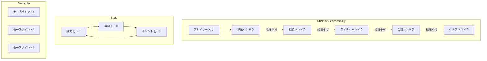
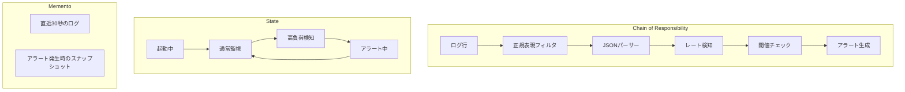
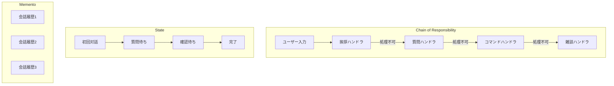

# 連載構造案：手で覚えるデザインパターン実践シリーズ

調査結果: `content/warehouse/chain-state-memento-series.md` の調査結果に基づく

## コンテキスト定義

### ペルソナ

- **想定読者**: 「デザインパターン学習シリーズ」を一通り読了したが、まだ「自力で使いこなせない」人
- **悩み**: 
  - パターン名は知っているけど、「どんな時に使えばいいか」がピンとこない
  - 各回で動くコードは見たけど、複数パターンの併用が難しい
  - 自分でゼロから設計しようとすると、if/elseに戻ってしまう
- **期待**: 手を動かしながら「あ、だから〇〇パターンなのか！」と腹落ちする体験

### 技術スタック

- Perl v5.36以降（signatures、postfix dereference対応）
- Moo（Moose不使用）
- モダンPerl（strict, warnings自動適用のuse v5.36）

### 対象パターン（3つ）

| パターン | 役割 | 既存シリーズでの題材（避ける） |
|---------|------|------------------------------|
| **Chain of Responsibility** | 処理要求の連鎖的受け渡し | ユーザー登録バリデーション、決済審査システム |
| **State** | 状態に応じた振る舞い変更 | 自動販売機シミュレーター |
| **Memento** | 状態のスナップショット保存・復元 | ゲームのセーブ機能、Pixelアートエディタ |

### 学習目標

1. 3パターンを「1つの題材」で体験し、相互の関係を理解する
2. 「この状況ならこのパターン」を直感的に判断できるようになる
3. 既存シリーズで学んだ知識を統合し、定着させる

### 制約

- 1記事1概念（新しい概念の導入は1つまで）
- コード例は各回2つまで
- 毎回、完成コードは原則1ファイル
- シリーズ名にパターン名は出さない（最終回で明かす）
- 既存シリーズと完全に異なるドメイン

---

## 案A【王道】: タイムトラベル・テキストアドベンチャーエンジン

### シリーズ名案

**「Perlで作るタイムトラベル冒険ゲーム」**（16文字）

### コンセプト

**何を作るか:**  
選択を間違えたら「時間を巻き戻して」やり直せるテキストアドベンチャーゲーム。プレイヤーのコマンドを複数のハンドラが順番に解釈し、ゲームの状態（探索/戦闘/イベント）を管理し、任意の時点にセーブ＆ロードできる「タイムトラベル」機能を実装。

**なぜこの題材か:**
- 完成したら「友人に遊んでもらえる」成果物
- 3パターンすべてが「ゲームの楽しさ」のために必然的に登場
- 学習なのにゲームを作れる楽しさ
- 「Perlでゲーム？」という意外性が話題性を生む

### 3パターンの役割



| パターン | 本シリーズでの役割 | 必然性 |
|---------|------------------|--------|
| **Chain of Responsibility** | プレイヤーコマンドを複数ハンドラが順番に解釈（移動→戦闘→アイテム→会話） | 新しいコマンドタイプを追加してもゲームロジック本体を変更不要 |
| **State** | ゲームモード（探索/戦闘/イベント）とキャラ状態（通常/毒/狂戦士）を管理 | 同じコマンドでもモードによって振る舞いが変わる（「攻撃」は戦闘中のみ有効） |
| **Memento** | ゲームの任意時点へのセーブ/ロード、開発者用の「任意の時点に戻る」機能 | 詰み状態から復帰、シナリオ調整のテストが可能 |

### USP（独自の価値提案）

**「なぜこのシリーズに価値があるのか？」**

1. **圧倒的な楽しさ**: 学習なのにゲームを作って遊べる
2. **創造性**: 完成後、自分でシナリオを書いて友人に遊ばせられる
3. **パターンの本質理解**: 「なぜこのパターンが必要か」がゲーム開発の文脈で直感的に理解できる
4. **Perlの再評価**: 「Perlでゲーム？」という意外性が話題性を生む

**自慢ポイント:**  
友人に「Perlでゲーム作ったから遊んでみて」と渡す。普通に遊んでもらった後、「実はこれ、デザインパターンの学習教材なんだよね」と種明かし。

### メリット・デメリット

**メリット:**
- ✅ 学習のモチベーションが最も高い（ゲームだから）
- ✅ 非エンジニアにも見せられる成果物
- ✅ SNSでのシェア性が高い
- ✅ パターンの必然性が体験的に理解できる

**デメリット:**
- ⚠️ 「ゲームで学習？」と真剣度を疑われる可能性
- ⚠️ シナリオデータの作成に時間がかかる
- ⚠️ ビジネス応用が見えにくい（ただし設計思想は応用可能）

### 連載構造表（全8回）

| 回 | タイトル | 新しい概念 | ストーリー | コード例1 | コード例2 | 推奨タグ |
|---|---|---|---|---|---|---|
| 1 | 冒険の始まり：シンプルなゲームループ | 基本的なREPL構造 | 「北に進む」「調べる」を受け付けるシンプルなゲーム。if/elseでコマンド判定 | `simple_game.pl`（if/else版） | 実行結果の確認 | perl, moo, game, text-adventure, beginner |
| 2 | コマンドが増えると大変！ | if/else肥大化問題 | 「攻撃」「使う」「話す」を追加。条件分岐が爆発し保守困難に | `messy_game.pl`（肥大化版） | 問題点の整理 | perl, moo, refactoring, code-smell, tutorial |
| 3 | コマンドハンドラの連鎖 | Chain of Responsibility導入 | コマンドを順番に解釈するハンドラチェーンを構築。新コマンド追加が容易に | `handler_chain.pl`（チェーン） | `MoveHandler.pm`（ハンドラ例） | perl, moo, chain-of-responsibility, handler |
| 4 | 探索モードと戦闘モード | State導入 | ゲームモードによってコマンドの解釈を変える。「攻撃」は戦闘中のみ有効 | `GameState.pm`（状態基底） | `BattleState.pm`（戦闘状態） | perl, moo, state-pattern, game-mode |
| 5 | タイムトラベル機能を実装 | Memento導入 | ゲーム状態をスナップショット保存。好きな時点に戻れる「セーブ/ロード」 | `GameMemento.pm`（メメント） | `SaveManager.pm`（管理者） | perl, moo, memento, save-load, undo |
| 6 | 3つのパターンを統合 | パターン協調動作 | Chain→State→Mementoの連携。コマンド処理→状態遷移→履歴保存の流れ | `adventure.pl`（統合版） | 実行デモ（探索→戦闘→セーブ） | perl, moo, design-pattern, integration |
| 7 | 新しいモードを追加しよう | 拡張性の実証（OCP） | 「ショップモード」と「BuyHandler」を追加。既存コード無修正で機能拡張 | `ShopState.pm`（新状態） | `BuyHandler.pm`（新ハンドラ） | perl, moo, open-closed, extensibility |
| 8 | 振り返り：3つのデザインパターン | パターン名の明示と統合理解 | 使用したパターンを明かし、「いつ・なぜ」使うかを整理。ビジネス応用例も紹介 | パターン対応表 | 完成コード全体像 | perl, moo, design-patterns, retrospective |

### 難易度勾配

```
難易度
  ↑     
⭐⭐⭐⭐⭐ |                                 ●(8回)
⭐⭐⭐⭐  |                       ●●●(6-7回)
⭐⭐⭐   |           ●●●(3-5回)
⭐⭐     |     ●(2回)
⭐       | ●(1回)
        +─────────────────────────────────→ 進行
          1   2   3   4   5   6   7   8
```

### 差別化ポイント

- **既存シリーズとの違い**: 自動販売機でもゲームセーブでもない、「インタラクティブに遊べる」ゲームエンジン
- **3パターン統合**: 既存の2パターン組み合わせシリーズより複合度が高い
- **楽しさ**: 完成したら友人に遊んでもらえる成果物

---

## 案B【革新】: リアルタイムログ監視＆アラートパイプライン

### シリーズ名案

**「Perlで作るログ監視タワー」**（13文字）

### コンセプト

**何を作るか:**  
`tail -f`のログをリアルタイムで読み取り、複数のフィルタチェーンで解析し、パイプラインの動作モードに応じて処理を切り替え、異常検知時には過去のログを遡って詳細分析できる監視システム。

**なぜこの題材か:**
- 「ログ監視なんてgrepで十分」という常識を覆す
- Perlの本領発揮（テキスト処理とパイプライン）
- 実運用で使える（趣味サーバーやCI/CDの監視）
- ハッキング感（リアルタイムでログが流れる中、異常を検知してターミナルが赤く光る）

### 3パターンの役割



| パターン | 本シリーズでの役割 | 必然性 |
|---------|------------------|--------|
| **Chain of Responsibility** | ログ行を順番に処理（正規表現→パース→レート検知→閾値→アラート） | フィルタの追加/削除/順序変更が容易 |
| **State** | パイプラインの動作モード（起動中/通常/高負荷/アラート）を管理 | 状態によってフィルタチェーンの挙動が変わる |
| **Memento** | 直近N秒分のログと内部状態をリングバッファに保存。異常検知時に再現 | デバッグとポストモーテム分析が容易 |

### USP（独自の価値提案）

**「なぜこのシリーズに価値があるのか？」**

1. **実運用で使える**: 趣味サーバーやCI/CDパイプラインの監視に実際に使える
2. **ハッキング感**: リアルタイムでログが流れる中、異常を検知してターミナルが赤く光る体験
3. **技術的深み**: ストリーム処理、イベント駆動、状態機械の実装を一度に学べる
4. **Perlの本領発揮**: テキスト処理とパイプライン処理はPerlが最も輝く領域

**自慢ポイント:**  
ターミナル2つ開いて、片方でダミーアプリ（エラーをランダムに吐く）を実行、もう片方で監視システムを起動。エラー率が閾値を超えた瞬間、過去30秒のログがハイライト表示。

### メリット・デメリット

**メリット:**
- ✅ Perlの強みを最大限に活かせる
- ✅ 技術的に深く、エンジニアリングとして面白い
- ✅ 完成後、実際のプロジェクトで使える
- ✅ リアルタイム処理の実装スキルも身につく

**デメリット:**
- ⚠️ やや上級者向け（ストリーム処理の概念が必要）
- ⚠️ 動作確認にログを出力するダミーアプリが必要
- ⚠️ 見た目の派手さは控えめ（ターミナルベース）

### 連載構造表（全8回）

| 回 | タイトル | 新しい概念 | ストーリー | コード例1 | コード例2 | 推奨タグ |
|---|---|---|---|---|---|---|
| 1 | ログを読んでみよう | 基本的なログ読み取り | `tail -f`的にログを読み取る基本処理。if/elseでパターンマッチ | `simple_tail.pl`（if/else版） | 実行結果の確認 | perl, moo, log, monitoring, beginner |
| 2 | フィルタが増えると大変！ | if/else肥大化問題 | エラー/警告/情報のフィルタを追加。条件分岐が爆発 | `messy_filter.pl`（肥大化版） | 問題点の整理 | perl, moo, refactoring, code-smell |
| 3 | フィルタチェーンを構築 | Chain of Responsibility導入 | フィルタを連鎖させて順番に処理。新フィルタ追加が容易に | `filter_chain.pl`（チェーン） | `ErrorFilter.pm`（フィルタ例） | perl, moo, chain-of-responsibility, filter |
| 4 | 監視モードを切り替える | State導入 | 通常モード/高負荷モード/アラートモードで処理を切り替え | `MonitorState.pm`（状態基底） | `AlertState.pm`（アラート状態） | perl, moo, state-pattern, monitoring |
| 5 | 過去のログを遡る | Memento導入 | 直近のログをリングバッファに保存。アラート時に過去を再現 | `LogMemento.pm`（メメント） | `LogBuffer.pm`（リングバッファ） | perl, moo, memento, buffer, debug |
| 6 | 3つのパターンを統合 | パターン協調動作 | Chain→State→Mementoの連携。フィルタ処理→状態遷移→履歴保存 | `log_tower.pl`（統合版） | 実行デモ（通常→高負荷→アラート） | perl, moo, design-pattern, integration |
| 7 | 新しいフィルタを追加 | 拡張性の実証（OCP） | 「JSONパーサー」と「メトリクス集計」を追加。既存コード無修正 | `JSONFilter.pm`（新フィルタ） | `MetricsState.pm`（新状態） | perl, moo, open-closed, extensibility |
| 8 | 振り返り：監視システムとデザインパターン | パターン名の明示と統合理解 | 使用したパターンを明かし、運用での活用法を紹介 | パターン対応表 | 完成コード全体像 | perl, moo, design-patterns, operations |

### 難易度勾配

```
難易度
  ↑     
⭐⭐⭐⭐⭐ |                                 ●(8回)
⭐⭐⭐⭐  |                       ●●●(6-7回)
⭐⭐⭐   |           ●●●(3-5回)
⭐⭐     |     ●(2回)
⭐       | ●(1回)
        +─────────────────────────────────→ 進行
          1   2   3   4   5   6   7   8
```

### 差別化ポイント

- **Perlの強み最大化**: テキスト処理という「Perlの聖地」でデザインパターンの価値を証明
- **実運用で使える**: 趣味サーバーやCI/CDの監視に実際に活用可能
- **ハッキング感**: リアルタイム監視のスリルを体験

---

## 案C【逆転】: 会話ボットフレームワーク

### シリーズ名案

**「Perlで作る会話ボット工房」**（13文字）

### コンセプト

**何を作るか:**  
Slack/Discord風のメッセージを処理するチャットボットフレームワーク。複数の意図理解エンジンが連鎖し、会話の文脈を保持しながら、過去の会話を巻き戻して「もし別の返答をしていたら？」をシミュレートできる。

**なぜこの題材か:**
- 対話AIブーム真っ只中で話題性がある
- OpenAI API不要で、パターンマッチングと状態遷移で「賢く見える」ボットを作る
- 3パターンの役割分担が明確
- 履歴書にも書ける実用的な成果物

### 3パターンの役割



| パターン | 本シリーズでの役割 | 必然性 |
|---------|------------------|--------|
| **Chain of Responsibility** | メッセージを複数のIntentHandler（挨拶/質問/コマンド/雑談）に順番に渡す | 新しい意図タイプを追加してもコード本体を変更不要 |
| **State** | 会話の文脈状態（初回/質問待ち/確認待ち/完了）を管理 | 同じメッセージでも状態によって応答が変わる |
| **Memento** | 会話履歴とその時点の状態をスナップショット保存 | デバッグ時に「3つ前の発言から会話をやり直す」が可能 |

### USP（独自の価値提案）

**「なぜこのシリーズに価値があるのか？」**

1. **実用性**: 実際にSlack/Discordにデプロイできるボットのベースになる
2. **学習曲線の最適化**: 3パターンの「なぜ必要か」が会話フローを実装する過程で自然に理解できる
3. **拡張性の実感**: ハンドラを1つ追加するだけで新機能が追加できる体験
4. **デバッグ体験**: Mementoによる会話巻き戻しで「あ、このパターン超便利じゃん！」となる

**自慢ポイント:**  
「Perlで会話ボット作ったんだけど、会話の途中でセーブして別のルート試せるんだよね。デバッグ超楽」と言いながら、ターミナルで会話を巻き戻すデモを見せる。

### メリット・デメリット

**メリット:**
- ✅ 実用性が高く、モチベーションが続く
- ✅ 3パターンの役割分担が明確
- ✅ 段階的に機能追加できる（最初は簡単なハンドラから）
- ✅ 完成後も趣味プロジェクトに使える

**デメリット:**
- ⚠️ やや実装量が多い（連載8回分に収まるか調整が必要）
- ⚠️ NLP的な処理は簡略化する必要がある
- ⚠️ ゲームほどの「楽しさ」は薄い

### 連載構造表（全8回）

| 回 | タイトル | 新しい概念 | ストーリー | コード例1 | コード例2 | 推奨タグ |
|---|---|---|---|---|---|---|
| 1 | ボットに話しかけてみよう | 基本的なREPL構造 | 「こんにちは」に「Hello!」と返す最小限のボット。if/elseで判定 | `simple_bot.pl`（if/else版） | 実行結果の確認 | perl, moo, chatbot, beginner |
| 2 | 返答パターンが増えると大変！ | if/else肥大化問題 | 挨拶/質問/コマンドへの応答を追加。条件分岐が爆発 | `messy_bot.pl`（肥大化版） | 問題点の整理 | perl, moo, refactoring, code-smell |
| 3 | 意図ハンドラの連鎖 | Chain of Responsibility導入 | メッセージを順番に解釈するハンドラチェーンを構築 | `handler_chain.pl`（チェーン） | `GreetingHandler.pm`（ハンドラ例） | perl, moo, chain-of-responsibility, intent |
| 4 | 会話の文脈を管理する | State導入 | 初回対話/質問待ち/確認待ちで応答を変える | `DialogState.pm`（状態基底） | `QuestionState.pm`（質問状態） | perl, moo, state-pattern, context |
| 5 | 会話を巻き戻す | Memento導入 | 会話履歴をスナップショット保存。任意の時点に戻れる | `DialogMemento.pm`（メメント） | `HistoryManager.pm`（管理者） | perl, moo, memento, history, debug |
| 6 | 3つのパターンを統合 | パターン協調動作 | Chain→State→Mementoの連携。意図解釈→状態遷移→履歴保存 | `chatbot.pl`（統合版） | 実行デモ（挨拶→質問→確認） | perl, moo, design-pattern, integration |
| 7 | 新しいハンドラを追加 | 拡張性の実証（OCP） | 「天気予報ハンドラ」と「予約状態」を追加。既存コード無修正 | `WeatherHandler.pm`（新ハンドラ） | `ReservationState.pm`（新状態） | perl, moo, open-closed, extensibility |
| 8 | 振り返り：会話システムとデザインパターン | パターン名の明示と統合理解 | 使用したパターンを明かし、Slack/Discord連携の発展案を紹介 | パターン対応表 | 完成コード全体像 | perl, moo, design-patterns, chatbot |

### 難易度勾配

```
難易度
  ↑     
⭐⭐⭐⭐⭐ |                                 ●(8回)
⭐⭐⭐⭐  |                       ●●●(6-7回)
⭐⭐⭐   |           ●●●(3-5回)
⭐⭐     |     ●(2回)
⭐       | ●(1回)
        +─────────────────────────────────→ 進行
          1   2   3   4   5   6   7   8
```

### 差別化ポイント

- **対話AIブームに乗る**: ChatGPT時代に「対話システムの裏側」を理解する価値
- **実用性**: Slack/Discord連携への発展が可能
- **デバッグ体験**: 会話巻き戻しでMementoの価値を体感

---

## 推薦と評価

### 総合評価

| 項目 | 案A（冒険ゲーム） | 案B（ログ監視） | 案C（会話ボット） |
|------|-----------------|----------------|-----------------|
| **楽しさ** | ⭐⭐⭐⭐⭐ | ⭐⭐⭐ | ⭐⭐⭐⭐ |
| **実用性** | ⭐⭐⭐ | ⭐⭐⭐⭐⭐ | ⭐⭐⭐⭐ |
| **Perl特有の強み** | ⭐⭐⭐ | ⭐⭐⭐⭐⭐ | ⭐⭐⭐ |
| **3パターンの必然性** | ⭐⭐⭐⭐⭐ | ⭐⭐⭐⭐ | ⭐⭐⭐⭐ |
| **SNSシェア性** | ⭐⭐⭐⭐⭐ | ⭐⭐⭐ | ⭐⭐⭐⭐ |
| **既存シリーズとの差別化** | ⭐⭐⭐⭐⭐ | ⭐⭐⭐⭐⭐ | ⭐⭐⭐⭐ |

### 推薦順位

1. **第1推薦: 案A（タイムトラベル冒険ゲーム）** 
   - 最も記憶に残り、完走率が高い
   - 「学習が苦痛じゃない」は最強の価値
   - 友人に遊んでもらえる成果物

2. **第2推薦: 案B（ログ監視タワー）** 
   - Perlの強みを最大限に活かせる
   - 実運用で使える技術的深さ
   - 中級者以上なら最も学びが多い

3. **第3推薦: 案C（会話ボット工房）** 
   - 対話AIブームに乗れる話題性
   - 実用性と学習効果のバランス
   - 履歴書にも書ける

### 最終推薦

**案Aを推薦します。**

理由:
- 「デザインパターン学習シリーズ読了者向け」という想定読者にとって、「楽しみながら復習」できる点が最大の価値
- 3パターンすべてが「ゲームの楽しさ」のために必然的に登場する設計
- 既存シリーズ（自動販売機、ゲームセーブ、バリデーション）と完全に異なるアプローチ
- 「Perlでゲーム」という意外性が話題性を生む

---

## レビュー履歴

### 初版 (2026-01-31)
- 3案（王道/革新/逆転）を作成
- 調査結果に基づいて3パターンの相互関係を整理
- 各案の連載構造表を作成
