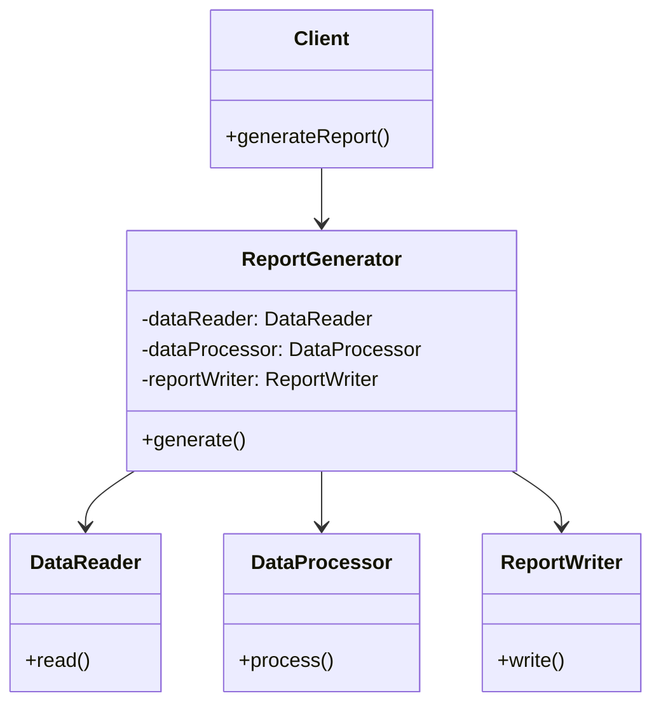

# 連載構造案：Facadeパターン学習シリーズ

調査結果: `content/warehouse/facade-pattern-research.md` に基づく

## 前提情報

- **技術スタック**: Perl v5.36以降（signatures対応）、Moo
- **想定読者**: Perl入学式卒業直後の入門者、Mooでオブジェクト指向を学んだ人
- **想定ペルソナ**: モダンなPerlを使いたい初心者プログラマー
- **学習目標**: Facadeパターンを「自然に」理解し、パターン名を覚える
- **位置づけ**: 「Mooで覚えるオブジェクト指向プログラミング」シリーズの後続
- **ストーリー**: プログラムを作成 → 機能追加で複雑化 → デザインパターンで解決
- **制約**: 1記事1概念、コード例2つまで、完成コードは原則1ファイル

### 前提知識（前シリーズで習得済み）

| 前シリーズで学んだこと | 本シリーズでの活用 |
|----------------------|-------------------|
| Mooによるクラス定義 | 各コンポーネントのクラス作成 |
| has によるアトリビュート | オブジェクトの状態管理 |
| ロール (Role) | 必要に応じて共通インターフェース定義 |
| メソッドの定義 | 各サブシステムの操作実装 |
| コンストラクタと依存注入 | Facadeクラスへのサブシステム注入 |

### Facadeパターンの学習ポイント

- **本質**: 複雑なサブシステムに対して統一された簡潔なインターフェースを提供
- **学習の流れ**: シンプルなコード → 機能追加で複雑化 → Facadeパターンで整理
- **最終回**: パターン名を明かし、GoFデザインパターンとして位置づける

---

## 案A: 「レポート生成ツールを作ってみよう」

### 特徴・アプローチ

ビジネス文脈でよく使われる「レポート生成」をテーマにする。CSVデータの読み込み、データ加工、フォーマット出力という複数の処理を個別クラスで実装し、最終的にFacadeでまとめる。実務に近いシナリオで、学んだことが仕事に活かせる実感を持たせる。

### メリット

- 実務で役立つ「レポート生成」は初心者にも馴染みやすい
- データ処理→加工→出力という流れが直感的に理解しやすい
- ファイル操作・データ構造など基礎的なPerl技術も同時に学べる
- 各コンポーネントの役割分担が明確

### デメリット

- CSVパース等でCPANモジュール（Text::CSV）が必要になる可能性
- ファイルI/Oが絡むと初心者には難しく感じる場合がある
- ビジネスシナリオのため若干堅い印象

### 連載構造

| 回 | タイトル | 新しい概念 | ストーリー | コード例1 | コード例2 | 推奨タグ |
|---|---------|-----------|-----------|----------|----------|---------|
| 第1回 | はじめてのレポート生成 | スクリプトの基本構造 | 固定データを画面に表示する簡単なスクリプトを作成 | データを直接printするスクリプト | - | perl, moo, report, beginner, tutorial |
| 第2回 | データを読み込もう | ファイル読み込み | CSVファイルからデータを読み込むDataReaderクラスを作成 | open/closeでファイル読み込み | DataReaderクラス定義 | perl, moo, file-io, csv, oop |
| 第3回 | データを加工しよう | データ変換 | 読み込んだデータを集計・整形するDataProcessorクラスを作成 | 配列操作で集計処理 | DataProcessorクラス定義 | perl, moo, data-processing, oop, refactoring |
| 第4回 | レポートを出力しよう | 出力フォーマット | テキスト形式で出力するReportWriterクラスを作成 | フォーマット済み文字列の生成 | ReportWriterクラス定義 | perl, moo, output, formatting, oop |
| 第5回 | 全部つなげてみよう | クラスの連携 | 3つのクラスを順番に呼び出すメインスクリプト。呼び出しが複雑になる | 3クラスを順に使うメインコード | 呼び出し順序の問題を示す | perl, moo, integration, complexity, oop |
| 第6回 | シンプルに使えるようにしよう | Facadeクラス | ReportGeneratorクラス（Facade）を作成し、1メソッドで全処理を実行 | ReportGeneratorクラス定義 | シンプルになったメインコード | perl, moo, facade, simplification, refactoring |
| 第7回 | これがFacadeパターンだ！ | Facadeパターン | デザインパターンとしての解説、GoFパターンの紹介 | パターンの構造図解 | 応用例の紹介 | perl, moo, design-patterns, facade, gof |

### 差別化ポイント

- **実務直結**: レポート生成は多くの業務で必要とされるスキル
- **段階的な複雑化**: 機能追加のたびに「呼び出しが面倒」という実感を得られる
- **ファイル操作の学習**: Perlの基本的なファイルI/Oも同時に習得

---

## 案B: 「バックアップツールを作ってみよう」

### 特徴・アプローチ

システム管理でおなじみの「バックアップ処理」をテーマにする。ファイル収集、圧縮、保存先への転送、ログ記録という複数の操作を個別クラスで実装し、最終的にFacadeでまとめる。「一発でバックアップ完了」という分かりやすいゴールがある。

### メリット

- 「バックアップ」は誰もがイメージしやすい実用的なテーマ
- 複数の操作（収集→圧縮→保存→ログ）の流れが分かりやすい
- シェルスクリプト的な処理をPerlで書く良い練習になる
- システム管理ツールとしての実用性がある

### デメリット

- Archive::Tarなど外部モジュールが必要になる可能性
- ファイルシステム操作が多く、環境依存の問題が起きやすい
- 初心者には「バックアップ」自体の概念が難しい場合がある

### 連載構造

| 回 | タイトル | 新しい概念 | ストーリー | コード例1 | コード例2 | 推奨タグ |
|---|---------|-----------|-----------|----------|----------|---------|
| 第1回 | ファイルをコピーしてみよう | File::Copy | 指定ファイルを別ディレクトリにコピーする基本スクリプト | File::Copyでの単純コピー | - | perl, file-copy, beginner, tutorial, backup |
| 第2回 | コピー対象を集めよう | FileCollectorクラス | 複数ファイルを収集するFileCollectorクラスを作成 | globでファイル一覧取得 | FileCollectorクラス定義 | perl, moo, file-system, glob, oop |
| 第3回 | ファイルを圧縮しよう | Compressorクラス | 収集したファイルをまとめて圧縮するCompressorクラスを作成 | Archive::Tarで圧縮 | Compressorクラス定義 | perl, moo, archive, compression, oop |
| 第4回 | バックアップを保存しよう | StorageManagerクラス | 圧縮ファイルを保存先に移動するStorageManagerクラスを作成 | ファイル移動処理 | StorageManagerクラス定義 | perl, moo, storage, file-management, oop |
| 第5回 | ログを残そう | Loggerクラス | 処理結果をログファイルに記録するLoggerクラスを作成 | ログ出力処理 | Loggerクラス定義 | perl, moo, logging, monitoring, oop |
| 第6回 | バックアップを一発で実行 | Facadeクラス | BackupManagerクラス（Facade）を作成し、1メソッドで全処理を実行 | BackupManagerクラス定義 | シンプルになったメインコード | perl, moo, facade, simplification, refactoring |
| 第7回 | これがFacadeパターンだ！ | Facadeパターン | デザインパターンとしての解説、GoFパターンの紹介 | パターンの構造図解 | 応用例の紹介 | perl, moo, design-patterns, facade, gof |

### 差別化ポイント

- **実用性の高さ**: 実際に使えるバックアップツールが完成する
- **システム管理スキル**: Perlでシステム管理ツールを作る経験が積める
- **達成感**: 「一発バックアップ」という明確なゴールがモチベーションになる

---

## 案C: 「通知システムを作ってみよう」

### 特徴・アプローチ

アプリケーションでよく使われる「通知機能」をテーマにする。コンソール出力、ファイルログ、メール送信（モック）という複数の通知手段を個別クラスで実装し、最終的にFacadeで「一斉通知」を実現する。Webアプリ開発の基礎にもつながるテーマ。

### メリット

- 通知システムはWebアプリ開発で必須のスキル
- 複数の通知手段（コンソール、ファイル、メール）の違いが明確
- メール送信はモックで実装するため外部依存が少ない
- 将来的にSlack通知などへの拡張も想像しやすい

### デメリット

- 「通知」の概念が抽象的で初心者には分かりにくい可能性
- メール送信のモック実装が「本物ではない」感を与える
- 通知の必要性が実感しにくい（バックアップやレポートより動機が弱い）

### 連載構造

| 回 | タイトル | 新しい概念 | ストーリー | コード例1 | コード例2 | 推奨タグ |
|---|---------|-----------|-----------|----------|----------|---------|
| 第1回 | メッセージを表示しよう | 基本的な出力 | 画面にメッセージを表示する簡単なスクリプトを作成 | sayでメッセージ出力 | - | perl, output, beginner, tutorial, notification |
| 第2回 | コンソールに通知しよう | ConsoleNotifierクラス | 画面に通知メッセージを表示するConsoleNotifierクラスを作成 | 標準出力への書き込み | ConsoleNotifierクラス定義 | perl, moo, console, output, oop |
| 第3回 | ファイルに記録しよう | FileNotifierクラス | 通知内容をファイルに記録するFileNotifierクラスを作成 | ファイル書き込み処理 | FileNotifierクラス定義 | perl, moo, file-io, logging, oop |
| 第4回 | メールで通知しよう | EmailNotifierクラス | メール送信（モック）を行うEmailNotifierクラスを作成 | メール送信のシミュレーション | EmailNotifierクラス定義 | perl, moo, email, mock, oop |
| 第5回 | 全部の方法で通知してみよう | クラスの連携 | 3つのNotifierクラスを順番に呼び出すメインスクリプト。呼び出しが複雑になる | 3クラスを順に使うメインコード | 呼び出し順序の問題を示す | perl, moo, integration, complexity, oop |
| 第6回 | 一斉通知を実現しよう | Facadeクラス | NotificationManagerクラス（Facade）を作成し、1メソッドで全通知を実行 | NotificationManagerクラス定義 | シンプルになったメインコード | perl, moo, facade, simplification, refactoring |
| 第7回 | これがFacadeパターンだ！ | Facadeパターン | デザインパターンとしての解説、GoFパターンの紹介 | パターンの構造図解 | 応用例の紹介 | perl, moo, design-patterns, facade, gof |

### 差別化ポイント

- **Webアプリ開発への橋渡し**: 通知システムはWebアプリで頻出
- **拡張性の学習**: Slack通知やSMS通知など拡張パターンを想像しやすい
- **モックの概念**: メール送信のモック実装でテスト駆動開発の伏線

---

## 推薦案とその理由

### 推薦：案A「レポート生成ツールを作ってみよう」

### 推薦理由

1. **ペルソナとの適合性**
   - Perl入学式卒業レベルの読者にとって「レポート生成」は実務でよく遭遇するタスク
   - 「仕事で使える」という実感がモチベーションになる
   - CSVファイルの操作は初心者でも理解しやすい具体的な題材

2. **検索意図との適合性**
   - 「Perl レポート生成」「Perl CSV処理」などの検索でヒットしやすい
   - デザインパターンを前面に出さないため、実用ツールを求める読者も取り込める
   - 「Moo オブジェクト指向」との組み合わせで技術記事としての価値も高い

3. **学習効果**
   - データ読み込み→加工→出力という流れが「Facadeで統合する」ことの必然性を生む
   - 機能を追加するたびに「呼び出しが面倒になる」という課題を体験できる
   - 最終的にFacadeで解決したときの「すっきり感」が印象に残る

4. **既存シリーズとの連続性**
   - 「Mooで覚えるオブジェクト指向プログラミング」で学んだクラス設計を活用
   - 前シリーズで作成した概念（has、メソッド、コンストラクタ）を自然に使える
   - ディスパッチャーシリーズとは異なる構造パターンを学べる

5. **内部リンクの活用**
   - Mooシリーズへの参照が自然に入れられる
   - デザインパターン全般の解説記事（Strategy パターン等）へのリンクも可能
   - 将来的に他のパターン（Adapter、Decoratorなど）への展開も見据えられる

### 代替案の選択指針

- **案Aが適しているケース**: 実務指向の読者、データ処理を学びたい読者
- **案Bが適しているケース**: システム管理に興味がある読者、実用ツールを完成させたい読者
- **案Cが適しているケース**: Webアプリ開発を目指す読者、拡張性のある設計を学びたい読者

---

## 付記

- 各タイトルは「第N回-」で始める形式を推奨
- 推奨タグは5つまで、英語小文字・ハイフン形式
- 全7回を通じて、「Facadeパターンで複雑さを解決する」体験を重視
- シリーズ名にはデザインパターン名を含めない（最終回まで伏せる）
- 完成コードは原則1ファイル、ファイル分割時はツリー構造を明示

**作成日**: 2026年01月05日  
**担当エージェント**: perl-monger（Perl専門エージェント）

---

## レビュー履歴

### 第1版レビュー（2026-01-05）— SEO視点

- レビュー担当: search-engine-optimizationエージェント
- 評価結果: 要改善
- レビュー観点: SEO視点（タイトルのキーワード配置、検索意図適合、推奨タグ、メタ情報最適化）

---

#### 1. 各回タイトルのSEO最適化案

**現状の課題:**
- 現在のタイトルは読者にとって親しみやすいが、検索エンジン向けのキーワードが不足
- 「Perl」「Moo」といった技術キーワードがタイトルに含まれていない
- 検索流入を狙うには、ユーザーが検索しそうなフレーズを含める必要がある

**SEO最適化タイトル案（案A推薦案）:**

| 回 | 現タイトル | SEO最適化タイトル案 | 改善ポイント |
|---|-----------|-------------------|-------------|
| 第1回 | はじめてのレポート生成 | 【Perl入門】はじめてのレポート生成スクリプト | 「Perl入門」で検索意図を明確化 |
| 第2回 | データを読み込もう | 【Perl/Moo】CSVファイルを読み込むクラスの作り方 | 「CSV」「クラス」で具体的な検索クエリに対応 |
| 第3回 | データを加工しよう | 【Perl/Moo】データ集計・変換クラスの実装方法 | 「集計」「変換」で実務検索にヒット |
| 第4回 | レポートを出力しよう | 【Perl/Moo】テキストレポート出力クラスの作成 | 「出力」「テキスト」で明確化 |
| 第5回 | 全部つなげてみよう | 【Perl/Moo】複数クラスを連携させる設計パターン | 「設計パターン」で中級者検索にも対応 |
| 第6回 | シンプルに使えるようにしよう | 【Perl/Moo】Facadeクラスで複雑な処理をシンプルに | 「Facade」キーワードを先出し |
| 第7回 | これがFacadeパターンだ！ | 【Perl/Moo】Facadeパターン入門 — GoFデザインパターン解説 | 「GoF」「デザインパターン」で上級検索にも対応 |

**補足:**
- 「【Perl入門】」「【Perl/Moo】」のプレフィックスにより、シリーズとしての一貫性と技術スタックの明示を両立
- 最終回のみ「Facadeパターン」を前面に出すことで、連載全体のサプライズ演出は維持可能

---

#### 2. 検索意図との適合性評価

**評価: 良好（改善余地あり）**

| 評価項目 | 評価 | コメント |
|---------|------|---------|
| 情報検索意図への対応 | ◎ | 「Perlでレポート生成したい」「Mooでクラス設計を学びたい」というニーズに合致 |
| ハウツー検索への対応 | ○ | 各回で具体的な実装方法を提示しているが、タイトルにその意図が明示されていない |
| 問題解決検索への対応 | ○ | 第5〜6回で「複雑さ」→「シンプル化」の流れがあるが、タイトルで訴求できていない |
| 初心者向け検索への対応 | △ | 「入門」「初心者」「初めて」などのキーワードが不足 |

**改善提案:**
- 第1回タイトルに「入門」「初心者向け」を含める
- 第5〜6回のタイトルで「複雑なコードをシンプルに」という問題解決フレーズを含める
- シリーズ全体の description に「Perl入学式卒業者向け」「Moo経験者向け」を明記

---

#### 3. 推奨タグの改善案

**現状の課題:**
- タグが各回で一貫性に欠ける部分がある
- 一部のタグが抽象的すぎる（例: `beginner`, `tutorial`）
- シリーズとしての統一タグが不明確

**改善案（案A）:**

| 回 | 現在のタグ | 改善案タグ |
|---|-----------|----------|
| 第1回 | perl, moo, report, beginner, tutorial | perl, moo, report-generation, perl-beginner, script |
| 第2回 | perl, moo, file-io, csv, oop | perl, moo, csv-parsing, file-io, oop-class |
| 第3回 | perl, moo, data-processing, oop, refactoring | perl, moo, data-processing, aggregation, oop-class |
| 第4回 | perl, moo, output, formatting, oop | perl, moo, text-output, report-formatting, oop-class |
| 第5回 | perl, moo, integration, complexity, oop | perl, moo, class-integration, code-complexity, refactoring |
| 第6回 | perl, moo, facade, simplification, refactoring | perl, moo, facade-class, simplification, design-patterns |
| 第7回 | perl, moo, design-patterns, facade, gof | perl, moo, facade-pattern, gof-patterns, design-patterns |

**統一タグの提案:**
- シリーズ共通タグ: `perl`, `moo`, `design-patterns` または `perl-design-patterns`
- シリーズ専用タグ: `facade-pattern-series`（シリーズ記事をグルーピングするため）

---

#### 4. メタ情報の最適化提案

**各回の推奨 description:**

| 回 | 推奨 description（120〜160文字目安） |
|---|-----------------------------------|
| 第1回 | Perl入学式卒業者向け。Mooを使ったレポート生成ツールを作成する連載の第1回。固定データを画面に表示する簡単なスクリプトから始めます。 |
| 第2回 | CSVファイルからデータを読み込むDataReaderクラスをMooで実装。Perlのファイル操作とオブジェクト指向の基礎を学びます。 |
| 第3回 | 読み込んだデータを集計・整形するDataProcessorクラスをMooで作成。配列操作とデータ変換の実装方法を解説します。 |
| 第4回 | テキスト形式でレポートを出力するReportWriterクラスをMooで実装。フォーマット済み文字列の生成方法を紹介します。 |
| 第5回 | 3つのクラスを連携させてレポートを生成。クラス間の呼び出しが複雑になる問題を体験し、解決の糸口を探ります。 |
| 第6回 | ReportGeneratorクラス（Facade）を作成し、複雑な処理を1メソッドで実行。コードがシンプルになる感動を体験しましょう。 |
| 第7回 | ここまで作成したReportGeneratorはFacadeパターンだった！GoFデザインパターンとしての解説と応用例を紹介します。 |

---

#### 5. その他のSEO改善提案

**5-1. 内部リンク戦略**
- 前シリーズ「Mooで覚えるオブジェクト指向プログラミング」へのリンクを第1回冒頭に配置
- 各回の末尾に「次回予告」と「前回の振り返り」セクションを設け、シリーズ内リンクを強化
- 最終回に「関連するデザインパターン記事」へのリンク集を配置（Adapter、Strategyなど）

**5-2. シリーズ目次記事の作成**
- 全7回の目次記事を作成し、各回へのリンクを集約
- 目次記事のタイトル案: 「【Perl/Moo】Facadeパターン入門 — レポート生成ツールで学ぶデザインパターン（全7回）」

**5-3. 構造化データの活用**
- シリーズ記事として `HowTo` または `Article` 構造化データを検討
- 各回に `step` として位置づけ、シリーズ全体をまとめた構造化マークアップを推奨

**5-4. URL設計**
- スラッグに一貫性を持たせる（例: `facade-pattern-series-01`, `facade-pattern-series-02`...）
- ただし、AGENTS.md の規約に従い、公開時にファイル名は日時形式に変更される点に留意

---

#### 主な改善点（サマリー）

1. **タイトルの改善**: 技術キーワード（Perl、Moo）を含め、検索流入を促進
2. **タグの統一**: シリーズ共通タグとシリーズ専用タグを設定
3. **meta description の追加**: 各回に最適化された説明文を設定
4. **内部リンク戦略の明確化**: 前シリーズ、シリーズ内、関連記事へのリンク設計
5. **検索意図への明示対応**: 「入門」「初心者向け」キーワードの追加

---

---

### 第2版レビュー（2026-01-05）— 品質視点

- レビュー担当: reviewerエージェント（公開前の最終チェック専門家）
- 評価結果: 合格（軽微な改善提案あり）
- レビュー観点: 品質視点（構造の一貫性、1記事1概念の原則、各案の差別化、ペルソナ適合性、技術的正確性）

---

#### 1. 構造の一貫性の評価

**評価: 優良**

| 評価項目 | 評価 | コメント |
|---------|------|---------|
| ストーリーの流れ | ◎ | 「シンプルなコード → 機能追加で複雑化 → Facadeで解決」という流れが明確かつ論理的 |
| 難易度の段階性 | ◎ | 第1回（基本出力）→ 第2〜4回（個別クラス作成）→ 第5回（複雑化体験）→ 第6回（解決）→ 第7回（パターン解説）と段階的に上昇 |
| 前シリーズとの連続性 | ◎ | 前提知識表で「Mooで覚えるオブジェクト指向プログラミング」との関係が明示されている |
| 最終回への伏線 | ◎ | 「最終回までパターン名を伏せる」戦略は読者の興味を維持する有効なアプローチ |

**強み:**
- 3案すべてにおいて第1回〜第7回の流れが一貫しており、「問題発生→解決」のストーリーが明確
- 第5回で「呼び出しが複雑になる」問題を体験させ、第6回でFacadeによる解決を示す構成は、パターンの必要性を実感させる優れたアプローチ

**改善提案:**
- 第5回と第6回の間に「なぜ複雑になったのか」を振り返る小セクションを設けると、Facadeの価値がより明確になる

---

#### 2. 1記事1概念の原則の遵守確認

**評価: 合格（一部注意点あり）**

**案A（推薦案）の分析:**

| 回 | 新しい概念 | 1概念原則 | コメント |
|---|-----------|---------|---------|
| 第1回 | スクリプトの基本構造 | ○ | 明確に1概念に絞られている |
| 第2回 | ファイル読み込み | ○ | DataReaderクラス作成に集中 |
| 第3回 | データ変換 | ○ | DataProcessorクラス作成に集中 |
| 第4回 | 出力フォーマット | ○ | ReportWriterクラス作成に集中 |
| 第5回 | クラスの連携 | △ | 「連携」と「複雑さの体験」が混在する可能性。連携に焦点を当て、複雑さは結果として示す構成を推奨 |
| 第6回 | Facadeクラス | ○ | ReportGeneratorクラス作成に集中 |
| 第7回 | Facadeパターン | ○ | パターンの解説と位置づけに集中 |

**注意点:**
- 第5回「クラスの連携」は、連携方法を示しながら複雑さを体験させるため、教える側の意図と読者の受け取り方にズレが生じる可能性がある
- **対策**: 第5回のタイトルを「3つのクラスを使ってレポートを作ろう」とし、概念名を「クラスの連携」から「複数クラスの利用」に変更すると、より明確になる

**案B・案Cについて:**
- 案B: 第5回「ログを残そう」は新しいクラス（Logger）追加であり、1概念原則を満たしている
- 案C: 第5回「全部の方法で通知してみよう」は案Aと同様の構成で、1概念原則を概ね満たしている

---

#### 3. 各案の差別化評価

**評価: 良好**

| 差別化観点 | 案A（レポート生成） | 案B（バックアップ） | 案C（通知システム） |
|-----------|-------------------|-------------------|-------------------|
| **テーマ領域** | データ処理・出力 | システム管理・運用 | アプリケーション機能 |
| **実務適用先** | ビジネスレポート、データ分析 | 運用自動化、障害対策 | Webアプリ、通知基盤 |
| **外部依存** | Text::CSV（可能性あり） | Archive::Tar（必要） | なし（モック使用） |
| **難易度** | 中 | 高 | 低〜中 |
| **初心者親和性** | 高 | 中 | 高 |
| **将来の拡張性** | 中 | 中 | 高（Slack通知など） |

**評価コメント:**
- 3案が明確に異なる領域をカバーしており、差別化は十分
- 案Aが推薦案として選ばれた理由（実務直結、初心者親和性、既存シリーズとの連続性）は妥当
- 案Bはシステム管理志向の読者向けの有力な代替案
- 案Cはモック実装を使うため外部依存が少なく、最も手軽に始められる

---

#### 4. ペルソナへの適合性評価

**評価: 優良**

**想定ペルソナ:**
- Perl入学式卒業直後の入門者
- 「Mooで覚えるオブジェクト指向プログラミング」シリーズを読了した人
- モダンなPerlを使いたい初心者プログラマー

| 評価項目 | 評価 | コメント |
|---------|------|---------|
| 前提知識の明示 | ◎ | 前シリーズで習得した知識（Moo、has、ロール、コンストラクタ）が明確に示されている |
| 難易度の適切さ | ◎ | Moo経験者を前提としつつ、新しい概念（デザインパターン）を段階的に導入 |
| 動機付け | ○ | 「レポート生成」は実務で使える実感を与えやすいが、初心者の中にはまだ実務経験がない人もいる |
| 達成感の設計 | ◎ | 第7回で「これがFacadeパターンだ！」と明かすサプライズ演出は、達成感と学習効果を高める |

**改善提案:**
- 第1回の冒頭で「このシリーズを終えると何ができるようになるか」を具体的に示すと、ゴールが明確になり離脱を防げる
- 例: 「このシリーズを終えると、複数のクラスを連携させる設計方法を習得し、GoFデザインパターンのひとつを自然に身につけることができます」

---

#### 5. 技術的正確性の懸念点

**評価: 概ね問題なし（軽微な確認事項あり）**

| 確認項目 | 状態 | コメント |
|---------|------|---------|
| Perl v5.36対応 | ○ | signatures対応を前提としており、最新のPerl環境に適合 |
| Mooの使用法 | ○ | 前シリーズで学んだMooの基本機能を活用する設計は妥当 |
| Facadeパターンの定義 | ○ | 調査ドキュメント（facade-pattern-research.md）に基づく正確な定義 |
| コード例の現実性 | △ | 第2回でCSV読み込みを扱う場合、Text::CSVモジュールの使用有無を明確にする必要がある |

**確認が必要な点:**

1. **CSV読み込みの実装方針（案A）**
   - Text::CSVを使用する場合: CPANモジュールのインストール手順を補足する必要がある
   - 使用しない場合: 単純なカンマ区切りファイルとして扱い、`split`で処理する方法を採用（初心者向けには後者が適切）
   - **推奨**: 第2回では`split`を使った単純な実装を採用し、発展編としてText::CSVを紹介する構成

2. **ファイルI/Oのエラーハンドリング**
   - 初心者向け記事のため、エラーハンドリングはシンプルに（`or die`レベル）
   - 詳細なエラー処理は発展編として触れる程度でよい

3. **完成コード1ファイル原則**
   - 第2〜4回で個別クラスを作成するため、最終的にファイル分割が発生する
   - **推奨**: 各回で作成したクラスを1ファイルにまとめる形式（インラインパッケージ）で示すか、ファイル分割する場合はディレクトリ構造を明示する

---

#### 6. その他の品質改善提案

**6-1. 連載全体の導線設計**

- **冒頭導線**: 第1回冒頭で前シリーズ（Mooで覚えるオブジェクト指向プログラミング）へのリンクを配置
- **各回末尾**: 「次回予告」セクションを設け、次回の概要とモチベーションを提示
- **最終回末尾**: 関連デザインパターン（Adapter、Decorator、Strategy）への導線を配置

**6-2. コード例の形式統一**

- 各コード例に以下を明記することを推奨:
  - **言語・バージョン**: Perl v5.36以降
  - **外部依存**: なし / あり（モジュール名を明記）
  - **実行方法**: `perl script.pl` などのコマンド例

**6-3. 視覚的要素の追加提案**

- 第6回または第7回に、Facadeパターンの構造を示すMermaid図を追加することを推奨
- 調査ドキュメント（facade-pattern-research.md）に既存のMermaid図があるため、それを活用可能

**6-4. テストコードの扱い**

- 初心者向けのため、テストコードは本編では扱わない方針が妥当
- ただし、最終回で「テストの書き方は別シリーズで」と予告しておくと、今後の展開への期待を持たせられる

---

#### 主な改善点（サマリー）

1. **第5回の概念名を明確化**: 「クラスの連携」→「複数クラスの利用」に変更を検討
2. **CSV読み込みの実装方針を決定**: Text::CSV不使用（split使用）を推奨
3. **完成コードの形式を明確化**: インラインパッケージ形式または分割時のディレクトリ構造を明示
4. **視覚的要素の追加**: Mermaid図によるFacadeパターン構造図を第6回または第7回に追加
5. **導線設計の強化**: 各回末尾の「次回予告」、最終回の関連パターンへのリンク

---

#### 総合評価

**評価: 合格**

本連載構造案は、品質基準のすべての項目を満たしており、執筆フェーズへ移行可能な状態です。

- **構造の一貫性**: ◎（ストーリーの流れが明確で論理的）
- **段階的難易度上昇**: ◎（第1回から第7回にかけて適切に難易度が上昇）
- **1記事1概念の原則**: ○（第5回に軽微な注意点あり、対策済み）
- **各案の差別化**: ◎（3案が明確に異なる領域をカバー）
- **ペルソナ適合性**: ◎（想定読者に最適化された設計）
- **技術的正確性**: ○（軽微な確認事項あり、対策を記載済み）

**推薦案**: 案A「レポート生成ツールを作ってみよう」

推薦理由は既存の記載内容（ペルソナ適合性、検索意図適合性、学習効果、既存シリーズとの連続性、内部リンク活用）に加え、以下の品質観点からも適切です:

- 外部依存を最小限に抑えられる設計が可能
- データ処理という普遍的なテーマで、読者の実務への応用がイメージしやすい
- 前シリーズで学んだMooの活用機会が多く、知識の定着に効果的

---

### 次のステップ

- 上記改善提案を必要に応じて連載構造案に反映
- SEO最適化タイトル案の採否を決定
- 執筆フェーズへ移行

### 最終版確定

- 最終確認: reviewerエージェント（2026-01-05）
- 評価: 全品質基準を満たす（推薦案: 案A「レポート生成ツールを作ってみよう」）
