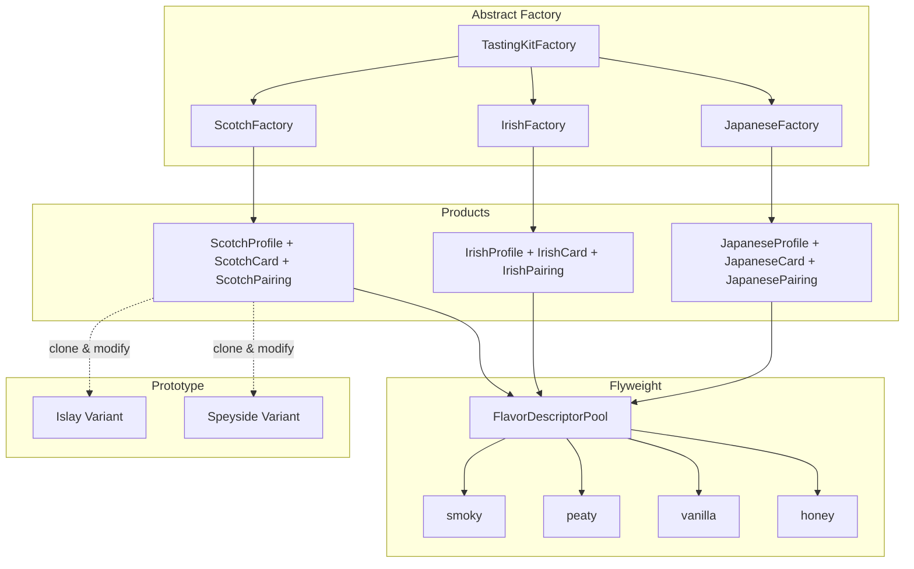

# 連載構造案：手で覚えるデザインパターン実践シリーズ

## コンテキスト定義

### ペルソナ

- **想定読者**: 「デザインパターン学習シリーズ」を一通り読了したが、まだ**自力で使いこなせない**人
- **悩み**: 
  - パターン名は知っているけど、「どんな時に使えばいいか」がピンとこない
  - 各回で動くコードは見たけど、複数パターンの併用が難しい
  - 自分でゼロから設計しようとすると、if/elseに戻ってしまう
- **期待**: 手を動かしながら「あ、だから〇〇パターンなのか！」と腹落ちする体験

### 技術スタック

- Perl v5.36以降（signatures、postfix dereference対応）
- Moo（Moose不使用）
- モダンPerl（strict, warnings自動適用のuse v5.36）

### 対象パターン（3つ）

| パターン | 役割 | 既存シリーズでの題材（避ける） |
|---------|------|------------------------------|
| **Flyweight** | オブジェクトの共有でメモリ節約 | 弾幕シューティング、ASCIIアートレンダラー |
| **Prototype** | クローンによるオブジェクト生成 | モンスター軍団を量産 |
| **Abstract Factory** | 関連オブジェクトのファミリ生成 | 注文フローの国別キット |

### 学習目標

1. 3パターンを**1つの題材**で体験し、相互の関係を理解する
2. 「この状況ならこのパターン」を直感的に判断できるようになる
3. 既存シリーズで学んだ知識を統合し、定着させる

### 制約

- 1記事1概念（新しい概念の導入は1つまで）
- コード例は各回2つまで
- 毎回、完成コードは原則1ファイル
- シリーズ名にパターン名は出さない（最終回で明かす）
- **既存シリーズと完全に異なるドメイン**

---

## 採用案: ウイスキーテイスティングカード生成器

### シリーズ名案

**「Perlで作るウイスキーテイスティングカード生成器」**（28文字）

### コンセプト

**何を作るか:**  
ウイスキーの産地別テイスティングカードを生成するCLIツール。スコットランド・アイルランド・日本など産地ごとに異なるテイスティングフォーマット・香味プロファイル・ペアリング提案をセットで生成する。

**なぜこの題材か:**

- ウイスキー好きなら誰でも使いたくなる実用ツール
- 3パターンすべてが自然に必要になる設計
- 「俺が作ったテイスティングカード生成器」と友人に自慢できる
- 香味表現という「共有すべき語彙」が大量にあり、Flyweightの必然性が高い

### 3パターンの役割



| パターン | 本シリーズでの役割 | 必然性 |
|---------|------------------|--------|
| **Abstract Factory** | 産地別テイスティングキット（Profile + Card + Pairing）を一括生成 | スコッチにアイリッシュのペアリングを混ぜるのはNG |
| **Prototype** | ベースプロファイルをクローンして地域バリエーションを作成 | Islayベースを複製してArdbeg風に微調整 |
| **Flyweight** | 香味表現（smoky, peaty, vanilla等）を共有 | 1000枚のカードでも香味語彙はプールから参照 |

### USP（独自の価値提案）

**「なぜこのシリーズに価値があるのか？」**

1. **趣味と実用の融合**: ウイスキー好きなら完成後も使い続けたいツール
2. **3パターン統合の実感**: 別々に学んだパターンが1つのツールで協調動作
3. **エンジニアのクラフト感**: 「自分だけのテイスティングツールを自作した」という達成感
4. **香味という「共有語彙」**: Flyweightが必然的に必要になる珍しいドメイン
5. **産地×バリエーション**: Abstract Factory × Prototypeの組み合わせが自然

### メリット・デメリット

**メリット:**
- ✅ ウイスキー好きには刺さる独自テーマ
- ✅ 3パターンすべてが**必然的に**登場する設計
- ✅ ゲーム/API/ファイル処理など既存シリーズと完全に異なるドメイン
- ✅ 完成後も実際のテイスティング会で使い続けられる
- ✅ 香味プール（Flyweight）のメリットが視覚的に理解しやすい

**デメリット:**
- ⚠️ ウイスキーに興味がない人には刺さらない
- ⚠️ 香味用語の基礎知識が必要
- ⚠️ 日本語出力がメインになる

### 連載構造表（統合版）

本シリーズは**統合版**（1つの長編記事として公開）の形式を採用。

| 章 | タイトル | 新しい概念 | ストーリー | コード例1 | コード例2 |
|---|---|---|---|---|---|
| 第1章 | テイスティングカードを作ってみよう | 基本構造 | 1つのウイスキー情報をカードとして出力。ハードコードで動く | `simple_card.pl` | 出力結果 |
| 第2章 | 産地が増えると分岐地獄 | if/else問題 | スコッチ・アイリッシュ・ジャパニーズを追加。条件分岐が爆発 | `messy_regions.pl` | 問題点の整理 |
| 第3章 | 産地別キットを工場で生産 | Abstract Factory導入 | TastingKitFactoryで産地別にProfile+Card+Pairingを一括生成 | `TastingKitFactory.pm` | `ScotchFactory.pm` |
| 第4章 | 同じ香味が何度も作られる | メモリ問題 | 100枚のカードで香味オブジェクトが1000個生成。無駄 | `memory_explosion.pl` | 問題分析 |
| 第5章 | 香味語彙を共有しよう | Flyweight導入 | FlavorPoolで香味表現を共有。100枚でも香味は30種類分のメモリ | `FlavorPool.pm` | `FlavorDescriptor.pm` |
| 第6章 | Islayベースから派生を作りたい | clone問題 | Islayプロファイルを元にArdbeg風・Laphroaig風を作りたいがnew()だと手間 | `manual_variant.pl` | 問題分析 |
| 第7章 | プロファイルをクローンして派生 | Prototype導入 | clone()でベースプロファイルを複製し、一部だけ変更 | `Cloneable.pm` | `clone_variant.pl` |
| 第8章 | 3パターンで完成！ | 統合と振り返り | Abstract Factory × Flyweight × Prototypeの連携を図解 | 完成コード全体 | パターン対応表 |

### 推奨タグ

- perl
- moo
- perl-design-patterns
- abstract-factory
- flyweight-pattern
- prototype-pattern
- whisky
- hands-on
- tutorial

### 難易度勾配

```
難易度
  ↑     
⭐⭐⭐⭐⭐ |                                 ●(8章)
⭐⭐⭐⭐  |                       ●●(6-7章)
⭐⭐⭐   |           ●●●(3-5章)
⭐⭐     |     ●(2章)
⭐       | ●(1章)
        +─────────────────────────────────→ 進行
          1   2   3   4   5   6   7   8
```

### 差別化ポイント

- **既存シリーズとの違い**: ゲームでもAPI連携でもファイル処理でもない、**趣味ドメイン**を作る
- **3パターン統合**: 既存の2パターン組み合わせシリーズより複合度が高い
- **Flyweightの必然性**: 香味語彙という「共有すべき語彙集」がドメインに内在
- **Prototypeの必然性**: 産地バリエーション（Islay→Ardbeg派生）という自然なユースケース

---

## レビュー履歴

### 第1版（2026-02-01）

- 作成担当: copilot
- 作成概要: ウイスキーテイスティングカード生成器を題材とした構造案を作成
- 推薦案: ウイスキーテイスティングカード生成器（唯一案）

### レビュー待ち事項

- [ ] SEO視点でのタイトル・タグ・description改善
- [ ] 品質視点での構造・難易度評価
- [ ] 技術的正確性の確認

---

## 選定結果

- **採用案**: 「Perlで作るウイスキーテイスティングカード生成器」
- **選定日**: 2026-02-01
- **選定理由**: 
  1. Flyweight × Prototype × Abstract Factoryの3パターンが自然に必要になる設計
  2. 既存シリーズ（ゲーム系、API系、ファイル系）と完全に異なる趣味ドメイン
  3. 「俺が作ったウイスキーツール」という自慢できる成果物
  4. 香味語彙の共有というFlyweightの教科書的ユースケース

### 採用された連載構造（統合版）

| 章 | タイトル | 新しい概念 | 推奨タグ |
|---|---------|-----------|---------|
| 1 | テイスティングカードを作ってみよう | 基本構造 | perl, moo, whisky, beginner |
| 2 | 産地が増えると分岐地獄 | if/else問題 | perl, moo, refactoring, code-smell |
| 3 | 産地別キットを工場で生産 | Abstract Factory導入 | perl, moo, abstract-factory, creation |
| 4 | 同じ香味が何度も作られる | メモリ問題 | perl, moo, memory, code-smell |
| 5 | 香味語彙を共有しよう | Flyweight導入 | perl, moo, flyweight-pattern, sharing |
| 6 | Islayベースから派生を作りたい | clone問題 | perl, moo, object-creation, code-smell |
| 7 | プロファイルをクローンして派生 | Prototype導入 | perl, moo, prototype-pattern, clone |
| 8 | 3パターンで完成！ | 統合と振り返り | perl, moo, design-patterns, integration |

### 3パターンの役割（採用案）

| パターン | 本シリーズでの役割 |
|---------|------------------|
| **Abstract Factory** | 産地別テイスティングキット（Profile + Card + Pairing）の一括生成 |
| **Flyweight** | 香味表現（smoky, peaty, vanilla等）の共有プール |
| **Prototype** | ベースプロファイルをクローンして地域バリエーション（Islay→Ardbeg）を作成 |
