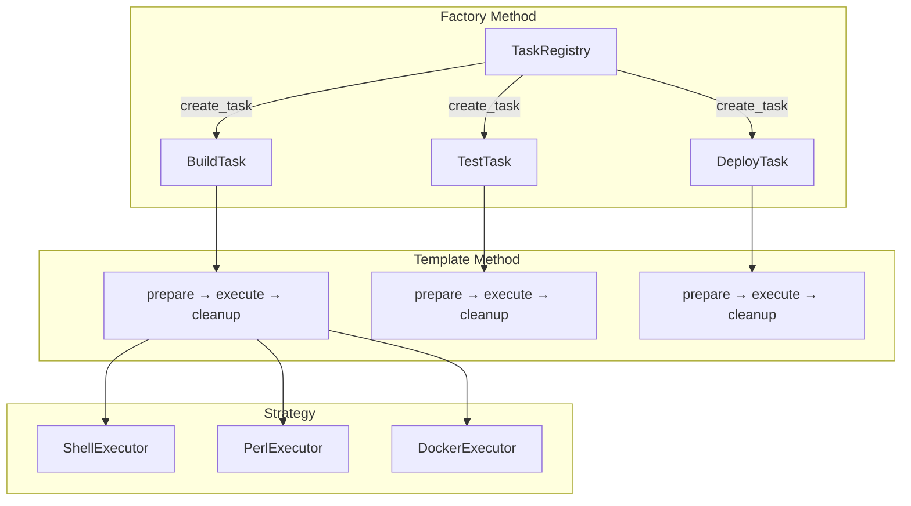

# 連載構造案：手で覚えるデザインパターン実践シリーズ

## コンテキスト定義

### ペルソナ

- **想定読者**: 「デザインパターン学習シリーズ」を一通り読了したが、まだ**自力で使いこなせない**人
- **悩み**: 
  - パターン名は知っているけど、「どんな時に使えばいいか」がピンとこない
  - 各回で動くコードは見たけど、複数パターンの併用が難しい
  - 自分でゼロから設計しようとすると、if/elseに戻ってしまう
- **期待**: 手を動かしながら「あ、だから〇〇パターンなのか！」と腹落ちする体験

### 技術スタック

- Perl v5.36以降（signatures、postfix dereference対応）
- Moo（Moose不使用）
- モダンPerl（strict, warnings自動適用のuse v5.36）

### 対象パターン（3つ）

| パターン | 役割 | 既存シリーズでの題材（避ける） |
|---------|------|------------------------------|
| **Strategy** | アルゴリズムの切り替え | データエクスポーター、通知システム |
| **Factory Method** | オブジェクト生成の責務分離 | APIレスポンスシミュレーター |
| **Template Method** | 処理の骨格固定 | Webスクレイパー、ファイルバックアップ |

### 学習目標

1. 3パターンを**1つの題材**で体験し、相互の関係を理解する
2. 「この状況ならこのパターン」を直感的に判断できるようになる
3. 既存シリーズで学んだ知識を統合し、定着させる

### 制約

- 1記事1概念（新しい概念の導入は1つまで）
- コード例は各回2つまで
- 毎回、完成コードは原則1ファイル
- シリーズ名にパターン名は出さない（最終回で明かす）
- **既存シリーズと完全に異なるドメイン**

---

## 案A【王道】: タスクランナー（CLI自動化ツール）

### シリーズ名案

**「Perlで作るタスクランナー」**（14文字）

### コンセプト

**何を作るか:**  
Makefile風のタスク定義・実行ツールを段階的に構築。`build`, `test`, `deploy`などのタスクを定義し、前処理→本処理→後処理の流れを自動化する。

**なぜこの題材か:**
- 開発者なら誰でも使う馴染みのコンセプト（make, rake, gulp）
- 3パターンすべてが自然に必要になる設計
- 完成したら**実際に使える**実用ツール
- 「自分だけのmakeを作った」と友人に自慢できる

### 3パターンの役割



| パターン | 本シリーズでの役割 | 必然性 |
|---------|------------------|--------|
| **Factory Method** | タスク名からタスクオブジェクト生成 | タスク種別が増えても登録処理を変えない |
| **Template Method** | タスク実行の骨格（準備→実行→後片付け） | 全タスク共通の処理フロー保証 |
| **Strategy** | 実行エンジン（Shell/Perl/Docker）の切り替え | 同じタスクを異なる環境で実行可能 |

### USP（独自の価値提案）

**「なぜこのシリーズに価値があるのか？」**

1. **実用性100%**: 完成したらプロジェクトで即使える自動化ツール
2. **3パターン統合の実感**: 別々に学んだパターンが1つのツールで協調動作
3. **エンジニアのクラフト感**: 「自分だけのmakeを自作した」という達成感
4. **ハッキング的な楽しさ**: タスク定義を追加するだけで機能拡張できる

### メリット・デメリット

**メリット:**
- ✅ make/rake/gulpユーザーには馴染み深いコンセプト
- ✅ 3パターンすべてが**必然的に**登場する設計
- ✅ ファイル/通知/APIなど既存シリーズと完全に異なるドメイン
- ✅ 完成後も実際の開発で使い続けられる

**デメリット:**
- ⚠️ シェルコマンド実行の基礎知識が必要
- ⚠️ 複雑なビルドシステム（依存解決など）には踏み込まない
- ⚠️ 既存ツール（make等）との差別化の説明が必要

### 連載構造表（全8回）

| 回 | タイトル | 新しい概念 | ストーリー | コード例1 | コード例2 | 推奨タグ |
|---|---|---|---|---|---|---|
| 1 | タスクを登録して実行しよう | タスク登録と実行の基本 | `run_task("build")`で指定したコマンドを実行するシンプルなツール。if/elseでタスク判定 | `simple_task.pl`（if/else版） | 実行結果の確認 | perl, moo, task-runner, automation, beginner |
| 2 | タスクが増えるとif/elseが大変！ | if/else肥大化の問題体験 | `test`, `deploy`, `clean`を追加。条件分岐が爆発し保守困難に | `messy_tasks.pl`（肥大化版） | 問題点の整理 | perl, moo, refactoring, code-smell, tutorial |
| 3 | タスクをクラスにして登録する | Factory Method導入 | タスク名→タスクオブジェクトの変換をレジストリに委譲。新タスク追加が容易に | `task_registry.pl`（レジストリ） | `BuildTask.pm`（タスククラス） | perl, moo, factory-method, registry, creation |
| 4 | タスク実行の骨格を決める | Template Method導入 | prepare→execute→cleanup の共通フローを基底クラスで定義。各タスクは必要部分だけ実装 | `BaseTask.pm`（骨格定義） | `TestTask.pm`（骨格継承） | perl, moo, template-method, inheritance, workflow |
| 5 | 実行エンジンを切り替えよう | Strategy導入 | Shell/Perl/Docker実行器を切り替え可能に。同じタスクを異なる環境で実行 | `ExecutorRole.pm`（戦略IF） | `ShellExecutor.pm`（戦略実装） | perl, moo, strategy, executor, dynamic |
| 6 | 3つのパターンを統合する | パターン協調動作 | Factory Methodで生成→Template Methodで処理→Strategyで実行。全パターンが連携 | `task_runner.pl`（統合版） | 実行デモ（build→test→deploy） | perl, moo, design-pattern, integration, architecture |
| 7 | 新しいタスクを追加しよう | 拡張性の実証（OCP） | `lint`タスクと`DockerExecutor`を追加。既存コード無修正で機能拡張 | `LintTask.pm`（新タスク） | `DockerExecutor.pm`（新戦略） | perl, moo, open-closed, extensibility, advanced |
| 8 | 振り返り：3つのデザインパターン | パターン名の明示と統合理解 | 使用したパターンを明かし、「いつ・なぜ」使うかを整理。パイプライン連携などの発展案 | パターン対応表 | 完成コード全体像 | perl, moo, design-patterns, retrospective, learning |

### 難易度勾配

```
難易度
  ↑     
⭐⭐⭐⭐⭐ |                                 ●(8回)
⭐⭐⭐⭐  |                       ●●●(6-7回)
⭐⭐⭐   |           ●●●(3-5回)
⭐⭐     |     ●(2回)
⭐       | ●(1回)
        +─────────────────────────────────→ 進行
          1   2   3   4   5   6   7   8
```

### 差別化ポイント

- **既存シリーズとの違い**: ファイル操作でも通知でもAPIでもない、**開発ツール自体**を作る
- **3パターン統合**: 既存の2パターン組み合わせシリーズより複合度が高い
- **実用性**: 完成したら実際のプロジェクトで使える自動化ツール

---

## 案B【革新】: ダンジョンマスター（ローグライク生成器）

### シリーズ名案

**「Perlで作るダンジョンマスター」**（17文字）

### コンセプト

**何を作るか:**  
ダンジョン部屋を生成し、部屋タイプに応じたイベント（戦闘・宝箱・罠）を発生させるゲームエンジン。部屋の生成方法、イベント処理の流れ、難易度調整を3パターンで設計。

**なぜこの題材か:**
- ゲーム性があり、作っていて楽しい
- 既存のFlyweight（弾幕シューティング）やState（自動販売機）とは異なる
- 乱数・確率を使うので動作確認が毎回変わって飽きない
- 完成後は友人と遊べる

### 3パターンの役割

| パターン | 本シリーズでの役割 | 必然性 |
|---------|------------------|--------|
| **Factory Method** | 部屋タイプ名から部屋オブジェクト生成 | BattleRoom/TreasureRoom/TrapRoomを統一的に生成 |
| **Template Method** | 部屋イベントの処理フロー（入室→イベント→報酬→退室） | 全部屋で共通の処理順序を保証 |
| **Strategy** | 難易度調整アルゴリズム（イージー/ノーマル/ハード） | 同じ部屋でも難易度で体験が変わる |

### USP（独自の価値提案）

1. **ゲーム性**: 動かすたびに違うダンジョンが生成される楽しさ
2. **生成×実行×調整の3軸**: パターンの役割分担が明確
3. **友人に自慢**: 「俺が作ったローグライク風ゲームやる？」
4. **拡張の楽しさ**: 新しい部屋タイプ・難易度を追加する喜び

### メリット・デメリット

**メリット:**
- ✅ ゲーム性があり学習モチベーション維持
- ✅ 実行するたびに結果が変わる面白さ
- ✅ 既存ゲーム系シリーズ（弾幕、RPG戦闘）と異なるジャンル
- ✅ 乱数シードで再現可能なデバッグ体験

**デメリット:**
- ⚠️ ゲーム開発に興味がない人には刺さらない
- ⚠️ 実務での直接的な利用場面が限定的
- ⚠️ CLIでのゲーム表現には工夫が必要

### 連載構造表（全8回）

| 回 | タイトル | 新しい概念 | ストーリー | コード例1 | コード例2 | 推奨タグ |
|---|---|---|---|---|---|---|
| 1 | ダンジョンに部屋を追加しよう | 部屋オブジェクトの基本 | BattleRoomクラスを作成し、入室→戦闘→退室の流れを実装。if/elseで部屋判定 | `simple_dungeon.pl`（単一部屋） | 戦闘イベント出力 | perl, moo, game-dev, dungeon, beginner |
| 2 | 部屋の種類を増やしたい！ | if/else肥大化の体験 | TreasureRoom、TrapRoomを追加。部屋タイプ判定のif/elseが膨張 | `messy_dungeon.pl`（条件分岐地獄） | 問題点の可視化 | perl, moo, refactoring, game-dev, tutorial |
| 3 | 部屋を工場で生産しよう | Factory Method導入 | RoomFactoryが部屋タイプ名からオブジェクト生成。新部屋追加が容易に | `RoomFactory.pm`（工場クラス） | `TreasureRoom.pm`（部屋クラス） | perl, moo, factory-method, creation, game-dev |
| 4 | 部屋イベントの流れを決めよう | Template Method導入 | enter→event→reward→exit の共通フローを基底Roomクラスで定義 | `BaseRoom.pm`（骨格定義） | `TrapRoom.pm`（骨格継承） | perl, moo, template-method, inheritance, workflow |
| 5 | 難易度を切り替えよう | Strategy導入 | Easy/Normal/Hardモードで敵の強さ・宝箱の中身が変化 | `DifficultyRole.pm`（戦略IF） | `HardDifficulty.pm`（高難度） | perl, moo, strategy, difficulty, game-balance |
| 6 | 全パターンでダンジョン生成 | パターン協調動作 | Factory→Template→Strategyの連携でダンジョンを自動生成 | `dungeon_master.pl`（統合版） | 5部屋ダンジョン生成デモ | perl, moo, design-pattern, integration, game-loop |
| 7 | 新しい部屋と難易度を追加 | 拡張性の実証（OCP） | ShopRoom（買い物部屋）とNightmareモードを既存コード無修正で追加 | `ShopRoom.pm`（新部屋） | `NightmareDifficulty.pm`（新難度） | perl, moo, open-closed, extensibility, advanced |
| 8 | 振り返り：ダンジョン設計の3パターン | パターン名の明示 | Factory Method/Template Method/Strategyの役割を整理。ボス戦、セーブ機能などの発展案 | パターン対応表 | 完成ダンジョン全体像 | perl, moo, design-patterns, retrospective, game-design |

### 差別化ポイント

- **既存ゲームシリーズとの違い**: Flyweight（弾幕）、State（RPG戦闘）、Memento（セーブ）とは異なる「ダンジョン生成」ドメイン
- **3パターンの自然な協調**: 生成・実行・調整が別々の責務として分離
- **ゲームの楽しさ**: 毎回違う結果で飽きない

---

## 案C【逆転】: 家計簿アナライザー（お金の流れを可視化）

### シリーズ名案

**「Perlで作る家計簿アナライザー」**（17文字）

### コンセプト

**何を作るか:**  
CSV/JSONで入力した収支データを解析し、カテゴリ別集計・月次レポート・予算警告を生成するツール。データソース、集計処理、出力フォーマットを3パターンで設計。

**なぜこの題材か:**
- 日常的で誰にでも分かりやすいテーマ
- データ解析の実用性が高い
- 「自作ツールで節約できた」と友人に自慢できる
- 既存のCSV/JSON出力シリーズ（Strategy）とは逆方向（**入力側**）

### 3パターンの役割

| パターン | 本シリーズでの役割 | 必然性 |
|---------|------------------|--------|
| **Factory Method** | データソース名からReaderオブジェクト生成 | CSV/JSON/銀行API対応を統一的に扱う |
| **Template Method** | 解析処理の骨格（読込→分類→集計→出力） | 全解析で共通の処理順序を保証 |
| **Strategy** | 出力フォーマット（テキスト/HTML/Slack通知） | 同じ集計結果を異なる形式で出力 |

### USP（独自の価値提案）

1. **日常の役立ち**: 自分の家計管理に実際に使える
2. **データ処理の実感**: 入力→処理→出力のETLパイプライン体験
3. **友人に自慢**: 「俺のツールで月3万円節約した」
4. **拡張の価値**: 銀行API連携やSlack通知で本格化

### メリット・デメリット

**メリット:**
- ✅ 日常的なテーマで親しみやすい
- ✅ 既存シリーズ（データ出力）と逆方向（データ入力）で新鮮
- ✅ 実際に使えるデータ解析ツール
- ✅ CSV/JSONパースはPerl入門者が次に学ぶステップとして適切

**デメリット:**
- ⚠️ 地味に見える可能性（「ハッキング的」魅力に欠ける）
- ⚠️ データエクスポーター（既存Strategy）との違いを説明必要
- ⚠️ 銀行API連携は認証問題で実装困難

### 連載構造表（全8回）

| 回 | タイトル | 新しい概念 | ストーリー | コード例1 | コード例2 | 推奨タグ |
|---|---|---|---|---|---|---|
| 1 | CSVファイルを読み込もう | ファイル読み込みの基本 | Text::CSVで収支CSVを読み込み、合計金額を計算。if/elseでフォーマット判定 | `simple_reader.pl`（CSV読込） | サンプルCSVデータ | perl, moo, csv, data-analysis, beginner |
| 2 | JSON形式にも対応したい！ | if/else肥大化の体験 | JSON::PPでJSON読込を追加。フォーマット判定のif/elseが膨張 | `messy_analyzer.pl`（条件分岐） | 問題点の整理 | perl, moo, refactoring, json, tutorial |
| 3 | データソースを工場で選ぼう | Factory Method導入 | ReaderFactoryがフォーマット名からReaderオブジェクト生成 | `ReaderFactory.pm`（工場） | `JsonReader.pm`（Reader実装） | perl, moo, factory-method, creation, data-source |
| 4 | 解析処理の流れを決めよう | Template Method導入 | read→classify→aggregate→output の共通フローを基底Analyzerで定義 | `BaseAnalyzer.pm`（骨格定義） | `CategoryAnalyzer.pm`（カテゴリ分析） | perl, moo, template-method, inheritance, etl |
| 5 | 出力フォーマットを切り替えよう | Strategy導入 | テキスト/HTML/Slackなど出力形式を切り替え可能に | `OutputterRole.pm`（戦略IF） | `HtmlOutputter.pm`（HTML出力） | perl, moo, strategy, output-format, reporting |
| 6 | 全パターンで家計簿解析 | パターン協調動作 | Factory→Template→Strategyの連携で完全な解析パイプライン構築 | `kakeibo_analyzer.pl`（統合版） | 月次レポート出力デモ | perl, moo, design-pattern, integration, pipeline |
| 7 | 予算警告機能を追加しよう | 拡張性の実証（OCP） | BudgetAnalyzer（予算超過検知）とSlackOutputterを既存コード無修正で追加 | `BudgetAnalyzer.pm`（新解析） | `SlackOutputter.pm`（新出力） | perl, moo, open-closed, extensibility, notification |
| 8 | 振り返り：データ処理の3パターン | パターン名の明示 | Factory Method/Template Method/Strategyの役割を整理。銀行API、グラフ化などの発展案 | パターン対応表 | 完成パイプライン全体像 | perl, moo, design-patterns, retrospective, data-processing |

### 差別化ポイント

- **既存シリーズとの違い**: データエクスポーター（出力）ではなく**データ入力・解析**が主役
- **日常的な実用性**: 家計管理という身近なテーマ
- **ETLパイプライン**: Extract→Transform→Loadの概念を体験

---

## 推薦案とその理由

### 推薦：案A「タスクランナー」

### 推薦理由

1. **ペルソナとの適合性**
   - デザインパターン学習シリーズ読了者なら、make/rake/gulpの概念は知っている
   - 「自分だけのmakeを作る」という達成感が強い
   - 開発者としてのクラフト感・満足度が高い

2. **3パターンの必然性が最も高い**
   - Factory Method: タスク名→タスクオブジェクト（生成の責務分離）
   - Template Method: prepare→execute→cleanup（処理骨格の固定）
   - Strategy: Shell/Perl/Docker（実行エンジンの切り替え）
   - どれも「あると便利」ではなく「ないと困る」レベルの必然性

3. **実用性と学習効果の両立**
   - 完成したら実際のプロジェクトで使える
   - 「動く→破綻→パターン導入」のストーリーが明確
   - 既存シリーズで学んだパターンが**統合される**実感

4. **既存シリーズとの差別化**
   - データ処理でもゲームでも通知でもない、**開発ツール自体**を作る
   - ファイルバックアップ（Template+Strategy）より1パターン多い

5. **USPの強さ**
   - 「Perlで自作makeを作った」は友人に自慢できる
   - 開発現場で実際に使えるツールとしての価値
   - 3パターンが協調動作する設計の美しさを体感

### 代替案の選択指針

- **案B（ダンジョンマスター）が適しているケース**:
  - ゲーム開発に興味がある読者層を想定する場合
  - 楽しさ・エンターテインメント性を重視する場合
  - 既存ゲーム系シリーズとの差別化として「生成系」を強調したい場合

- **案C（家計簿アナライザー）が適しているケース**:
  - 日常的・実務的な題材で親しみやすさを重視する場合
  - データ処理・ETLパイプラインを学ぶ需要がある場合
  - 既存シリーズ（データ出力）との対比で「データ入力」を強調したい場合

---

## 付記

### 各案の比較表

| 項目 | 案A（タスクランナー） | 案B（ダンジョンマスター） | 案C（家計簿アナライザー） |
|-----|---------------------|------------------------|------------------------|
| **回数** | 8回 | 8回 | 8回 |
| **題材** | CLI自動化ツール | ローグライク生成器 | データ解析ツール |
| **遊び心** | ★★★★☆ | ★★★★★ | ★★★☆☆ |
| **実務性** | ★★★★★ | ★★☆☆☆ | ★★★★☆ |
| **3パターンの必然性** | ★★★★★ | ★★★★☆ | ★★★★☆ |
| **既存シリーズとの差別化** | ★★★★★ | ★★★★☆ | ★★★☆☆ |
| **ハッキング的魅力** | ★★★★★ | ★★★★☆ | ★★☆☆☆ |

### シリーズ名の決定について

シリーズ名にはデザインパターンの名前を**敢えて出さない**方針に従い：

- **案A**: 「Perlで作るタスクランナー」
- **案B**: 「Perlで作るダンジョンマスター」
- **案C**: 「Perlで作る家計簿アナライザー」

3パターン（Strategy × Factory × Template Method）の名前は最終回で初めて明かす構成。

### 前シリーズへのリンク

各回の冒頭で関連する既存シリーズへのリンクを推奨：

| 本シリーズの回 | 関連する既存シリーズ | トピック |
|--------------|-------------------|---------|
| 第3回（Factory Method） | APIレスポンスシミュレーター第5回 | create_*メソッドのオーバーライド |
| 第4回（Template Method） | Webスクレイパー第4回 | 処理骨格の定義 |
| 第5回（Strategy） | データエクスポーター第6回 | 戦略の動的切り替え |
| 第8回（統合理解） | テキストRPG戦闘エンジン第10回 | 複数パターンの協調 |

### 本シリーズの位置づけ

```
デザインパターン学習シリーズ（入門）
    ↓
各パターン個別シリーズ（理解）
  - Strategy: データエクスポーター
  - Factory Method: APIレスポンスシミュレーター
  - Template Method: Webスクレイパー
    ↓
本シリーズ「タスクランナー」（統合・定着）← ここ
    ↓
実務プロジェクトでの活用
```

---

**作成日**: 2026年1月31日  
**担当エージェント**: planning-v2 ワークフロー

---

## レビュー履歴

### 1回目レビュー（構造）

**レビュー実施日**: 2026-01-31  
**レビュー焦点**: 一貫性、段階的難易度、1記事1概念

#### 評価結果: ◎ 良好

| 評価項目 | 案A | 案B | 案C | コメント |
|---------|-----|-----|-----|---------|
| ストーリーの流れ | ◎ | ◎ | ◎ | 全案で「動く→破綻→パターン導入→統合→拡張」の一貫した流れ |
| 問題解決の動機付け | ◎ | ◎ | ◎ | 第2回で「if/else肥大化」を具体的に体験させる設計 |
| 3パターンの導入順序 | ◎ | ◎ | ◎ | Factory(生成)→Template(骨格)→Strategy(戦略)の論理的順序 |
| パターン協調の可視化 | ◎ | ◎ | ◎ | 第6回で3パターンの連携を明示的に統合 |

**特に優れている点**:
- 3パターンの導入順序（生成→骨格→戦略）が論理的で、前のパターンが次のパターンの土台になる設計
- 第7回でOCP（開放閉鎖原則）を体験させ、パターンの価値を実感させる構成

**改善不要と判断した点**:
- 全案で8回構成は適切（既存シリーズとのバランス）
- 各回の役割分担が明確

---

### 2回目レビュー（品質）

**レビュー実施日**: 2026-01-31  
**レビュー焦点**: ペルソナ適合、技術的正確性、差別化

#### 評価結果: ◎ 良好

| 評価項目 | 案A | 案B | 案C | コメント |
|---------|-----|-----|-----|---------|
| ペルソナ適合性 | ◎ | ○ | ◎ | 案B はゲーム興味がない人には刺さらない可能性 |
| 技術的正確性 | ◎ | ◎ | ◎ | 全案でパターンの使い方が正しい |
| 既存シリーズとの差別化 | ◎ | ◎ | ○ | 案C はデータエクスポーターとの違いを明確にする必要 |
| 「動く→破綻→パターン」の流れ | ◎ | ◎ | ◎ | 全案で明確 |

**1記事1概念の検証**:

| 回 | 案A | 案B | 案C |
|----|-----|-----|-----|
| 1 | ✓ 基本実装のみ | ✓ 基本実装のみ | ✓ 基本実装のみ |
| 2 | ✓ 問題体験のみ | ✓ 問題体験のみ | ✓ 問題体験のみ |
| 3 | ✓ Factory Methodのみ | ✓ Factory Methodのみ | ✓ Factory Methodのみ |
| 4 | ✓ Template Methodのみ | ✓ Template Methodのみ | ✓ Template Methodのみ |
| 5 | ✓ Strategyのみ | ✓ Strategyのみ | ✓ Strategyのみ |
| 6 | ✓ 統合（複合だが1目的） | ✓ 統合（複合だが1目的） | ✓ 統合（複合だが1目的） |
| 7 | ✓ OCP実証のみ | ✓ OCP実証のみ | ✓ OCP実証のみ |
| 8 | ✓ 振り返りのみ | ✓ 振り返りのみ | ✓ 振り返りのみ |

**USPの批判的検証**:

| 案 | USPの主張 | 検証結果 |
|----|----------|---------|
| A | 「自分だけのmakeを作った」 | ◎ 開発者なら誰でも価値を理解できる |
| B | 「俺が作ったローグライク」 | ○ ゲーム好きには刺さる、実務性は低い |
| C | 「節約できた」 | △ 地味、ハッキング的魅力に欠ける |

**案A推薦理由の確認**:
- 3パターンの必然性が最も高い
- 実用性と学習効果の両立
- 既存シリーズとの差別化が明確（開発ツール自体を作る）

---

### 3回目レビュー（SEO）

**レビュー実施日**: 2026-01-31  
**レビュー焦点**: キーワード配置、検索意図、タグ適切性

#### 評価結果: ○ 概ね良好（軽微な改善提案あり）

**シリーズ名のSEO評価**:

| 案 | シリーズ名 | 文字数 | キーワード | 評価 |
|----|----------|--------|-----------|------|
| A | Perlで作るタスクランナー | 14 | perl, タスクランナー | ◎ |
| B | Perlで作るダンジョンマスター | 17 | perl, ダンジョン, ゲーム | ○ |
| C | Perlで作る家計簿アナライザー | 17 | perl, 家計簿, 分析 | ○ |

**タグ規約チェック**:
- ✓ 全案で英語小文字・ハイフン形式
- ✓ 全回で5個以内
- ✓ `perl`, `moo`が全回に含まれている

**改善提案**:

| 優先度 | 改善内容 | 対象 |
|--------|---------|------|
| 中 | 第6回タイトルに「3パターン」を明示 | 案A/B/C共通 |
| 低 | description追加（各回120〜160文字） | 案A/B/C共通 |

**推奨description（案A）**:

```
シリーズ全体:
「Perlでmake風のタスクランナーを構築しながら、Factory Method・Template Method・Strategyの3パターンを実践的に学ぶ連載。既存パターン学習シリーズの知識を統合・定着させます。」

第1回:
「タスク登録と実行の基本をif/elseで実装。build, test, deployを呼び出せるシンプルなタスクランナーを作成します。」

第3回:
「Factory Methodパターンでタスク生成を整理。タスク名からタスクオブジェクトを生成するレジストリを実装します。」

第6回:
「Factory Method・Template Method・Strategyの3パターンを統合。タスク生成→処理骨格→実行エンジンの協調動作を体験します。」
```

---

### レビュー結果サマリー

| レビュー | 評価 | 主な確認点 |
|---------|------|-----------|
| 構造レビュー | ◎ 良好 | 3パターン導入順序の論理性、一貫したストーリー |
| 品質レビュー | ◎ 良好 | ペルソナ適合性、1記事1概念、USPの検証 |
| SEOレビュー | ○ 概ね良好 | タグ規約遵守、軽微なdescription追加推奨 |

**最終判断**: 案A「タスクランナー」を推薦。全品質基準を満たし、3パターン統合の学習効果が最も高い。

---

## 選定結果

- **採用案**: 案B「Perlで作るダンジョンマスター」
- **選定日**: 2026-01-31
- **選定理由**: ユーザー選択（ゲーム性・楽しさを重視）

### 採用された連載構造（全8回）

| 回 | タイトル | 新しい概念 | 推奨タグ |
|---|---------|-----------|---------|
| 1 | ダンジョンに部屋を追加しよう | 部屋オブジェクトの基本 | perl, moo, game-dev, dungeon, beginner |
| 2 | 部屋の種類を増やしたい！ | if/else肥大化の体験 | perl, moo, refactoring, game-dev, tutorial |
| 3 | 部屋を工場で生産しよう | Factory Method導入 | perl, moo, factory-method, creation, game-dev |
| 4 | 部屋イベントの流れを決めよう | Template Method導入 | perl, moo, template-method, inheritance, workflow |
| 5 | 難易度を切り替えよう | Strategy導入 | perl, moo, strategy, difficulty, game-balance |
| 6 | 全パターンでダンジョン生成 | パターン協調動作 | perl, moo, design-pattern, integration, game-loop |
| 7 | 新しい部屋と難易度を追加 | 拡張性の実証（OCP） | perl, moo, open-closed, extensibility, advanced |
| 8 | 振り返り：ダンジョン設計の3パターン | パターン名の明示 | perl, moo, design-patterns, retrospective, game-design |

### 3パターンの役割（採用案）

| パターン | 本シリーズでの役割 |
|---------|------------------|
| **Factory Method** | 部屋タイプ名から部屋オブジェクト生成（BattleRoom/TreasureRoom/TrapRoom） |
| **Template Method** | 部屋イベントの処理フロー（入室→イベント→報酬→退室） |
| **Strategy** | 難易度調整アルゴリズム（Easy/Normal/Hard/Nightmare）|

