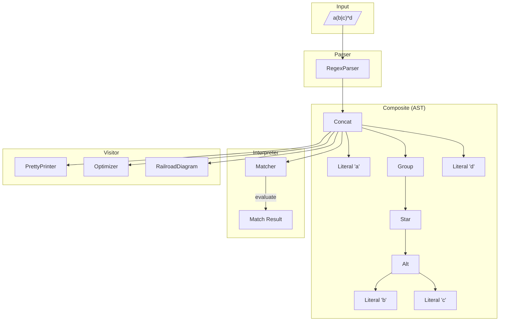

# 連載構造案：正規表現リファインリー

調査結果: `content/warehouse/interpreter-visitor-composite-series.md` の調査結果に基づく

## コンテキスト定義

### ペルソナ

- **想定読者**: 「デザインパターン学習シリーズ」を一通り読了したが、まだ**自力で使いこなせない**人
- **悩み**:
  - パターン名は知っているけど、「どんな時に使えばいいか」がピンとこない
  - 各回で動くコードは見たけど、複数パターンの併用が難しい
  - 自分でゼロから設計しようとすると、if/else に戻ってしまう
- **期待**: 手を動かしながら「あ、だから〇〇パターンなのか！」と腹落ちする体験

### 技術スタック

- Perl v5.36以降（signatures、postfix dereference対応）
- Moo（Moose不使用）
- モダンPerl（strict, warnings自動適用のuse v5.36）

### 対象パターン（3つ）

| パターン | 役割 | 既存シリーズでの題材（避ける） |
|---------|------|------------------------------|
| **Interpreter** | 式の評価・実行 | ダイス言語インタプリタ |
| **Visitor** | 操作の追加 | ドキュメント変換ツール |
| **Composite** | ツリー構造の表現 | Markdown目次生成ツリー構造 |

### 学習目標

1. 3パターンを**1つの題材**で体験し、相互の関係を理解する
2. 「この状況ならこのパターン」を直感的に判断できるようになる
3. 既存シリーズで学んだ知識を統合し、定着させる
4. 言語処理（パーサー・AST）の基礎を体験する

### 制約

- 1記事1概念（新しい概念の導入は1つまで）
- コード例は各回2つまで
- 毎回、完成コードは原則1ファイル
- シリーズ名にパターン名は出さない（最終回で明かす）
- **既存シリーズと完全に異なるドメイン**

---

## 採用案: 正規表現リファインリー（RegexRefinery）

### シリーズ名案

**「Perlで作る正規表現リファインリー」**（16文字）

### コンセプト

**何を作るか:**
複雑な正規表現を解読・可視化・最適化するCLIツール。正規表現を抽象構文木（AST）として解析し、人間が読みやすい形式への変換、鉄道図（Railroad Diagram）風の可視化、冗長な記法の最適化提案を行う。

**なぜこの題材か:**

- 「他人の正規表現が読めない」問題は全エンジニア共通の悩み
- 正規表現は自然にツリー構造（連結・選択・繰り返し・グループ）を持つ
- 3パターンすべてが**必然的に**必要になる設計
- 「他人のコードを添削できる」という生意気さがある
- Perlの正規表現をPerlで解析するという一貫性
- 完成品がポートフォリオになる実用ツール

### 3パターンの役割



| パターン | 本シリーズでの役割 | 必然性 |
|---------|------------------|--------|
| **Composite** | 正規表現をASTで表現（Literal, Concat, Alt, Star, Group等） | 正規表現は本質的にツリー構造 |
| **Interpreter** | ASTを走査してマッチング実行、ステップ実行デバッグ | 各ノードがevaluate()を持つ |
| **Visitor** | 可視化・最適化・変換などの操作をノード変更なしで追加 | 操作追加のたびにクラス修正は×|

### USP（独自の価値提案）

**「なぜこのシリーズに価値があるのか？」**

1. **全エンジニアに刺さる題材**: 正規表現は言語を問わず全員が使う
2. **「添削できる」生意気さ**: 完成したら「君の正規表現、冗長だよ」と言える
3. **3パターン統合の必然性**: 別々に学んだパターンが1つのツールで協調動作
4. **Perlの強みを活かす**: Perlの正規表現エンジンを内側から理解
5. **ポートフォリオ価値**: 「正規表現解析ツールを自作した」は強いアピール

### メリット・デメリット

**メリット:**
- ✅ 正規表現は全エンジニアが使う普遍的な題材
- ✅ 3パターンすべてが**必然的に**登場する設計
- ✅ 既存シリーズ（ゲーム系、ウイスキー系、API系）と完全に異なるドメイン
- ✅ 完成後も実務で使い続けられる実用ツール
- ✅ AST（抽象構文木）の概念を視覚的に理解しやすい
- ✅ Perlの正規表現をPerlで解析するメタ的な面白さ

**デメリット:**
- ⚠️ パーサー実装がやや複雑（再帰下降パーサーの理解が必要）
- ⚠️ 全ての正規表現機能をカバーするのは困難（スコープを絞る）
- ⚠️ 正規表現の文法知識が前提として必要

### 連載構造表（統合版）

本シリーズは**統合版**（1つの長編記事として公開）の形式を採用。

| 章 | タイトル | 新しい概念 | ストーリー | コード例1 | コード例2 |
|---|---|---|---|---|---|
| 第1章 | 正規表現を解読してみよう | 基本構造 | `a(b|c)*d`を人間が読める形に展開してみる。ベタ書きで文字列操作 | `simple_expand.pl` | 出力結果 |
| 第2章 | 複雑な正規表現で破綻 | if/else問題 | ネストしたグループ、複数の繰り返しで条件分岐が爆発する | `messy_parser.pl` | 問題点の整理 |
| 第3章 | 正規表現をツリーで表す | Composite導入 | Literal, Concat, Alt, Star, Groupなどのノードクラスを定義 | `Node.pm`（Role） | `Literal.pm`, `Concat.pm` |
| 第4章 | パーサーでツリーを組み立て | 再帰下降パーサー | 文字列からASTを自動構築するパーサーを実装 | `RegexParser.pm` | パース結果表示 |
| 第5章 | ツリーを歩いてマッチング | Interpreter導入 | 各ノードにevaluate()を実装、文字列とのマッチングを実行 | `evaluate`メソッド | マッチング結果 |
| 第6章 | 可視化機能を追加したい | OCP問題 | 鉄道図風の可視化を追加しようとして、全ノードクラスを修正する羽目に | 問題分析 | 「このままでは…」 |
| 第7章 | 操作をクラスに分離 | Visitor導入 | PrettyPrinterを外部クラスとして実装、accept/visitパターン | `Visitor.pm`（Role） | `PrettyPrinter.pm` |
| 第8章 | 最適化と鉄道図も追加 | 複数Visitor | Optimizer, RailroadDiagramを追加。ノードクラスは変更なし | `Optimizer.pm` | `RailroadDiagram.pm` |
| 第9章 | 3パターンで完成！ | 統合と振り返り | Composite × Interpreter × Visitorの連携を図解、パターン名を明かす | 完成コード全体 | パターン対応表 |

### 正規表現機能のスコープ

**対応する機能（第1版）:**

| 機能 | 記法 | ASTノード |
|------|------|-----------|
| リテラル文字 | `a`, `b` | Literal |
| 連結 | `ab` | Concat |
| 選択 | `a\|b` | Alt |
| 繰り返し（0以上） | `a*` | Star |
| 繰り返し（1以上） | `a+` | Plus |
| オプション | `a?` | Optional |
| グループ | `(ab)` | Group |

**対応しない機能（複雑すぎる）:**

- 文字クラス `[abc]`, `[^abc]`
- メタ文字 `.`, `\d`, `\w`, `\s`
- アンカー `^`, `$`
- 量指定子 `{n,m}`
- 先読み/後読み

### 推奨タグ

- perl
- moo
- perl-design-patterns
- interpreter-pattern
- visitor-pattern
- composite-pattern
- regex
- parser
- ast
- hands-on
- tutorial

### 難易度勾配

```
難易度
  ↑     
⭐⭐⭐⭐⭐ |                                       ●(9章)
⭐⭐⭐⭐  |                             ●●(7-8章)
⭐⭐⭐   |               ●●●(4-6章)
⭐⭐     |     ●●(2-3章)
⭐       | ●(1章)
        +─────────────────────────────────────────→ 進行
          1   2   3   4   5   6   7   8   9
```

### 差別化ポイント

- **既存シリーズとの違い**: ゲームでもウイスキーでもAPI連携でもない、**言語処理ドメイン**
- **3パターン統合**: 既存の2パターン組み合わせシリーズより複合度が高い
- **Compositeの必然性**: 正規表現は本質的にツリー構造
- **Interpreterの必然性**: マッチング実行はツリー走査そのもの
- **Visitorの必然性**: 可視化・最適化など複数操作を追加したい

---

## レビュー履歴

### 第1版（2026-02-01）

- 作成担当: copilot
- 作成概要: 正規表現リファインリーを題材とした構造案を作成
- 推薦案: 正規表現リファインリー（唯一案）

### レビュー待ち事項

- [ ] SEO視点でのタイトル・タグ・description改善
- [ ] 品質視点での構造・難易度評価
- [ ] 技術的正確性の確認

---

## 選定結果

- **採用案**: 「Perlで作る正規表現リファインリー」
- **選定日**: 2026-02-01
- **選定理由**:
  1. Interpreter × Visitor × Composite の3パターンが自然に必要になる設計
  2. 既存シリーズ（ゲーム系、ウイスキー系、API系、ファイル系）と完全に異なるドメイン
  3. 「他人の正規表現を添削できる」という生意気なツール
  4. 全エンジニアに刺さる普遍的な題材
  5. 完成品がポートフォリオとして使える

### 採用された連載構造（統合版）

| 章 | タイトル | 新しい概念 | 推奨タグ |
|---|---------|-----------|---------|
| 1 | 正規表現を解読してみよう | 基本構造 | perl, moo, regex, beginner |
| 2 | 複雑な正規表現で破綻 | if/else問題 | perl, moo, refactoring, code-smell |
| 3 | 正規表現をツリーで表す | Composite導入 | perl, moo, composite-pattern, ast |
| 4 | パーサーでツリーを組み立て | 再帰下降パーサー | perl, moo, parser, recursion |
| 5 | ツリーを歩いてマッチング | Interpreter導入 | perl, moo, interpreter-pattern, evaluation |
| 6 | 可視化機能を追加したい | OCP問題 | perl, moo, open-closed, code-smell |
| 7 | 操作をクラスに分離 | Visitor導入 | perl, moo, visitor-pattern, double-dispatch |
| 8 | 最適化と鉄道図も追加 | 複数Visitor | perl, moo, multiple-visitors, optimization |
| 9 | 3パターンで完成！ | 統合と振り返り | perl, moo, design-patterns, integration |

### 3パターンの役割（採用案）

| パターン | 本シリーズでの役割 |
|---------|------------------|
| **Composite** | 正規表現をAST（Literal, Concat, Alt, Star, Group等）で表現 |
| **Interpreter** | ASTを走査してマッチング実行、ステップデバッグ |
| **Visitor** | 可視化（PrettyPrinter）、最適化（Optimizer）、鉄道図（RailroadDiagram） |
