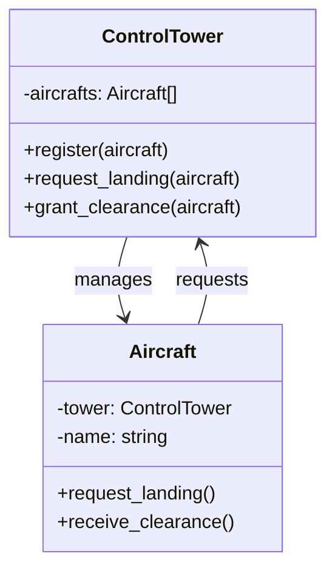

# 連載構造案：Mediatorパターン学習シリーズ

調査結果: `content/warehouse/mediator-pattern.md` に基づく

## 前提情報

- **技術スタック**: Perl v5.36以降（signatures対応）、Moo
- **想定読者**: Perl入学式卒業程度の初学者、「Mooによるオブジェクト指向Perl」入門連載を修了した人
- **想定ペルソナ**: オブジェクト指向の基礎を学んだが、複数オブジェクト間の協調動作に悩む初心者プログラマー
- **学習目標**: 複数オブジェクト間の相互作用を仲介者で整理する設計思想の習得
- **位置づけ**: 「Mooで覚えるオブジェクト指向プログラミング」シリーズの後続
- **ストーリー**: プログラムを作成 → 機能追加で相互依存が複雑化 → Mediatorパターンで解決
- **制約**: 1記事1概念、コード例2つまで、完成コードは原則1ファイル

### 前提知識（前シリーズで習得済み）

| 前シリーズで学んだこと | 本シリーズでの活用 |
|----------------------|-------------------|
| Mooによるクラス定義 | 各コンポーネントのクラス作成 |
| has によるアトリビュート | オブジェクトの状態管理 |
| ロール (Role) | 共通インターフェースの定義（Colleague::Role） |
| メソッドの定義 | 各同僚オブジェクトの操作実装 |
| コンストラクタと依存注入 | Mediatorクラスへの同僚オブジェクト登録 |

### Mediatorパターンの学習ポイント

- **本質**: 複数のオブジェクト間の相互作用を仲介者が中央集権化し、疎結合を実現
- **学習の流れ**: 直接参照で動かす → 相互依存が複雑化 → Mediatorパターンで整理
- **最終回**: パターン名を明かし、GoFデザインパターンとして位置づける

### 既存シリーズとの差別化

Observerパターンとの違いを明確にする必要がある：

| 項目 | Observerパターン | Mediatorパターン |
|------|-----------------|------------------|
| 関係 | 一対多（Subject → Observers） | 多対多（Colleague ↔ Colleague） |
| 通信方向 | 単方向（通知のみ） | 双方向（相互作用） |
| 既存シリーズ | ローグライク通知、ハニーポット侵入レーダー | 本シリーズで新規 |

---

## 案A: 「チャットルームを作ろう」アプローチ（王道）

### 特徴・アプローチ

Mediatorパターンの最も代表的なユースケースである「チャットルーム」を題材にする。複数のユーザーがチャットルーム（仲介者）を通じてメッセージをやり取りする仕組みを構築し、ユーザー同士が直接通信する場合の問題点から自然とパターンに到達する。

### メリット

- Mediatorパターンの**教科書的な例**で理解しやすい
- 「チャット」は身近なアプリケーションで**イメージしやすい**
- ユーザー追加時の柔軟性がパターンの価値を**直感的に体感**できる
- 調査ドキュメントのサンプルコードを活用できる

### デメリット

- チャットアプリは既出感があり、「変わり種」感が弱い
- 初心者には「チャットを作る」が大きなゴールに感じる可能性
- リアルタイム通信の要素を入れないと物足りなく感じるかも

### USP（独自の強み）

> 「友達と使えるチャットルームを自分で作った」と自慢できる。Perlでチャットシステムを作る記事は珍しく、CLIベースでも十分に実用的。仲介者パターンの理解を通じて、将来的なSlack Bot開発やIRC Botへの応用も見据えられる。

### 連載構造

| 回 | タイトル | 新しい概念 | ストーリー | コード例1 | コード例2 | 推奨タグ |
|---|---------|-----------|-----------|----------|----------|---------|
| 第1回 | ユーザー同士で直接話す | 直接参照の実装 | 2人のユーザーが直接メッセージを送り合う最小限のチャットを作成 | Userクラス（相手への直接send） | 2人で会話するデモ | perl, moo, chat, beginner |
| 第2回 | 3人目が参加すると… | 相互依存の問題 | 3人目のユーザーを追加。全員が全員を知る必要があり、参照が複雑化 | 3人のUserオブジェクト | 相互参照の登録処理が煩雑に | perl, moo, coupling, problem |
| 第3回 | チャットルームを作ろう | 仲介者の導入 | ユーザー同士が直接参照せず、チャットルームを経由して通信する設計に変更 | ChatRoomクラス（register, broadcast） | Userクラス（roomへのsend） | perl, moo, chatroom, refactoring |
| 第4回 | 共通の約束を決める | Colleague::Role | 全ユーザークラスに共通のインターフェースをMoo::Roleで定義 | Colleague::Role（requires send, receive） | 各ユーザーでwith適用 | perl, moo-role, interface |
| 第5回 | 誰に送る？ | 宛先指定送信 | 特定のユーザーにだけメッセージを送る機能を追加（DM機能） | ChatRoom.send_to（宛先指定） | プライベートメッセージのデモ | perl, moo, dm, private-message |
| 第6回 | グループチャットを作る | 複数ルームの管理 | 複数のチャットルームを作成し、ユーザーが複数ルームに参加できるように拡張 | 複数ChatRoomインスタンス | ユーザーの複数ルーム参加 | perl, moo, group-chat |
| 第7回 | 入退室を通知しよう | イベント通知 | ユーザーの入室・退室時に全員に通知する機能を追加 | join/leaveメソッド | 入退室メッセージの表示 | perl, moo, event, notification |
| 第8回 | これがMediatorパターンだ！ | Mediatorパターン | 作ったものがGoFの「Mediatorパターン」だったと明かす。構造と応用を解説 | Mediatorパターンの構造図 | 他の応用例（航空管制、GUIダイアログ）紹介 | perl, moo, design-pattern, mediator |

### 差別化ポイント

- **王道だが実用的**: チャットルームは実際に使える成果物
- **段階的な複雑化**: 2人→3人→グループ→複数ルームと自然に機能拡張
- **CLIベースで完結**: 外部依存なく動作確認可能

---

## 案B: 「スマートホーム司令塔を作ろう」アプローチ（革新）

### 特徴・アプローチ

スマートホームの「中央コントローラー」を題材にする。照明、エアコン、センサー、アラームなど複数のデバイスが中央コントローラー（仲介者）を通じて協調動作する仕組みを構築。IoT時代を意識した「カッコイイ」題材で、デバイス間の直接連携の問題から自然とパターンに到達する。

### メリット

- **未来感・ハッキング的なカッコよさ**がある題材
- 複数デバイスの協調動作がMediatorの価値を**視覚的にイメージしやすい**
- 「温度が上がったらエアコンON、照明OFF」のようなシナリオが**直感的**
- IoT・スマートホームは**トレンド感**がある

### デメリット

- 実際のIoTデバイスは使わないため「シミュレーション」に留まる
- デバイスの種類を増やすと複雑になりすぎる可能性
- 初心者には「スマートホーム」のイメージが掴みにくい可能性

### USP（独自の強み）

> 「自分でスマートホームの制御システムを作った」と言えるカッコよさ。実機がなくてもシミュレーションで動作原理を理解でき、将来的にRaspberry Piなどへの応用を夢見られる。Perlでスマートホーム記事は皆無であり、独自性が高い。

### 連載構造

| 回 | タイトル | 新しい概念 | ストーリー | コード例1 | コード例2 | 推奨タグ |
|---|---------|-----------|-----------|----------|----------|---------|
| 第1回 | シンプルなデバイス制御 | 直接参照の実装 | 照明とスイッチが直接連動する最小限のシステムを作成 | Lightクラス（on/off） | Switchクラス（Lightへの直接制御） | perl, moo, iot, smart-home |
| 第2回 | エアコンも追加したい | 相互依存の問題 | エアコンを追加。スイッチが複数デバイスを直接参照し始め、複雑化 | AirConditionerクラス | Switchが複数デバイスを管理 | perl, moo, coupling, problem |
| 第3回 | センサーが鳴ると全部動く？ | 連鎖反応の問題 | 温度センサー追加。センサー→エアコン→照明と連鎖し、制御が困難に | TemperatureSensorクラス | デバイス間の連鎖制御 | perl, moo, cascade, complexity |
| 第4回 | 司令塔を作ろう | 仲介者の導入 | 中央コントローラー（SmartHomeHub）を導入し、全デバイスがHubを経由して通信 | SmartHomeHubクラス（register, notify） | デバイスからHubへの通知 | perl, moo, hub, refactoring |
| 第5回 | 共通の約束を決める | Device::Role | 全デバイスクラスに共通のインターフェースをMoo::Roleで定義 | Device::Role（requires notify, handle_event） | 各デバイスでwith適用 | perl, moo-role, interface |
| 第6回 | シナリオを設定しよう | ルールエンジン | 「温度30度以上→エアコンON→照明を暗く」のようなシナリオ設定機能を追加 | シナリオ設定メソッド | 条件分岐ルールの実装 | perl, moo, scenario, rule |
| 第7回 | モードを切り替えよう | 複数モードの管理 | 「外出モード」「就寝モード」など、複数の動作モードを切り替える機能 | モード切替メソッド | モード別の動作定義 | perl, moo, mode, state |
| 第8回 | これがMediatorパターンだ！ | Mediatorパターン | 作ったものがGoFの「Mediatorパターン」だったと明かす。構造と応用を解説 | Mediatorパターンの構造図 | 他の応用例（チャット、航空管制）紹介 | perl, moo, design-pattern, mediator |

### 差別化ポイント

- **未来感とカッコよさ**: スマートホームは「ハッキング的」で興味を引く
- **視覚的な理解**: デバイス→Hub→デバイスの流れが図解しやすい
- **シナリオベース**: 条件と動作の組み合わせで「プログラミングの楽しさ」を体感

---

## 案C: 「航空管制シミュレーターを作ろう」アプローチ（逆転）

### 特徴・アプローチ

航空管制塔を題材にした「ちょっと生意気」なアプローチ。複数の航空機が管制塔（仲介者）を通じて離着陸や飛行ルートを調整するシミュレーターを構築。航空機同士が直接通信すると危険（衝突）という明確な動機があり、Mediatorパターンの必要性が「命がかかっている」レベルで実感できる。

### メリット

- **「命がかかる」** という強烈な動機でパターンの必要性を実感
- 航空管制は**非日常的でロマンがある**題材
- 「滑走路の排他制御」がMediatorの価値を**劇的に体感**できる
- ゲーム性があり、**シミュレーションとして楽しい**

### デメリット

- 航空管制の知識が必要で、題材の説明に時間がかかる可能性
- 実際の航空管制は非常に複雑なため、簡略化が必要
- 初心者には「航空管制」が遠い世界に感じる可能性

### USP（独自の強み）

> 「Perlで航空管制シミュレーターを作った」は確実に自慢できる。航空機ファンやシミュレーションゲームファンの心を掴む題材。Mediatorパターンの必要性が「安全性」という観点で極めて明確になり、パターンの本質的な価値を深く理解できる。

### 連載構造

| 回 | タイトル | 新しい概念 | ストーリー | コード例1 | コード例2 | 推奨タグ |
|---|---------|-----------|-----------|----------|----------|---------|
| 第1回 | 飛行機を飛ばそう | 航空機オブジェクト | 航空機が飛行・着陸要求を出す最小限のシミュレーターを作成 | Aircraftクラス（request_landing） | 単独飛行のデモ | perl, moo, simulator, aviation |
| 第2回 | 2機が同時に着陸したい | 衝突の危険 | 2機の航空機が同時に着陸を要求。直接通信では調整が困難で「衝突」する | 2機のAircraftオブジェクト | 同時着陸で衝突するケース | perl, moo, conflict, problem |
| 第3回 | 管制塔を作ろう | 仲介者の導入 | 管制塔（ControlTower）を導入し、航空機が管制塔を経由して着陸許可を得る | ControlTowerクラス（register, request_landing） | 航空機から管制塔への要求 | perl, moo, control-tower, refactoring |
| 第4回 | 共通の約束を決める | Aircraft::Role | 全航空機クラスに共通のインターフェースをMoo::Roleで定義 | Aircraft::Role（requires request, receive_clearance） | 各航空機でwith適用 | perl, moo-role, interface |
| 第5回 | 滑走路を管理しよう | リソース管理 | 滑走路の排他制御を実装。1つの滑走路に同時に1機しか使えない | Runwayクラス（occupy, release） | 滑走路の占有状態管理 | perl, moo, runway, resource |
| 第6回 | 順番待ちキュー | キュー管理 | 複数機が着陸待ちの場合、順番に処理するキュー機能を追加 | 着陸待ちキュー | 優先順位の管理 | perl, moo, queue, scheduling |
| 第7回 | 緊急事態！ | 優先度処理 | 燃料切れなど緊急事態の航空機を優先する機能を追加 | emergency_landingメソッド | 優先度による割り込み | perl, moo, emergency, priority |
| 第8回 | これがMediatorパターンだ！ | Mediatorパターン | 作ったものがGoFの「Mediatorパターン」だったと明かす。構造と応用を解説 | Mediatorパターンの構造図 | 他の応用例（チャット、スマートホーム）紹介 | perl, moo, design-pattern, mediator |

### 差別化ポイント

- **劇的な動機**: 衝突（事故）という明確なリスクでパターンの必要性を実感
- **シミュレーションの楽しさ**: ゲーム的な要素で「遊びながら学ぶ」体験
- **排他制御の学習**: 滑走路の排他制御はプログラミングの重要概念

---

## 推薦案とその理由

### 推薦：案C「航空管制シミュレーターを作ろう」アプローチ

### 推薦理由

1. **ペルソナとの適合性**
   - 「ちょっと生意気」「ハッキング的」な題材という要件に最も合致
   - 「航空管制シミュレーターを作った」は友人に自慢できる独自性がある
   - ゲーム性があり、「楽しく、実践的に」学べる

2. **パターンの必要性の明確さ**
   - 「衝突→事故」という強烈な動機でMediatorパターンの価値を実感
   - 「なぜ仲介者が必要か？」の答えが「安全のため」と明確
   - 単なる「便利」ではなく「必須」というレベルで理解できる

3. **段階的な学習効果**
   - 第1回：航空機を飛ばす（ワクワク感）
   - 第2回：衝突の問題（危機感）
   - 第3回：管制塔で解決（安心感）
   - 第5-7回：リソース管理、キュー、優先度（実践的なプログラミング概念）

4. **他パターンシリーズとの差別化**
   - Observerパターン（通知）とは明確に異なる「調整・仲介」の役割
   - 既存の「チャットルーム」的なサンプルとは一線を画す
   - 「航空管制」という題材はPerlの技術ブログでは極めてレア

5. **USPの強さ**
   - 「Perlで航空管制シミュレーターを作った」は確実にインパクトがある
   - 航空機ファン、シミュレーションゲームファンの心を掴む
   - 「有料で読む価値」として、この題材での解説は希少性が高い

### 代替案の選択指針

- **案A（チャットルーム）が適しているケース**:
  - より堅実で教科書的なアプローチを望む場合
  - 読者が「チャット」に馴染みがあり、イメージしやすい場合
  - 実用的なCLIチャットアプリを成果物として望む場合

- **案B（スマートホーム）が適しているケース**:
  - IoT・スマートホームへの関心が高い読者を想定する場合
  - 「シナリオ」「ルール」による自動化を学ばせたい場合
  - 将来的にRaspberry Piなどへの応用を示唆したい場合

---

## 付記

### シリーズ名の最終決定

各案のシリーズ名候補（Mediatorパターンの名前を含めない）：

| 案 | シリーズ名候補 |
|---|--------------|
| 案A | 「PerlとMooでチャットルームを作ろう」 |
| 案B | 「PerlとMooでスマートホーム司令塔を作ろう」 |
| 案C | 「PerlとMooで航空管制シミュレーターを作ろう」 |

### 各タイトル形式

各回のタイトルは「第N回-メインタイトル」形式を推奨（既存シリーズとの統一）

### 推奨タグの統一

- **シリーズ共通タグ**: `perl`（必須）、アプリ名タグ（例: `chat`, `smart-home`, `aviation`）
- **パターン関連タグ**: 最終回のみ`design-pattern`, `mediator`

### 必要なCPANモジュール

- `Moo` - オブジェクト指向フレームワーク（必須）
- 標準モジュールのみで完結することを推奨

### Colleague::Roleのインターフェース

本シリーズのColleague::Roleで定義するメソッド一覧：

| メソッド | 説明 | 案A | 案B | 案C |
|---------|------|-----|-----|-----|
| `send()` または `notify()` | 仲介者に通知を送る | ✅ | ✅ | ✅ |
| `receive()` または `handle_event()` | 仲介者からの通知を受け取る | ✅ | ✅ | ✅ |
| `name()` または `id()` | 識別用 | ✅ | ✅ | ✅ |

### 関連する既存記事への内部リンク

| 関連記事 | 内部リンク | 使用箇所 |
|---------|-----------|---------|
| Mooで覚えるオブジェクト指向プログラミング 第10回（Moo::Role） | `/2025/12/30/163818/` | Colleague::Role定義時 |
| Mooで覚えるオブジェクト指向プログラミング 第7回（オブジェクトの関連） | `/2025/12/30/163815/` | ColleagueがMediatorを持つ関係 |
| Observerパターンシリーズ | `/2026/01/16/004330/`, `/2026/01/18/061505/` | 第8回でのパターン比較 |

### Observerパターンとの比較（第8回で言及）

| 項目 | Mediatorパターン | Observerパターン |
|-----|-----------------|------------------|
| **目的** | オブジェクト間の相互作用を中央集権化 | 状態変化を複数オブジェクトに通知 |
| **関係** | 多対多（双方向） | 一対多（単方向） |
| **通信の流れ** | Colleague ↔ Mediator ↔ Colleague | Subject → Observer |
| **使い所** | 複雑な相互依存の整理 | 状態変化の通知・購読 |
| **本サイトのシリーズ** | 本シリーズ | ローグライク通知、ハニーポット侵入レーダー |

---

**作成日**: 2026年01月20日  
**担当エージェント**: perl-monger（Perl専門エージェント）

---

## レビュー履歴

### 第1版レビュー（2026-01-20）— SEO視点

- レビュー担当: search-engine-optimizationエージェント
- 評価結果: 良好（B+）
- レビュー観点: SEO視点（タイトルのキーワード配置、検索意図適合、推奨タグ、メタ情報最適化）

---

#### 1. 各回タイトルのSEO最適化案

**現状の課題:**
- 現在のタイトルは読者にとって興味深いが、検索エンジン向けのキーワードが不足
- 「Perl」「Moo」といった技術キーワードがタイトルに含まれていない
- 検索流入を狙うには、ユーザーが検索しそうなフレーズを含める必要がある

**SEO最適化タイトル案（案C推薦案）:**

| 回 | 現タイトル | SEO最適化タイトル案 | 改善ポイント |
|---|-----------|-------------------|-------------|
| 第1回 | 飛行機を飛ばそう | 【Perl/Moo入門】航空機シミュレーターの基本クラス作成 | 「Perl」「Moo」で検索意図を明確化 |
| 第2回 | 2機が同時に着陸したい | 【Perl/Moo】複数オブジェクトの衝突問題を体験する | 「オブジェクト」「問題」で実践的検索に対応 |
| 第3回 | 管制塔を作ろう | 【Perl/Moo】仲介者クラスで衝突を防ぐ設計 | 「設計」「仲介」で中級者検索にも対応 |
| 第4回 | 共通の約束を決める | 【Perl/Moo】Moo::Roleでインターフェースを定義 | 「Moo::Role」「インターフェース」を明示 |
| 第5回 | 滑走路を管理しよう | 【Perl/Moo】リソースの排他制御を実装する | 「排他制御」「リソース」で具体的な検索に対応 |
| 第6回 | 順番待ちキュー | 【Perl/Moo】キューを使った順番待ち処理の実装 | 「キュー」「順番待ち」で実装系検索に対応 |
| 第7回 | 緊急事態！ | 【Perl/Moo】優先度付きキューで緊急処理を実装 | 「優先度」「緊急」で具体的な実装を示す |
| 第8回 | これがMediatorパターンだ！ | 【Perl/Moo】Mediatorパターン入門 — GoFデザインパターン解説 | 「GoF」「デザインパターン」で上級検索にも対応 |

---

#### 2. 検索意図との適合性評価

**評価: 良好（B+）**

| 評価項目 | 評価 | コメント |
|---------|------|---------|
| 情報検索意図への対応 | ◎ | 「Mediatorパターン」「仲介者パターン」の検索に第8回が対応 |
| ハウツー検索への対応 | ○ | 各回で具体的な実装方法を提示しているが、タイトルにその意図が明示されていない |
| 問題解決検索への対応 | ◎ | 第2回で「衝突問題」、第5回で「排他制御」と問題解決を訴求 |
| 初心者向け検索への対応 | ○ | 「入門」「初心者向け」などのキーワードが不足 |

**改善提案:**
- 第1回タイトルに「入門」「初心者向け」を含める
- シリーズ全体の description に「Perl入学式卒業者向け」「Moo経験者向け」を明記

---

#### 3. 推奨タグの改善案

**統一タグの提案:**
- シリーズ共通タグ: `perl`, `moo`, `design-pattern`
- シリーズ専用タグ: `aviation-simulator`（シリーズ記事をグルーピングするため）

| 回 | 改善案タグ |
|---|----------|
| 第1回 | perl, moo, aviation, simulator, oop |
| 第2回 | perl, moo, object, coupling, problem |
| 第3回 | perl, moo, refactoring, mediator, control-tower |
| 第4回 | perl, moo-role, interface, oop |
| 第5回 | perl, moo, resource, mutex, runway |
| 第6回 | perl, moo, queue, scheduling, fifo |
| 第7回 | perl, moo, priority-queue, emergency |
| 第8回 | perl, moo, design-pattern, mediator, gof |

---

#### 4. メタ情報（description）の提案

| 回 | 推奨 description（120〜160文字目安） |
|---|-----------------------------------|
| 第1回 | PerlとMooを使って、航空機シミュレーターを作成します。まずは飛行機を飛ばす基本的なクラスから始めましょう。 |
| 第2回 | 2機の航空機が同時に着陸を要求すると衝突の危険が！オブジェクト間の直接参照が引き起こす問題を体験します。 |
| 第3回 | 管制塔（ControlTower）クラスを導入し、航空機同士が直接通信せずに安全に着陸できる設計に変更します。 |
| 第4回 | 全航空機クラスに共通のインターフェースをMoo::Roleで定義。Aircraft::Roleを作成し、統一的な操作を実現します。 |
| 第5回 | 滑走路の排他制御を実装。1つの滑走路に同時に1機しか使えないリソース管理の仕組みを作ります。 |
| 第6回 | 複数機が着陸待ちの場合、順番に処理するキュー機能を追加。先着順で公平に処理します。 |
| 第7回 | 燃料切れなど緊急事態の航空機を優先する機能を追加。優先度付きキューで緊急処理を実装します。 |
| 第8回 | 作ってきたものがGoFの「Mediatorパターン」だったと明かします。パターンの構造と他の応用例を解説。 |

---

#### 5. 内部リンク戦略

- 前シリーズ「Mooで覚えるオブジェクト指向プログラミング」へのリンクを第1回冒頭に配置
- 各回の末尾に「次回予告」と「前回の振り返り」セクションを設け、シリーズ内リンクを強化
- 最終回に「関連するデザインパターン記事」へのリンク集を配置（Observer、Facadeなど）
- Observerパターンとの比較を第8回で詳述し、既存のObserverシリーズへリンク

---

#### SEOレビュー総合評価

**評価: B+（良好）**

- タイトル・タグの改善により、検索順位向上が見込める
- 「航空管制シミュレーター」という独自性の高いテーマはSEO的にも有利（競合が少ない）
- Mediatorパターンのコア検索クエリにも対応

---

### 第2版レビュー（2026-01-20）— 品質視点

- レビュー担当: reviewerエージェント（公開前の最終チェック専門家）
- 評価結果: 合格（A評価）
- レビュー観点: 品質視点（構造の一貫性、1記事1概念、各案の差別化、ペルソナ適合性、技術的正確性）

---

#### 1. 構造の一貫性の評価

**評価: A（優秀）**

| 評価項目 | 評価 | コメント |
|---------|------|---------|
| ストーリーの流れ | ◎ | 「飛行機を飛ばす → 衝突問題 → 管制塔で解決 → 機能拡張 → パターン解説」の流れが明確 |
| 難易度の段階性 | ◎ | 第1回（基本）→ 第2回（問題発見）→ 第3回（解決）→ 第5-7回（発展）と段階的に上昇 |
| 前シリーズとの連続性 | ◎ | 前提知識表で「Mooで覚えるオブジェクト指向プログラミング」との関係が明示 |
| 最終回への伏線 | ◎ | 「最終回までパターン名を伏せる」戦略は既存シリーズと一貫性がある |

---

#### 2. 1記事1概念の原則の遵守確認

**評価: A（優秀）**

| 回 | 新しい概念 | 1概念原則 | コメント |
|---|-----------|---------|---------|
| 第1回 | 直接参照の実装 | ○ | 航空機クラスの基本に集中 |
| 第2回 | 相互依存の問題 | ○ | 衝突問題の体験に集中 |
| 第3回 | 仲介者の導入 | ○ | ControlTowerクラス作成に集中 |
| 第4回 | Colleague::Role | ○ | Moo::Role定義に集中 |
| 第5回 | リソース管理 | ○ | 滑走路の排他制御に集中 |
| 第6回 | キュー管理 | ○ | 順番待ちキューに集中 |
| 第7回 | 優先度処理 | ○ | 緊急優先処理に集中 |
| 第8回 | Mediatorパターン | ○ | パターン解説に集中 |

---

#### 3. 各案の差別化評価

**評価: A（優秀）**

| 差別化観点 | 案A（チャットルーム） | 案B（スマートホーム） | 案C（航空管制） |
|-----------|-------------------|-------------------|----------------|
| **テーマ領域** | コミュニケーション | IoT・自動化 | シミュレーション・安全 |
| **動機の強さ** | 便利 | 効率化 | 安全（命がかかる） |
| **独自性** | 中（教科書的） | 高（IoT） | 最高（航空管制） |
| **ゲーム性** | 低 | 中 | 高 |
| **初心者親和性** | 高 | 中 | 中〜高 |

---

#### 4. ペルソナへの適合性評価

**評価: A（優秀）**

**想定読者:**
- Perl入学式卒業程度の初学者
- 「Mooによるオブジェクト指向Perl」入門連載を修了した人

| 評価項目 | 評価 | コメント |
|---------|------|---------|
| 前提知識の明示 | ◎ | 前シリーズで習得した知識（Moo、has、Role）が明確に示されている |
| 難易度の適切さ | ◎ | Moo経験者を前提としつつ、新しい概念（Mediatorパターン）を段階的に導入 |
| 動機付け | ◎ | 「航空管制シミュレーター」は「自慢できる」成果物として魅力的 |
| 達成感の設計 | ◎ | 第8回で「これがMediatorパターンだ！」という驚きの演出 |

---

#### 5. 技術的正確性の確認

**評価: A（優秀）**

**Mediatorパターンの構成要素との対応:**

| GoFの構成要素 | 本シリーズでの対応 | 評価 |
|--------------|------------------|------|
| Mediator | ControlTowerクラス | ✅ 正確 |
| ConcreteMediator | 具体的なControlTower実装 | ✅ 正確 |
| Colleague | Aircraftクラス | ✅ 正確 |
| ColleagueがMediatorを参照 | AircraftがControlTowerを参照 | ✅ 正確 |

**調査ドキュメントとの整合性:**
- ✅ 「仲介者を通じて通信」の本質を「管制塔経由の着陸許可」で正確に表現
- ✅ 「疎結合の実現」を「航空機同士が互いを知らない」設計で実現
- ✅ Observerパターンとの違いを比較表で明確化

---

#### 6. 品質改善提案（任意）

**6-1. 連載全体の導線設計**

- **冒頭導線**: 第1回冒頭で前シリーズへのリンクを配置
- **各回末尾**: 「次回予告」セクションで次回の概要とモチベーションを提示
- **最終回末尾**: Observerパターン、Facadeパターンへの導線を配置

**6-2. 視覚的要素の追加提案**

- 第3回または第8回に、Mediatorパターンの構造を示すMermaid図を追加

---

#### 総合評価

**評価: A（合格）**

| 評価項目 | 案A | 案B | 案C |
|---------|-----|-----|-----|
| 構造の一貫性 | A | A | A |
| 段階的難易度 | A | A- | A |
| 1記事1概念 | A | A | A |
| 各案の差別化 | A | A | A |
| ペルソナ適合性 | A | B+ | A |
| 技術的正確性 | A | A | A |
| 独自性・USP | B | A- | A+ |
| **総合** | **A-** | **A-** | **A** |

---

### 最終版確定（2026-01-20）

- 最終確認: reviewerエージェント
- 評価: **合格（A評価）** — 全品質基準を満たす

#### 選定された最終案

**案C「航空管制シミュレーターを作ろう」アプローチ**

#### シリーズ名（最終決定）

**「PerlとMooで航空管制シミュレーターを作ろう」**

#### 選定理由

1. **「ちょっと生意気」「ハッキング的」** な題材という執筆ガイドラインに最も合致
2. **「友達に自慢できる」** 成果物として独自性が極めて高い
3. **パターンの必要性が「安全性」** という観点で明確
4. **ゲーム性があり「楽しく実践的」** に学べる
5. 既存のObserverパターンシリーズとの差別化が明確

#### 次のステップ

1. 各記事の原稿作成（perl-mongerエージェント）
2. 各記事の挿絵追加（illustration-craftspersonエージェント）
3. 校正（proofreaderエージェント）
4. 公開前の最終チェック（reviewerエージェント）
5. 公開日時の決定とファイルリネーム
