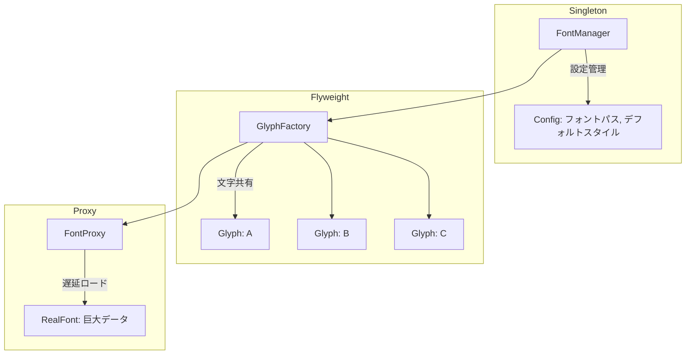

# 連載構造案：手で覚えるデザインパターン実践シリーズ

調査結果: `content/warehouse/singleton-flyweight-proxy-combination.md` に基づく

## 前提情報

- **技術スタック**: Perl v5.36以降（signatures、postfix dereference対応）、Mooによるオブジェクト指向
- **想定読者**: 「デザインパターン学習シリーズ」を読了したが、まだ自力で使いこなせない人
- **想定ペルソナ**: パターン名は知っているけど、「どんな時に使えばいいか」がピンとこない学習者
- **学習目標**:
  - 3パターンを1つの題材で体験し、相互の関係を理解する
  - 「この状況ならこのパターン」を直感的に判断できるようになる
  - 既存シリーズで学んだ知識を統合し、定着させる
- **位置づけ**: デザインパターン学習シリーズの復習・統合編
- **ストーリー**: シンプルな実装 → 問題発覚 → パターン導入 → 統合 → 完成
- **制約**:
  - 1記事1概念
  - コード例2つまで
  - 回の最後に完成コードを提示（原則1ファイル）
  - シリーズ名にパターン名は入れない（最終回で明かす）

### 既存シリーズとの差別化

**使用済みの題材（避けるべき）:**

| シリーズ | 題材 | パターン |
|---------|------|---------|
| 設定ファイルマネージャー | 設定管理 | Singleton |
| 弾幕シューティング | ゲーム弾幕 | Flyweight |
| ブルートフォース攻撃シミュレータ | セキュリティ | Proxy |
| ゴーストギャラリー・ビューワ | 画像ギャラリー | Proxy |
| ダンジョン自動生成器 | ダンジョン生成 | 複数パターン |
| テキストRPG戦闘エンジン | RPG戦闘 | 複数パターン |

---

## 案A: 「ASCIIアート・フォントレンダラー」アプローチ

### シリーズ名案

**「Perlで作るASCIIアート・フォントレンダラー」**（全8回）

### 特徴・アプローチ

FIGlet風のASCIIアートフォントをレンダリングするツールを段階的に構築。文字を入力すると巨大なASCIIアート文字を出力する。最初は単純なハードコード → 文字が増えてメモリ爆発 → Flyweightで共有 → Singletonで設定管理 → Proxyで遅延ロード、と段階的にパターンを導入。

### 3パターンの役割

| パターン | 本シリーズでの役割 | 必然性 |
|---------|------------------|--------|
| **Singleton** | フォント設定マネージャー（パス、デフォルト設定） | 複数箇所から同じ設定にアクセス |
| **Flyweight** | 文字グリフ（ASCIIアートデータ）の共有 | 同じ文字を複数回描画してもメモリ節約 |
| **Proxy** | フォントファイルの遅延ロード | 使わない文字のデータはロードしない |

### USP（独自の価値提案）

**「なぜこのシリーズに価値があるのか？」**

1. **視覚的フィードバック**: 出力が目に見えるので「動いた！」感が強い
2. **友人に自慢できる**: 「俺が作ったASCIIアートジェネレーター見てよ」
3. **実在ツールのミニ版**: FIGletという有名ツールの仕組みを理解できる
4. **デバッグしやすい**: 出力を見れば問題がすぐわかる
5. **段階的な破綻体験**: 「なぜパターンが必要か」を痛みで学べる

### メリット

- ✅ 視覚的な成果物で学習モチベーション維持
- ✅ 3パターンすべてが必然的に登場する設計
- ✅ 既存シリーズと完全に異なる題材
- ✅ Perl入学式卒業レベルでも理解しやすい

### デメリット

- ⚠️ 実務での直接利用は限定的
- ⚠️ フォントデータの準備が必要
- ⚠️ CLIでの表示に工夫が必要

### 連載構造表

| 回 | タイトル | 新しい概念 | ストーリー | コード例1 | コード例2 | 推奨タグ |
|---|---|---|---|---|---|---|
| 第1回 | 第1回-巨大な文字を表示してみよう - Perlで作るASCIIアート・フォントレンダラー | ASCIIアート基礎 | 1文字をハードコードで巨大表示。「HELLO」と表示できた！ | `simple_art.pl`（ハードコード） | 出力結果 | perl, moo, ascii-art, beginner, tutorial |
| 第2回 | 第2回-文字が増えるとメモリが爆発する - Perlで作るASCIIアート・フォントレンダラー | メモリ問題の体験 | A-Z全部追加したらメモリ使用量が急増。同じ文字なのに複製される | `memory_explosion.pl` | メモリ使用量の比較 | perl, moo, refactoring, memory, code-smell |
| 第3回 | 第3回-文字グリフを共有しよう - Perlで作るASCIIアート・フォントレンダラー | Flyweight導入 | 同じ文字は1つのオブジェクトを再利用。メモリ激減 | `GlyphFactory.pm` | `Glyph.pm` | perl, moo, flyweight-pattern, sharing, optimization |
| 第4回 | 第4回-フォントの設定が散らばる問題 - Perlで作るASCIIアート・フォントレンダラー | 設定管理問題の体験 | フォントパスを複数箇所でハードコード。変更が大変 | `scattered_config.pl` | 問題点の整理 | perl, moo, configuration, code-smell, refactoring |
| 第5回 | 第5回-設定を一元管理しよう - Perlで作るASCIIアート・フォントレンダラー | Singleton導入 | FontManagerで設定を一元管理。変更が1箇所で済む | `FontManager.pm`（Singleton） | 使用例 | perl, moo, singleton-pattern, configuration, global |
| 第6回 | 第6回-使わない文字もロードしてしまう - Perlで作るASCIIアート・フォントレンダラー | 遅延ロード問題の体験 | 全フォントを起動時にロード。起動が遅い | `eager_loading.pl` | 起動時間の計測 | perl, moo, lazy-loading, performance, code-smell |
| 第7回 | 第7回-使う文字だけロードしよう - Perlで作るASCIIアート・フォントレンダラー | Proxy導入 | FontProxyで必要な文字だけ遅延ロード。起動爆速 | `FontProxy.pm` | `RealFont.pm` | perl, moo, proxy-pattern, lazy-loading, virtual |
| 第8回 | 第8回-3つのパターンで完成！ - Perlで作るASCIIアート・フォントレンダラー | パターン統合と振り返り | 3パターン名を明かし、連携を図解。拡張案も紹介 | 完成コード全体 | パターン連携図 | perl, moo, design-patterns, integration, retrospective |

### 差別化ポイント

- **既存シリーズとの違い**: ゲームでもAPI連携でもない、「文字レンダリング」という新領域
- **3パターン同時統合**: 既存の2パターン組み合わせシリーズより複合度が高い
- **視覚的成果物**: 完成したら目に見える出力が得られる

---

## 案B: 「タイルベース・マップエディタ」アプローチ

### シリーズ名案

**「Perlで作るドット絵マップエディタ」**（全8回）

### 特徴・アプローチ

ゲームマップのタイル（草、水、壁など）を配置・表示するCLIエディタを構築。タイルを配置してASCII表現でマップを出力。タイル種類が増えてメモリ問題 → Flyweightで共有 → 設定をSingletonで管理 → テクスチャをProxyで遅延ロード。

### 3パターンの役割

| パターン | 本シリーズでの役割 | 必然性 |
|---------|------------------|--------|
| **Singleton** | マップ設定マネージャー（タイルサイズ、マップサイズ） | 全タイルで同じ設定を参照 |
| **Flyweight** | タイルオブジェクトの共有（草、水、壁） | 100×100マップでもタイル種類分のメモリで済む |
| **Proxy** | タイルテクスチャの遅延ロード | 表示領域のタイルだけロード |

### USP（独自の価値提案）

1. **ゲーム性**: マップを作って遊べる楽しさ
2. **拡張イメージ**: RPGやローグライクへの応用が想像できる
3. **作品として見せられる**: 「俺が作ったマップエディタ」

### メリット

- ✅ ゲーム系は学習モチベーションが高い
- ✅ 既存ダンジョン系（生成器）とは異なる（配置＋編集に焦点）
- ✅ 2Dマップは視覚的でわかりやすい

### デメリット

- ⚠️ ダンジョン系シリーズと近い印象を持たれる可能性
- ⚠️ CLIでのマップ編集UIに工夫が必要
- ⚠️ 実務との関連が薄い

### 連載構造表

| 回 | タイトル | 新しい概念 | ストーリー | コード例1 | コード例2 | 推奨タグ |
|---|---|---|---|---|---|---|
| 第1回 | 第1回-タイルを配置してみよう - Perlで作るドット絵マップエディタ | タイル基礎 | 草・水・壁をハードコードで配置。5×5マップ完成 | `simple_map.pl` | 出力結果 | perl, moo, game-dev, tiles, beginner |
| 第2回 | 第2回-マップが広がるとメモリが辛い - Perlで作るドット絵マップエディタ | メモリ問題 | 100×100マップにしたらメモリ爆発 | `large_map.pl` | メモリ計測 | perl, moo, memory, code-smell, refactoring |
| 第3回 | 第3回-タイルを共有しよう - Perlで作るドット絵マップエディタ | Flyweight導入 | 同じタイル種は1オブジェクトを再利用 | `TileFactory.pm` | `Tile.pm` | perl, moo, flyweight-pattern, sharing |
| 第4回 | 第4回-設定がバラバラで大変 - Perlで作るドット絵マップエディタ | 設定問題 | タイルサイズを複数箇所で定義。変更が困難 | `scattered_settings.pl` | 問題整理 | perl, moo, configuration, code-smell |
| 第5回 | 第5回-設定を一元管理しよう - Perlで作るドット絵マップエディタ | Singleton導入 | MapSettingsで設定一元化 | `MapSettings.pm` | 使用例 | perl, moo, singleton-pattern, configuration |
| 第6回 | 第6回-全テクスチャをロードしてしまう - Perlで作るドット絵マップエディタ | 遅延ロード問題 | 巨大テクスチャを全部ロード。起動が遅い | `eager_textures.pl` | 起動時間 | perl, moo, lazy-loading, performance |
| 第7回 | 第7回-表示するタイルだけロード - Perlで作るドット絵マップエディタ | Proxy導入 | TileProxyで必要なタイルだけロード | `TileProxy.pm` | `RealTile.pm` | perl, moo, proxy-pattern, lazy-loading |
| 第8回 | 第8回-完成！3パターンの連携 - Perlで作るドット絵マップエディタ | 統合・振り返り | パターン名を明かし、連携を解説 | 完成コード | パターン図 | perl, moo, design-patterns, integration |

### 差別化ポイント

- **配置＋編集に焦点**: 既存の「生成」系とは異なるアプローチ
- **CLIマップエディタ**: 操作可能なツールを作る達成感

---

## 案C: 「絵文字パレット・ジェネレーター」アプローチ

### シリーズ名案

**「Perlで作る絵文字辞書」**（全8回）

### 特徴・アプローチ

Unicode絵文字を効率的に検索・表示するCLIツールを構築。カテゴリ別に絵文字を一覧表示し、キーワード検索も可能。絵文字データが膨大 → Flyweightでメタデータ共有 → Singletonでデータベース管理 → Proxyで遅延ロード。

### 3パターンの役割

| パターン | 本シリーズでの役割 | 必然性 |
|---------|------------------|--------|
| **Singleton** | 絵文字データベースマネージャー | 全検索で同じデータベースを参照 |
| **Flyweight** | 絵文字メタデータの共有（カテゴリ、タグ） | 3000+絵文字のメタデータを効率管理 |
| **Proxy** | カテゴリデータの遅延ロード | 表示するカテゴリだけロード |

### USP（独自の価値提案）

1. **実用性**: チャットやドキュメントで絵文字を探すのに使える
2. **Unicode知識**: 絵文字の仕組みも学べる一石二鳥
3. **モダンなテーマ**: 絵文字は現代的で親しみやすい

### メリット

- ✅ 実用的なツールになる
- ✅ Unicodeという実世界のデータを扱う
- ✅ 絵文字は親しみやすいテーマ

### デメリット

- ⚠️ Perlでの絵文字処理がやや複雑
- ⚠️ CLI表示で絵文字が正しく出るか環境依存
- ⚠️ 視覚的なインパクトが弱い（絵文字自体は小さい）

### 連載構造表

| 回 | タイトル | 新しい概念 | ストーリー | コード例1 | コード例2 | 推奨タグ |
|---|---|---|---|---|---|---|
| 第1回 | 第1回-絵文字を表示してみよう - Perlで作る絵文字辞書 | Unicode基礎 | 数個の絵文字をハードコードで表示 | `simple_emoji.pl` | 出力結果 | perl, moo, unicode, emoji, beginner |
| 第2回 | 第2回-全絵文字をロードしたら重い - Perlで作る絵文字辞書 | メモリ問題 | 3000+絵文字のメタデータでメモリ爆発 | `all_emoji.pl` | メモリ計測 | perl, moo, memory, code-smell |
| 第3回 | 第3回-メタデータを共有しよう - Perlで作る絵文字辞書 | Flyweight導入 | カテゴリ情報を共有してメモリ節約 | `EmojiFactory.pm` | `Emoji.pm` | perl, moo, flyweight-pattern, sharing |
| 第4回 | 第4回-データベース設定が散らばる - Perlで作る絵文字辞書 | 設定問題 | DB接続設定が複数箇所に分散 | `scattered_db.pl` | 問題整理 | perl, moo, configuration, code-smell |
| 第5回 | 第5回-データベースを一元管理 - Perlで作る絵文字辞書 | Singleton導入 | EmojiDatabaseで一元管理 | `EmojiDatabase.pm` | 使用例 | perl, moo, singleton-pattern, database |
| 第6回 | 第6回-全カテゴリをロードしてしまう - Perlで作る絵文字辞書 | 遅延ロード問題 | 起動時に全カテゴリロード。遅い | `eager_categories.pl` | 起動時間 | perl, moo, lazy-loading, performance |
| 第7回 | 第7回-使うカテゴリだけロード - Perlで作る絵文字辞書 | Proxy導入 | CategoryProxyで遅延ロード | `CategoryProxy.pm` | `RealCategory.pm` | perl, moo, proxy-pattern, lazy-loading |
| 第8回 | 第8回-完成！3パターンの連携 - Perlで作る絵文字辞書 | 統合・振り返り | パターン名を明かし、全体像を解説 | 完成コード | パターン図 | perl, moo, design-patterns, integration |

### 差別化ポイント

- **実用ツール**: 実際に使える絵文字辞書を作る
- **Unicodeの世界**: 文字コードの知識も得られる

---

## 推薦案とその理由

### 推薦：案A「ASCIIアート・フォントレンダラー」アプローチ

### 推薦理由

1. **ペルソナとの適合性**
   - 視覚的な出力で「動いた！」感が強く、学習効果を実感しやすい
   - デバッグしやすく、問題の原因が特定しやすい

2. **検索意図との適合性**
   - 「ASCII art」「figlet」は検索されやすいキーワード
   - 「Perl ASCIIアート」という独自のポジション

3. **学習効果**
   - 3パターンの導入が自然な流れ（メモリ→設定→遅延ロード）
   - 問題→パターン導入→解決の体験が各回で明確

4. **既存シリーズとの連続性**
   - ゲーム系・API系とは完全に異なる領域
   - 「文字表示」という新鮮な切り口

### 代替案の選択指針

- **案Bが適しているケース**: ゲーム開発志向の読者、マップ編集に興味がある読者
- **案Cが適しているケース**: 実用ツール志向の読者、Unicodeに興味がある読者

---

## 付記

### 各案の比較表

| 項目 | 案A | 案B | 案C |
|-----|-----|-----|-----|
| **回数** | 8回 | 8回 | 8回 |
| **題材** | ASCIIアート | タイルマップ | 絵文字辞書 |
| **直感的なわかりやすさ** | ◎ | ○ | ○ |
| **「楽しさ」要素** | ◎ | ◎ | ○ |
| **実務との関連** | △ | △ | ○ |
| **既存シリーズとの差別化** | ◎ | ○ | ◎ |
| **デバッグのしやすさ** | ◎ | ○ | △ |

---

**作成日**: 2026年1月30日
**担当エージェント**: copilot
**参照元**: `content/warehouse/singleton-flyweight-proxy-combination.md`

---

## レビュー履歴

### 第1版（2026-01-30）

- 作成担当: copilot
- 作成概要: 3案（ASCIIアート・フォントレンダラー、タイルベース・マップエディタ、絵文字パレット・ジェネレーター）を作成
- 推薦案: 案A（ASCIIアート・フォントレンダラー）

### レビュー待ち事項

- [x] SEO視点でのタイトル・タグ・description改善
- [x] 品質視点での構造・難易度評価
- [x] 技術的正確性の確認

---

### 第1版レビュー（品質視点）（2026-01-30）

- レビュー担当: reviewer エージェント
- 評価結果: 合格（軽微な修正で完璧）
- 主な改善点: タイトル形式の統一（「第N回-○○ - シリーズ名」形式に修正）

#### 品質基準チェック

| 基準 | 評価 |
|------|------|
| 構造の一貫性 | ✓ |
| 段階的難易度上昇 | ✓ |
| 1記事1概念の原則 | ✓ |
| 各案の差別化 | ✓ |
| 連載構造表の完全性 | ✓ |
| ペルソナへの適合性 | ✓ |
| 技術的正確性 | ✓ |

---

### 第2版（2026-01-30）- 第1版レビュー反映

**反映した改善点**:

1. タイトル形式を「第N回-○○ - シリーズ名」に統一（全3案）
2. レビュー履歴セクションを更新

---

### 最終版（第2版）確定（2026-01-30）

- 最終確認: reviewer エージェント
- 評価: 全品質基準を満たす

---
