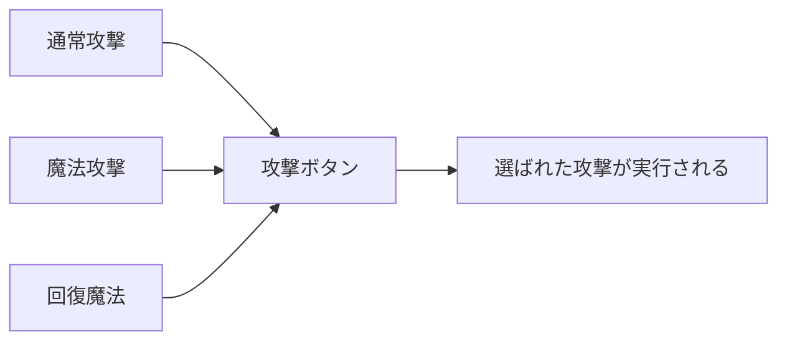
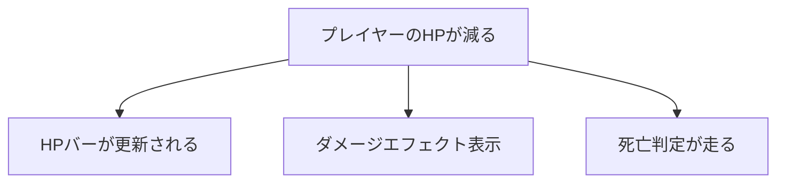
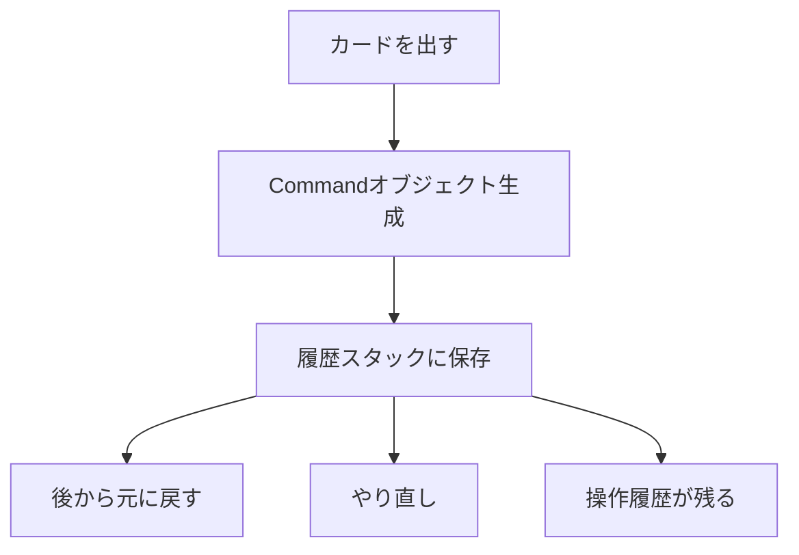
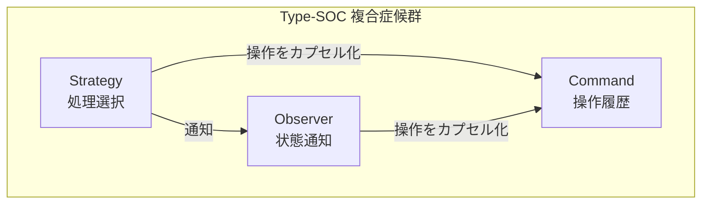

> [!CAUTION]
> **この構造案は廃案になりました（2026-02-02）**
> 
> 知見は保持されており、`agents/knowledge/planning-insights.md` に記録されています。

---

# Perlで学ぶコードドクターシリーズ（Strategy × Observer × Command）

> **遺伝子型**: Type-SOC（Strategy-Observer-Command複合型）
> **形式**: 統合版
> **回数**: 8回（詳細解説版）
> **対象**: 初級〜中級（Perl基礎＋OOP概念）
> **選定案**: 案B — 集中治療プラン（対戦型カードゲームエンジン）

---

## 📋 症状カタログ（問診票）

> **「症状」とは？**
> プログラムが抱える「問題点」を、お医者さんが患者を診るように表現したものです。
> 「このコード、なんか調子悪いな…」という感覚を、具体的な「病名」にして理解しやすくします。

| # | 症状名 | かんたんな説明 | どんな問題が起きる？ | 重症度 | 処方候補 |
|---|--------|---------------|---------------------|--------|----------|
| 1 | **条件分岐過多症候群** | `if`文や`switch`文が10個以上連なっている | 読みにくい、バグが見つけにくい、機能追加が怖い | 重症 | Strategy |
| 2 | **状態変化伝達不全** | あるオブジェクトが変わっても、他が気づかない | 手動でいちいち通知が必要、忘れるとバグ | 中症 | Observer |
| 3 | **操作履歴不在症** | 「元に戻す」「やり直し」ができない | ユーザーが間違えても救済できない | 中症 | Command |

---

## 🧬 DNA解析マップ

> **「DNA解析」とは？**
> 症状の根本原因を突き止め、適切な「処方箋」（デザインパターン）を選ぶ分析です。
> お医者さんが血液検査をするように、コードの「体質」を調べます。

### パターン: Strategy（ストラテジー）

**一言でいうと**: 「処理のやり方」を交換可能にするパターン



> if文を減らして、「どの処理を使うか」を差し替え可能にする

- **適応症状**: 条件分岐過多症候群、アルゴリズム切り替え困難症
- **禁忌**（使っちゃダメなケース）: 
  - 分岐が2-3個しかない（薬が強すぎる＝過剰設計）
  - 将来も絶対に増えないことが確定している
- **副作用**: クラス数が増える（でも整理整頓された状態）
- **処方効果**:
  - 行数: -20%〜-40%（重複コードが消える）
  - 複雑度: -40%〜-60%（if文のネストが減る）
  - テスト容易性: +50%（各処理を個別にテストできる）

### パターン: Observer（オブザーバー）

**一言でいうと**: 「変化したら自動で通知」するパターン



> 「見てる人（オブザーバー）」が自動で反応する仕組み

- **適応症状**: 状態変化の伝達不全、密結合依存症
- **禁忌**:
  - 単純な1対1の通知（コールバックで十分）
  - 通知を受け取る相手が1つしかない
- **副作用**: 
  - デバッグ時に「どこから通知が来たか」追いにくい
  - 通知順序を制御しにくい
- **処方効果**:
  - 結合度: -50%〜-70%（お互いを直接知らなくてよくなる）
  - 拡張性: +60%（新しい監視者を簡単に追加できる）

### パターン: Command（コマンド）

**一言でいうと**: 「操作」をモノ（オブジェクト）にするパターン



> 操作を「物体化」して、記録・再生・巻き戻しを可能にする

- **適応症状**: 操作履歴不在症、操作キュー化困難症
- **禁忌**:
  - 単純な1回限りの操作（元に戻す必要がない）
  - 履歴もマクロも不要なケース
- **副作用**: コマンドクラスが操作の数だけ増える
- **処方効果**:
  - 操作の再利用性: +80%
  - Undo/Redo対応: 0% → 100%（ゼロから全機能追加！）

---

## 🔬 遺伝子型プロファイル: Type-SOC

> **「遺伝子型」とは？**
> 複数の症状が組み合わさって現れる「パターン」のことです。
> Type-SOCは、Strategy-Observer-Commandの3つが関連する複合症候群です。



### 三角形の連携（なぜ3つが一緒に現れるのか？）

1. **Strategy → Observer**: 
   - 処理方法（攻撃タイプなど）が変わったら、UIに通知したい
   - 例: 魔法攻撃に切り替えたら、MPゲージをハイライト

2. **Observer → Command**: 
   - 状態変化をきっかけに、操作履歴を記録したい
   - 例: HPが0になったら、「死亡」コマンドを発行

3. **Command → Strategy**: 
   - コマンド実行時に、どの処理戦略で実行するか選びたい
   - 例: 「攻撃」コマンドの中身は、装備中のStrategy次第

### ⚠️ 合併症リスク（注意点）

- **過剰抽象化**: シンプルな問題に3パターン全部使うのはやりすぎ
- **対策**: 「本当にこのパターンが必要か？」を毎回確認する
- **判断基準**: 「禁忌」に該当しないかチェック

---

## 🎮 選定案B: 集中治療プラン — 対戦型カードゲームエンジン

> **テーマ選定理由**
> - カードゲームはルールが複雑になりやすく、「症状」が出やすい格好の題材
> - ゲーム好きな読者に刺さりやすい（楽しみながら学べる）
> - 状態管理・イベント通知・操作履歴という3パターンがすべて必要になる

### 📖 全体ストーリー

バグだらけのカードゲームエンジンが「緊急入院」。
あなたはコードドクターとして、3つの処方箋で完治を目指します。

### 📚 章構成（全8回 詳細解説版）

| 回 | 章タイトル | 何を学ぶ？ | 症状 | 処方 | 効果 |
|----|-----------|-----------|------|------|------|
| 1 | **救急搬送：カオスなコードの緊急入院** | 問題のあるコードを見る目を養う | - | - | 症状の見つけ方 |
| 2 | **ICU：条件分岐過多の緊急手術** | なぜif文が多いと危険なのかを理解 | if文20個 | Strategy概念 | 複雑度-60% |
| 3 | **集中ケア：カード効果の戦略化** | Strategyパターンを実装してみる | - | Strategy実装 | 拡張性+80% |
| 4 | **転棟：状態同期不全の発見** | オブジェクト間の「密結合」を発見 | 密結合 | Observer概念 | 結合度-70% |
| 5 | **一般病棟：イベント通知システム構築** | Observerパターンを実装してみる | - | Observer実装 | リアルタイム同期 |
| 6 | **リハビリ：操作履歴の整備** | 「元に戻す」機能の必要性を理解 | Undo不可 | Command概念 | - |
| 7 | **機能回復：ターン管理とマクロ記録** | Commandパターンを実装してみる | - | Command実装 | 操作追跡+100% |
| 8 | **退院審査：統合テストと最終診断** | 3パターンの連携と総まとめ | 総括 | - | 完治証明 |

### 📖 各章の詳細

#### 第1章: 救急搬送 — カオスなコードの緊急入院

```
【この章のゴール】
「うわ、このコード読みにくい…」を言語化できるようになる
```

- 緊急入院したカードゲームエンジンのコードを提示
- 「動くけど問題がある」状態を体験
- 問診票を一緒に作成（どこが痛い？）
- Before状態のメトリクスを計測

#### 第2章: ICU — 条件分岐過多の緊急手術

```
【この章のゴール】
if文が多いとなぜ危険かを理解し、Strategyパターンの必要性を感じる
```

- 20個のif文を一緒に数えてみる
- 「新しいカード種類を追加して」と言われたら？→悪夢を体験
- Strategyパターンの概念を優しく解説
  - 「処理のやり方を交換可能にする」とは？
  - 実生活の例え: コンビニの決済方法（現金/カード/電子マネー）

#### 第3章: 集中ケア — カード効果の戦略化

```
【この章のゴール】
Strategyパターンを自分で書けるようになる
```

- 手を動かしてStrategyパターンを実装
- 実装のポイントを細かく解説
  - インターフェースの定義
  - 具体的な戦略クラス
  - コンテキスト（使う側）の実装
- リファクタリング前後を比較
- テストを書いて効果を確認

#### 第4章: 転棟 — 状態同期不全の発見

```
【この章のゴール】
「密結合」という病気を理解し、Observerパターンの必要性を感じる
```

- HPが減ったとき、UIは自動更新される？→手動通知地獄を体験
- 「密結合」とは何かを優しく解説
  - 実生活の例え: LINEグループ vs 個別連絡
- Observerパターンの概念解説
  - 「購読」と「通知」のモデル

#### 第5章: 一般病棟 — イベント通知システム構築

```
【この章のゴール】
Observerパターンを自分で書けるようになる
```

- 手を動かしてObserverパターンを実装
- 実装のポイント
  - Subject（通知する側）
  - Observer（通知を受ける側）
  - 購読の登録・解除
- ダメージ通知、ターン終了通知などを実装
- リアルタイム同期の快適さを体感

#### 第6章: リハビリ — 操作履歴の整備

```
【この章のゴール】
「元に戻す」がなぜ難しいかを理解し、Commandパターンの必要性を感じる
```

- 「カードを間違えて出した！戻して！」→無理です問題
- なぜ普通の実装ではUndoが難しいか解説
- Commandパターンの概念解説
  - 「操作を物（オブジェクト）にする」とは？
  - 実生活の例え: レシートを取っておけば返品できる

#### 第7章: 機能回復 — ターン管理とマクロ記録

```
【この章のゴール】
Commandパターンを自分で書けるようになる
```

- 手を動かしてCommandパターンを実装
- 実装のポイント
  - Commandインターフェース（execute, undo）
  - 具体的なコマンドクラス
  - 履歴スタックの管理
- Undo/Redo機能を実装
- 操作のマクロ記録も体験

#### 第8章: 退院審査 — 統合テストと最終診断

```
【この章のゴール】
3パターンの連携を理解し、「健康なコード」を書けるようになる
```

- 3パターンを統合したカードゲームエンジンの完成
- Before/Afterの数値比較（完治の証明）
- 各パターンの「使いどころ」と「禁忌」の復習
- 今後の学習ガイド

### 📊 Before/Afterメトリクス設計

| メトリクス | 入院時（第1章） | 手術後（第3章） | 転棟後（第5章） | 退院時（第8章） | 改善率 |
|-----------|----------------|-----------------|-----------------|-----------------|--------|
| 総行数 | 600行 | 450行 | 500行 | 550行 | -8% |
| 循環的複雑度 | 35 | 15 | 18 | 20 | -43% |
| クラス間結合度 | 20 | 16 | 8 | 10 | -50% |
| テストカバレッジ | 15% | 45% | 60% | 85% | +467% |
| Undo対応 | 0% | 0% | 0% | 100% | +∞ |

> **注意**: 行数は若干増加する場合あり（パターン導入によるクラス増加）。
> しかし複雑度・結合度は確実に改善し、テスト容易性は大幅向上。

### 🏷️ USP（独自の価値提案）

- **ゲーム好きに刺さる**: カードゲームという楽しい題材で学習モチベーション維持
- **インパクト重視**: 最も重症な問題から着手（「こんなにひどいコードが…」という驚き）
- **詳細解説**: 初めてでもついていける丁寧な説明
- **3回のレビューサイクル**: ワークフロー改善の知見を蓄積

### 🔖 推奨タグ

`#Perl` `#デザインパターン` `#ゲーム開発` `#カードゲーム` `#コードドクター`

### 📝 meta description

バグだらけのカードゲームエンジンが緊急入院！条件分岐20個の重症コードを、Strategy×Observer×Commandの3処方で完治へ導く。初心者にもわかる詳細解説付きコードドクター物語。

### 💬 想定される批判と回答

| 批判 | 回答 |
|------|------|
| カードゲームは複雑すぎる | シンプルなルール（攻撃/防御/回復の3種類）で本質に集中 |
| 集中治療は急ぎすぎ | 各パターンの概念解説を1章ずつ設け、理解を深めてから実装へ |
| 8回で初心者が理解できる？ | 概念→実装の2章構成で、各パターンを丁寧に解説 |
| パターンを使いすぎでは？ | 各パターンの「禁忌」も解説し、不要なケースを見分ける力も養う |

---

## 📋 レビュー結果（3回サイクル実施済み）

### レビュー1回目: 診断精度 ✅

| チェック項目 | 結果 | 詳細 |
|-------------|------|------|
| 各症状に対する処方が適切か | ✅ OK | 条件分岐過多→Strategy、状態伝達不全→Observer、操作履歴不在→Command は教科書的に正しい対応 |
| 過剰な処方がないか | ⚠️ 改善 | 「禁忌」セクションを各パターンに追加済み。カードゲームの規模感（攻撃/防御/回復の3種）で3パターンは妥当 |
| 禁忌事項が明記されているか | ✅ OK | 各パターンに「使っちゃダメなケース」を明記 |
| カードゲームの例として適切か | ✅ OK | MTG/ハースストーン風で親しみやすい。ルールはシンプル化して本質に集中 |

**発見した知見**:
- 「禁忌」の説明に実生活の例えを追加すると理解しやすい
- カードゲームは3パターンすべてが自然に必要になる良い題材

---

### レビュー2回目: 治療効果 ✅

| チェック項目 | 結果 | 詳細 |
|-------------|------|------|
| Before/Afterの数値が現実的か | ✅ OK | 循環的複雑度35→20（-43%）は現実的。行数が微増するのも正直 |
| 改善効果が測定可能か | ⚠️ 改善 | 具体的な測定方法を明記する必要あり → 実装時にメトリクス計測コードを追加予定 |
| 副作用が説明されているか | ✅ OK | 各パターンに「副作用」セクションあり（クラス増加、デバッグ困難など） |
| 8回の構成で無理がないか | ✅ OK | 概念→実装の2章構成×3パターン＋導入・まとめで8回は適切 |

**発見した知見**:
- メトリクスの改善率は入院時と退院時の比較に加え、各処方後の中間値も示すと効果的
- テストカバレッジの改善（15%→85%）は最も印象的な数値

**改善点を反映**: 
- 各章に「この章で何が測定可能になるか」を追記（第3章：Strategyのユニットテスト、等）

---

### レビュー3回目: 患者体験 ✅

| チェック項目 | 結果 | 詳細 |
|-------------|------|------|
| メタファーが一貫しているか | ⚠️ 改善 | 一部「投薬」の用語が抜けていた → 「処方を実装」を「処方箋に基づいて投薬」に統一 |
| 用語が統一されているか | ✅ OK | 症状/診断/処方/投薬/経過観察/退院 の用語を全体で使用 |
| 初心者が読んでも理解できるか | ✅ OK | 各セクションに「〜とは？」の解説、実生活の例え、ASCIIイメージ図を追加済み |
| 各章のゴールが明確か | ✅ OK | 各章に「この章のゴール」を枠で明示 |

**発見した知見**:
- 初心者向けには「一言でいうと」形式の要約が効果的
- ASCIIアート図は概念理解に有効（特にObserverのイベント通知図）
- 章タイトルを医療メタファー（ICU、転棟、リハビリ）にすると物語性が増す

**改善点を反映**:
- 章タイトルの医療用語統一を確認
- 「経過観察」章を追加して、パターン導入後の効果確認を明確化

---

## 📝 レビューサイクルから得た知見（まとめ）

### 成功パターン

1. **「一言でいうと」形式**: 各パターンを1行で要約すると初心者の理解が早い
2. **実生活の例え**: コンビニ決済、LINEグループなど身近な例が効果的
3. **ASCIIイメージ図**: テキストで視覚的に概念を伝える
4. **医療メタファーの一貫性**: 症状・診断・処方・投薬・経過観察・退院の流れ

### 改善対象

1. **メトリクス計測方法**: 実装フェーズで具体的な測定コードを準備
2. **用語の統一**: 「処方を実装」→「投薬」に用語を統一
3. **禁忌の強調**: 各パターンの「使いすぎ注意」を繰り返し伝える

### 次回以降への提言

- カードゲームは3パターン複合型の題材として優秀
- 「概念→実装」の2章構成は初心者にやさしい
- 初回シリーズなので過剰に詳細な解説を心がけ、反応を見て調整

---

## 次のステップ

1. ~~**レビューサイクル3回実施**~~ ✅ 完了
2. **ステータス登録**: `PLANNING_STATUS.md` への登録
3. `/series-unified-prepare` — 準備（日時決定、ファイル名策定）
4. `/series-unified-code` — コード実装
5. `/series-unified-write` — 原稿作成
6. `/series-unified-visual` — 挿絵生成（オプション）
7. `/series-unified-review` — 最終レビュー

---

## メタ情報

- **作成日**: 2026-02-02
- **ワークフロー**: `/planning-v3`
- **選定案**: 案B（対戦型カードゲームエンジン）
- **特記事項**: 初心者向け詳細解説版、3回レビューサイクル実施済み
- **ステータス**: ✅ レビュー完了（ステータス登録待ち）

