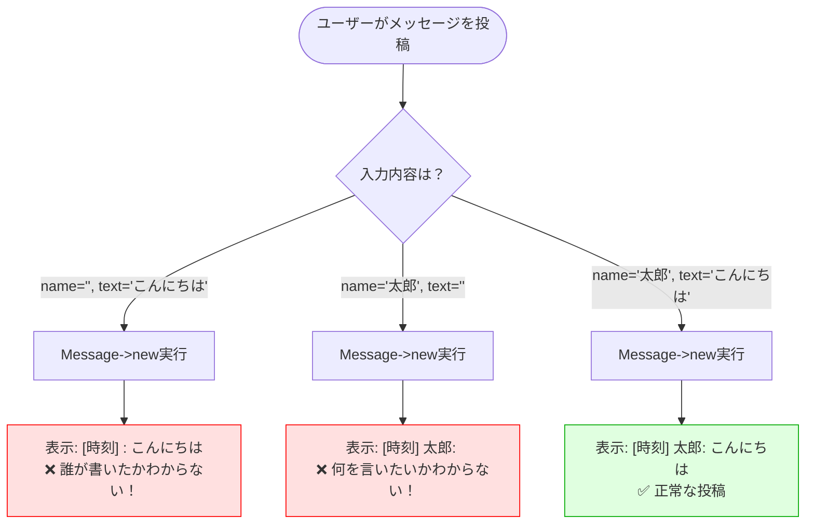
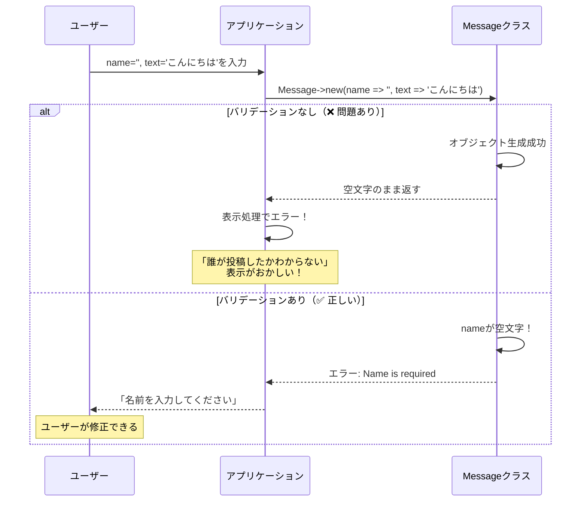
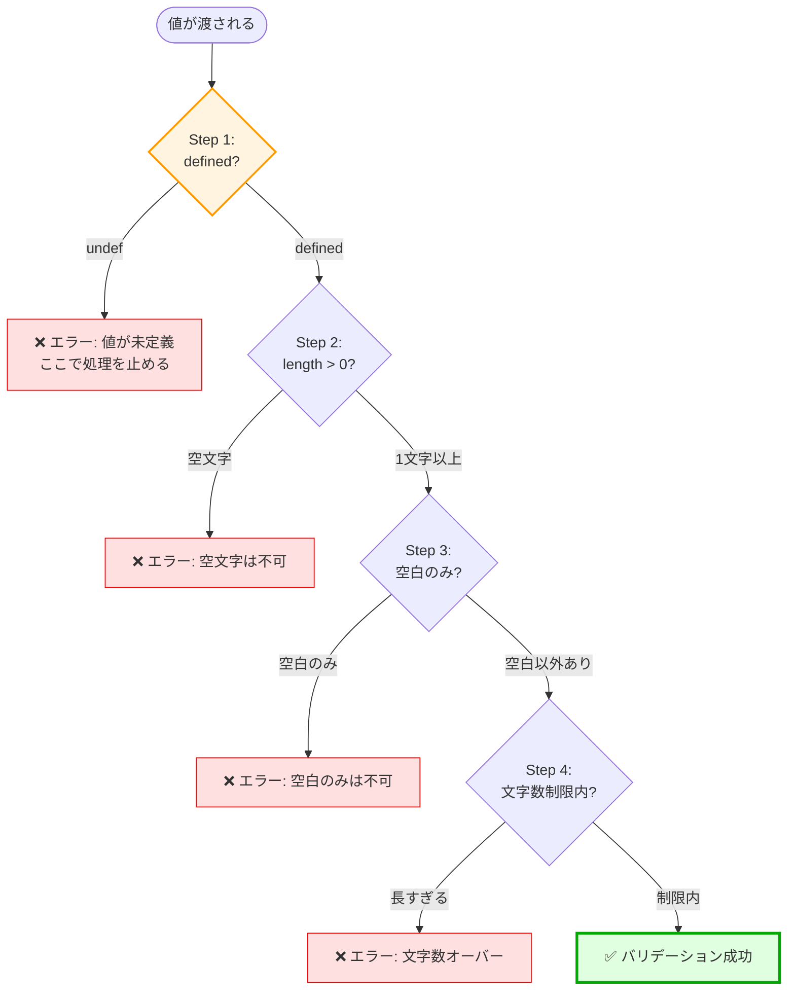
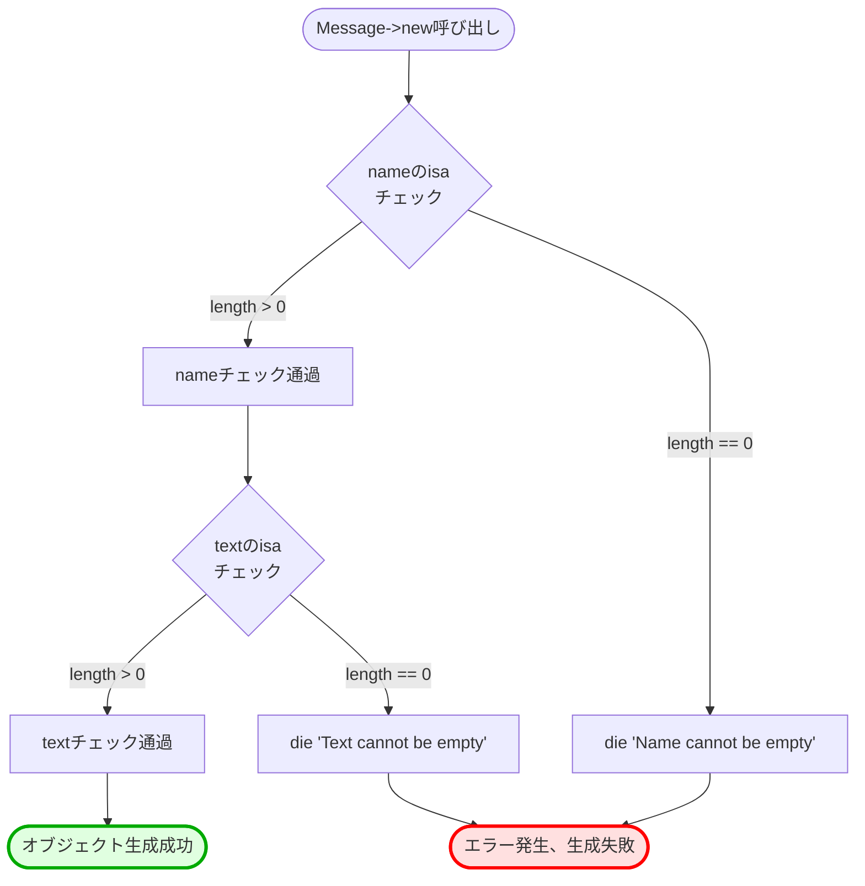
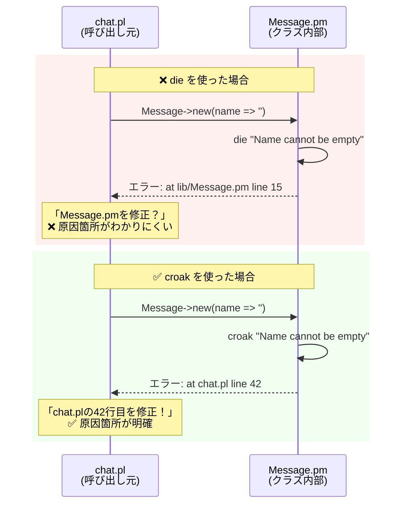
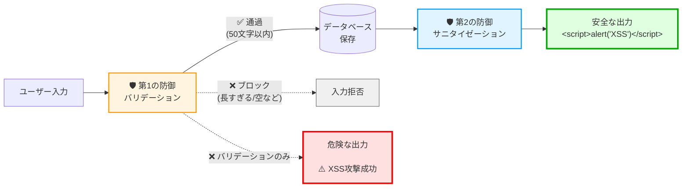

[@nqounet](https://twitter.com/nqounet)です。

Perlのオブジェクト指向、順調に進んでいますか？[前回の第3回](/post/1735477200/)では、`default`を使ってタイムスタンプを自動設定しました。掲示板に投稿日時が表示されて、いい感じになってきましたね！

でも、実は**大きなセキュリティホール**があります。試しに、こんなコードを実行してみてください。

```perl
my $msg = Message->new(
    name => '',     # 空文字！
    text => ''      # これも空文字！
);
```

**なんと、これが通ってしまうのです！** 😱

名前も本文も空っぽのメッセージが作れてしまいます。これでは掲示板が荒らされ放題です。今回は、Mooの`isa`機能を使って、不正なデータをシャットアウトする**入力値検証（バリデーション）**の方法を学びます。

たった5分で、Messageクラスが鉄壁のセキュリティを持つように変わります！🛡️

## 動作確認環境

本記事は**Perl初心者向けの入門記事**です。以下の環境で動作確認しています。

- **Perl**: 5.16以上（5.38.0で検証済み）- ほとんどのPerl環境で動作します
- **Moo**: 2.005005 - `cpanm Moo`でインストール可能
- **Carp**: コア標準モジュール（追加インストール不要）
- **OS**: Linux, macOS, Windows（WSL）

## 入力値検証が必要な理由 - 空文字がもたらすセキュリティリスク

前回までに作ったMessageクラスは、`name`と`text`のプロパティを持っていますが、何も制限がありません。つまり、どんな値でも受け入れてしまいます。これは**セキュリティリスク**の温床です。

### 名前が空のメッセージが投稿できてしまう

実際に試してみましょう。

```perl
#!/usr/bin/env perl
use strict;
use warnings;
use utf8;
use FindBin;
use lib "$FindBin::Bin/lib";
use Message;

binmode STDOUT, ':utf8';

# これが通ってしまう！
my $msg1 = Message->new(
    name => '',
    text => 'こんにちは'
);

my $msg2 = Message->new(
    name => '太郎',
    text => ''
);

printf "[%s] %s: %s\n", $msg1->formatted_time, $msg1->name, $msg1->text;
printf "[%s] %s: %s\n", $msg2->formatted_time, $msg2->name, $msg2->text;
```

実行結果です。

```text
[2024-12-29 15:30:00] : こんにちは
[2024-12-29 15:30:00] 太郎: 
```

**誰が投稿したのかわからない**メッセージや、**何を言いたいのかわからない**メッセージが表示されてしまいます。これでは掲示板として機能しません！



*図: バリデーションなしで起こる問題*

### セキュリティとデータ整合性のリスク

空文字が通ってしまう問題は、見た目だけの問題ではありません。実際のWebアプリケーションでは、深刻なセキュリティリスクにつながる可能性があります。

**データ整合性の観点**
- データベースに保存する際、空文字が紛れ込む
- 検索や集計が正しく動作しない（「投稿者なし」のメッセージが混在）
- レポート作成時にエラーの原因になる
- 統計データが不正確になる（平均メッセージ長の計算など）

**セキュリティの観点**
- 荒らし投稿の温床になる（自動化しやすい）
- スパムボットが大量投稿しやすくなる
- 管理者の負担が増える（不正投稿の削除作業）
- システムの信頼性が低下する

**ユーザー体験の観点**
- 空のメッセージが表示されて混乱する
- 「ちゃんと投稿されたかな？」と不安になる
- 掲示板の品質が低下し、ユーザーが離れる

**実際に起こりうる攻撃シナリオ**

1. **大量の空投稿攻撃** - ボットが空文字のメッセージを大量に投稿し、サーバーリソースを消費させる
2. **データベース汚染** - 空文字や異常に長い文字列で、データベースのパフォーマンスを低下させる
3. **表示崩れ攻撃** - 極端に長い文字列で、ページレイアウトを破壊する

これらの問題を防ぐために、**バリデーション（入力値の検証）**が必要なのです！バリデーションは、セキュリティの**第一の防衛線**です。

### なぜバリデーションが必要か

プログラミングの世界には、重要な原則があります。

> **「ユーザー入力は信用するな」**

ユーザーは、意図的に、あるいは誤って、おかしなデータを入力することがあります。プログラマーの仕事は、そういった不正なデータを**事前にブロック**することです。

バリデーションを追加すれば、問題のあるデータは**オブジェクト生成の段階で弾かれる**ため、後続の処理でエラーが起きる心配がありません。これを**フェイルファスト（Fail Fast）**と呼びます。早めに失敗して、問題を早期発見するのです。



*図: バリデーションの有無による動作の違い*

## Moo isaの基本 - プロパティに型チェックを追加する方法

Mooには、プロパティの値をチェックする`isa`というオプションがあります。これを使えば、不正な値を持つオブジェクトの生成を防げます。Perlでの入力値検証の基本となる機能です。

### isaオプションの基本構文

`isa`オプションには、**サブルーチンリファレンス**（`sub { ... }`）を渡します。このサブルーチンの中で、値をチェックして、問題があれば`die`でエラーを投げます。

基本的なパターンを見てみましょう。

```perl
has name => (
    is  => 'ro',
    isa => sub {
        die "Name cannot be empty" unless length($_[0]) > 0;
    },
);
```

この例では、`name`プロパティに対して「長さが0より大きい」というチェックを行っています。もし空文字が渡されたら、`die`が実行されてエラーになります。

**重要ポイント**
- `$_[0]`は、プロパティに渡された値（第1引数）
- `die`でエラーを投げると、オブジェクト生成が失敗する
- エラーが投げられない場合は、値が正常とみなされる
- **`isa`はオブジェクト生成時と値の設定時に毎回実行される**

**実行タイミング**
- `Message->new(name => '')`を実行すると、即座に`isa`のサブルーチンが呼ばれる
- `rw`プロパティの場合は、`$obj->name('新しい値')`でも再度実行される
- `ro`プロパティの場合は、生成時の1回のみ実行される（後から変更できないため）

### サブルーチンによるカスタムバリデーション

`isa`のサブルーチンの中では、Perlの機能を自由に使えます。これにより、柔軟なバリデーションが可能です。

**複数の条件をチェックする例**

```perl
has name => (
    is  => 'ro',
    isa => sub {
        my $val = $_[0];
        die "Name is required" unless defined $val;
        die "Name cannot be empty" unless length($val) > 0;
        die "Name must be 50 characters or less" if length($val) > 50;
    },
);
```

この例では、3つのチェックを順番に行っています。

1. `defined $val`: 値が`undef`（未定義）でないか
2. `length($val) > 0`: 空文字でないか
3. `length($val) <= 50`: 50文字以内か

**チェックの順序が重要な理由**

バリデーションの順序を間違えると、予期しないエラーが発生します。

```perl
# ❌ 悪い例：undefに対してlengthを実行してしまう
has name => (
    is  => 'ro',
    isa => sub {
        my $val = $_[0];
        die "Name cannot be empty" unless length($val) > 0;  # undefならwarning!
        die "Name is required" unless defined $val;
    },
);

# ✅ 良い例：まずdefinedチェック
has name => (
    is  => 'ro',
    isa => sub {
        my $val = $_[0];
        die "Name is required" unless defined $val;  # 最初にチェック
        die "Name cannot be empty" unless length($val) > 0;
    },
);
```

`undef`に対して`length`を実行すると、Perlはwarningを出します。それを避けるため、**まず`defined`をチェック**してから、他のチェックを行います。これを**防御的プログラミング**と呼びます。



*図: バリデーションチェックの優先順位（防御的プログラミング）*

### dieでエラーを投げる仕組み

`die`は、Perlでエラーを発生させる組み込み関数です。`isa`の中で`die`が実行されると、オブジェクトの生成が中断され、呼び出し元にエラーが伝わります。

```perl
# これはエラーになる
eval {
    my $msg = Message->new(
        name => '',
        text => 'こんにちは'
    );
};

if ($@) {
    print "Error: $@\n";  # => Error: Name cannot be empty at ...
}
```

`eval { ... }`で囲むことで、エラーを捕捉できます。`$@`には、エラーメッセージが格納されます。



*図: isaによるバリデーションフロー*

## 実践！カスタムバリデーションの実装 - 空文字・長さ・空白チェック

それでは、Messageクラスに実際のバリデーションを追加してみましょう。Perlの組み込み関数と正規表現を使って、段階的に進めます。

### 空文字チェックの実装

まずは、最もシンプルな空文字チェックです。

```perl
package Message;
use Moo;
use utf8;
use Time::Piece;

# 名前プロパティ（空文字チェック追加）
has name => (
    is  => 'ro',
    isa => sub {
        die "Name cannot be empty" unless length($_[0]) > 0;
    },
);

# メッセージ本文プロパティ（空文字チェック追加）
has text => (
    is  => 'ro',
    isa => sub {
        die "Message text cannot be empty" unless length($_[0]) > 0;
    },
);

# タイムスタンププロパティ（第3回で実装済み）
has timestamp => (
    is      => 'ro',
    default => sub { time }
);

# 日時を見やすくフォーマットするメソッド
sub formatted_time {
    my $self = shift;
    my $t = localtime($self->timestamp);
    return $t->strftime('%Y-%m-%d %H:%M:%S');
}

1;
```

これで、空文字の`name`や`text`は受け付けなくなりました！

試してみます。

```perl
use Message;

# これはエラーになる
eval {
    my $msg = Message->new(
        name => '',
        text => 'こんにちは'
    );
};
print "Error: $@\n" if $@;  # => Error: Name cannot be empty at ...
```

完璧です！🎉

### 文字列長の制限と空白チェック

さらに強化しましょう。空文字だけでなく、**空白のみ**の文字列や、**長すぎる**文字列もブロックします。

```perl
package Message;
use Moo;
use utf8;
use Time::Piece;

# 名前プロパティ（完全版バリデーション）
has name => (
    is  => 'ro',
    isa => sub {
        my $val = $_[0];
        die "Name is required" 
            unless defined $val && length($val) > 0;
        die "Name cannot be only whitespace" 
            unless $val =~ /\S/;
        die "Name must be 50 characters or less" 
            if length($val) > 50;
    },
);

# メッセージ本文プロパティ（完全版バリデーション）
has text => (
    is  => 'ro',
    isa => sub {
        my $val = $_[0];
        die "Message text is required" 
            unless defined $val && length($val) > 0;
        die "Message text cannot be only whitespace" 
            unless $val =~ /\S/;
        die "Message text must be 1000 characters or less" 
            if length($val) > 1000;
    },
);

# タイムスタンププロパティ
has timestamp => (
    is      => 'ro',
    default => sub { time }
);

# 日時を見やすくフォーマットするメソッド
sub formatted_time {
    my $self = shift;
    my $t = localtime($self->timestamp);
    return $t->strftime('%Y-%m-%d %H:%M:%S');
}

1;
```

**追加したチェック項目**
- `$val =~ /\S/` - 空白以外の文字が最低1つ必要（`\S`は非空白文字）
- `length($val) <= 50` - 名前は50文字以内
- `length($val) <= 1000` - 本文は1000文字以内

これで、スペースだけの投稿や、異常に長い投稿も防げます！

### エラーメッセージの改善 - Carp::croakの活用

今のコードでも動きますが、エラーメッセージをもっとユーザーフレンドリーにできます。Perlの標準モジュール`Carp`の`croak`を使うことで、開発者にとってわかりやすいエラー報告が可能になります。

**dieとcroakの違い**

```perl
# dieの場合
die "Name cannot be empty";
# => Name cannot be empty at lib/Message.pm line 15.
#    ↑ エラーが「Messageクラスの中」で起きたように見える

# croakの場合
use Carp qw(croak);
croak "Name cannot be empty";
# => Name cannot be empty at chat.pl line 42.
#    ↑ エラーが「呼び出し元（chat.pl）」で起きたように見える
```

`croak`を使うと、エラーメッセージに**呼び出し元の行番号**が表示されます。これにより、ユーザーは「どこを修正すればいいか」が一目でわかります。



*図: dieとcroakのエラー報告位置の違い*

**Carp::croakを使った改善版**

```perl
package Message;
use Moo;
use utf8;
use Carp qw(croak);
use Time::Piece;

# 名前プロパティ
has name => (
    is  => 'ro',
    isa => sub {
        my $val = $_[0];
        croak "Name is required" 
            unless defined $val && length($val) > 0;
        croak "Name cannot be only whitespace" 
            unless $val =~ /\S/;
        croak "Name must be 50 characters or less (got " . length($val) . " characters)" 
            if length($val) > 50;
    },
);

# メッセージ本文プロパティ
has text => (
    is  => 'ro',
    isa => sub {
        my $val = $_[0];
        croak "Message text is required" 
            unless defined $val && length($val) > 0;
        croak "Message text cannot be only whitespace" 
            unless $val =~ /\S/;
        croak "Message text must be 1000 characters or less (got " . length($val) . " characters)" 
            if length($val) > 1000;
    },
);

# タイムスタンププロパティ
has timestamp => (
    is      => 'ro',
    default => sub { time }
);

# 日時を見やすくフォーマットするメソッド
sub formatted_time {
    my $self = shift;
    my $t = localtime($self->timestamp);
    return $t->strftime('%Y-%m-%d %H:%M:%S');
}

1;
```

エラーメッセージに「実際の文字数」を含めることで、ユーザーが問題を理解しやすくなりました！

## 動かしてみよう - 完全なコード例

それでは、すべてを統合して動作確認してみましょう。

### Message.pmの更新

`lib/Message.pm`を上記の完全版に更新します。

### chat.plの更新（エラーハンドリング付き）

`chat.pl`も更新して、エラーを適切に処理できるようにします。

```perl
#!/usr/bin/env perl
# Perl 5.16以上
# 外部依存: Moo, Carp
use strict;
use warnings;
use utf8;
use FindBin;
use lib "$FindBin::Bin/lib";
use Message;

binmode STDOUT, ':utf8';

# メッセージオブジェクトの配列
my @messages;

# メッセージを安全に追加する関数（エラーハンドリング付き）
sub add_message_safely {
    my ($name, $text) = @_;
    
    eval {
        my $msg = Message->new(
            name => $name,
            text => $text,
        );
        push @messages, $msg;
        return 1;  # 成功
    };
    
    if ($@) {
        warn "Failed to add message: $@";
        return 0;  # 失敗
    }
}

# メッセージを表示する関数
sub show_messages {
    foreach my $msg (@messages) {
        printf "[%s] %s: %s\n", 
            $msg->formatted_time,
            $msg->name, 
            $msg->text;
    }
}

# 正常な投稿（成功）
print "=== 正常な投稿 ===\n";
if (add_message_safely('太郎', 'こんにちは')) {
    print "Message added successfully!\n";
}

sleep 1;

if (add_message_safely('花子', 'おはよう')) {
    print "Message added successfully!\n";
}

# 不正な投稿（失敗）
print "\n=== 不正な投稿のテスト ===\n";

# 空の名前
add_message_safely('', 'こんにちは');

# 空の本文
add_message_safely('次郎', '');

# 空白のみの名前
add_message_safely('   ', 'テスト');

# 長すぎる名前
add_message_safely('あ' x 100, 'テスト');

# 表示
print "\n=== 投稿一覧 ===\n";
show_messages();
```

### 実行結果

```text
=== 正常な投稿 ===
Message added successfully!
Message added successfully!

=== 不正な投稿のテスト ===
Failed to add message: Name is required at chat.pl line 19.
Failed to add message: Message text is required at chat.pl line 19.
Failed to add message: Name cannot be only whitespace at chat.pl line 19.
Failed to add message: Name must be 50 characters or less (got 100 characters) at chat.pl line 19.

=== 投稿一覧 ===
[2024-12-29 15:45:00] 太郎: こんにちは
[2024-12-29 15:45:01] 花子: おはよう
```

完璧です！正常なメッセージは投稿され、不正なメッセージは全てブロックされました。しかも、エラーメッセージがわかりやすい！🎉

### よくある質問（FAQ）

#### Q1: timestampにはバリデーションを追加しないのか？

**A:** `timestamp`は`default => sub { time }`で自動設定されるため、ユーザーが直接値を指定することを想定していません。これは、**第3回で学んだ設計思想**の応用です。

**バリデーションが不要な理由**
- システムが自動生成するため、常に有効な値（エポック秒）が保証される
- `is => 'ro'`で読み取り専用なので、後から変更されない
- ユーザー入力ではないため、不正な値が入る余地がない
- `default`のサブルーチンリファレンスが毎回正しい値を返す

**第3回との対比で理解する**

```perl
# 第3回で学んだこと：システムが値を生成
has timestamp => (
    is      => 'ro',
    default => sub { time }  # 常に有効な値
);

# 第4回で学んだこと：ユーザーが値を入力
has name => (
    is  => 'ro',
    isa => sub {  # 検証が必要！
        die "Name is required" unless defined $_[0] && length($_[0]) > 0;
    },
);
```

**設計原則（重要！）**:
```text
システム生成の値（default） → バリデーション不要（信頼できる）
ユーザー入力の値           → バリデーション必須（信頼できない）
```

これは、セキュリティの基本原則「**信頼境界（Trust Boundary）**」の考え方です。システムが生成する値は信頼できますが、外部（ユーザー）から来る値は信頼できません。

**もし`timestamp`を手動で指定できるようにするなら**

```perl
# rwにして手動設定可能にした場合
has timestamp => (
    is  => 'rw',  # 読み書き可能
    isa => sub {
        my $val = $_[0];
        die "Timestamp must be a positive integer" unless $val =~ /^\d+$/;
        die "Timestamp cannot be in the future" if $val > time;
    },
);
```

この場合は、バリデーションが必要になります。でも、今回の掲示板では`timestamp`は自動生成で十分なので、シンプルに`ro` + `default`で実装しています。**必要十分な設計**が大切です。

#### Q2: Type::Tinyとの違いは？初心者はどちらを使うべきか？

**A:** Moo標準の`isa`は学習コストが低く、初心者に最適です。

**比較表**

| 項目 | Moo標準のisa | Type::Tiny |
|------|-------------|-----------|
| 学習曲線 | 低い（Perlの基本だけ） | 中程度（型システムの理解が必要） |
| 依存関係 | なし（Mooのみ） | あり（Type::Tiny） |
| 柔軟性 | 高い（任意のコードが書ける） | 型定義に限定される |
| 再利用性 | 低い（コピペが必要） | 高い（型をエクスポート可能） |

**初心者には`isa`を推奨する理由**
- 追加の概念を学ぶ必要がない
- 依存関係が増えない
- 動作が直感的で理解しやすい

Type::Tinyは、大規模なプロジェクトや複雑な型が必要になった時に検討しましょう。

#### Q3: バリデーションとサニタイゼーションの違いは？

**A:** バリデーションは「値が正しいかチェック」、サニタイゼーションは「危険な文字を無害化」です。**どちらも必要**で、異なる役割を果たします。

**バリデーション（今回学んだこと）**
- 空文字をチェック
- 文字列長をチェック
- 正規表現でパターンマッチ
- **不正な値を拒否する（入口でブロック）**
- オブジェクト生成時に実行

**サニタイゼーション（別の技術）**
- HTMLタグをエスケープ（XSS対策）
- SQLの特殊文字をエスケープ（SQLインジェクション対策）
- **危険な文字を無害化する（出力時に安全化）**
- データを使用する直前に実行

**具体例で理解する**

```perl
# バリデーション：入力時にチェック
has name => (
    is  => 'ro',
    isa => sub {
        my $val = $_[0];
        die "Name is required" unless defined $val && length($val) > 0;
        die "Name must be 50 characters or less" if length($val) > 50;
    },
);

# サニタイゼーション：出力時に安全化
use HTML::Entities;

sub display_message {
    my $self = shift;
    # HTMLタグを無害化（<script>などの攻撃を防ぐ）
    my $safe_name = encode_entities($self->name);
    my $safe_text = encode_entities($self->text);
    return "[$safe_name] $safe_text";
}
```

**多層防御の考え方**:

```text
入力 → バリデーション → 保存 → サニタイゼーション → 出力
      （不正な値を拒否）        （危険な文字を無害化）
```

バリデーションだけでは、悪意のあるスクリプトタグ（`<script>alert('XSS')</script>`）を含む文字列を防げません。長さが50文字以内なら通ってしまいます。そのため、HTML出力時に`HTML::Entities`でエスケープが必要です。



*図: バリデーションとサニタイゼーションの多層防御アーキテクチャ*

**覚え方**
- **バリデーション**: 「このデータは正しいか？」をチェック
- **サニタイゼーション**: 「このデータは安全か？」を確保

**両方とも必要**です！バリデーションで不正な値をブロックし、サニタイゼーションで表示時の安全性を確保します。セキュリティは一つの技術だけでは守れません。**多層防御**が鉄則です。

## まとめ - Perlでデータの安全性を守る次のステップ

今回は、Mooの`isa`機能を使って、Messageクラスに**入力値検証（バリデーション）**を追加しました。これで、空文字や不正な値がオブジェクトに混入することがなくなり、**セキュリティレベルが大幅に向上**しました！

### 今回の3つのポイント

**ポイント1: Perl Mooのisaによるバリデーション**
- `isa => sub { ... }`でプロパティの値をチェックできる
- `die`または`croak`でエラーを投げる
- オブジェクト生成時に自動的にチェックが実行される
- 入力値検証の基本パターンを習得

**ポイント2: 段階的なバリデーションの重要性**
- まず`defined`チェック（undefを避ける）
- 次に空文字チェック（`length > 0`）
- 最後に具体的な制約（文字列長、パターンなど）
- 防御的プログラミングでセキュリティを確保

**ポイント3: ユーザーフレンドリーなエラーメッセージ**
- `Carp::croak`で呼び出し元の行番号を表示
- 具体的で建設的なメッセージ（「何が問題で、どうすればいいか」）
- エラーメッセージに実際の値を含める

Perlのオブジェクト指向プログラミング、どんどん実用的になってきましたね！次回はさらに発展させます。

### 次回予告 - Perlのメソッドでロジックを追加する

今回作ったMessageクラスは、かなり堅牢になりました。第2回でクラスを作り、第3回で自動タイムスタンプを追加し、第4回でバリデーションを実装。着実に進化していますね！

でも、プロパティだけでは、まだ物足りないと思いませんか？

```perl
# こんな機能が欲しい！
$msg->summary;      # => "太郎: こんにちは..."（要約を表示）
$msg->length;       # => 10（メッセージの長さ）
$msg->is_long;      # => true/false（長いメッセージかチェック）
$msg->is_recent;    # => true/false（最近の投稿か）
$msg->mentions('花子');  # => true/false（特定の名前が含まれるか）
```

こういった「振る舞い」を追加するには、**Perlのメソッド**を定義します。

**プロパティとメソッドの違い**

```text
プロパティ: データを保持する（name, text, timestamp）
メソッド:   処理を実行する（summary, is_long, is_recent）
```

この2つを組み合わせることで、オブジェクトが「生きたデータ」になるのです！データだけでなく、そのデータに対する操作も一緒にまとめられるのが、**Perlオブジェクト指向プログラミングの真髄**です。

**第5回で学ぶこと**
- メソッドの定義方法（`sub メソッド名 { ... }`）
- `$self`の使い方（自分自身のプロパティにアクセス）
- プロパティとメソッドの使い分け
- 実践的なメソッドの実装例（要約、検索、フォーマット）

**これまでの進化の軌跡**

```text
第1回: Mooの基本（packageとhas）
第2回: クラスの作成（name, text）
第3回: 自動設定（timestamp + default）  ← システムが値を生成
第4回: バリデーション（isa）           ← ユーザー入力を検証
第5回: メソッド（次回）                ← オブジェクトに振る舞いを追加！
```

オブジェクト指向の3大要素「**データ（プロパティ）**」「**振る舞い（メソッド）**」「**カプセル化**」のうち、メソッドを学べば、あなたのPerl力は一気に加速します！

お楽しみに！🚀

## 参考リンク

### 公式ドキュメント





### チュートリアル





### 関連タグ

- [Perlに関する記事一覧](/tags/perl/)
- [Mooに関する記事一覧](/tags/moo/)
- [バリデーションに関する記事一覧](/tags/validation/)
- [セキュリティに関する記事一覧](/tags/security/)
- [初心者向け記事一覧](/tags/beginner/)

### 関連記事

- [第1回-Mooで覚えるオブジェクト指向プログラミング](/2021/10/31/191008/) - Mooの基本構文とクラスの作り方を学ぶ
- [第2回-Messageクラスでスパゲティコードから脱却](/post/1767021303/) - オブジェクト指向の実践とクラス設計
- [第3回-デフォルト値で投稿日時を自動設定しよう](/post/1735477200/) - defaultとTime::Pieceを使ったタイムスタンプの実装
- 第4回-入力値をチェックして安全にしよう（本記事） - isaを使った入力値検証の基本
- 第5回-メソッドでオブジェクトに機能を持たせよう（次回予告）

## 更新履歴

- 2024-12-29: 初版公開
