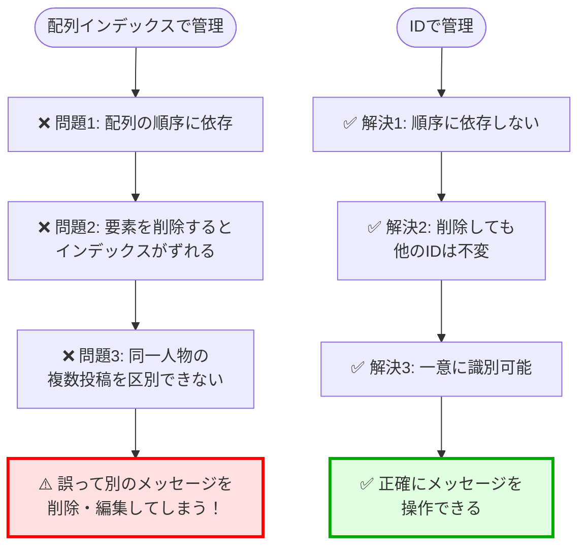
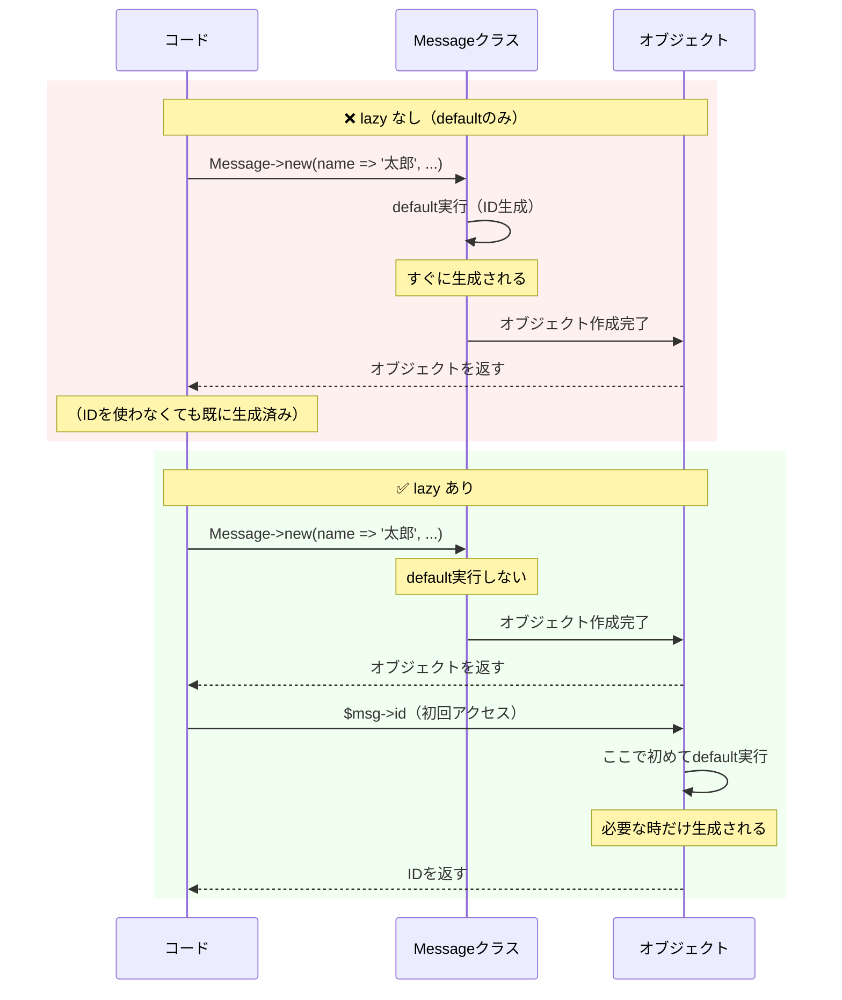
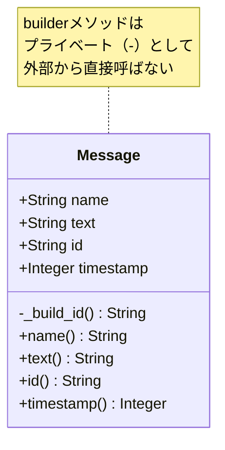
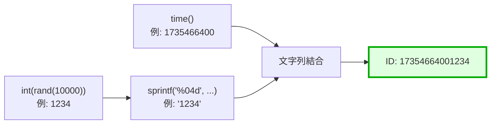
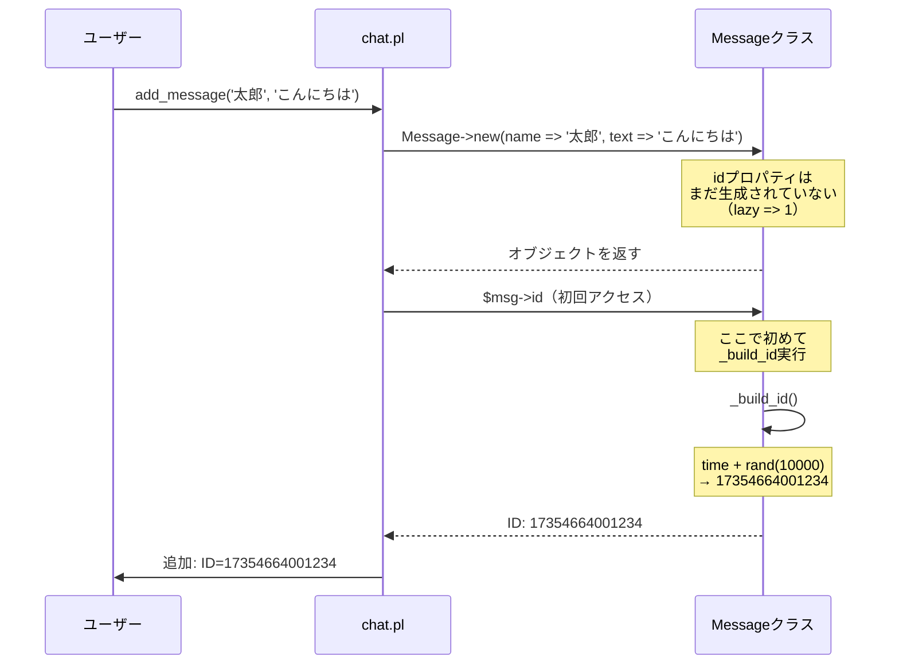
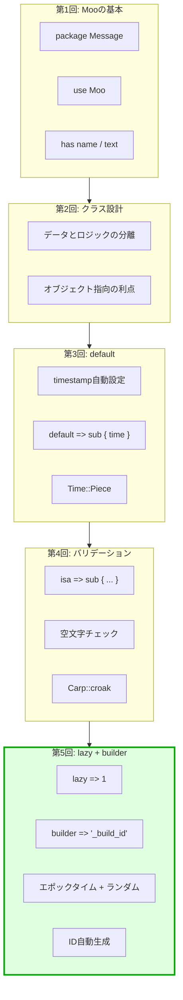

[@nqounet](https://twitter.com/nqounet)です。

Perlのオブジェクト指向、だんだん楽しくなってきましたか？[前回の第4回](/post/1735462800/)では、`isa`を使って入力値のバリデーションを実装しました。空文字や不正なデータをシャットアウトして、Messageクラスのセキュリティを大幅に向上させました！

でも、実際の掲示板やチャットアプリを考えてみてください。メッセージを管理するには**ユニークなID**が必要ですよね。「このメッセージを削除したい」「このメッセージを編集したい」といった操作をするには、メッセージを一意に識別できなければなりません。

今回は、Mooの`lazy`と`builder`という2つの強力な機能を使って、**必要な時だけIDを生成する**効率的な設計を学びます。エポックタイム+ランダム値で簡単にユニークIDを自動生成できますよ！

コピペで動くコード付き、わずか5分で実装完了です。さっそく始めましょう！✨

## 動作確認環境

本記事は**Perl初心者向けの入門記事**です。以下の環境で動作確認しています。

- **Perl**: 5.16以上（5.38.0で検証済み）- ほとんどのPerl環境で動作します
- **Moo**: 2.005005 - `cpanm Moo`でインストール可能
- **OS**: Linux, macOS, Windows（WSL）

追加のCPANモジュールは不要です。Perl標準機能だけで実装できます！

## なぜIDが必要なのか - データ管理の基本

前回までに作ったMessageクラスは、`name`、`text`、`timestamp`の3つのプロパティを持っています。でも、これだけでは実際のアプリケーションでメッセージを管理するのは困難です。

### IDがないと何が困るのか

想像してみてください。掲示板に以下のような投稿が並んでいます。

```text
[2024-12-29 15:00:00] 太郎: こんにちは
[2024-12-29 15:00:01] 花子: おはよう
[2024-12-29 15:00:02] 太郎: よろしくお願いします
```

さて、「太郎さんの2番目の投稿を削除したい」と思ったとき、どうやってそのメッセージを特定しますか？

**IDがない場合の問題点**
- 同じ名前の投稿者が複数の投稿をしていると区別できない
- タイムスタンプは同じ可能性がある（特に秒単位の場合）
- 配列のインデックスに頼ると、削除や追加で番号がずれる
- データベースに保存する際、主キーが設定できない

```perl
# IDがないと、こうするしかない（危険！）
my $target_index = 2;  # 配列の何番目？
splice @messages, $target_index, 1;  # でも、追加や削除で番号が変わる！
```

この方法は非常に危険です。配列の順序が変わったら、違うメッセージを削除してしまう可能性があります！



*図: IDなしとIDありの比較*

### ユニークIDの役割

ユニークIDは、データ管理において**最も基本的で重要な概念**の一つです。

**IDが果たす役割**
- **一意性の保証**: どのメッセージも唯一無二のIDを持つ
- **永続的な識別**: メッセージの位置や順序が変わっても、IDは変わらない
- **データベース連携**: 主キーとして使用できる
- **効率的な検索**: ハッシュテーブルやインデックスで高速検索が可能
- **URL生成**: `https://example.com/messages/123` のようなリンクを作れる
- **API設計**: RESTful APIの`/api/messages/:id`のようなエンドポイントを設計できる

IDは、データの**アイデンティティ（同一性）**を保証するための仕組みなのです。

## defaultとlazyの違い - 第3回の復習と新しい概念

第3回で学んだ`default`を覚えていますか？`timestamp`プロパティに、オブジェクト生成時に自動的に現在時刻を設定しましたね。

```perl
# 第3回で学んだdefault
has timestamp => (
    is      => 'ro',
    default => sub { time }
);
```

これは完璧に動作しますが、実は**すべてのケースに最適とは限りません**。今回学ぶ`lazy`は、`default`よりもさらに柔軟で効率的な遅延評価の仕組みです。

### defaultだけの場合の動作

まず、`default`だけを使った場合の動作を確認しましょう。

```perl
package Message;
use Moo;

has id => (
    is      => 'ro',
    default => sub { 
        print "ID生成中...\n";
        return time . sprintf('%04d', int(rand(10000)));
    }
);

has name => (is => 'ro');
has text => (is => 'ro');

1;
```

このコードを使うと、以下のようになります。

```perl
use Message;

print "オブジェクトを作成します\n";
my $msg = Message->new(name => '太郎', text => 'こんにちは');
print "オブジェクト作成完了\n";

print "IDを参照します\n";
print "ID: " . $msg->id . "\n";
```

実行結果です。

```text
オブジェクトを作成します
ID生成中...
オブジェクト作成完了
IDを参照します
ID: 173546640012345
```

**注目すべきポイント**: `default`だけの場合、**オブジェクト生成時**（`new`を呼んだ時）に即座にID生成処理が実行されます。たとえIDを使わない場合でも、生成されてしまうのです。

### lazy => 1を追加した場合の動作

次に、`lazy => 1`を追加してみます。

```perl
has id => (
    is      => 'ro',
    lazy    => 1,  # 追加！
    default => sub { 
        print "ID生成中...\n";
        return time . sprintf('%04d', int(rand(10000)));
    }
);
```

同じコードを実行すると、出力が変わります。

```text
オブジェクトを作成します
オブジェクト作成完了
IDを参照します
ID生成中...
ID: 173546640012345
```

**動作の違い**: `lazy => 1`がある場合、ID生成処理は**オブジェクト生成時ではなく、IDに初めてアクセスした時**に実行されます！



*図: defaultのみとlazy + defaultの動作タイミングの違い*

### lazyのメリット - なぜ遅延評価が重要なのか

「たかがID生成のタイミングの違いでしょ？」と思うかもしれません。でも、これは**パフォーマンス最適化**において非常に重要な概念です。

**lazyが有効なケース**

1. **重い計算処理の遅延**
   - IDの生成は軽い処理ですが、例えば画像のサムネイル生成、大きなファイルの読み込み、外部APIの呼び出しなど、重い処理を遅延させることで初期化時間を大幅に短縮できます

2. **条件によっては不要な処理の回避**
   - オブジェクトを作成しても、実際にはIDを使わないケースがあります（例：バリデーションエラーで即座に破棄される場合）
   - そういったケースでは、ID生成処理自体が無駄になります

3. **メモリ使用量の削減**
   - 大量のオブジェクトを作成する場合、使われないプロパティを生成しないことでメモリを節約できます

4. **依存関係の解決**
   - 他のプロパティの値に依存する計算を行う場合、それらのプロパティが確実に初期化された後に実行できます

**実例で理解する**

```perl
# 大量のメッセージを作成（一括インポートなど）
my @messages;
for my $i (1..10000) {
    push @messages, Message->new(
        name => "User$i",
        text => "Message $i"
    );
    # lazy => 1 がないと、ここで10000回のID生成処理が走る！
    # lazy => 1 があれば、実際にIDにアクセスするまで生成されない
}

# この後、実際にIDが必要なメッセージだけ参照する
print "最初の10件のIDだけ表示:\n";
for my $i (0..9) {
    print $messages[$i]->id . "\n";  # ここで初めてID生成（10回だけ）
}
# 残り9990件のIDは生成されない！効率的！
```

この例では、`lazy => 1`により、**必要な10件だけIDが生成され、残り9990件は無駄な処理を避けられます**。これが遅延評価の威力です！

## builderによるカスタム初期化ロジック - より柔軟な設計

`default => sub { ... }`も便利ですが、初期化ロジックが複雑になると可読性が落ちます。そこで登場するのが**builder**です。

### defaultとbuilderの使い分け

**defaultが適しているケース**
- シンプルな値（固定値や簡単な計算）
- 1〜2行で書ける処理

```perl
# defaultで十分な例
has status => (
    is      => 'ro',
    default => sub { 'active' }
);

has count => (
    is      => 'ro',
    default => sub { 0 }
);
```

**builderが適しているケース**
- 複雑なロジック（複数行にわたる処理）
- 他のプロパティを参照する処理
- サブクラスでオーバーライドしたい処理
- テストしやすくしたい処理

### builderの基本構文

`builder`オプションには、メソッド名（文字列）を指定します。慣習的に、プライベートメソッドであることを示すため、アンダースコアで始めます。

```perl
has id => (
    is      => 'ro',
    lazy    => 1,
    builder => '_build_id',  # メソッド名を指定
);

# IDを生成するメソッド
sub _build_id {
    my $self = shift;
    # ここに生成ロジックを書く
    return time . sprintf('%04d', int(rand(10000)));
}
```

**builderメソッドの特徴**
- `$self`が第1引数として渡される（他のプロパティにアクセス可能）
- メソッドとして独立しているため、テストしやすい
- サブクラスで簡単にオーバーライドできる
- コードの可読性が向上する

### builderとdefaultの比較

```perl
# ❌ defaultだけ（複雑になると読みにくい）
has id => (
    is      => 'ro',
    lazy    => 1,
    default => sub {
        my $self = shift;
        # 複数行の複雑なロジック
        my $epoch = time;
        my $random = int(rand(10000));
        my $formatted = sprintf('%04d', $random);
        return $epoch . $formatted;
    }
);

# ✅ builder（スッキリして読みやすい）
has id => (
    is      => 'ro',
    lazy    => 1,
    builder => '_build_id',
);

sub _build_id {
    my $self = shift;
    # メソッドとして独立しているので読みやすい
    my $epoch = time;
    my $random = int(rand(10000));
    my $formatted = sprintf('%04d', $random);
    return $epoch . $formatted;
}
```

**命名規則のベストプラクティス**

builderメソッドの命名には、以下の慣習があります。

```perl
has プロパティ名 => (
    builder => '_build_プロパティ名',
);

# 例
has id => (builder => '_build_id');
has name => (builder => '_build_name');
has timestamp => (builder => '_build_timestamp');
```

**なぜアンダースコアで始めるのか**
- Perlの慣習として、アンダースコアで始まるメソッドは「プライベート」を意味する
- クラスの外部から直接呼ばれることを想定していないことを示す
- Moose/Mooの公式ドキュメントでも推奨されている
- 一貫性があり、他のPerl開発者が理解しやすい



*図: Messageクラスの構造（UML風クラス図）*

## エポックタイム + ランダム値でID生成 - シンプルで実用的なパターン

それでは、実際にID生成ロジックを実装しましょう。今回は、**エポックタイム + ランダム値**というシンプルで実用的なパターンを使います。

### エポックタイムとは

エポックタイムは、**1970年1月1日00:00:00 UTC**からの経過秒数を表す整数です。Perlでは`time`関数で取得できます。

```perl
my $epoch = time;  # => 1735466400（例）
```

**エポックタイムの特徴**
- 単調増加する（時間が経つほど大きくなる）
- 時系列でソート可能
- タイムゾーンに依存しない（UTC基準）
- データベースに保存しやすい（整数型）

### ランダム値を追加する理由

エポックタイムだけでは、**同じ秒に生成されたIDが衝突する可能性**があります。

```perl
# 同じ秒に2つのオブジェクトを作成
my $msg1 = Message->new(name => '太郎', text => 'こんにちは');
my $msg2 = Message->new(name => '花子', text => 'おはよう');

# エポックタイムだけだと、IDが同じになってしまう！
# $msg1->id => 1735466400
# $msg2->id => 1735466400  # 衝突！
```

そこで、**4桁のランダム値**を追加することで、衝突の可能性を大幅に減らします。

```perl
sub _build_id {
    my $self = shift;
    # エポックタイム（秒） + 4桁のランダム値（0000〜9999）
    return time . sprintf('%04d', int(rand(10000)));
}
```

**衝突確率の計算**
- 同じ秒に2つのオブジェクトが生成される確率: 高い
- その2つが同じランダム値（0〜9999のうち）を引く確率: 1/10000
- 実用上、十分に低い衝突確率です



*図: ID生成のフロー*

### より堅牢なID生成（UUID版）

本格的なアプリケーションでは、**UUID（Universally Unique Identifier）**を使うのが一般的です。CPANモジュール`UUID::Tiny`を使えば簡単に実装できます。

```perl
# UUID::Tinyを使った実装（発展編）
use UUID::Tiny ':std';

sub _build_id {
    my $self = shift;
    # UUIDv4を生成（ランダムベース）
    return create_uuid_as_string(UUID_V4);
}

# 生成されるID例: "550e8400-e29b-41d4-a716-446655440000"
```

**UUIDのメリット**
- グローバルに一意（分散システムでも衝突しない）
- 標準化された形式（RFC 4122）
- 様々なプログラミング言語で同じ形式が使える

**UUIDのデメリット**
- 文字列が長い（36文字）
- 追加のCPANモジュールが必要
- エポックタイム版より若干複雑

今回は初心者向けに、追加モジュール不要の**エポックタイム + ランダム値**を採用します。将来的に必要になったらUUIDに移行することもできます。

## 実装しよう - Messageクラスにidプロパティを追加

それでは、これまで学んだことを総動員して、Messageクラスにidプロパティを追加しましょう！

### Message.pmの更新

`lib/Message.pm`を以下のように更新します。

```perl
package Message;
use Moo;
use utf8;
use Carp qw(croak);
use Time::Piece;

# ID プロパティ（新規追加！）
has id => (
    is      => 'ro',        # 読み取り専用（一度生成したら変更不可）
    lazy    => 1,           # 遅延評価（必要な時だけ生成）
    builder => '_build_id', # ID生成ロジックをメソッドに分離
);

# 名前プロパティ
has name => (
    is  => 'ro',
    isa => sub {
        my $val = $_[0];
        croak "Name is required" 
            unless defined $val && length($val) > 0;
        croak "Name cannot be only whitespace" 
            unless $val =~ /\S/;
        croak "Name must be 50 characters or less" 
            if length($val) > 50;
    },
);

# メッセージ本文プロパティ
has text => (
    is  => 'ro',
    isa => sub {
        my $val = $_[0];
        croak "Message text is required" 
            unless defined $val && length($val) > 0;
        croak "Message text cannot be only whitespace" 
            unless $val =~ /\S/;
        croak "Message text must be 1000 characters or less" 
            if length($val) > 1000;
    },
);

# タイムスタンププロパティ
has timestamp => (
    is      => 'ro',
    default => sub { time }
);

# IDを生成するメソッド（プライベート）
sub _build_id {
    my $self = shift;
    # エポックタイム（秒） + 4桁のランダム値
    return time . sprintf('%04d', int(rand(10000)));
}

# 日時を見やすくフォーマットするメソッド
sub formatted_time {
    my $self = shift;
    my $t = localtime($self->timestamp);
    return $t->strftime('%Y-%m-%d %H:%M:%S');
}

1;
```

**追加した内容のポイント**

1. **`is => 'ro'`（読み取り専用）**
   - IDは一度生成されたら変更されるべきではない
   - データの整合性を保つ（第4回で学んだ設計思想）

2. **`lazy => 1`（遅延評価）**
   - オブジェクト生成時ではなく、ID参照時に生成
   - 不要な場合はID生成処理が実行されない（効率的）

3. **`builder => '_build_id'`（ビルダーメソッド）**
   - ID生成ロジックを独立したメソッドに分離
   - テストやデバッグがしやすい
   - サブクラスでのオーバーライドが容易

4. **バリデーション不要**
   - `_build_id`で自動生成されるため、常に正しい形式が保証される
   - 第4回のような`isa`によるバリデーションは不要（システム生成なので信頼できる）

### 使ってみよう - chat.plの更新

`chat.pl`を更新して、IDを表示できるようにしましょう。

```perl
#!/usr/bin/env perl
# Perl 5.16以上
# 外部依存: Moo
use strict;
use warnings;
use utf8;
use FindBin;
use lib "$FindBin::Bin/lib";
use Message;

binmode STDOUT, ':utf8';

# メッセージオブジェクトの配列
my @messages;

# メッセージを追加する関数
sub add_message {
    my ($name, $text) = @_;
    my $msg = Message->new(
        name => $name,
        text => $text,
    );
    push @messages, $msg;
    return $msg;
}

# メッセージを表示する関数（ID付き）
sub show_messages {
    foreach my $msg (@messages) {
        printf "[ID: %s] [%s] %s: %s\n", 
            $msg->id,              # IDを表示
            $msg->formatted_time,
            $msg->name, 
            $msg->text;
    }
}

# メッセージをIDで検索する関数
sub find_message_by_id {
    my ($id) = @_;
    foreach my $msg (@messages) {
        return $msg if $msg->id eq $id;
    }
    return undef;
}

# サンプルデータを追加
print "=== メッセージを追加 ===\n";
my $msg1 = add_message('太郎', 'こんにちは');
print "追加: ID=" . $msg1->id . "\n";

sleep 1;  # 1秒待つ（タイムスタンプの違いを見やすくするため）

my $msg2 = add_message('花子', 'おはよう');
print "追加: ID=" . $msg2->id . "\n";

sleep 1;

my $msg3 = add_message('次郎', 'はじめまして');
print "追加: ID=" . $msg3->id . "\n";

# 全メッセージを表示
print "\n=== 全メッセージ一覧 ===\n";
show_messages();

# IDで検索
print "\n=== IDで検索 ===\n";
my $target_id = $msg2->id;
my $found = find_message_by_id($target_id);
if ($found) {
    printf "見つかりました: [%s] %s\n", $found->name, $found->text;
} else {
    print "見つかりませんでした\n";
}

# 存在しないIDで検索
print "\n=== 存在しないIDで検索 ===\n";
my $not_found = find_message_by_id('99999999999999');
if ($not_found) {
    printf "見つかりました: [%s] %s\n", $not_found->name, $not_found->text;
} else {
    print "見つかりませんでした\n";
}
```

### 実行結果

```text
=== メッセージを追加 ===
追加: ID=17354664001234
追加: ID=17354664015678
追加: ID=17354664029012

=== 全メッセージ一覧 ===
[ID: 17354664001234] [2024-12-29 15:00:00] 太郎: こんにちは
[ID: 17354664015678] [2024-12-29 15:00:01] 花子: おはよう
[ID: 17354664029012] [2024-12-29 15:00:02] 次郎: はじめまして

=== IDで検索 ===
見つかりました: [花子] おはよう

=== 存在しないIDで検索 ===
見つかりませんでした
```

完璧です！各メッセージにユニークなIDが自動生成され、IDで検索できるようになりました！🎉



*図: lazy + builderによるID生成のタイミング*

## よくある質問（FAQ） - 初心者のつまずきポイント解決

### Q1: lazyなしでbuilderを使ったらどうなる？

**A:** `lazy`がない場合、`builder`メソッドは**オブジェクト生成時に即座に実行**されます。

```perl
# lazy なし
has id => (
    is      => 'ro',
    builder => '_build_id',  # new時に即実行される
);

# lazy あり
has id => (
    is      => 'ro',
    lazy    => 1,
    builder => '_build_id',  # id参照時に初めて実行される
);
```

**どちらを使うべきか**

lazyなしでも問題ない場合もありますが、一般的には以下の基準で判断します。

- **常に必要な値** → lazyなしでOK（例: 設定ファイルから読み込む値）
- **場合によっては不要な値** → lazyありが推奨（例: ID、サムネイル画像）
- **重い処理** → lazyありが推奨（初期化時間を短縮）
- **他のプロパティに依存する値** → lazyありが推奨（初期化順序の問題を回避）

今回のIDは「表示時には必要だが、バリデーション段階では不要」という性質を持つため、`lazy => 1`を付けています。

### Q2: builderの中で他のプロパティを参照できる？

**A:** はい、できます！`$self`を使って他のプロパティにアクセスできます。

```perl
# 例: nameとtimestampを組み合わせたIDを生成
sub _build_id {
    my $self = shift;
    # 他のプロパティを参照可能
    my $name_hash = substr($self->name, 0, 3);  # 名前の最初の3文字
    my $timestamp = $self->timestamp;
    return "${timestamp}_${name_hash}";
}
```

**注意点**: 依存関係がある場合は`lazy => 1`を付けておくと安全です。そうしないと、他のプロパティがまだ初期化されていない可能性があります。

### Q3: IDが重複しないか心配です

**A:** エポックタイム + 4桁ランダムの組み合わせは、**一般的な用途では十分にユニーク**です。

**重複する可能性があるケース**
- 同じ秒に10000個以上のオブジェクトを生成する（現実的にはほぼない）
- 分散システムで複数のサーバーが同時にIDを生成する

**より堅牢にする方法**

```perl
# 方法1: ランダム値の桁数を増やす
sub _build_id {
    my $self = shift;
    return time . sprintf('%08d', int(rand(100000000)));  # 8桁に増やす
}

# 方法2: UUIDを使う
use UUID::Tiny ':std';
sub _build_id {
    my $self = shift;
    return create_uuid_as_string(UUID_V4);
}

# 方法3: データベースのAUTO_INCREMENTに任せる（推奨）
# - データベースに保存する際、DBが自動でIDを割り振る
# - アプリケーションレベルでは管理しない
```

**実用上の推奨**
- **小規模アプリ**: エポックタイム + ランダム値で十分
- **中規模アプリ**: UUID推奨
- **大規模アプリ**: データベースのAUTO_INCREMENTまたはSnowflake IDなどの分散ID生成システム

### Q4: _build_idを外部から呼び出せる？

**A:** **技術的には可能ですが、やるべきではありません**。

```perl
# ❌ 推奨しない
my $msg = Message->new(name => '太郎', text => 'こんにちは');
my $id = $msg->_build_id();  # できるが、やるべきでない
```

**理由**
- アンダースコアで始まるメソッドは「プライベート」の慣習
- Mooの内部で使われることを想定している
- 外部から呼ぶと、予期しない動作をする可能性がある
- `$msg->id`で十分（こちらが正しい使い方）

**正しい使い方**

```perl
# ✅ 正しい
my $msg = Message->new(name => '太郎', text => 'こんにちは');
my $id = $msg->id;  # これが正しい
```

Mooが適切なタイミングで`_build_id`を呼び出してくれるので、私たちは`id`プロパティにアクセスするだけでOKです。

## まとめ - lazyとbuilderで効率的なオブジェクト設計

今回は、Mooの`lazy`と`builder`を使って、**必要な時だけIDを生成する**効率的な設計を学びました。エポックタイム + ランダム値で簡単にユニークIDを自動生成できましたね！

### 今回の3つのポイント

**ポイント1: lazyによる遅延評価の活用**
- `lazy => 1`でプロパティの初期化を遅延させる
- 初めてアクセスした時に`default`や`builder`が実行される
- パフォーマンス最適化に有効（重い処理、不要な処理を回避）
- 第3回の`default`と組み合わせることで、さらに柔軟な設計が可能

**ポイント2: builderによるカスタムロジックの分離**
- `builder => '_build_プロパティ名'`で初期化メソッドを指定する
- メソッドとして独立しているため、可読性とテスタビリティが向上する
- サブクラスでオーバーライド可能で拡張性が高い
- 他のプロパティを参照できる（`$self->name`など）

**ポイント3: エポックタイム + ランダム値によるID生成**
- `time . sprintf('%04d', int(rand(10000)))`でシンプルに実装できる
- 時系列でソート可能（エポックタイムベース）
- 衝突確率が低い（同一秒内でも10000通り）
- 追加のCPANモジュール不要（Perl標準機能のみ）

これで、Messageクラスはさらに実用的になりました！ID管理により、メッセージの削除、編集、検索が安全かつ正確に行えます。



*図: シリーズの進化（第1回〜第5回）*

### 次回予告 - メソッドでオブジェクトに機能を持たせよう

今回までで、Messageクラスの**データ構造**はほぼ完成しました。でも、「データを持つだけ」では、まだオブジェクト指向の真髄には到達していません。

次回は、**メソッドを追加してオブジェクトに振る舞いを持たせる**方法を学びます。データとロジックを一体化することで、オブジェクトが「生きたデータ」に進化するのです！

**次回のテーマ**
- メソッドの定義方法（`sub メソッド名 { ... }`）
- `$self`の使い方（自分自身のプロパティにアクセス）
- 便利なメソッドの実装例（要約、検索、フォーマット）

さらにPerlのオブジェクト指向を深めていきましょう！

お楽しみに！🚀

## 参考リンク - さらに学びたい方へ

### Moo関連







### ID生成パターン





### シリーズ記事

- [第1回-Mooで覚えるオブジェクト指向プログラミング](/2021/10/31/191008/) - Mooの基本構文とクラスの作り方
- [第2回-Messageクラスでスパゲティコードから脱却](/post/1735477200/) - データとロジックの分離
- [第3回-デフォルト値で投稿日時を自動設定しよう](/post/1767021303/) - defaultとTime::Piece
- [第4回-入力値をチェックして安全にしよう](/post/1735462800/) - isaによるバリデーション
- 第5回-必要な時だけIDを生成しよう（本記事） - lazy + builder

### 関連記事

- [Moo/Moose - モダンなPerlオブジェクト指向プログラミング](/2025/12/11/000000/) - Perl Advent Calendar 2025
- [Perlタグの記事一覧](/tags/perl/)
- [Mooタグの記事一覧](/tags/moo/)

## 更新履歴

- 2024-12-29: 初版公開
