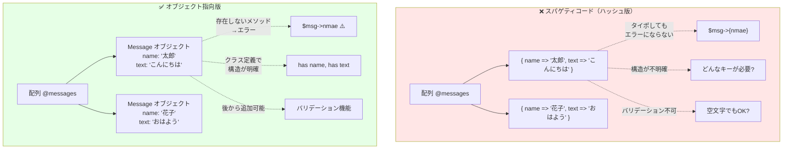
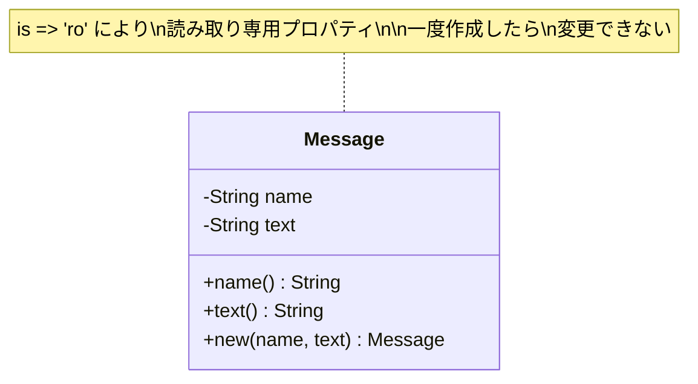
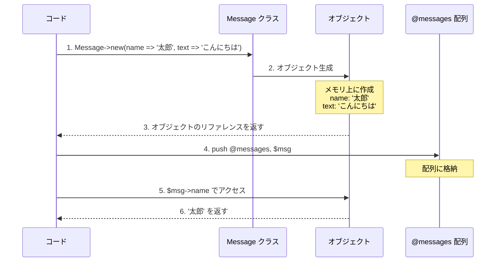
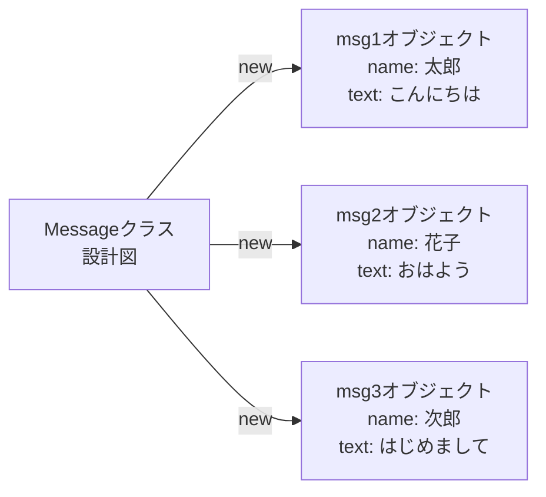

[@nqounet](https://twitter.com/nqounet)です。

前回の[第1回-Mooで覚えるオブジェクト指向プログラミング](/2021/10/31/191008/)では、Mooの基本的な使い方について学びました。blessは忘れて、Mooを使えば簡単にオブジェクト指向プログラミングができることを体験しました。

今回は実際にMessageクラスを作って、オブジェクト指向プログラミングの利点をさらに深く体験してみましょう。コピペで動くコードと一緒に、手を動かしながら進めていきます。

## はじめに - Perlでオブジェクト指向プログラミングを学ぶ理由

前回はMooの基本的な構文を学びました。`package`、`use Moo`、`has`といったキーワードを使って、シンプルなクラスを作る方法を見てきました。

今回は、簡単なチャット機能を作りながら、「なぜオブジェクト指向プログラミングが必要なのか」を実感していきます。

### 今回学ぶこと - 3つの実践スキル

- **スパゲティコードの5つの問題点**: なぜ配列・ハッシュだけでは限界があるのか
- **Messageクラスの作り方**: Mooを使ったPerlクラス定義の基本
- **オブジェクトを使った投稿管理**: データとロジックを分離する実践テクニック

10分ほどで実際に動くコードを書けるようになります。手を動かしながら進めていきましょう！

## スパゲティコードの課題 - なぜリファクタリングが必要なのか

掲示板やチャットアプリを作る際、Perl初心者がよく書くのは以下のようなコードです。

### 配列でメッセージを管理する問題

まずは、配列とハッシュでメッセージを管理するコードを見てみましょう。

```perl
#!/usr/bin/env perl
# Perl 5.16以上
use strict;
use warnings;
use utf8;

binmode STDOUT, ':utf8';

# メッセージデータ（配列の中にハッシュリファレンス）
my @messages = (
    { name => '太郎', text => 'こんにちは' },
    { name => '花子', text => 'おはよう' },
);

# メッセージを追加
push @messages, { name => '次郎', text => 'はじめまして' };

# メッセージを表示
foreach my $msg (@messages) {
    # ハッシュのキーで直接アクセス
    print $msg->{name} . ': ' . $msg->{text} . "\n";
}
```

このコードを `chat_before.pl` として保存して実行すると、以下のように表示されます。

```text
太郎: こんにちは
花子: おはよう
次郎: はじめまして
```

一見問題なさそうに見えますが、実はいくつかの課題があります。

### データとロジックの混在 - 5つの致命的な問題

上記のコードには、Perlプログラミングでよくある以下の問題があります。

- **ハッシュのキー名をタイポしてもエラーにならない**: `$msg->{nmae}`と書いても実行時エラーにならず、予期しない動作になる。オブジェクト指向なら存在しないメソッドを呼ぶと即エラーになる
- **データ構造が不明確**: どんなキーが必要なのか、コードを全て読まないと分からない。クラス定義を見れば一目瞭然にできる
- **バリデーションができない**: 空文字や不正な値が入ってもチェックできない。クラスにバリデーション機能を後から追加可能
- **変更に弱い**: データ構造を変更すると、全ての箇所を修正する必要がある。カプセル化により影響範囲を限定できる
- **テストが困難**: データとロジックが分離されていないため、単体テストが書きにくい。オブジェクトなら独立してテスト可能

これらの問題は、プログラムが大きくなるほど深刻になります。保守性、拡張性、テスタビリティの全てに影響します。



*図: スパゲティコードとオブジェクト指向の構造比較*

では、これをオブジェクト指向で書き直してみましょう。

## Messageクラスを作る - Mooで始めるPerlオブジェクト指向

メッセージを表すクラスを作ってみます。これがPerlでオブジェクト指向プログラミングを実践する第一歩です。

### package宣言とuse Moo - Perlクラスの基本構造

まず、Perlでクラスを定義する基本的な方法を見ていきましょう。

```perl
package Message;
use Moo;
use utf8;

# ここにプロパティやメソッドを定義

1;  # モジュールは1を返す必要がある
```

- `package Message;` でMessageクラスを定義する
- `use Moo;` でMooの機能を有効化（自動的に`strict`と`warnings`も有効になる）
- `use utf8;` でソースコード内の日本語を扱えるようにする
- 最後の `1;` はモジュールとして読み込まれた時に「成功」を返すために必要

### プロパティの定義（has） - オブジェクトの属性を決める

Mooでは `has` キーワードを使ってプロパティ（属性）を定義します。プロパティとは、オブジェクトが持つ「データ」のことです。Perlのハッシュと違い、型安全で明確な構造を持たせることができます。

```perl
package Message;
use Moo;
use utf8;

# 名前プロパティ（読み取り専用）
has name => (
    is => 'ro',
);

# メッセージ本文プロパティ（読み取り専用）
has text => (
    is => 'ro',
);

1;
```

ポイントは以下の通りです。

- `has プロパティ名 => (オプション);` の形式で定義する
- `is => 'ro'` は「Read-Only（読み取り専用）」を意味する
- 投稿後に名前やメッセージが変更されないよう、読み取り専用にしている

これで「名前」と「本文」を持つメッセージクラスができました。まるで設計図を描いたようなものです。



*図: Messageクラスの構造（UML風クラス図）*

### is => 'ro' と is => 'rw' の違い

プロパティには2つのアクセスモードがあります。

| モード | 意味 | 説明 | 例え |
|--------|------|------|------|
| `'ro'` | Read-Only | 読み取り専用。コンストラクタ（`new`）でしか値を設定できない | 一度書いたら消せない石碑 |
| `'rw'` | Read-Write | 読み書き可能。後から値を変更できる | 読んだり書いたりできるノート |

今回のメッセージは、一度投稿したら変更されないため `'ro'` を使います。掲示板の投稿を後から書き換えられたら困りますよね。

## オブジェクトを使って投稿を表示する - 実践コード例

それでは、作成したMessageクラスを実際のPerlプログラムで使ってみましょう。

### ファイル構成

以下のようなディレクトリ構成で作成します。

```text
my_chat/
  ├ lib/
  │  └ Message.pm
  └ chat.pl
```

### Message.pm（lib/Message.pm）

まず、`lib`ディレクトリを作成して、その中に`Message.pm`ファイルを作成します。

```perl
package Message;
use Moo;
use utf8;

# 名前プロパティ
has name => (
    is => 'ro',
);

# メッセージ本文プロパティ
has text => (
    is => 'ro',
);

1;
```

### chat.pl

次に、メインスクリプト`chat.pl`を作成します。

```perl
#!/usr/bin/env perl
# Perl 5.16以上
# 外部依存: Moo
use strict;
use warnings;
use utf8;
use FindBin;
use lib "$FindBin::Bin/lib";
use Message;

binmode STDOUT, ':utf8';

# メッセージオブジェクトの配列
my @messages;

# メッセージを追加する関数
sub add_message {
    my ($name, $text) = @_;
    push @messages, Message->new(
        name => $name,
        text => $text,
    );
}

# メッセージを表示する関数
sub show_messages {
    foreach my $msg (@messages) {
        printf "%s: %s\n", $msg->name, $msg->text;
    }
}

# サンプルデータを追加
add_message('太郎', 'こんにちは');
add_message('花子', 'おはよう');
add_message('次郎', 'はじめまして');

# 表示
show_messages();
```

### オブジェクトの生成（->new） - インスタンス化の基本

Mooを使うと、`new`メソッド（コンストラクタ）が自動的に生成されます。Perlで明示的に定義する必要はありません。これがMooの大きな利点の一つです。

```perl
my $msg = Message->new(
    name => '太郎',
    text => 'こんにちは'
);
```

- `Message->new(...)` でMessageクラスのオブジェクトを生成する（これを「インスタンス化」と呼ぶ）
- プロパティ名と値をペアで指定する
- 生成されたオブジェクトは `$msg` 変数に格納される

たとえるなら、`Message`は「たい焼きの型」（設計図）で、`$msg`は「実際に焼いたたい焼き」（実物）です。同じ型から何個でもたい焼きを作れるように、同じクラスから何個でもオブジェクトを作れます。



*図: オブジェクト生成から利用までの流れ*

### プロパティへのアクセス

オブジェクトのプロパティには、メソッド形式でアクセスします。

```perl
print $msg->name;  # => 太郎
print $msg->text;  # => こんにちは
```

`->` は「〜の」という意味だと考えると分かりやすいです。「メッセージオブジェクトの名前」「メッセージオブジェクトの本文」と読めます。

### クラスとオブジェクトの関係（図解）

クラスとオブジェクトの関係を図で見てみましょう。



1つのクラス（設計図）から、複数のオブジェクト（実物）を作ることができます。それぞれのオブジェクトは独立していて、異なる値を持つことができます。

## 動かしてみよう - コピペで即実行

それでは実際にコードを動かしてみましょう。以下のコードをコピペするだけで、Perlでオブジェクト指向プログラミングを体験できます。

### ファイルの準備

以下のステップでファイルを作成します。

1. `my_chat` ディレクトリを作成
2. その中に `lib` ディレクトリを作成
3. `lib/Message.pm` を作成（上記のコードをコピー）
4. `my_chat` ディレクトリ直下に `chat.pl` を作成（上記のコードをコピー）

### 実行方法

ターミナルで以下のコマンドを実行します。

```bash
# Mooのインストール（初回のみ）
cpanm Moo

# ディレクトリに移動
cd my_chat

# 実行
perl chat.pl
```

以下のように表示されれば成功です！

```text
太郎: こんにちは
花子: おはよう
次郎: はじめまして
```

### 試してみよう - 3つの実践チャレンジ

理解を深めるために、以下の3つのチャレンジを試してみましょう。手を動かすことが、Perlのオブジェクト指向プログラミングをマスターする最短ルートです。

**チャレンジ1: 別の名前とメッセージで投稿を追加してみる**
- `add_message`関数を使って、自分の投稿を追加してみましょう
- 例: `add_message('自分の名前', '好きなメッセージ');`
   
**チャレンジ2: 存在しないプロパティにアクセスしてみる**
- `print $msg->age;` のように、定義していないプロパティにアクセスするとエラーになることを確認してみましょう
- これがオブジェクト指向の「安全性」です
   
**チャレンジ3: 読み取り専用プロパティに書き込んでみる**
- `$msg->name('新しい名前');` のように値を変更しようとするとエラーになることを確認してみましょう
- `is => 'ro'` なので変更できません。これも安全性の一部です

## よくある質問（FAQ） - Perl初心者のつまずきポイント解決

Perlでオブジェクト指向プログラミングを始める初心者がつまずきやすいポイントをまとめました。

### Q1: `->` って何ですか？

`->` は「メソッド呼び出し演算子」と呼ばれます。オブジェクトに対してメソッドを呼び出す時に使います。

```perl
$msg->name  # メッセージオブジェクトのnameメソッドを呼び出す
```

「〜の」と読み替えると理解しやすいです。「メッセージの名前」「メッセージの本文」といった具合です。

ハッシュの `$msg->{name}` と似ていますが、オブジェクトでは `$msg->name` のように波括弧が不要です。

### Q2: `is => 'ro'` と `is => 'rw'` の違いは？

- `'ro'`（Read-Only）は読み取り専用で、オブジェクト生成時にしか値を設定できない
- `'rw'`（Read-Write）は読み書き可能で、後から値を変更できる

投稿後に変更されないデータは `'ro'` にすると安全です。

```perl
# ro（読み取り専用）の場合
my $msg = Message->new(name => '太郎', text => 'こんにちは');
print $msg->name;        # OK: 太郎
$msg->name('花子');      # エラー！roなので変更できない

# rw（読み書き可能）の場合
has status => (is => 'rw');  # 仮にstatusプロパティを定義したら
$msg->status('active');      # OK: 変更できる
```

### Q3: エラー「Can't locate Message.pm」が出ます

`Message.pm` が見つからないというエラーです。以下を確認してください。

- `lib` ディレクトリが正しく作成されているか
- `lib/Message.pm` ファイルが存在するか
- `chat.pl` に `use lib "$FindBin::Bin/lib";` の行があるか

### Q4: 日本語が文字化けします

以下を確認してください。

- ファイルがUTF-8で保存されているか
- `use utf8;` が記述されているか
- `binmode STDOUT, ':utf8';` が記述されているか

## Before/After比較 - リファクタリング効果を実感

スパゲティコードとオブジェクト指向版のPerlコードを比較してみましょう。保守性・拡張性・テスタビリティの違いが一目瞭然です。

### Before（ハッシュ版）

```perl
my @messages = (
    { name => '太郎', text => 'こんにちは' },
);

foreach my $msg (@messages) {
    print $msg->{name} . ': ' . $msg->{text} . "\n";
}
```

問題点：
- キー名のタイポに気づけない
- データ構造が不明確
- バリデーションができない

### After（オブジェクト版）

```perl
my @messages = (
    Message->new(name => '太郎', text => 'こんにちは'),
);

foreach my $msg (@messages) {
    print $msg->name . ': ' . $msg->text . "\n";
}
```

改善点：
- 存在しないメソッドを呼ぶとエラーになる（安全）
- クラス定義を見れば必要なプロパティが分かる（明確）
- IDEやエディタの補完が効く（開発効率向上）
- 後から機能を追加しやすい（拡張性）

## まとめ - Perlオブジェクト指向プログラミングの第一歩

今回学んだことを振り返りましょう。Mooを使ったPerlのオブジェクト指向プログラミングで、コードの品質が劇的に向上します。

### 今回の3つのポイント

**ポイント1: スパゲティコードの問題点**
- ハッシュと配列だけではデータ構造が不明確である
- タイポに気づけず、バグの原因になる
- 変更に弱く、保守が困難になる

**ポイント2: Messageクラスの作り方**
- `package Message;` でクラスを定義する
- `use Moo;` でMooの機能を有効化する
- `has name => (is => 'ro');` でプロパティを定義する
- 最後に `1;` を忘れずに書く

**ポイント3: オブジェクトでのデータ管理**
- `Message->new(...)` でオブジェクトを生成する
- `$msg->name` でプロパティにアクセスする
- 配列の中にオブジェクトを入れて管理できる

オブジェクト指向プログラミングの第一歩を踏み出せましたね！

### 次回予告 - デフォルト値とバリデーション

今回作ったMessageクラスには、投稿日時がありません。実際の掲示板では「いつ投稿されたか」が重要ですよね。

**次回（第3回）のテーマ**:
- `default`を使った投稿日時の自動設定
- サブルーチンリファレンスを使った動的な値の生成
- バリデーション機能の追加でデータの整合性を保つ方法

デフォルト値を設定すれば、`new` する時にいちいち時刻を指定しなくても、自動的に現在時刻が設定されます。Perlのオブジェクト指向がさらに便利になります！

お楽しみに！

## 参考リンク - さらに学びたい方へ

Mooを使ったPerlのオブジェクト指向プログラミングについて、さらに詳しく知りたい方は以下の公式ドキュメントをご覧ください。

### 公式ドキュメント



### チュートリアル



### 関連記事

- [第1回-Mooで覚えるオブジェクト指向プログラミング](/2021/10/31/191008/) - Mooの基本構文とクラスの作り方
- Perlタグの記事一覧 - 他のPerl関連チュートリアルをチェック
