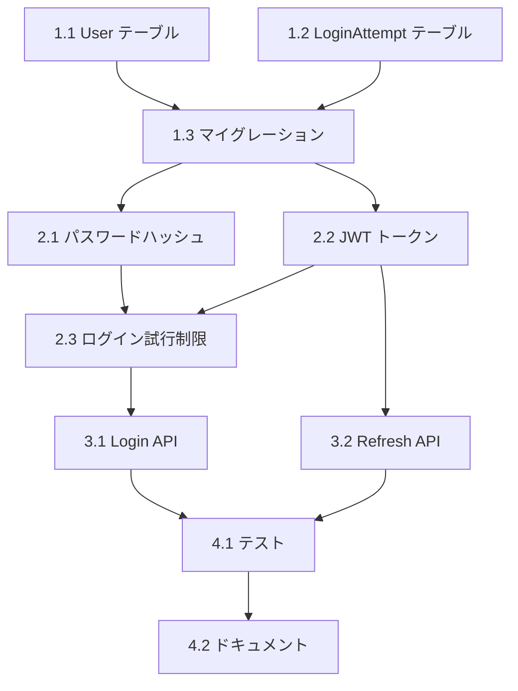

[@nqounet](https://x.com/nqounet)です。

GitHub エージェントパネル実践ガイド第4回です。今回は、タスクプランニングエージェントを活用して、複雑な開発タスクを効率的に分解・管理する方法を学びます。

## この記事で学べること

- タスク分解の理論と実践
- タスクプランニングエージェントの効果的な使い方
- 依存関係の管理
- 優先順位付けのテクニック
- 大規模機能開発の計画立案

## タスクプランニングエージェントとは

タスクプランニングエージェント（task-planner）は、大きな開発タスクを実行可能な小タスクに分解し、実行順序を計画するエージェントです。

### 従来の計画立案との違い

**従来の方法（手動）：**
```
1. 開発者が要件を読む
2. 頭の中でタスクを考える
3. チケットに分割
4. 見積もり
5. 優先順位付け

所要時間: 30分〜2時間
```

**タスクプランニングエージェント：**
```
1. 要件をエージェントに入力
2. 自動的にタスク分解
3. 依存関係を分析
4. 実行順序を提案

所要時間: 1〜3分
```

### タスク分解の5つの原則

1. **単一責任**: 各タスクは1つの明確な目的を持つ
2. **独立性**: 可能な限り他のタスクから独立
3. **検証可能性**: 完了条件が明確
4. **適切な粒度**: 数時間〜1日で完了できるサイズ
5. **優先順位**: ビジネス価値と技術的依存関係を考慮

## 基本的な使い方

### シンプルな例：ログイン機能の実装

**入力タスク：**
```
ユーザーログイン機能を実装してください。

要件:
- メールアドレスとパスワードでログイン
- JWT トークンを発行
- トークンの有効期限は24時間
- ログイン失敗は5回まで（その後アカウントロック）
```

**タスクプランニングエージェントの出力：**

```markdown
## タスク分解結果

### フェーズ1: データモデル設計（所要時間: 2時間）

#### タスク1.1: User テーブル設計
- フィールド: id, email, password_hash, login_attempts, locked_until, created_at
- インデックス: email (ユニーク)
- 所要時間: 30分

#### タスク1.2: LoginAttempt テーブル設計
- フィールド: id, user_id, attempted_at, ip_address, success
- インデックス: user_id, attempted_at
- 所要時間: 30分

#### タスク1.3: マイグレーションファイル作成
- 上記テーブルを作成するマイグレーション
- 所要時間: 1時間

### フェーズ2: 認証ロジック実装（所要時間: 4時間）

#### タスク2.1: パスワードハッシュ化
- bcrypt を使用
- ソルトラウンド: 10
- 所要時間: 1時間

#### タスク2.2: JWT トークン発行
- ペイロード: user_id, email, exp
- 署名アルゴリズム: HS256
- 所要時間: 1時間

#### タスク2.3: ログイン試行制限
- 5回失敗でアカウントロック
- ロック時間: 30分
- 所要時間: 2時間

### フェーズ3: API エンドポイント（所要時間: 3時間）

#### タスク3.1: POST /api/auth/login 実装
- リクエスト検証（email, password必須）
- ログイン処理
- レスポンス: トークン、ユーザー情報
- 所要時間: 2時間

#### タスク3.2: POST /api/auth/refresh 実装
- トークンリフレッシュ
- 所要時間: 1時間

### フェーズ4: テストとドキュメント（所要時間: 3時間）

#### タスク4.1: ユニットテスト
- 各関数のテストケース
- カバレッジ80%以上
- 所要時間: 2時間

#### タスク4.2: API ドキュメント
- エンドポイント仕様
- リクエスト/レスポンス例
- エラーケース
- 所要時間: 1時間

## 合計所要時間: 12時間（1.5日）

## タスク依存関係



## 推奨実装順序

1. タスク1.1, 1.2 (並行可能)
2. タスク1.3
3. タスク2.1, 2.2 (並行可能)
4. タスク2.3
5. タスク3.1, 3.2 (並行可能)
6. タスク4.1
7. タスク4.2
```

## 効果的なプロンプトの書き方

### 1. コンテキストを明確にする

**悪い例：**
```
EC サイトを作る
```

**良い例：**
```
小規模 EC サイトのバックエンド API を構築

技術スタック:
- Node.js + Express
- PostgreSQL
- Stripe (決済)
- SendGrid (メール)

主要機能:
- 商品管理（CRUD）
- カート機能
- 注文処理
- 決済連携
- 注文確認メール

制約:
- MVP として最小限の機能
- 開発期間: 2週間
- 開発者: 2名
```

### 2. 既存の資産を指定する

```
既存システム:
- ユーザー認証は実装済み（JWT使用）
- データベーススキーマは作成済み
- デプロイ環境は整備済み（AWS ECS）

再利用可能なコンポーネント:
- エラーハンドリングミドルウェア
- ロギングユーティリティ
- バリデーションヘルパー
```

### 3. 制約条件を明示する

```
制約:
- 予算: 追加の外部サービス利用は不可
- 期限: 2週間以内
- 品質: カバレッジ70%以上
- パフォーマンス: API レスポンス200ms以内
```

## 高度な活用例

### 例1: 大規模リファクタリング

**タスク：**
```
レガシーコードベースをモダンな構成にリファクタリング

現状:
- jQuery ベースの SPA（5000行）
- グローバル変数多用
- テストなし
- ES5 構文

目標:
- React + TypeScript 化
- モジュール化
- ユニットテスト追加
- 既存機能は維持
```

**プランニングエージェントの戦略：**

```markdown
## リファクタリング戦略

### アプローチ: Strangler Fig Pattern（段階的置き換え）

### フェーズ1: 準備（1週間）
- 既存コードの機能一覧作成
- E2Eテストで現在の動作を記録
- React プロジェクトのセットアップ

### フェーズ2: 段階的移行（4週間）
- 週ごとに1つの機能を移行
- 新旧両方が動作する状態を維持
- 各移行後にE2Eテスト実行

Week 1: ユーザー管理画面
Week 2: 商品一覧・詳細
Week 3: カート機能
Week 4: 注文処理

### フェーズ3: クリーンアップ（1週間）
- レガシーコード削除
- 最終テスト
- パフォーマンス最適化

## リスク管理
- 毎週金曜日にレビュー
- 問題があれば該当週の作業をロールバック
- 本番デプロイは週1回（月曜日）
```

### 例2: マイクロサービス分割

**タスク：**
```
モノリシックアプリケーションをマイクロサービス化

現在の構成:
- 単一の Node.js アプリ（20,000行）
- PostgreSQL 1台
- すべての機能が密結合

目標:
- 独立したサービスに分割
- 各サービスは独自のDB
- API Gateway で統合
```

**プランニングエージェントの出力：**

```markdown
## マイクロサービス分割計画

### ステップ1: ドメイン分析（1週間）
1. 既存機能のドメイン分類
   - User Service (認証・ユーザー管理)
   - Product Service (商品管理)
   - Order Service (注文処理)
   - Payment Service (決済)

2. サービス境界の定義
   - 各サービスの責務を明確化
   - データの所有権を決定

### ステップ2: 共通基盤構築（1週間）
1. API Gateway セットアップ
2. サービス間通信（REST/gRPC）
3. 共通認証基盤
4. ログ集約システム

### ステップ3: サービス分割（各2週間）

#### User Service
Week 1-2:
- ユーザーDBの分離
- 認証APIの切り出し
- トークン検証の共通化

#### Product Service  
Week 3-4:
- 商品DBの分離
- 商品API実装
- 画像ストレージ連携

#### Order Service
Week 5-6:
- 注文DBの分離
- 注文フロー実装
- 在庫確認連携

#### Payment Service
Week 7-8:
- 決済処理の分離
- Stripe API 統合
- トランザクション管理

### ステップ4: 統合テスト（2週間）
- E2Eテストシナリオ作成
- 負荷テスト
- 障害時の動作確認

## 合計期間: 12週間
```

## タスク優先順位の決定

### MoSCoW メソッド

タスクプランニングエージェントは、MoSCoW メソッドを使ってタスクを分類します：

```
Must have (必須):
  - ログイン機能
  - 商品表示
  - カート追加
  - 決済処理

Should have (重要):
  - ユーザープロフィール編集
  - 注文履歴表示
  - お気に入り機能

Could have (あれば良い):
  - レコメンド機能
  - レビュー投稿
  - SNSシェア

Won't have (今回は不要):
  - チャット機能
  - ポイントシステム
  - 定期購入
```

### 価値 vs 複雑度マトリクス

```
高価値・低複雑度 → 最優先
  ├─ 商品検索機能
  └─ カートに追加

高価値・高複雑度 → 2番目
  ├─ 決済連携
  └─ 注文処理フロー

低価値・低複雑度 → 3番目
  ├─ お気に入り登録
  └─ レビュー表示

低価値・高複雑度 → 後回し
  └─ レコメンドエンジン
```

## 実践演習：ブログシステムの機能追加

実際にタスクプランニングエージェントを使ってみましょう。

### 課題

```
Hugo ブログにコメント機能を追加

要件:
- 記事ごとにコメント可能
- ゲストユーザーでもコメント可
  （名前とメールアドレス入力）
- スパム対策（reCAPTCHA）
- コメント承認フロー（管理者が承認後に表示）
- メール通知（新規コメント時）

技術スタック:
- フロントエンド: Hugo (静的サイト)
- バックエンド: Node.js + Express
- データベース: PostgreSQL
- 外部サービス: SendGrid, Google reCAPTCHA
```

### タスクプランニングエージェントへの入力

エージェントパネルで以下を入力：

```
以下の要件でブログコメント機能の実装計画を立ててください。

[上記の要件をコピー]

制約:
- 開発期間: 1週間
- 開発者: 1名（フルスタック）
- 既存の Hugo サイトは変更最小限に

期待する出力:
- タスクリスト（詳細な手順）
- 所要時間見積もり
- 依存関係の明示
- リスクと対策
```

### 期待される出力（抜粋）

```markdown
## コメント機能実装計画

### 全体像
- 総所要時間: 32時間（4日間）
- タスク数: 15個
- フェーズ数: 4

### フェーズ1: バックエンド基盤（8時間）

**タスク1.1: データベース設計**
```sql
CREATE TABLE comments (
  id SERIAL PRIMARY KEY,
  post_slug VARCHAR(255) NOT NULL,
  author_name VARCHAR(100) NOT NULL,
  author_email VARCHAR(255) NOT NULL,
  content TEXT NOT NULL,
  status VARCHAR(20) DEFAULT 'pending',
  created_at TIMESTAMP DEFAULT NOW(),
  approved_at TIMESTAMP,
  ip_address INET
);

CREATE INDEX idx_comments_post_slug ON comments(post_slug);
CREATE INDEX idx_comments_status ON comments(status);
```
所要時間: 2時間

**タスク1.2: API エンドポイント実装**
- POST /api/comments - コメント投稿
- GET /api/comments/:slug - コメント取得（承認済みのみ）
- PATCH /api/comments/:id/approve - コメント承認（管理者のみ）

所要時間: 4時間

**タスク1.3: reCAPTCHA 検証**
- Google reCAPTCHA v3 統合
- スコア判定（0.5以上で許可）

所要時間: 2時間

(以下省略...)
```

## タスク計画の検証

プランニングエージェントが作成した計画を検証するチェックリスト：

```
✓ 完了条件の確認
  - 各タスクの完了条件は明確か？
  - 成果物は定義されているか？

✓ 依存関係の確認
  - タスクの順序は適切か？
  - 並行実行可能なタスクは識別されているか？

✓ 見積もりの妥当性
  - 所要時間は現実的か？
  - バッファは含まれているか？

✓ リスクの考慮
  - 潜在的な問題は識別されているか？
  - 対策は用意されているか？

✓ リソースの確認
  - 必要なツール/ライブラリは利用可能か？
  - 外部サービスのアカウントは取得済みか？
```

## チームでの活用

### 計画のレビュープロセス

```
1. タスクプランニングエージェントが計画を生成

2. チームレビュー
   - 技術リード: アーキテクチャの妥当性
   - PM: ビジネス要件との整合性
   - 開発者: 実装可能性と見積もり

3. フィードバックを反映
   - エージェントに修正を依頼
   - 計画を更新

4. 承認・実行
```

### 計画の共有

生成された計画は、プロジェクト管理ツールに連携できます：

```
# GitHub Issues に変換
各タスクを Issue として作成
ラベル: フェーズごと、優先度
マイルストーン: 完了予定日

# Jira に変換
Epic: 機能全体
Story: フェーズ
Task: 個別タスク
```

## まとめ

タスクプランニングエージェントを活用することで：

- **計画立案時間を90%削減**（2時間 → 10分）
- **タスク分解の品質向上**（見落としの減少）
- **見積もり精度の向上**（過去データの活用）
- **チーム間のコミュニケーション改善**（共通理解）

## 次回予告

第5回「コード生成エージェントの実践」では、実際にコードを生成するエージェントの効果的な使い方と、高品質なコードを生成するためのテクニックを学びます。

具体的には：
- コード生成エージェントの設定
- プロンプトエンジニアリング
- コード品質の担保
- 既存コードとの統合

## チェックリスト

- [ ] タスクプランニングエージェントで計画を作成できた
- [ ] 適切な粒度でタスクを分解できた
- [ ] 依存関係を理解し、順序を決定できた
- [ ] 見積もりの妥当性を検証できた
- [ ] チームで計画をレビューする流れを理解した

## 演習課題

以下のタスクの実装計画を立ててみましょう：

1. **簡単**: TODO アプリの作成
2. **中程度**: ブログの検索機能追加
3. **複雑**: 既存システムの AWS 移行

---

**シリーズ目次**
1. [エージェントパネル入門](../1764676800/)
2. [エージェントパネルの基本操作](../1764849600/)
3. [最初のエージェント設定](../1765022400/)
4. **タスクプランニングエージェントの活用**（本記事）
5. コード生成エージェントの実践
6. レビューエージェントの構築
7. ドキュメント生成エージェントの設定
8. マルチエージェント連携
9. カスタムツール統合
10. セキュリティとベストプラクティス
11. トラブルシューティング
12. 実践プロジェクト

質問や感想は [@nqounet](https://x.com/nqounet) までお気軽にどうぞ！
