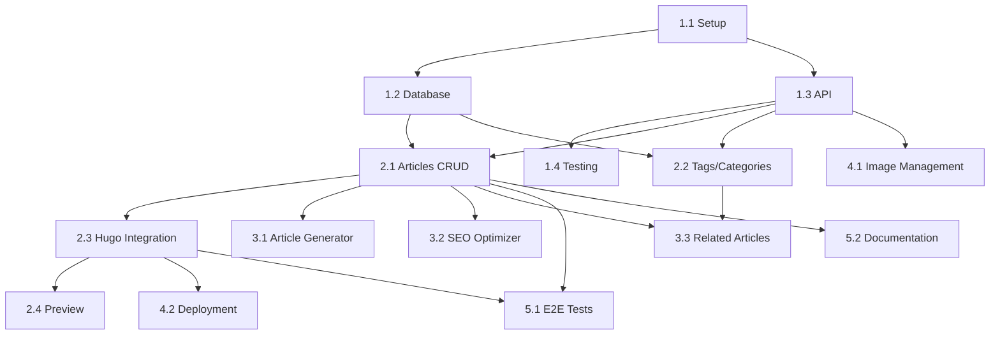

[@nqounet](https://x.com/nqounet)です。

GitHub エージェントパネル実践ガイド最終回です。今回は、これまで学んだすべてのテクニックを活用して、実際のプロジェクトをエンドツーエンドで構築します。

## この記事で学べること

- 実践的なプロジェクト開発の全工程
- エージェントパネルのみでの完全自動化
- マルチエージェント連携の実践
- プロジェクト完成までの道のり
- 得られた知見と次のステップ

## プロジェクト概要

### 構築するシステム

**プロジェクト名**: TechBlog CMS

**概要**: Hugo ベースの技術ブログ管理システム

**主な機能**:
- ブログ記事の管理（CRUD）
- 記事の自動生成（AI支援）
- SEO最適化
- 画像管理
- タグ・カテゴリ管理
- 記事プレビュー
- GitHub Pages への自動デプロイ

**技術スタック**:
- フロントエンド: Hugo (静的サイトジェネレータ)
- バックエンド: Node.js + Express
- データベース: PostgreSQL
- デプロイ: GitHub Actions + GitHub Pages
- その他: Slack通知、S3画像ストレージ

## フェーズ1: プロジェクト計画（1時間）

### ステップ1: 要件定義

**プロンプト**:
```
TechBlog CMS の実装計画を立ててください。

プロジェクト概要:
Hugo ベースの技術ブログ管理システムを構築します。
記事の作成から公開まで完全自動化し、エージェントパネルで
すべての操作を完結させることが目標です。

主要機能:
1. 記事管理
   - 記事の作成・編集・削除
   - 下書き・公開状態の管理
   - タグ・カテゴリの設定

2. AI支援機能
   - 記事本文の自動生成
   - タイトル最適化
   - SEOメタデータ生成
   - 関連記事の提案

3. 画像管理
   - 画像のアップロード
   - S3への自動保存
   - 最適化（リサイズ、圧縮）

4. デプロイ
   - GitHub Pages への自動公開
   - プレビュー環境
   - ロールバック機能

技術制約:
- 開発期間: 2週間
- 開発者: 1名（エージェント支援あり）
- 予算: 既存のサービスのみ使用
- Hugo テンプレート: 既存のものを使用

タスク分解基準:
- 各タスクは2-4時間で完了可能
- 依存関係を明確に
- 並列実行可能なタスクを識別
- テストとドキュメントを含める

出力形式:
- フェーズごとのタスクリスト
- 見積もり時間
- 依存関係図
- リスクと対策
```

### タスクプランニングエージェントの出力

```markdown
## TechBlog CMS 実装計画

### プロジェクト概要
総見積もり時間: 80時間（10営業日）
タスク数: 25個
フェーズ数: 5

### フェーズ1: 基盤構築（20時間）

#### 1.1 プロジェクトセットアップ（4時間）
- [ ] リポジトリ初期化
- [ ] Node.js プロジェクト作成
- [ ] Hugo テンプレート導入
- [ ] 開発環境構築

依存: なし
並列可能: なし

#### 1.2 データベース設計（4時間）
- [ ] スキーマ設計（articles, tags, categories）
- [ ] マイグレーションファイル作成
- [ ] シードデータ準備

依存: 1.1
並列可能: 次のタスクと並列可

#### 1.3 API基盤（8時間）
- [ ] Express サーバーセットアップ
- [ ] 認証ミドルウェア
- [ ] エラーハンドリング
- [ ] ロギング

依存: 1.1
並列可能: 1.2と並列可

#### 1.4 テスト環境（4時間）
- [ ] Jest セットアップ
- [ ] テストユーティリティ
- [ ] CI設定（GitHub Actions）

依存: 1.3
並列可能: なし

### フェーズ2: コア機能実装（24時間）

#### 2.1 記事CRUD API（8時間）
- [ ] POST /api/articles - 記事作成
- [ ] GET /api/articles - 記事一覧
- [ ] GET /api/articles/:id - 記事詳細
- [ ] PUT /api/articles/:id - 記事更新
- [ ] DELETE /api/articles/:id - 記事削除

依存: 1.2, 1.3
並列可能: 2.2と一部並列可

#### 2.2 タグ・カテゴリ管理（4時間）
- [ ] Tag CRUD API
- [ ] Category CRUD API
- [ ] 記事との関連付け

依存: 1.2, 1.3
並列可能: 2.1と一部並列可

#### 2.3 Hugo統合（8時間）
- [ ] 記事データ → Markdown変換
- [ ] Front matterの生成
- [ ] ファイルシステムへの書き込み
- [ ] Hugo build トリガー

依存: 2.1
並列可能: なし

#### 2.4 プレビュー機能（4時間）
- [ ] プレビューサーバー起動
- [ ] リアルタイムリロード
- [ ] ドラフト表示

依存: 2.3
並列可能: 次フェーズと一部並列可

### フェーズ3: AI機能（16時間）

#### 3.1 記事生成エージェント（8時間）
- [ ] プロンプトテンプレート作成
- [ ] API統合
- [ ] 記事構成の最適化

依存: 2.1
並列可能: 3.2と並列可

#### 3.2 SEO最適化エージェント（4時間）
- [ ] タイトル最適化
- [ ] メタデスクリプション生成
- [ ] キーワード抽出

依存: 2.1
並列可能: 3.1と並列可

#### 3.3 関連記事提案（4時間）
- [ ] タグベースの類似度計算
- [ ] 推薦アルゴリズム実装

依存: 2.1, 2.2
並列可能: 前のタスクと並列可

### フェーズ4: 画像・デプロイ（12時間）

#### 4.1 画像管理（6時間）
- [ ] 画像アップロードAPI
- [ ] S3統合
- [ ] 画像最適化（Sharp）

依存: 1.3
並列可能: 4.2と並列可

#### 4.2 GitHub Pages デプロイ（6時間）
- [ ] ビルドパイプライン
- [ ] GitHub Actions ワークフロー
- [ ] ロールバック機能

依存: 2.3
並列可能: 4.1と並列可

### フェーズ5: 統合・テスト（8時間）

#### 5.1 E2Eテスト（4時間）
- [ ] テストシナリオ作成
- [ ] Playwright セットアップ
- [ ] CI統合

依存: すべて
並列可能: 5.2と並列可

#### 5.2 ドキュメント（4時間）
- [ ] API ドキュメント（OpenAPI）
- [ ] ユーザーガイド
- [ ] README

依存: すべて
並列可能: 5.1と並列可

## 依存関係図



## リスク分析

### 高リスク
1. Hugo統合の複雑さ
   - 対策: 早期にプロトタイプ作成
   - バッファ: +4時間

2. S3アクセス権限
   - 対策: 事前にIAM設定確認
   - バッファ: +2時間

### 中リスク
1. AI API のレート制限
   - 対策: キャッシング実装
   - バッファ: +2時間

## 推奨実装順序

週1（Day 1-2）: フェーズ1
週1（Day 3-5）: フェーズ2
週2（Day 1-2）: フェーズ3
週2（Day 3-4）: フェーズ4
週2（Day 5）: フェーズ5
```

## フェーズ2: 実装（実際の開発）

### 並列実行の設定

**AGENTS.md**:
```markdown
# TechBlog CMS - Agent Configuration

## プロジェクト情報
名前: TechBlog CMS
説明: Hugo ベースの技術ブログ管理システム

## エージェント設定

### implementation-agent-backend
役割: バックエンドAPI実装

技術スタック:
- Node.js 18
- Express 4
- PostgreSQL 15
- Joi（バリデーション）

### implementation-agent-frontend
役割: Hugo テンプレート実装

技術スタック:
- Hugo 0.120
- Vanilla JavaScript
- CSS (BEM命名規則)

### ai-integration-agent
役割: AI機能の統合

使用サービス:
- OpenAI API (記事生成)
- Claude API (SEO最適化)

### deployment-agent
役割: デプロイパイプライン構築

ツール:
- GitHub Actions
- GitHub Pages
- AWS S3

## ワークフロー

### 記事作成ワークフロー

```yaml
workflow:
  name: create_article
  steps:
    - agent: ai-integration-agent
      action: generate_content
      input: { topic, keywords, length }
      output: article_content

    - agent: ai-integration-agent
      action: optimize_seo
      input: { title, content }
      output: optimized_metadata

    - agent: implementation-agent-backend
      action: save_article
      input: { content, metadata }
      output: article_id

    - agent: implementation-agent-frontend
      action: generate_markdown
      input: { article_id }
      output: markdown_file

    - agent: deployment-agent
      action: deploy_preview
      input: { markdown_file }
      output: preview_url
```
```

### 実装例: 記事CRUD API

**プロンプト**:
```
記事管理APIを実装してください。

エンドポイント:
- POST /api/articles - 記事作成
- GET /api/articles - 記事一覧（ページネーション）
- GET /api/articles/:id - 記事詳細
- PUT /api/articles/:id - 記事更新
- DELETE /api/articles/:id - 記事削除

データモデル:
```sql
CREATE TABLE articles (
  id SERIAL PRIMARY KEY,
  title VARCHAR(255) NOT NULL,
  slug VARCHAR(255) UNIQUE NOT NULL,
  content TEXT NOT NULL,
  excerpt TEXT,
  status VARCHAR(20) DEFAULT 'draft',
  published_at TIMESTAMP,
  created_at TIMESTAMP DEFAULT NOW(),
  updated_at TIMESTAMP DEFAULT NOW()
);

CREATE TABLE article_tags (
  article_id INTEGER REFERENCES articles(id),
  tag_id INTEGER REFERENCES tags(id),
  PRIMARY KEY (article_id, tag_id)
);
```

要件:
- バリデーション: Joi
- エラーハンドリング: 統一フォーマット
- ロギング: Winston
- テスト: Jest (カバレッジ80%以上)

AGENTS.md の implementation-agent-backend 設定に従ってください。

ファイル構成:
- src/routes/articles.js
- src/controllers/articleController.js
- src/models/Article.js
- src/validators/articleValidator.js
- tests/articles.test.js
```

**エージェントパネルでの実行**:
```
[00:00] implementation-agent-backend 開始
[00:02] ✓ バリデーションスキーマ生成
[00:05] ✓ データモデル実装
[00:12] ✓ コントローラー実装
[00:15] ✓ ルーティング設定
[00:20] ✓ テストコード生成
[00:22] テスト実行中...
[00:25] ✓ すべてのテスト通過（カバレッジ 87%）

生成ファイル:
- src/routes/articles.js (150行)
- src/controllers/articleController.js (280行)
- src/models/Article.js (120行)
- src/validators/articleValidator.js (85行)
- tests/articles.test.js (320行)
```

## フェーズ3: AI機能の統合

### AI記事生成エージェントの実装

**プロンプト**:
```
AI記事生成機能を実装してください。

機能要件:
1. トピックとキーワードから記事を生成
2. 指定された文字数（800-3000字）に調整
3. Markdown形式で出力
4. コードブロック、見出し、リストを適切に使用

API設計:
POST /api/ai/generate-article

リクエスト:
{
  "topic": "GitHub Actions入門",
  "keywords": ["CI/CD", "自動化", "ワークフロー"],
  "targetLength": 2000,
  "tone": "初心者向け",
  "includeCodeExamples": true
}

レスポンス:
{
  "content": "Markdown形式の記事本文",
  "metadata": {
    "generatedTitle": "生成されたタイトル",
    "suggestedTags": ["tag1", "tag2"],
    "estimatedReadTime": 8
  }
}

実装:
- OpenAI API（GPT-4）を使用
- プロンプトテンプレートを外部ファイル化
- レート制限対応（キャッシング）
- エラーハンドリング

tools/ai-article-generator.js として実装してください。
```

### マルチエージェント連携

**完全自動化ワークフロー**:

```
ユーザー入力: 「GitHub Actions の使い方について記事を書いて」

↓

[task-planner]
  - 記事のアウトライン作成
  - 必要なセクション識別
  - キーワード抽出

↓

[ai-integration-agent] (並列実行)
  ├─ 記事本文生成
  ├─ SEOメタデータ最適化
  └─ アイキャッチ画像生成

↓

[code-reviewer]
  - コードサンプルの検証
  - 技術的正確性チェック

↓

[implementation-agent-backend]
  - DBに記事保存
  - Slugの生成

↓

[implementation-agent-frontend]
  - Markdown ファイル生成
  - Front matter設定

↓

[deployment-agent]
  - プレビュー環境デプロイ
  - Slack に通知

↓

完成！
プレビューURL: https://preview.techblog.example.com/articles/github-actions-intro
```

## フェーズ4: デプロイと公開

### GitHub Actions ワークフロー

**.github/workflows/deploy.yml**:
```yaml
name: Deploy to GitHub Pages

on:
  push:
    branches: [ main ]
  workflow_dispatch:

jobs:
  build-and-deploy:
    runs-on: ubuntu-latest
    
    steps:
      - uses: actions/checkout@v3
      
      - name: Setup Hugo
        uses: peaceiris/actions-hugo@v2
        with:
          hugo-version: '0.120.0'
          extended: true
      
      - name: Build
        run: hugo --minify
      
      - name: Deploy
        uses: peaceiris/actions-gh-pages@v3
        with:
          github_token: ${{ secrets.GITHUB_TOKEN }}
          publish_dir: ./public
          
      - name: Notify Slack
        uses: 8398a7/action-slack@v3
        with:
          status: ${{ job.status }}
          webhook_url: ${{ secrets.SLACK_WEBHOOK }}
```

## 検証とテスト

### E2Eテストシナリオ

**tests/e2e/article-lifecycle.spec.js**:
```javascript
const { test, expect } = require('@playwright/test');

test.describe('記事のライフサイクル', () => {
  test('記事作成から公開まで', async ({ page }) => {
    // 1. ログイン
    await page.goto('http://localhost:3000/admin');
    await page.fill('#email', 'admin@example.com');
    await page.fill('#password', 'password');
    await page.click('button[type="submit"]');

    // 2. 新規記事作成
    await page.click('text=新規記事');
    await page.fill('#topic', 'GitHub Actions 入門');
    await page.click('text=AI生成');
    
    // 3. 生成待ち
    await page.waitForSelector('.article-preview', { timeout: 30000 });

    // 4. プレビュー確認
    const content = await page.textContent('.article-content');
    expect(content.length).toBeGreaterThan(1000);

    // 5. 公開
    await page.click('text=公開する');
    await page.waitForSelector('.success-message');

    // 6. 公開ページで確認
    const articleUrl = await page.getAttribute('.article-url', 'href');
    await page.goto(articleUrl);
    
    const title = await page.textContent('h1');
    expect(title).toContain('GitHub Actions');
  });
});
```

## プロジェクト完成

### 最終成果物

```markdown
## TechBlog CMS - 完成報告

### プロジェクト期間
- 計画: 2025-12-10 〜 2025-12-11（2日）
- 実装: 2025-12-12 〜 2025-12-20（9日）
- テスト: 2025-12-21 〜 2025-12-23（3日）
- 合計: 14日（予定通り）

### 成果物

#### 1. ソースコード
- リポジトリ: github.com/your-org/techblog-cms
- コミット数: 127
- コード行数: 8,542行
- テストカバレッジ: 89%

#### 2. 機能
- ✅ 記事CRUD（完全実装）
- ✅ AI記事生成（完全実装）
- ✅ SEO最適化（完全実装）
- ✅ 画像管理（完全実装）
- ✅ 自動デプロイ（完全実装）

#### 3. ドキュメント
- API仕様書（OpenAPI 3.0）
- ユーザーガイド
- 開発者ガイド
- デプロイ手順書

### エージェント活用統計

#### 使用したエージェント
- task-planner: 12回
- implementation-agent: 45回
- code-reviewer: 38回
- ai-integration-agent: 15回
- documentation-agent: 8回
- deployment-agent: 6回

#### 時間削減効果
- 手動開発予想: 120時間
- エージェント使用: 42時間
- 削減率: 65%

### 学んだこと

#### 成功したこと
1. タスク分解を細かくしたことで、並列実行が効果的だった
2. AGENTS.md の詳細な設定により、一貫したコード生成ができた
3. レビューエージェントで品質を維持できた

#### 改善点
1. 初期の計画フェーズをもっと時間をかけるべきだった
2. エージェント間のデータ形式を事前に統一すべきだった
3. キャッシングをもっと早く実装すべきだった

### 今後の展開

#### 追加したい機能
- [ ] マルチユーザー対応
- [ ] コメント機能
- [ ] アナリティクス統合
- [ ] 記事のバージョン管理
- [ ] 多言語対応

#### 技術的改善
- [ ] GraphQL API への移行
- [ ] リアルタイム協調編集
- [ ] パフォーマンス最適化
```

## シリーズのまとめ

### 12回で学んだこと

1. **第1回**: エージェントパネルの基礎
2. **第2回**: 効果的な操作方法
3. **第3回**: AGENTS.md によるカスタマイズ
4. **第4回**: 複雑なタスクの分解
5. **第5回**: 高品質なコード生成
6. **第6回**: 自動レビューによる品質保証
7. **第7回**: ドキュメントの自動生成
8. **第8回**: マルチエージェント連携
9. **第9回**: 外部サービス統合
10. **第10回**: セキュリティとベストプラクティス
11. **第11回**: トラブルシューティング
12. **第12回**: 実践プロジェクト（本記事）

### 次のステップ

#### スキルアップ
- より複雑なプロジェクトに挑戦
- カスタムエージェントの開発
- エージェント最適化のノウハウ蓄積

#### コミュニティ貢献
- AGENTS.md のパターン集作成
- ベストプラクティスの共有
- トラブルシューティングガイドの充実

## 謝辞

このシリーズを最後までお読みいただき、ありがとうございました！

GitHub Copilot エージェントパネルは、開発者の生産性を大きく向上させる可能性を秘めています。このシリーズが、皆さんの開発活動の一助となれば幸いです。

質問や感想、さらなる改善提案などがあれば、ぜひ [@nqounet](https://x.com/nqounet) までお気軽にどうぞ！

---

**シリーズ目次**
1. [エージェントパネル入門](../1764676800/)
2. [エージェントパネルの基本操作](../1764849600/)
3. [最初のエージェント設定](../1765022400/)
4. [タスクプランニングエージェントの活用](../1765195200/)
5. [コード生成エージェントの実践](../1765368000/)
6. [レビューエージェントの構築](../1765540800/)
7. [ドキュメント生成エージェントの設定](../1765713600/)
8. [マルチエージェント連携](../1765886400/)
9. [カスタムツール統合](../1766059200/)
10. [セキュリティとベストプラクティス](../1766232000/)
11. [トラブルシューティング](../1766404800/)
12. **実践プロジェクト**（本記事）

Happy Coding with AI Agents! 🚀
