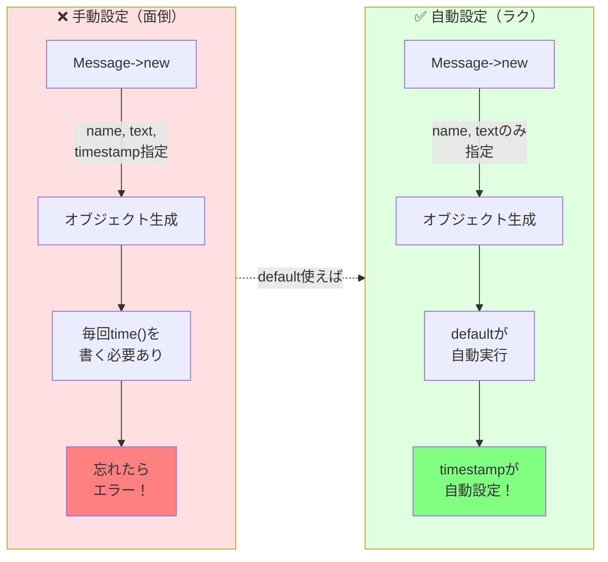
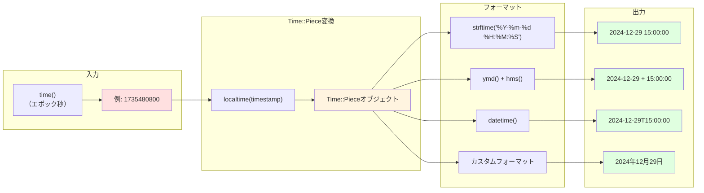

[@nqounet](https://twitter.com/nqounet)です。

Perlのオブジェクト指向、楽しんでいますか？[前回の第2回](/post/1735477200/)では、Messageクラスを作ってスパゲティコードから脱却しました。でも、実際に動かしてみて「あれ？」と思いませんでしたか？

「この投稿、いつ書いたんだっけ？🤔」

そうなのです、**投稿日時がない**のです！掲示板やチャットアプリで「いつ投稿されたか」がわからないのは致命的ですよね。今回は、Mooの`default`機能を使って、オブジェクト生成時に自動的にタイムスタンプを記録する方法を学びます。

コピペで動くコード付きで、わずか5分で実装完了です。Perlの魔法で時間を操りましょう！✨

## 動作確認環境

本記事のコードは以下の環境で動作確認しています。

- **Perl**: 5.16以上（5.38.0で検証済み）
- **Moo**: 2.005005
- **Time::Piece**: 1.35（Perlコア標準モジュール、追加インストール不要）
- **OS**: Linux, macOS, Windows（WSL）

## タイムスタンプの必要性 - いつ投稿されたかを記録する理由

前回の第2回で作ったMessageクラスを思い出してください。`name`と`text`の2つのプロパティを持つシンプルなクラスでしたね。でも、実際に使ってみると気づくことがあります。

チャットや掲示板で投稿日時がないと、どんな問題が起こるでしょうか？実際に考えてみましょう。

### 投稿日時がないと困ること

想像してみてください。前回作ったMessageクラスで、あなたの掲示板に以下のような投稿が並んでいます。

```text
太郎: こんにちは
花子: おはよう
次郎: はじめまして
```

問題がわかりますか？

- **時系列が不明**: どの投稿が新しいのかわからない
- **ソートできない**: 最新順に並べ替えられない
- **検索できない**: 「昨日の投稿を見たい」ができない
- **デバッグ困難**: エラーが起きた時、いつの投稿かわからない

実用的な掲示板やチャットアプリには、必ず投稿日時が必要です！

### 手動で毎回設定するのは大変

投稿のたびに手動でタイムスタンプを設定するのは面倒です。

```perl
# 毎回こんなことをしたくない！
my $msg1 = Message->new(
    name => '太郎',
    text => 'こんにちは',
    timestamp => time  # これを毎回書くのは面倒！
);

my $msg2 = Message->new(
    name => '花子',
    text => 'おはよう',
    timestamp => time  # また書く...
);
```

人間は忘れる生き物です。うっかり`timestamp`を指定し忘れたら？エラーになるか、おかしな値が入るか、バグの温床になります。

**自動化こそプログラマーの真髄！** Mooの`default`を使えば、これが驚くほど簡単に実現できます。さあ、ラクしましょう！



*図: 手動設定と自動設定の比較*

## defaultで自動的に値を設定する - Mooの基本機能

Mooには、プロパティにデフォルト値を設定する`default`という便利なオプションがあります。これを使えば、オブジェクト生成時に値を指定しなくても、自動的に値が設定されます。

### 固定値のdefault

まずは、固定値を設定する基本的な例を見てみましょう。

```perl
package Person;
use Moo;

has age => (
    is      => 'rw',
    default => 0  # 指定しなければ0が設定される
);

1;
```

使用例です。

```perl
use Person;

my $joe = Person->new();            # age は自動的に 0
my $clara = Person->new(age => 3);  # age は 3

print $joe->age;    # => 0
print $clara->age;  # => 3
```

`default => 0`と書くだけで、値を指定しなかった場合に自動的に`0`が設定されます。シンプルです！

### 動的な値とdefaultの落とし穴 - よくある間違い

ここで重要な注意点があります。**動的な値（毎回変わる値）**を設定したい場合、裸の値を書いてはいけません。

```perl
# ❌ 間違った例（これはダメ！）
has timestamp => (
    is      => 'ro',
    default => time  # これは「クラス読み込み時」に1回だけ評価される！
);
```

この間違いをすると、全てのオブジェクトで**同じタイムスタンプ**が設定されてしまいます！なぜでしょうか？

`default => time`と書くと、Perlは「クラスを読み込んだ時」に一度だけ`time`を実行して、その値を記憶します。その後、何個オブジェクトを作っても、最初に記憶した値が使われ続けるのです。

```mermaid
sequenceDiagram
    participant Script as スクリプト
    participant Class as Messageクラス
    participant Obj1 as オブジェクト1
    participant Obj2 as オブジェクト2
    
    Script->>Class: use Message;（クラス読み込み）
    Note over Class: ❌ default => time<br/>timeが1回だけ実行される<br/>→ 1735480800
    Script->>Class: Message->new
    Class->>Obj1: timestamp = 1735480800
    Note over Script: （10秒待機）
    Script->>Class: Message->new
    Class->>Obj2: timestamp = 1735480800
    Note over Obj1,Obj2: 同じタイムスタンプ！<br/>これではダメ
```

*図: 間違ったdefault（裸のtime）の動作*

それでは、どうすれば良いのでしょうか？答えは次のセクションです！

## サブルーチンリファレンスで動的な値を設定 - 正しい実装方法

動的な値（現在時刻、ランダム値など）を`default`で設定するには、**サブルーチンリファレンス**（`sub { ... }`）を使います。

### コードリファレンスの基本

サブルーチンリファレンスとは、`sub { ... }`の形で書く「コードの塊」です。これを`default`に渡すと、Mooは「オブジェクトを生成するたびに」この`sub`を実行してくれます。

```perl
# ✅ 正しい例
has timestamp => (
    is      => 'ro',
    default => sub { time }  # オブジェクト生成のたびに実行される
);
```

`sub { time }`は「timeを実行して結果を返すコード」を意味します。Mooはこれを見て、「あ、これは毎回実行する必要があるな」と判断してくれるのです。

```mermaid
sequenceDiagram
    participant Script as スクリプト
    participant Class as Messageクラス
    participant Obj1 as オブジェクト1
    participant Obj2 as オブジェクト2
    
    Script->>Class: use Message;（クラス読み込み）
    Note over Class: ✅ default => sub { time }<br/>コードリファレンスを記憶
    Script->>Class: Message->new
    Class->>Class: sub { time } を実行
    Class->>Obj1: timestamp = 1735480800
    Note over Script: （10秒待機）
    Script->>Class: Message->new
    Class->>Class: sub { time } を実行
    Class->>Obj2: timestamp = 1735480810
    Note over Obj1,Obj2: 異なるタイムスタンプ！<br/>これが正しい動作
```

*図: 正しいdefault（コードリファレンス）の動作*

### timestampプロパティの実装

それでは、実際にMessageクラスに`timestamp`プロパティを追加してみましょう。

```perl
package Message;
use Moo;
use utf8;

# 名前プロパティ
has name => (
    is => 'ro',
);

# メッセージ本文プロパティ
has text => (
    is => 'ro',
);

# タイムスタンププロパティ（新規追加！）
has timestamp => (
    is      => 'ro',
    default => sub { time }  # オブジェクト生成時に自動的に現在時刻を設定
);

1;
```

たったこれだけで、投稿日時が自動記録されるようになりました！🎉

使ってみます。

```perl
my $msg = Message->new(
    name => '太郎',
    text => 'こんにちは'
);

print $msg->timestamp;  # => 1735480800（エポック秒）
```

`timestamp`を指定していないのに、自動的に現在時刻が設定されています。これがMooの`default`の魔法です。

### 他のプロパティを参照する方法

サブルーチンリファレンスの中では、第1引数として`$self`（構築中のオブジェクト）が渡されます。これを使えば、他のプロパティを参照できます。

```perl
has greeting => (
    is      => 'ro',
    default => sub { 
        my $self = shift;
        return "こんにちは、" . $self->name . "さん";
    }
);
```

ただし、今回の`timestamp`には不要なので、シンプルに`sub { time }`で十分です。

### defaultが呼び出されるタイミング

Mooの`default`がいつ実行されるのか、フローチャートで理解しましょう。

```mermaid
flowchart TD
    Start([Message->new呼び出し]) --> Check{引数でtimestamp<br/>が指定されている？}
    Check -->|はい| UseArg[引数の値を使用]
    Check -->|いいえ| HasDefault{defaultが<br/>定義されている？}
    
    HasDefault -->|はい| CheckType{defaultの型は？}
    HasDefault -->|いいえ| SetUndef[undefを設定]
    
    CheckType -->|固定値<br/>例: default => 0| UseFixed[固定値を使用]
    CheckType -->|サブルーチン<br/>例: default => sub {...}| ExecSub["sub {...}を実行<br/>（毎回新しい値）"]
    
    UseArg --> End([オブジェクト生成完了])
    SetUndef --> End
    UseFixed --> End
    ExecSub --> End
    
    style Check fill:#fff4e0
    style CheckType fill:#fff4e0
    style ExecSub fill:#e0ffe0,stroke:#00aa00,stroke-width:3px
    style End fill:#e0e0ff
```

*図: defaultが呼び出されるタイミングと判断フロー*

## Time::Pieceで日時をフォーマット - 人間が読める形式に変換

エポック秒（`1735480800`のような数字）は、コンピューターには最高に便利ですが、人間には暗号にしか見えませんよね。これを「2024-12-29 15:00:00」のような読みやすい形式に変換してみます。

Perlには`Time::Piece`という最高に便利なモジュールがあります。しかも**Perl 5.8以降で標準搭載**です！追加インストールは一切不要です。これぞPerl標準モジュールの底力！🚀

### Time::Pieceの基本的な使い方

```perl
use Time::Piece;

my $t = localtime;  # 現在時刻を取得
print $t;           # => "Sun Dec 29 15:00:00 2024"（自動的に文字列化）
```

`localtime`をTime::Pieceのコンテキストで実行すると、Time::Pieceオブジェクトが返されます。これをprintすると、自動的に読みやすい形式で表示されます。

### よく使うフォーマットメソッド

Time::Pieceには、便利なフォーマット用メソッドが山盛りです。覚えておくと超便利です！

```perl
use Time::Piece;

my $t = localtime;

print $t->ymd;       # => "2024-12-29"（年-月-日、ISO標準）
print $t->hms;       # => "15:00:00"（時:分:秒）
print $t->datetime;  # => "2024-12-29T15:00:00"（ISO 8601形式、ログに最適）
```

区切り文字も自由自在にカスタマイズできます。

```perl
print $t->mdy("/");  # => "12/29/2024"（米国式、アメリカ人に優しい）
print $t->dmy(".");  # => "29.12.2024"（欧州式、ヨーロッパ人に優しい）
```

よく使うメソッドの一覧です。

| メソッド | 出力例 | 説明 |
|---------|--------|------|
| `ymd` | 2024-12-29 | ISO yyyy-mm-dd形式 |
| `mdy("/")` | 12/29/2024 | 米国式 mm/dd/yyyy |
| `dmy(".")` | 29.12.2024 | 欧州式 dd.mm.yyyy |
| `hms` | 15:00:00 | 時刻 (hh:mm:ss) |
| `datetime` | 2024-12-29T15:00:00 | ISO 8601形式 |

### カスタムフォーマット（strftime）

さらに細かくフォーマットしたい場合は、`strftime`メソッドを使います。

```perl
print $t->strftime('%Y年%m月%d日 %H時%M分%S秒');
# => "2024年12月29日 15時00分00秒"

print $t->strftime('%A, %B %d, %Y');
# => "Sunday, December 29, 2024"
```

`strftime`は強力で、あらゆる日時フォーマットに対応できます。詳しくは公式ドキュメントを参照してください。



### Time::Pieceのデータフロー

Time::Pieceを使った日時フォーマットの流れを図で見てみましょう。



*図: エポック秒から人間が読める形式への変換フロー*

## 動かしてみよう - 完全なコード例

それでは、すべてを組み合わせた完全なコード例を見てみます。コピペで即動きます！

### Message.pmの更新

`lib/Message.pm`を以下のように更新します。

```perl
package Message;
use Moo;
use utf8;
use Time::Piece;

# 名前プロパティ
has name => (
    is => 'ro',
);

# メッセージ本文プロパティ
has text => (
    is => 'ro',
);

# タイムスタンププロパティ
has timestamp => (
    is      => 'ro',
    default => sub { time }
);

# 日時を見やすくフォーマットするメソッド
sub formatted_time {
    my $self = shift;
    my $t = localtime($self->timestamp);
    return $t->strftime('%Y-%m-%d %H:%M:%S');
}

1;
```

ポイントは以下の通りです。

- `use Time::Piece;`でTime::Pieceモジュールを有効化
- `timestamp`プロパティに`default => sub { time }`を設定
- `formatted_time`メソッドで日時を見やすくフォーマット

### chat.plの更新

`chat.pl`も更新して、日時を表示できるようにしましょう。

```perl
#!/usr/bin/env perl
# Perl 5.16以上
# 外部依存: Moo
use strict;
use warnings;
use utf8;
use FindBin;
use lib "$FindBin::Bin/lib";
use Message;

binmode STDOUT, ':utf8';

# メッセージオブジェクトの配列
my @messages;

# メッセージを追加する関数
sub add_message {
    my ($name, $text) = @_;
    push @messages, Message->new(
        name => $name,
        text => $text,
    );
}

# メッセージを表示する関数（日時付き）
sub show_messages {
    foreach my $msg (@messages) {
        printf "[%s] %s: %s\n", 
            $msg->formatted_time,  # 日時を表示
            $msg->name, 
            $msg->text;
    }
}

# サンプルデータを追加
add_message('太郎', 'こんにちは');
sleep 1;  # 1秒待つ（タイムスタンプの違いを見やすくするため）
add_message('花子', 'おはよう');
sleep 1;
add_message('次郎', 'はじめまして');

# 表示
show_messages();
```

### 実行結果

実行すると、以下のように日時付きで表示されます。

```text
[2024-12-29 15:00:00] 太郎: こんにちは
[2024-12-29 15:00:01] 花子: おはよう
[2024-12-29 15:00:02] 次郎: はじめまして
```

完璧です！投稿日時が自動的に記録され、見やすい形式で表示されます。🎉

### よくある質問（FAQ）

初心者がつまずきやすいポイントをまとめました。

#### Q1: なぜdefault => timeではなくdefault => sub { time }なのか？

**A:** `default => time`と書くと、クラス読み込み時に一度だけ`time`が実行され、全てのオブジェクトで同じタイムスタンプが使われてしまいます。

`default => sub { time }`と書くと、オブジェクトを生成するたびに`sub { time }`が実行され、毎回異なるタイムスタンプが記録されます。

```perl
# ❌ ダメな例
default => time  # クラス読み込み時に1回だけ実行

# ✅ 良い例
default => sub { time }  # オブジェクト生成のたびに実行
```

#### Q2: Time::Pieceとlocaltime関数の違いは？

**A:** Perlの組み込み`localtime`関数は、リストコンテキストでは9要素のリストを返し、スカラーコンテキストでは文字列を返します。

Time::Pieceを`use`すると、`localtime`がTime::Pieceオブジェクトを返すようにオーバーライドされます。これにより、オブジェクト指向で日時を扱えるようになります。

```perl
# Time::Piece なし
my ($sec, $min, $hour, $mday, $mon, $year) = localtime(time);
$year += 1900;  # 1900年からの年数なので補正が必要
$mon += 1;      # 0始まりなので補正が必要

# Time::Piece あり（こちらが簡単！）
use Time::Piece;
my $t = localtime(time);
print $t->year;  # 自動的に4桁の年（2024）
print $t->mon;   # 自動的に1〜12の月
```

Time::Pieceの方が圧倒的に使いやすいです！

#### Q3: タイムゾーンはどう扱うべきか？

**A:** `localtime`はサーバーのローカルタイムゾーンを使います。UTCで扱いたい場合は`gmtime`を使います。

```perl
use Time::Piece;

my $local = localtime;  # ローカルタイムゾーン（例: JST）
my $utc = gmtime;       # UTC（協定世界時）

print $local->datetime;  # => "2024-12-29T15:00:00"（日本時間）
print $utc->datetime;    # => "2024-12-29T06:00:00"（UTC）
```

一般的には、保存はUTC、表示はローカルという使い分けをすることが多いです。今回の例では、シンプルに`localtime`を使っています。

## まとめ - Moo defaultとTime::Pieceで実現する自動タイムスタンプ

今回学んだことを振り返ります。Mooの`default`を使えば、オブジェクト指向プログラミングがさらに便利で強力になります！

### 今回の3つのポイント

**ポイント1: defaultで自動設定の魔法**
- `default`オプションで、プロパティに自動的に値を設定できる
- 固定値は`default => 0`のように直接書く
- 動的な値は`default => sub { ... }`のようにサブルーチンリファレンスで書く

**ポイント2: サブルーチンリファレンスの必須知識**
- `default => time`は大きな間違い
- `default => sub { time }`が正解
- `sub { ... }`はオブジェクト生成のたびに実行される

**ポイント3: Time::Pieceで日時フォーマット自由自在**
- Time::PieceはPerl 5.8以降で標準搭載
- `ymd`、`hms`、`datetime`などの便利メソッドが充実
- `strftime`で柔軟なカスタムフォーマットが可能

Perlのオブジェクト指向、どんどん楽しくなってきましたね！次回はさらなる進化を遂げます。

### 次回予告 - バリデーションでデータを守る

今回作った`timestamp`プロパティは完璧に動きます。でも、ちょっと待ってください。`name`や`text`はどうでしょうか？

```perl
# これが通ってしまう！😱
my $msg = Message->new(
    name => '',     # 空文字でもOK？
    text => ''      # これも空文字でOK？
);
```

実際の掲示板では、名前やメッセージが空だと困ります。荒らし投稿の温床にもなりかねません。「投稿できないようにしたい」「ちゃんとチェックしたい」という気持ち、よくわかります。

**次回（第4回）のテーマ**
- `isa`を使った型チェックとバリデーション
- カスタムバリデーションで細かく制御
- わかりやすいエラーメッセージで親切設計

バリデーションを追加すれば、Messageクラスはさらに堅牢になります。不正なデータをシャットアウトして、安心して使えるクラスを作りましょう！Perlでセキュアなコーディング、始めます。

お楽しみに！🚀

## 参考リンク - さらに学びたい方へ

Mooの`default`やTime::Pieceについて、さらに詳しく知りたい方は以下のリンクをご覧ください。

### Moo関連





### Time::Piece関連





### シリーズ記事

- [第1回 Mooで覚えるオブジェクト指向プログラミング](/2021/10/31/191008/) - Mooの基本構文とクラスの作り方
- [第2回 Messageクラスでスパゲティコードから脱却](/post/1735477200/) - オブジェクト指向の実践
- 第3回 デフォルト値で投稿日時を自動設定しよう（本記事）
- 第4回 バリデーションでデータを守る（次回予告）

### 関連トピック

- [Perlタグの記事一覧](/tags/perl/) - 他のPerl関連チュートリアルをチェック
- [プログラミングチュートリアル一覧](/tags/programming/)

## 更新履歴

- 2024-12-29: 初版公開
