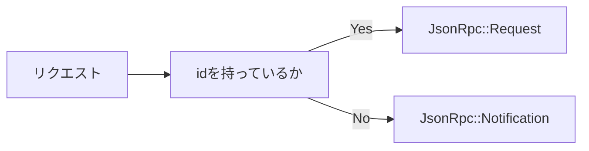

この記事は「**Perlで値オブジェクトを使ってテスト駆動開発してみよう**」シリーズの**第4回（全5回）**です。前回は、[Test2によるTDD実践とMethodName値オブジェクト](/2025/12/18/test2-tdd-value-object-testing-strategy/)の実装を通じて、Red-Green-Refactorサイクルを体験しました。今回は、**複数の値オブジェクトを組み合わせた複合的な値オブジェクト**として、JSON-RPC 2.0のRequestとResponseを完全実装します。

> **シリーズナビゲーション**  
> ← 前回: [PerlのTest2でTDD実践 - 値オブジェクトのテスト戦略](/2025/12/18/test2-tdd-value-object-testing-strategy/)  
> → 次回: エラー処理と境界値テスト - 堅牢な値オブジェクトを作る（公開予定）

## この記事で学べること

- **複合値オブジェクトの設計**: 単純な値オブジェクトを組み合わせた設計パターン
- **Type::Tinyの実践活用**: Maybe、ArrayRef、HashRef、InstanceOfなどの型制約
- **TDDで進める複雑な実装**: 必須/オプションフィールドのテスト戦略
- **ファクトリーメソッドパターン**: from_hashによるJSON→オブジェクト変換の実装
- **JSON-RPC 2.0仕様の実装**: Request/Responseオブジェクトの完全実装

## 複合値オブジェクトとは - JSON-RPCを題材に理解する

### 単純な値オブジェクトと複合値オブジェクトの違い

これまで実装してきたのは**単純な値オブジェクト**です。これらは、単一のプリミティブ型（文字列や数値）をラップしたものです。

```perl
# 単純な値オブジェクト - 文字列をラップ
package JsonRpc::MethodName;
use Moo;

has value => (
    is  => 'ro',
    isa => sub { ... },  # 文字列のバリデーション
);
```

一方、**複合値オブジェクト**（Composite Value Object）は、複数のフィールドを持ち、それぞれが独自の値オブジェクトや型制約を持ちます。JSON-RPC 2.0のRequest/Responseオブジェクトは、この複合値オブジェクトの典型例です。

```perl
# 複合的な値オブジェクト - 複数フィールドと値オブジェクトを組み合わせ
package JsonRpc::Request;
use Moo;

has jsonrpc => (is => 'ro', isa => InstanceOf['JsonRpc::Version']);
has method  => (is => 'ro', isa => InstanceOf['JsonRpc::MethodName']);
has params  => (is => 'ro', isa => Maybe[ArrayRef|HashRef]);  # オプション
has id      => (is => 'ro', isa => Maybe[Str|Int]);           # オプション
```

### 値オブジェクトのネスト構造

JSON-RPC Requestオブジェクトは以下のような階層構造を持ちます。

```text
JsonRpc::Request
├── jsonrpc: JsonRpc::Version (値オブジェクト)
├── method:  JsonRpc::MethodName (値オブジェクト)
├── params:  ArrayRef | HashRef | undef (オプション)
└── id:      Str | Int | undef (オプション)
```

このように、**値オブジェクトが他の値オブジェクトを含む**構造を、複合値オブジェクトと呼びます。JSON-RPCの実装において、この構造は以下のメリットをもたらします。

- **責任の分離**: 各値オブジェクトが独自のバリデーションを担当
- **再利用性**: JsonRpc::VersionやMethodNameは他のコンテキストでも使える
- **型安全性**: Type::Tinyによる厳密な型チェック
- **保守性**: 変更箇所が局所化され、影響範囲が限定される

## Type::Tinyによる型制約の実践 - Perlに型安全性をもたらす

Type::Tinyは、Perlに強力な型システムを導入するモジュールであり、JSON-RPCのRequestやResponseのような複合値オブジェクトの実装には不可欠なツールです。TDDにおいて、Type::Tinyの型制約は「実行可能な仕様書」として機能します。

### Type::Tinyの基本型

Type::Tiny とは言っていますが、実際に使うのはバンドルされている Types::Standard がメインになるでしょう。Type::Tiny をインストールすれば使用できるようになります。

Types::Standard はよく使用される型が定義されています。`isa`にその型を指定することでPerlでも型の制約をつけることができます。

```perl
use Types::Standard qw(
    Str Int Num Bool
    ArrayRef HashRef Maybe
    InstanceOf Enum Any
);

# 基本型
has name => (is => 'ro', isa => Str);           # 文字列
has age  => (is => 'ro', isa => Int);           # 整数
has rate => (is => 'ro', isa => Num);           # 数値（小数含む）
has flag => (is => 'ro', isa => Bool);          # 真偽値

# 参照型
has items  => (is => 'ro', isa => ArrayRef);        # 配列リファレンス
has config => (is => 'ro', isa => HashRef);         # ハッシュリファレンス

# 型パラメータ付き
has numbers => (is => 'ro', isa => ArrayRef[Int]);  # 整数の配列
has mapping => (is => 'ro', isa => HashRef[Str]);   # 文字列のハッシュ

# オブジェクト型
has version => (is => 'ro', isa => InstanceOf['JsonRpc::Version']);

# オプショナル（Maybe）
has optional_name => (is => 'ro', isa => Maybe[Str]);  # Str または undef
```

### Type::Tinyのインストール

```bash
# CPANからインストール
cpanm Type::Tiny

# または cpan コマンド
cpan Type::Tiny
```

### Maybe型でオプショナルフィールドを表現する - JSON-RPC仕様の実装

JSON-RPC 2.0仕様では、`params`と`id`はオプショナルフィールドです。PerlでこれをType::Tinyの`Maybe`型で厳密に表現します。

```perl
use Types::Standard qw(Maybe Str Int ArrayRef HashRef);

# Maybe[型] は「型 または undef」を意味する
has params => (
    is  => 'ro',
    isa => Maybe[ArrayRef | HashRef],
);

has id => (
    is  => 'ro',
    isa => Maybe[Str | Int],
);

# 使用例
my $req1 = Request->new(
    jsonrpc => $version,
    method  => $method,
    params  => [1, 2, 3],   # ArrayRef - OK
    id      => "req-123",   # Str - OK
);

my $req2 = Request->new(
    jsonrpc => $version,
    method  => $method,
    params  => undef,       # Maybe[...] なので undef OK
    id      => undef,       # Maybe[...] なので undef OK
);

my $req3 = Request->new(
    jsonrpc => $version,
    method  => $method,
    # params と id は省略可能（自動的に undef）
);
```

## JsonRpc::Request値オブジェクトのTDD実装

それでは、TDDでJSON-RPC 2.0のRequest値オブジェクトを実装していきましょう。前回学んだRed-Green-Refactorサイクルを適用し、複合値オブジェクトならではのテスト戦略を実践します。

### JSON-RPC 2.0 Request仕様の確認

まず、[JSON-RPC 2.0仕様書](https://www.jsonrpc.org/specification)を確認します。Request objectは以下のフィールドを持ちます。

| フィールド | 型 | 必須/オプション | 説明 |
|-----------|-----|----------------|------|
| jsonrpc | String | 必須 | "2.0" 固定 |
| method | String | 必須 | 呼び出すメソッド名 |
| params | Array or Object | オプション | メソッドのパラメータ |
| id | String, Number, Null | オプション | リクエストID（通知の場合は省略） |



### Red - 失敗するテストを書く

では、Requestのテストを書きます。

```perl
# t/request.t
use v5.38;
use Test2::V0 -target => 'JsonRpc::Request';

use JsonRpc::Version;
use JsonRpc::MethodName;

subtest 'constructor with required fields only' => sub {
    my $req = JsonRpc::Request->new(
        jsonrpc => JsonRpc::Version->new(value => '2.0'),
        method  => JsonRpc::MethodName->new(value => 'getUser'),
    );
    
    ok $req, 'Request created with required fields';
    isa_ok $req->jsonrpc, 'JsonRpc::Version';
    isa_ok $req->method,  'JsonRpc::MethodName';
    is $req->params, undef, 'params is undef by default';
    is $req->id,     undef, 'id is undef by default';
};

subtest 'constructor with all fields' => sub {
    my $req = JsonRpc::Request->new(
        jsonrpc => JsonRpc::Version->new(value => '2.0'),
        method  => JsonRpc::MethodName->new(value => 'createUser'),
        params  => { name => 'Alice', age => 30 },
        id      => 'req-001',
    );
    
    ok $req, 'Request created with all fields';
    is $req->params, { name => 'Alice', age => 30 }, 'params is hash';
    is $req->id, 'req-001', 'id is string';
};

subtest 'constructor rejects invalid jsonrpc' => sub {
    like(
        dies {
            JsonRpc::Request->new(
                jsonrpc => "not a Version object",
                method  => JsonRpc::MethodName->new(value => 'test'),
            );
        },
        qr/type constraint|isa/i,
        'rejects non-Version jsonrpc'
    );
};

subtest 'constructor rejects invalid method' => sub {
    like(
        dies {
            JsonRpc::Request->new(
                jsonrpc => JsonRpc::Version->new(value => '2.0'),
                method  => "not a MethodName object",
            );
        },
        qr/type constraint|isa/i,
        'rejects non-MethodName method'
    );
};

subtest 'params accepts array or hash or undef' => sub {
    my $version = JsonRpc::Version->new(value => '2.0');
    my $method  = JsonRpc::MethodName->new(value => 'test');
    
    # ArrayRef
    ok(lives {
        JsonRpc::Request->new(
            jsonrpc => $version,
            method  => $method,
            params  => [1, 2, 3],
        );
    }, 'params accepts ArrayRef');
    
    # HashRef
    ok(lives {
        JsonRpc::Request->new(
            jsonrpc => $version,
            method  => $method,
            params  => { key => 'value' },
        );
    }, 'params accepts HashRef');
    
    # undef
    ok(lives {
        JsonRpc::Request->new(
            jsonrpc => $version,
            method  => $method,
            params  => undef,
        );
    }, 'params accepts undef');
    
    # String は拒否
    like(dies {
        JsonRpc::Request->new(
            jsonrpc => $version,
            method  => $method,
            params  => "string",
        );
    }, qr/type constraint/i, 'params rejects string');
};

subtest 'id accepts string, int, or undef' => sub {
    my $version = JsonRpc::Version->new(value => '2.0');
    my $method  = JsonRpc::MethodName->new(value => 'test');
    
    ok(lives {
        JsonRpc::Request->new(jsonrpc => $version, method => $method, id => 'str-id');
    }, 'id accepts string');
    
    ok(lives {
        JsonRpc::Request->new(jsonrpc => $version, method => $method, id => 123);
    }, 'id accepts integer');
    
    ok(lives {
        JsonRpc::Request->new(jsonrpc => $version, method => $method, id => undef);
    }, 'id accepts undef');
    
    like(dies {
        JsonRpc::Request->new(jsonrpc => $version, method => $method, id => []);
    }, qr/type constraint/i, 'id rejects array reference');
};

done_testing;
```

テストを実行すると、当然失敗します（Red）。

```bash
$ prove -lv t/request.t
Can't locate JsonRpc/Request.pm in @INC
...
```

### Green - 最小実装で通す

次に、テストを通すための実装を書きます。

```perl
# lib/JsonRpc/Request.pm
package JsonRpc::Request;
use v5.38;
use Moo;
use Types::Standard qw(InstanceOf Maybe ArrayRef HashRef Str Int);
use namespace::clean;

has jsonrpc => (
    is       => 'ro',
    isa      => InstanceOf['JsonRpc::Version'],
    required => 1,
);

has method => (
    is       => 'ro',
    isa      => InstanceOf['JsonRpc::MethodName'],
    required => 1,
);

has params => (
    is  => 'ro',
    isa => Maybe[ArrayRef | HashRef],
);

has id => (
    is  => 'ro',
    isa => Maybe[Str | Int],
);

1;

__END__

=head1 NAME

JsonRpc::Request - JSON-RPC 2.0 Request object

=head1 SYNOPSIS

    use JsonRpc::Request;
    use JsonRpc::Version;
    use JsonRpc::MethodName;
    
    my $req = JsonRpc::Request->new(
        jsonrpc => JsonRpc::Version->new(value => '2.0'),
        method  => JsonRpc::MethodName->new(value => 'getUser'),
        params  => { user_id => 42 },
        id      => 'req-123',
    );

=head1 DESCRIPTION

Represents a JSON-RPC 2.0 Request object with validation.

=cut
```

テストを再実行すると、すべて成功するでしょう（Green）！

```
$ prove -lv t/request.t
ok 1 - constructor with required fields only {
    ok 1 - Request created with required fields
    ok 2 - JsonRpc::Version=HASH->isa('JsonRpc::Version')
    ok 3 - JsonRpc::MethodName=HASH->isa('JsonRpc::MethodName')
    ok 4 - params is undef by default
    ok 5 - id is undef by default
    1..5
}
...
All tests successful.
```

### Refactor - しなくても良い

Red Green Refactorのサイクルですが、リファクタリング不要であればスキップしても問題ありません。

今回はスキップして、次の仕様を書きます。

### Red - from_hash のテスト追加

実際のJSON-RPCアプリケーションでは、JSONをデコードした結果（ハッシュリファレンス）から直接Requestオブジェクトを生成することになります。ハッシュリファレンスからオブジェクトを生成する `from_hash` メソッドを追加することにします。どのような動作になるかを検討しながら書いていきます。

```perl
# t/request.t に追加

subtest 'from_hash factory method' => sub {
    subtest 'creates request from hash' => sub {
        my $req = JsonRpc::Request->from_hash({
            jsonrpc => '2.0',
            method  => 'getUser',
            params  => { user_id => 42 },
            id      => 'req-001',
        });
        
        isa_ok $req,['JsonRpc::Request'], 'is a JsonRpc::Request';
        is $req->jsonrpc->value, '2.0', 'jsonrpc is correct';
        is $req->method->value, 'getUser', 'method is correct';
        is $req->params, { user_id => 42 }, 'params is correct';
        is $req->id, 'req-001', 'id is correct';
    };

    subtest 'from_hash rejects missing required fields' => sub {
        like(dies {
            JsonRpc::Request->from_hash({ method => 'test' });
        }, qr/missing.*jsonrpc/i, 'missing jsonrpc rejected');
        
        like(dies {
            JsonRpc::Request->from_hash({ jsonrpc => '2.0' });
        }, qr/missing.*method/i, 'missing method rejected');
    };
    
    subtest 'from_hash rejects non-hash' => sub {
        like(dies {
            JsonRpc::Request->from_hash("not a hash");
        }, qr/hash reference/i, 'string rejected');
        
        like(dies {
            JsonRpc::Request->from_hash([]);
        }, qr/hash reference/i, 'array rejected');
    };
};
```

### Green - from_hash を実装する

では、Greenにするために`from_hash`メソッドを追加します。

```perl
# lib/JsonRpc/Request.pm
package JsonRpc::Request;
use v5.38;
use Moo;
use Types::Standard qw(InstanceOf Maybe ArrayRef HashRef Str Int);
use JsonRpc::Version;
use JsonRpc::MethodName;
use namespace::clean;

has jsonrpc => (
    is       => 'ro',
    isa      => InstanceOf['JsonRpc::Version'],
    required => 1,
);

has method => (
    is       => 'ro',
    isa      => InstanceOf['JsonRpc::MethodName'],
    required => 1,
);

has params => (
    is  => 'ro',
    isa => Maybe[ArrayRef | HashRef],
);

has id => (
    is  => 'ro',
    isa => Maybe[Str | Int],
);

# ファクトリーメソッド: HashRef から Request を生成
sub from_hash {
    my ($class, $hash) = @_;
    
    die "from_hash requires a hash reference"
        unless ref $hash eq 'HASH';
    
    # 必須フィールドの存在チェック
    die "missing required field: jsonrpc"
        unless exists $hash->{jsonrpc};
    die "missing required field: method"
        unless exists $hash->{method};
    
    return $class->new(
        jsonrpc => JsonRpc::Version->new(value => $hash->{jsonrpc}),
        method  => JsonRpc::MethodName->new(value => $hash->{method}),
        exists $hash->{params} ? (params => $hash->{params}) : (),
        exists $hash->{id}     ? (id     => $hash->{id})     : (),
    );
}

1;

__END__

=head1 METHODS

=head2 from_hash

Creates a Request object from a hash reference (typically from decoded JSON).

    my $req = JsonRpc::Request->from_hash({
        jsonrpc => '2.0',
        method  => 'getUser',
        params  => { user_id => 42 },
        id      => 'req-123',
    });

=cut
```

テストを実行して、Greenになるのを確認しましょう。

### 使ってみよう！

これで、JSON文字列からJsonRpc::Requestオブジェクトを生成できるようになりました！

```perl
use JSON::MaybeXS qw(decode_json encode_json);

# JSON文字列 → Request オブジェクト
my $json = '{"jsonrpc":"2.0","method":"getUser","id":1}';
my $hash = decode_json($json);
my $req  = JsonRpc::Request->from_hash($hash);
```

### ここで重要な仕様が追加されます

さて、ここで仕様が追加されます！（という体でお願いします）

JSON-RPC 2.0には、 `Notification` という仕様があります。

> A Notification is a Request object without an "id" member. A Request object that is a Notification signifies the Client's lack of interest in the corresponding Response object, and as such no Response object needs to be returned to the client. The Server MUST NOT reply to a Notification, including those that are within a batch request.

リクエストに `id` が存在しない場合は、 `Notification` という扱いになります。**MUST NOT**が使用されている重要な仕様です。

`Notification` に対しては、サーバーは返信してはいけません。それがバッチに含まれるリクエストであってもです。

ですが、心配ありません。新しい仕様を追加するには、テストを追加すれば良いのです。

### Red - リクエストに id が含まれない場合は Notification

さて、テストを書くために、どのような仕様にするかを検討します。

重要な仕様でもあるので、値オブジェクトを厳密に適用する方向で考えます。ここでは `JsonRpc::Notification` を定義することにします。

> 💡 **仕様の判断**
> `JsonRpc::Request` に `is_notification` のようなフラグを追加する方法もあります（そして、おそらくそちらの方が書き直す量は少ない）。実際のプロダクトではそのような判断になる場合もあると思います。
> 最初から仕様が決まっていた場合はともかく、仕様変更の場合、既存コードへの影響も判断材料になります。（ほとんどの場合、想定しているよりも大きく影響するのが怖いところです）

ところで、この場合 `JsonRpc::Request` は `id` を必須項目に変更する必要もあります。何故ならば、 `id` が存在しない `JsonRpc::Request` は `JsonRpc::Notification` になるので、結果的に `JsonRpc::Request` は `id` が必ず存在するという仕様に変わりました。



ちょっとした仕様追加のはずだったのに、かなり大ごとになりそうな予感です。

ですが、落ち着いてテストコードを変更していきましょう。

- `id` が必須項目になるので、 `id` を省略していた正しく生成しているテストには、必須項目として `id` を追加する
- 新たなテストとして、 `id` を指定しないで new すると、エラー（required）を返すテストを追加する

ちなみに、 `id` は null を許容しているので、**指定しない**のと**undefを渡す**のとは明確に区別する必要があります。今回の仕様変更で `JsonRpc::Request` は `id` を指定しない場合はエラーになりますが、`id`としてundefを渡すと正常に作成されます。

ここまでは、 `JsonRpc::Request` として話をしてきましたが、`JsonRpc::Request`のファクトリーメソッドで `JsonRpc::Notification` も作成されるのはわかりにくそうです。なので、ファクトリークラスを作成してしまいましょう。`JsonRpc::Request->from_hash()`を`JsonRpc::RequestFactory->from_hash` として再実装します。

`JsonRpc::Notification` についても、新たにテストコードを作成します。クラスの構成としては `id` を持たない `JsonRpc::Request` という感じを想定します。

これで大筋が決まりました。これらの仕様をテストコードに落とし込んでいきます。

まずは、新たに追加されるファクトリークラスのテストコードを作成します。

```perl
# t/request_factory.t
use v5.38;
use Test2::V0 -target => 'JsonRpc::RequestFactory';

subtest 'constructor with required fields only' => sub {
    subtest 'from_hash creates JsonRpc::Request' => sub {
        my $req = JsonRpc::RequestFactory->from_hash(
            {
                jsonrpc => '2.0',
                method  => 'createUser',
                params  => {name => 'Bob'},
                id      => 123,
            }
        );

        isa_ok $req,          ['JsonRpc::Request'];
        isa_ok $req->jsonrpc, ['JsonRpc::Version'];
        isa_ok $req->method,  ['JsonRpc::MethodName'];
        is $req->params, {name => 'Bob'}, 'params is hash';
        is $req->id, 123, 'id is integer';
    };

    subtest 'from_hash creates JsonRpc::Notification' => sub {
        my $req = JsonRpc::RequestFactory->from_hash(
            {
                jsonrpc => '2.0',
                method  => 'notifyEvent',
                params  => ['event1', 'event2'],
            }
        );

        isa_ok $req,          ['JsonRpc::Notification'];
        isa_ok $req->jsonrpc, ['JsonRpc::Version'];
        isa_ok $req->method,  ['JsonRpc::MethodName'];
        is $req->params, ['event1', 'event2'], 'params is array';
    };
};

done_testing;
```

`JsonRpc::Notification` のためのテストを書いていきます。`JsonRpc::Request` のテストと被るところが多いですが、気にせず書いていきます。

```perl
# t/notification.t
use v5.38;
use Test2::V0 -target => 'JsonRpc::Notification';

use JsonRpc::Version;
use JsonRpc::MethodName;

subtest 'constructor with required fields only' => sub {
    my $req = JsonRpc::Notification->new(
        jsonrpc => JsonRpc::Version->new(value => '2.0'),
        method  => JsonRpc::MethodName->new(value => 'notify'),
    );

    isa_ok $req,          ['JsonRpc::Notification'];
    isa_ok $req->jsonrpc, ['JsonRpc::Version'];
    isa_ok $req->method,  ['JsonRpc::MethodName'];
    is $req->method->value, 'notify', 'method value is notify';
    is $req->params,        undef,    'params is undef by default';
};

subtest 'constructor with all fields' => sub {
    my $req = JsonRpc::Notification->new(
        jsonrpc => JsonRpc::Version->new(value => '2.0'),
        method  => JsonRpc::MethodName->new(value => 'notifyEvent'),
        params  => [{event => 'event1'}, {event => 'event2'}],
    );

    isa_ok $req, ['JsonRpc::Notification'];
    is $req->method->value, 'notifyEvent',                              'method value is notifyEvent';
    is $req->params,        [{event => 'event1'}, {event => 'event2'}], 'params is array';
};

subtest 'constructor rejects invalid jsonrpc' => sub {
    like(
        dies {
            JsonRpc::Notification->new(
                jsonrpc => "not a Version object",
                method  => JsonRpc::MethodName->new(value => 'test'),
            );
        },
        qr/type constraint|isa/i,
        'rejects non-Version jsonrpc'
    );
};

subtest 'constructor rejects invalid method' => sub {
    like(
        dies {
            JsonRpc::Notification->new(
                jsonrpc => JsonRpc::Version->new(value => '2.0'),
                method  => "not a MethodName object",
            );
        },
        qr/type constraint|isa/i,
        'rejects non-MethodName method'
    );
};

subtest 'params accepts array or hash or undef' => sub {
    my $version = JsonRpc::Version->new(value => '2.0');
    my $method  = JsonRpc::MethodName->new(value => 'testMethod');

    my $req_array = JsonRpc::Notification->new(
        jsonrpc => $version,
        method  => $method,
        params  => ['item1', 'item2'],
    );
    is $req_array->params, ['item1', 'item2'], 'params is array';

    my $req_hash = JsonRpc::Notification->new(
        jsonrpc => $version,
        method  => $method,
        params  => {key1 => 'value1', key2 => 'value2'},
    );
    is $req_hash->params, {key1 => 'value1', key2 => 'value2'}, 'params is hash';

    my $req_undef = JsonRpc::Notification->new(
        jsonrpc => $version,
        method  => $method,
        params  => undef,
    );
    is $req_undef->params, undef, 'params is undef';

    # String は拒否
    like(
        dies {
            JsonRpc::Notification->new(
                jsonrpc => $version,
                method  => $method,
                params  => "not an array or hash",
            );
        },
        qr/type constraint|isa/i,
        'rejects string params'
    );
};

done_testing;
```

`JsonRpc::Request` は仕様が変更になるのでテストは細かく変更になります。

```perl
# t/request.t
use v5.38;
use Test2::V0 -target => 'JsonRpc::Request';

use JsonRpc::Version;
use JsonRpc::MethodName;

subtest 'constructor with required fields only' => sub {
    my $req = JsonRpc::Request->new(
        jsonrpc => JsonRpc::Version->new(value => '2.0'),
        method  => JsonRpc::MethodName->new(value => 'ping'),
        id      => undef,
    );

    isa_ok $req,          ['JsonRpc::Request'];
    isa_ok $req->jsonrpc, ['JsonRpc::Version'];
    isa_ok $req->method,  ['JsonRpc::MethodName'];
    is $req->method->value, 'ping', 'method value is ping';
    is $req->params,        undef,  'params is undef by default';
    is $req->id,            undef,  'id is undef';
};

subtest 'constructor with all fields' => sub {
    my $req = JsonRpc::Request->new(
        jsonrpc => JsonRpc::Version->new(value => '2.0'),
        method  => JsonRpc::MethodName->new(value => 'createUser'),
        params  => {name => 'Alice', age => 30},
        id      => 'req-001',
    );

    isa_ok $req, ['JsonRpc::Request'];
    is $req->method->value, 'createUser', 'method value is createUser';
    is $req->params, {name => 'Alice', age => 30}, 'params is hash';
    is $req->id, 'req-001', 'id is string';
};

subtest 'constructor rejects invalid jsonrpc' => sub {
    like(
        dies {
            JsonRpc::Request->new(
                jsonrpc => "not a Version object",
                method  => JsonRpc::MethodName->new(value => 'test'),
                id      => undef,
            );
        },
        qr/type constraint|isa/i,
        'rejects non-Version jsonrpc'
    );
};

subtest 'constructor rejects invalid method' => sub {
    like(
        dies {
            JsonRpc::Request->new(
                jsonrpc => JsonRpc::Version->new(value => '2.0'),
                method  => "not a MethodName object",
                id      => undef,
            );
        },
        qr/type constraint|isa/i,
        'rejects non-MethodName method'
    );
};

subtest 'constructor rejects missing id' => sub {
    like(
        dies {
            JsonRpc::Request->new(
                jsonrpc => JsonRpc::Version->new(value => '2.0'),
                method  => "not a MethodName object",
            );
        },
        qr/required/i,
        'rejects missing id'
    );
};

subtest 'params accepts array or hash or undef' => sub {
    my $version = JsonRpc::Version->new(value => '2.0');
    my $method  = JsonRpc::MethodName->new(value => 'test');

    # ArrayRef
    ok(
        lives {
            JsonRpc::Request->new(
                jsonrpc => $version,
                method  => $method,
                params  => [1, 2, 3],
                id      => 1,
            );
        },
        'params accepts ArrayRef'
    );

    # HashRef
    ok(
        lives {
            JsonRpc::Request->new(
                jsonrpc => $version,
                method  => $method,
                params  => {key => 'value'},
                id      => 1,
            );
        },
        'params accepts HashRef'
    );

    # undef
    ok(
        lives {
            JsonRpc::Request->new(
                jsonrpc => $version,
                method  => $method,
                params  => undef,
                id      => 1,
            );
        },
        'params accepts undef'
    );

    # String は拒否
    like(
        dies {
            JsonRpc::Request->new(
                jsonrpc => $version,
                method  => $method,
                params  => "string",
                id      => 1,
            );
        },
        qr/type constraint/i,
        'params rejects string'
    );
};

subtest 'id accepts string, int, or undef' => sub {
    my $version = JsonRpc::Version->new(value => '2.0');
    my $method  = JsonRpc::MethodName->new(value => 'test');

    ok(
        lives {
            JsonRpc::Request->new(jsonrpc => $version, method => $method, id => 'str-id');
        },
        'id accepts string'
    );

    ok(
        lives {
            JsonRpc::Request->new(jsonrpc => $version, method => $method, id => 123);
        },
        'id accepts integer'
    );

    ok(
        lives {
            JsonRpc::Request->new(jsonrpc => $version, method => $method, id => undef);
        },
        'id accepts undef'
    );

    like(
        dies {
            JsonRpc::Request->new(jsonrpc => $version, method => $method, id => []);
        },
        qr/type constraint/i,
        'id rejects array reference'
    );
};

done_testing;
```

### Green - テストを満たす最小限の実装

まずは `JsonRpc::Request` を変更しましょう。

```perl
# lib/JsonRpc/Request.pm
package JsonRpc::Request;
use v5.38;
use Moo;
use Types::Standard qw(InstanceOf Maybe ArrayRef HashRef Str Int);
use JsonRpc::Version;
use JsonRpc::MethodName;
use namespace::clean;

has jsonrpc => (
    is       => 'ro',
    isa      => InstanceOf ['JsonRpc::Version'],
    required => 1,
);

has method => (
    is       => 'ro',
    isa      => InstanceOf ['JsonRpc::MethodName'],
    required => 1,
);

has params => (
    is  => 'ro',
    isa => Maybe [ArrayRef | HashRef],
);

has id => (
    is       => 'ro',
    isa      => Maybe [Str | Int],
    required => 1,                   # 必須にする
);

1;
```

次は、`JsonRpc::Notification`です。`JsonRpc::Request` の `id` なしですね。

```perl
# lib/JsonRpc/Notification.pm
package JsonRpc::Notification;
use v5.38;
use Moo;
use Types::Standard qw(InstanceOf Maybe ArrayRef HashRef);
use JsonRpc::Version;
use JsonRpc::MethodName;
use namespace::clean;

has jsonrpc => (
    is       => 'ro',
    isa      => InstanceOf ['JsonRpc::Version'],
    required => 1,
);

has method => (
    is       => 'ro',
    isa      => InstanceOf ['JsonRpc::MethodName'],
    required => 1,
);

has params => (
    is  => 'ro',
    isa => Maybe [ArrayRef | HashRef],
);

1;
```

最後に `JsonRpc::RequestFactory` を作ります。

```perl
# lib/JsonRpc/RequestFactory.pm
package JsonRpc::RequestFactory;
use v5.38;
use Moo;
use JsonRpc::Request;
use JsonRpc::Notification;
use JsonRpc::Version;
use JsonRpc::MethodName;
use namespace::clean;

sub from_hash {
    my ($class, $hashref) = @_;

    my $jsonrpc = JsonRpc::Version->new(value => $hashref->{jsonrpc});
    my $method  = JsonRpc::MethodName->new(value => $hashref->{method});
    my $params  = $hashref->{params};

    if (exists $hashref->{id}) {

        # Request
        return JsonRpc::Request->new(
            jsonrpc => $jsonrpc,
            method  => $method,
            params  => $params,
            id      => $hashref->{id},
        );
    }
    else {
        # Notification
        return JsonRpc::Notification->new(
            jsonrpc => $jsonrpc,
            method  => $method,
            params  => $params,
        );
    }
}

1;
```

すべてGreenになりました。

### Refactor - 重複を取り除く

`JsonRpc::Request` と `JsonRpc::Notification` は `id` の有無以外は、ほぼ同じです。ここをリファクタリングしましょう。

`JsonRpc::RequestBase` を作成し、このクラスを継承させることにします。

よくある設計の助言として、まずは「合成（composition）を優先する」と言われることがあります。今回のように、リファクタリングとして重複部分を切り出すような場合は、継承を使わない方が良い場合が多いと思います。一部機能が重複しているだけであれば尚更です。

今回、継承を選択したのは、RequestとNotificationが、どちらもmethodに対してparamsを渡す処理を行うためです（今回はその部分は実装しないのですが）。Requestはレスポンスを返しますが、Notificationはレスポンスを返さない（返してはいけない）という部分だけが異なります。

```perl
# lib/JsonRpc/RequestBase.pm
package JsonRpc::RequestBase;
use v5.38;
use Moo;
use Types::Standard qw(InstanceOf Maybe ArrayRef HashRef);
use JsonRpc::Version;
use JsonRpc::MethodName;
use namespace::clean;

has jsonrpc => (
    is       => 'ro',
    isa      => InstanceOf ['JsonRpc::Version'],
    required => 1,
);

has method => (
    is       => 'ro',
    isa      => InstanceOf ['JsonRpc::MethodName'],
    required => 1,
);

has params => (
    is  => 'ro',
    isa => Maybe [ArrayRef | HashRef],
);

1;
```

`JsonRpc::Notification` は `JsonRpc::RequestBase` を継承させると、何も残りません。

```perl
# lib/JsonRpc/Notification.pm
package JsonRpc::Notification;
use v5.38;
use Moo;
extends 'JsonRpc::RequestBase';
use namespace::clean;

1;
```

`JsonRpc::Request` にも `JsonRpc::RequestBase` を継承させます。

```perl
# lib/JsonRpc/Request.pm
package JsonRpc::Request;
use v5.38;
use Moo;
extends 'JsonRpc::RequestBase';
use Types::Standard qw(Maybe Str Int);
use namespace::clean;

has id => (
    is       => 'ro',
    isa      => Maybe [Str | Int],
    required => 1,
);

1;
```

Greenのままであればリファクタリングはうまくいっています。今回は継承（extends）を使うことで重複を削除できました。

テストコードはたくさん増えましたが、実装の方は、最終的な増減はそれほどでもありませんでした。ですが、`JsonRpc::Notification` という重要な仕様を持つクラスを実装できたので十分な成果と言えます。

## JsonRpc::Response値オブジェクトのTDD実装

次に、JSON-RPC 2.0のResponse値オブジェクトを実装します。第2回で検討したとおり「成功時のResponse」と「エラー時のResponse」を別のオブジェクトとして定義します。今回は成功時のResponseのみを実装します（エラーResponseは次回の記事で扱います）。

### JSON-RPC 2.0 Response仕様の確認

JSON-RPC 2.0仕様における成功時のResponse objectは以下のフィールドを持ちます。

| フィールド | 型 | 必須/オプション | 説明 |
|-----------|-----|----------------|------|
| jsonrpc | String | 必須 | "2.0" 固定 |
| result | Any | 必須 | メソッドの実行結果（任意の型） |
| id | String, Number, Null | 必須 | リクエストと対応するID |

### Red - Responseのテストを書く

ここでは一度に紹介しますが、例えばsubtest単位で Red -> Green -> Refactor のサイクルを回しながら実装してみてください。テストファイルは `done_testing;` で終わるようにすれば問題ありません。

```perl
# t/response.t
use v5.38;
use Test2::V0 -target => 'JsonRpc::Response';

use JsonRpc::Version;

subtest 'constructor with all required fields' => sub {
    my $res = JsonRpc::Response->new(
        jsonrpc => JsonRpc::Version->new,
        result  => { name => 'Alice', age => 30 },
        id      => 'req-001',
    );
    
    ok $res, 'Response created';
    isa_ok $res->jsonrpc, ['JsonRpc::Version'], 'version';
    is $res->result, { name => 'Alice', age => 30 }, 'result is hash';
    is $res->id, 'req-001', 'id is string';

    # ここでは省略していますが id は `Maybe[Str|Int]` なので、数値やundefのテストも必要です。
};

subtest 'result accepts any type' => sub {
    my $version = JsonRpc::Version->new;
    
    # 文字列
    ok(lives {
        JsonRpc::Response->new(jsonrpc => $version, result => 'success', id => 1);
    }, 'result accepts string');
    
    # 数値
    ok(lives {
        JsonRpc::Response->new(jsonrpc => $version, result => 42, id => 2);
    }, 'result accepts number');
    
    # 配列
    ok(lives {
        JsonRpc::Response->new(jsonrpc => $version, result => [1, 2, 3], id => 3);
    }, 'result accepts array');
    
    # ハッシュ
    ok(lives {
        JsonRpc::Response->new(jsonrpc => $version, result => { ok => 1 }, id => 4);
    }, 'result accepts hash');
    
    # null/undef
    ok(lives {
        JsonRpc::Response->new(jsonrpc => $version, result => undef, id => 5);
    }, 'result accepts undef');
};

subtest 'id is required' => sub {
    like(dies {
        JsonRpc::Response->new(
            jsonrpc => JsonRpc::Version->new,
            result  => 'ok',
        );
    }, qr/required|missing/i, 'id is required');
};

subtest 'from_hash factory method' => sub {
    my $res = JsonRpc::Response->from_hash({
        jsonrpc => '2.0',
        result  => { status => 'ok' },
        id      => 'test-id',
    });
    
    isa_ok $res,['JsonRpc::Response'], 'Response created from hash';
    is $res->result, { status => 'ok' }, 'result is correct';
    is $res->id, 'test-id', 'id is correct';
};

done_testing;
```

### Green - Response実装

```perl
# lib/JsonRpc/Response.pm
package JsonRpc::Response;
use v5.38;
use Moo;
use Types::Standard qw(InstanceOf Any Str Int);
use JsonRpc::Version;
use namespace::clean;

has jsonrpc => (
    is       => 'ro',
    isa      => InstanceOf['JsonRpc::Version'],
    required => 1,
);

has result => (
    is       => 'ro',
    isa      => Any,  # 任意の型を許容
    required => 1,
);

has id => (
    is       => 'ro',
    isa      => Maybe[Str | Int],
    required => 1,
);

sub from_hash {
    my ($class, $hash) = @_;
    
    die "from_hash requires a hash reference"
        unless ref $hash eq 'HASH';
    
    die "missing required field: jsonrpc"
        unless exists $hash->{jsonrpc};
    die "missing required field: result"
        unless exists $hash->{result};
    die "missing required field: id"
        unless exists $hash->{id};
    
    return $class->new(
        jsonrpc => JsonRpc::Version->new(value => $hash->{jsonrpc}),
        result  => $hash->{result},
        id      => $hash->{id},
    );
}

1;

__END__

=head1 NAME

JsonRpc::Response - JSON-RPC 2.0 successful Response object

=head1 SYNOPSIS

    use JsonRpc::Response;
    
    my $res = JsonRpc::Response->new(
        jsonrpc => JsonRpc::Version->new(value => '2.0'),
        result  => { user => { id => 42, name => 'Alice' } },
        id      => 'req-123',
    );
    
    # From hash
    my $res2 = JsonRpc::Response->from_hash({
        jsonrpc => '2.0',
        result  => [1, 2, 3],
        id      => 999,
    });

=head1 DESCRIPTION

Represents a JSON-RPC 2.0 successful Response object.

The C<result> field can be any value (string, number, array, hash, null).

=cut
```

テスト実行で成功（Green）を確認！

## 複合値オブジェクトのファクトリーパターン - 生成方法の比較

JSON-RPCのような複合値オブジェクトの生成には、いくつかのデザインパターンが適用できます。それぞれの特徴とユースケースを見ていきましょう。

### コンストラクタによる直接生成

最も基本的な方法は、`new`による直接生成です。

```perl
my $req = JsonRpc::Request->new(
    jsonrpc => JsonRpc::Version->new(value => '2.0'),
    method  => JsonRpc::MethodName->new(value => 'getUser'),
    params  => { user_id => 42 },
    id      => 'req-001',
);
```

この方法は明示的ですが、冗長になりがちです。

### ファクトリーメソッドパターン

`from_hash`のようなファクトリーメソッドを提供することで生成を簡潔にできます。

```perl
# JSON文字列 → Hash → Request
use JSON::MaybeXS qw(decode_json);

my $json_str = '{"jsonrpc":"2.0","method":"getUser","id":1}';
my $hash = decode_json($json_str);
my $req = JsonRpc::Request->from_hash($hash);  # 簡潔！
```

### ビルダーパターン（応用）

より複雑な生成ロジックが必要な場合はビルダーパターンも検討できます。

```perl
package JsonRpc::RequestBuilder;
use v5.38;
use Moo;

has _jsonrpc => (is => 'rw');
has _method  => (is => 'rw');
has _params  => (is => 'rw');
has _id      => (is => 'rw');

sub jsonrpc {
    my ($self, $value) = @_;
    $self->_jsonrpc(JsonRpc::Version->new(value => $value));
    return $self;
}

sub method {
    my ($self, $value) = @_;
    $self->_method(JsonRpc::MethodName->new(value => $value));
    return $self;
}

sub params {
    my ($self, $value) = @_;
    $self->_params($value);
    return $self;
}

sub id {
    my ($self, $value) = @_;
    $self->_id($value);
    return $self;
}

sub build {
    my $self = shift;
    
    return JsonRpc::Request->new(
        jsonrpc => $self->_jsonrpc,
        method  => $self->_method,
        defined $self->_params ? (params => $self->_params) : (),
        defined $self->_id     ? (id     => $self->_id)     : (),
    );
}

1;
```

使用例：

```perl
use JsonRpc::RequestBuilder;

my $req = JsonRpc::RequestBuilder->new
    ->jsonrpc('2.0')
    ->method('getUser')
    ->params({ user_id => 42 })
    ->id('req-001')
    ->build;
```

流れるようなインターフェース（Fluent Interface）で読みやすくなります。

## 複合値オブジェクトのメリット再確認 - JSON-RPC実装から学ぶ

ここまでのJSON-RPC Request/Response実装を通じて、複合値オブジェクトがもたらす具体的なメリットが明確になりました。

### 型安全性

```perl
# これはコンパイル時（ロード時）にエラー
my $req = JsonRpc::Request->new(
    jsonrpc => "2.0",  # NG: Version オブジェクトが必要
    method  => "test",
);
# Value "2.0" did not pass type constraint "InstanceOf['JsonRpc::Version']"
```

不正なデータは、システムに入り込む前に確実に拒否される。

### 自己文書化

MooとType::Tinyとの組み合わせで、データ構造が明確に見えてきます。

```perl
has jsonrpc => (
    is       => 'ro',
    isa      => InstanceOf['JsonRpc::Version'],
    required => 1,
);

has method => (
    is       => 'ro',
    isa      => InstanceOf['JsonRpc::MethodName'],
    required => 1,
);

has params => (
    is  => 'ro',
    isa => Maybe[ArrayRef | HashRef],
);

has id => (
    is  => 'ro',
    isa => Maybe[Str | Int],
);
```

また、テストコードを見れば、どのような仕様で動作するのかがわかります。

### リファクタリングの安全性

機能を追加するときは、まずはテストを追加します。（Red）

Red を Green にするときは、実装はコピペでも構いません。とにかくGreenにすることだけを考えて実装します。（Green）

Greenの間はテストコードによって仕様を満たしていることになるので、**仕様を変えずにリファクタリング**ができます。（Refactor）

### テストの容易さ

テスト駆動開発では、機能を追加するときは、まずはテストを追加します。

機能を実装する時には、すでにテストが書かれていることになります。

結果的に、テストコードが書きやすい状態を（否応なく）維持できることになります。

```perl
# モックオブジェクトも簡単
my $mock_version = JsonRpc::Version->new(value => '2.0');
my $mock_method  = JsonRpc::MethodName->new(value => 'test');

my $req = JsonRpc::Request->new(
    jsonrpc => $mock_version,
    method  => $mock_method,
);
```

## まとめと次回予告

### この記事で学んだこと - JSON-RPC実装で習得した技術

今回は、JSON-RPC 2.0のRequest/Responseという**複合値オブジェクト**の実装を通じて、以下の技術を習得しました。

**複合値オブジェクトの設計:**
- 単純な値オブジェクトを組み合わせた階層構造
- 必須フィールドとオプショナルフィールドの扱い
- 値オブジェクトのネスト構造の設計

**Type::Tinyの実践活用:**
- `Maybe`型によるオプショナルフィールドの表現
- `ArrayRef | HashRef`による選択的な型制約
- `InstanceOf`による値オブジェクト同士の組み合わせ
- `Any`型による柔軟な結果の受け入れ

**ファクトリーメソッドパターン:**
- `from_hash`による簡潔なオブジェクト生成
- JSONデコード結果からの直接変換

**TDDでの実装プロセス:**
- 複合的な値オブジェクトのテスト戦略
- 必須/オプションフィールドのテストパターン
- Red-Green-Refactorサイクルの実践

### 複合値オブジェクトの実装指針 - ベストプラクティス

JSON-RPCのような複合値オブジェクトを実装する際は、以下のベストプラクティスを意識すると良い。

1. **小さな値オブジェクトから始める**: Version, MethodNameのような単純な値オブジェクトを先に実装（ボトムアップアプローチ）
2. **型制約を明確にする**: Type::TinyのMaybe/InstanceOfで厳密に型を定義し、実行可能な仕様書とする
3. **ファクトリーメソッドを提供する**: from_hashでJSON→オブジェクト変換の利便性を向上
4. **テストファーストで進める**: TDDのRed-Green-Refactorサイクルで段階的に実装

### 次回予告 - エラー処理と境界値テスト（シリーズ完結編）

次回は「**エラー処理と境界値テスト - 堅牢な値オブジェクトを作る**」として、**シリーズの完結編（第5回）**をお届けします。

**次回の学習内容:**
- **JSON-RPC Error Responseの実装**: エラーオブジェクトの値オブジェクト化
- **エラーコードと例外の設計**: Perlにおける例外処理とType::Tinyの統合
- **境界値分析の実践**: JSONサイズ制限、数値範囲、文字列長などの境界値テスト
- **プロパティベーステストの導入**: Test::QuickCheckによるランダムテスト
- **実践的なエラーハンドリング戦略**: JSON-RPC仕様に準拠したエラー処理

今回実装したRequestとResponseに、JSON-RPC Error Response値オブジェクトとエラー処理を加えることで、**完全なJSON-RPC 2.0実装**が完成します。さらに、境界値テストやproperty-based testingにより、より堅牢で本番環境に耐えうる値オブジェクトの実装技法を学びます。

> **次回記事**  
> → エラー処理と境界値テスト - 堅牢な値オブジェクトを作る（公開予定）

## 参考リンク







## シリーズ記事一覧

本記事は「**Perlで値オブジェクトを使ってテスト駆動開発してみよう**」シリーズの第4回です。

1. 値オブジェクトって何だろう？ - DDDの基本概念とPerlでの実装入門
2. JSON-RPC 2.0で学ぶ値オブジェクト設計 - 仕様から設計へ
3. [PerlのTest2でTDD実践 - 値オブジェクトのテスト戦略](/2025/12/18/test2-tdd-value-object-testing-strategy/)
4. **JSON-RPC Request/Response実装 - 複合値オブジェクト設計【Perl×TDD】**（この記事）
5. エラー処理と境界値テスト - 堅牢な値オブジェクトを作る（次回・シリーズ完結編）

各記事は独立して読めますが、順番に読むことでPerlにおけるTDDと値オブジェクト設計の全体像が理解できます。
