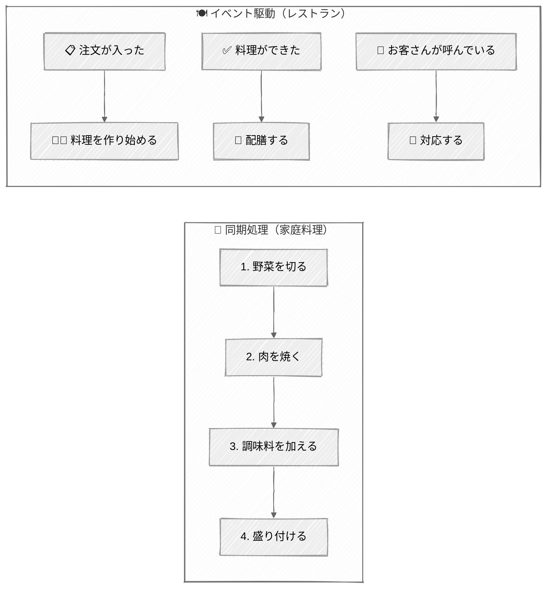
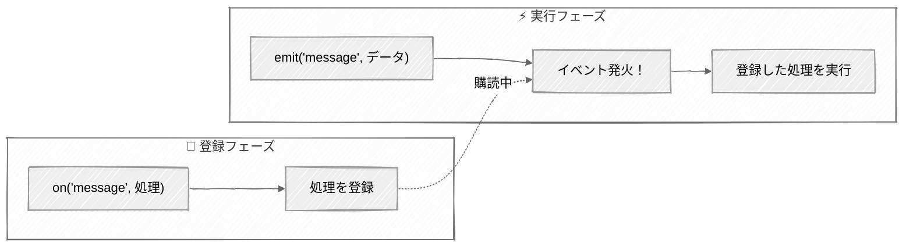

[@nqounet](https://x.com/nqounet)です。

「イベント駆動プログラミング」という言葉を聞いたことはありますか？ なんとなく難しそうに感じるかもしれませんが、実は私たちの身近にあるものです。スマートフォンのボタンを押したら画面が変わる、メールが届いたら通知が表示される──これらはすべてイベント駆動の考え方で動いています。

この記事では、Perl の Mojo::Log モジュールを使って、イベント駆動プログラミングの基礎を学びます。覚えるのは `on` と `emit` の 2 つだけです。この記事を読み終えるころには、自分でイベント駆動のコードが書けるようになっているはずです。

## はじめに - イベント駆動プログラミングを学ぼう

### 「ボタンを押したら画面が変わる」も実はイベント駆動

日常生活でイベント駆動の例を考えてみましょう。

- **スマートフォン**: 画面をタップすると反応する
- **エレベーター**: ボタンを押すと来てくれる
- **メールアプリ**: 新着メールが届くと通知される

これらに共通するのは「何かが起きたら、それに応じて処理が実行される」という仕組みです。この「何かが起きた」ことを「イベント」と呼びます。

プログラミングでも同じ考え方が使えます。「ログが出力されたら、ファイルに保存する」「エラーが発生したら、管理者に通知する」──このように、イベントをきっかけに処理を実行するのがイベント駆動プログラミングです。

### この記事のゴール：on と emit を使いこなせるようになる

イベント駆動プログラミングで覚えるべきことは、たった 2 つです。

- **on**: 「〇〇が起きたら、これをして」と登録する
- **emit**: 「〇〇が起きたよ！」と通知する

この 2 つを理解すれば、イベント駆動プログラミングの基礎はマスターしたも同然です。

### 対象読者：プログラミングの基礎を知っている初心者

この記事は、以下のような方を対象としています。

- Perl の基本的な文法（変数、サブルーチン、ハッシュなど）を理解している方
- イベント駆動プログラミングに興味があるが、どこから始めればよいかわからない方
- 実際に動くコードで学びたい方

## 30秒でわかるイベント駆動の考え方

### 同期処理との違いをたとえ話で理解

イベント駆動を理解するために、まずは「同期処理」との違いを見てみましょう。

**同期処理：レシピ通りに順番に料理する**

同期処理は、レシピ通りに 1 つずつ順番に作業を進めるようなものです。

```
1. 野菜を切る（完了するまで待つ）
2. 肉を焼く（完了するまで待つ）
3. 調味料を加える（完了するまで待つ）
4. 盛り付ける
```

1 つの作業が終わるまで、次の作業には進めません。

**イベント駆動：「注文が入ったら作り始める」レストラン**

イベント駆動は、レストランの厨房のようなものです。

```
「注文が入った」→ 料理を作り始める
「料理ができた」→ 配膳する
「お客さんが呼んでいる」→ 対応する
```

それぞれのイベント（出来事）に対して、対応する処理が実行されます。複数のイベントを効率よく処理できるのが特徴です。



同期処理では 1 つの作業が終わるまで次に進めませんが、イベント駆動では各イベントに対して独立した処理が実行されます。

### on と emit - 覚えるのはこの2つだけ

イベント駆動プログラミングの核心は、この 2 つの操作です。

**on = 「〇〇が起きたら、これをして」と登録**

「メッセージが出力されたら、ファイルに保存して」のように、イベントに対する処理を事前に登録しておきます。

```perl
# 「message」イベントが起きたら、この処理を実行する
$log->on(message => sub {
    my ($log, $level, @lines) = @_;
    # ここに処理を書く
});
```

**emit = 「〇〇が起きたよ！」と通知**

イベントが発生したことを知らせます。登録されている処理が実行されます。

```perl
# 「message」イベントを発火させる
$log->emit(message => 'info', 'ログメッセージ');
```

たったこれだけで、イベント駆動プログラミングの基本形が完成します。



`on` で処理を登録しておき、`emit` でイベントが発火すると、登録した処理が自動的に実行されます。

## Mojo::Log とは - イベント駆動学習に最適な教材

### Mojolicious のシンプルなロガー

Mojo::Log は、Perl の人気 Web フレームワーク「Mojolicious」に含まれるロギングモジュールです。

なぜ Mojo::Log がイベント駆動の学習に最適なのでしょうか？

- **シンプルな API**: 覚えることが少ない
- **イベント駆動の設計**: 内部で on と emit を使用している
- **すぐに動く**: インストールが簡単

Mojo::Log は、ログを出力するたびに `message` イベントを発火します。このイベントを `on` で購読すれば、ログ出力をカスタマイズできます。

### 環境を準備する

まず、Mojolicious をインストールしましょう。cpanm（CPAN Minus）を使うと簡単です。

```bash
# cpanmがなければ先にインストール
# curl -L https://cpanmin.us | perl - App::cpanminus

# Mojoliciousをインストール
cpanm Mojolicious
```

インストールできたか確認してみましょう。

```bash
perl -MMojo::Log -e 'print "OK\n"'
```

「OK」と表示されればインストール成功です。

## 基礎を学ぶ：on でイベントを購読する

### 最小限のコードで始める

それでは、実際にコードを書いてみましょう。まずは 10 行で動く最小限のサンプルです。

```perl
#!/usr/bin/env perl
use strict;
use warnings;
use Mojo::Log;

my $log = Mojo::Log->new;  # ロガーを作成

# messageイベントを購読する
$log->on(message => sub {
    my ($log, $level, @lines) = @_;  # イベントの引数を受け取る
    print "[$level] @lines\n";        # ログを整形して出力
});

$log->info('Hello, Event-Driven!');   # ログを出力（イベントが発火）
```

このコードを `event_basic.pl` として保存し、実行してみてください。

```bash
perl event_basic.pl
```

出力結果:

```
[info] Hello, Event-Driven!
```

**注意**: 実際には Mojo::Log のデフォルトハンドラも動作するため、2 行出力されることがあります。自分のハンドラだけを動かしたい場合は、「パターン1：カスタムフォーマットで出力」で説明する `unsubscribe` を使います。

おめでとうございます！ これがイベント駆動プログラミングの第一歩です。

### message イベントを理解する

上のコードで何が起きているのか、順番に見ていきましょう。

1. `$log->on(message => sub { ... })` で、`message` イベントに対する処理を登録
2. `$log->info('Hello, Event-Driven!')` でログを出力
3. Mojo::Log の内部で `message` イベントが発火
4. 登録しておいた処理（sub { ... }）が実行される

`message` イベントのコールバック（処理）には、3 つの引数が渡されます。

- `$log`: Mojo::Log オブジェクト自身
- `$level`: ログレベル（debug, info, warn, error, fatal）
- `@lines`: ログメッセージ（複数行の場合もある）


この図のように、`$log->info()` を呼ぶと内部で `message` イベントが発火し、`on` で登録した処理が自動的に実行されます。

### 複数の on を登録する

同じイベントに対して、複数の処理を登録できます。

```perl
#!/usr/bin/env perl
use strict;
use warnings;
use Mojo::Log;

my $log = Mojo::Log->new;

# 1つ目の購読者：コンソールに出力
$log->on(message => sub {
    my ($log, $level, @lines) = @_;
    print "[Console] $level: @lines\n";
});

# 2つ目の購読者：大文字で出力
$log->on(message => sub {
    my ($log, $level, @lines) = @_;
    print "[UPPER] " . uc("$level: @lines") . "\n";
});

# 3つ目の購読者：文字数をカウント
$log->on(message => sub {
    my ($log, $level, @lines) = @_;
    my $len = length("@lines");
    print "[Count] Message length: $len chars\n";
});

$log->info('Test message');
```

出力結果:

```
[Console] info: Test message
[UPPER] INFO: TEST MESSAGE
[Count] Message length: 12 chars
```

1 つのイベントに対して、複数の処理が順番に実行されています。これがイベント駆動の強力な点です。処理を追加したいときは、既存のコードを変更せずに `on` で新しい処理を登録するだけでよいのです。

## emit を理解する：イベントの発火

### Mojo::Log では内部で使われている

`emit` は「イベントを発火させる」メソッドです。Mojo::Log では、ログを出力するメソッド（`info`、`warn` など）の内部で `emit` が呼ばれています。

概念的には、次のような処理が行われています。

```perl
# $log->info('message') の内部動作（イメージ）
sub info {
    my ($self, @messages) = @_;
    $self->emit(message => 'info', @messages);  # イベントを発火
}
```

つまり、私たちが `$log->info('Hello')` と書くと、内部で `emit` が呼ばれ、`on` で登録した処理が実行されるというわけです。

### 自分で emit を使う場面

Mojo::Log を使うだけなら、`emit` を直接呼ぶ必要はありません。しかし、自分でイベント駆動の仕組みを作りたい場合は、`emit` を使うことになります。

例えば、カスタムイベントを定義する場合です。

```perl
#!/usr/bin/env perl
use strict;
use warnings;
use Mojo::EventEmitter;
use Encode qw(encode_utf8);

# Mojo::EventEmitterを継承したクラスを作成
package MyNotifier;
use Mojo::Base 'Mojo::EventEmitter';

sub notify {
    my ($self, $message) = @_;
    $self->emit(notification => $message);  # カスタムイベントを発火
}

package main;

my $notifier = MyNotifier->new;

# カスタムイベントを購読
$notifier->on(notification => sub {
    my ($self, $message) = @_;
    print encode_utf8("通知を受信: $message\n");
});

$notifier->notify('新しいメッセージがあります');
```

出力結果:

```
通知を受信: 新しいメッセージがあります
```

このように、`emit` を使えば独自のイベントを作成できます。

## 実用例で身につける：3つのログ処理パターン

ここからは、実際に役立つ 3 つのパターンを紹介します。

### パターン1：カスタムフォーマットで出力

標準のログ出力を、見やすいフォーマットにカスタマイズしてみましょう。

```perl
#!/usr/bin/env perl
use strict;
use warnings;
use Mojo::Log;
use Time::Piece;

my $log = Mojo::Log->new;

# unsubscribeでデフォルトのハンドラ（STDERRへの出力）を無効化
$log->unsubscribe('message');

# カスタムフォーマットで出力
$log->on(message => sub {
    my ($log, $level, @lines) = @_;
    
    # タイムスタンプを取得
    my $timestamp = localtime->strftime('%Y-%m-%d %H:%M:%S');
    
    # ログレベルを大文字に統一
    my $level_upper = uc($level);
    
    # フォーマットして出力
    for my $line (@lines) {
        print "[$timestamp] [$level_upper] $line\n";
    }
});

$log->debug('デバッグ情報です');
$log->info('処理を開始しました');
$log->warn('警告：ディスク容量が少なくなっています');
$log->error('エラーが発生しました');
```

出力例:

```
[2025-12-29 12:00:00] [DEBUG] デバッグ情報です
[2025-12-29 12:00:00] [INFO] 処理を開始しました
[2025-12-29 12:00:00] [WARN] 警告：ディスク容量が少なくなっています
[2025-12-29 12:00:00] [ERROR] エラーが発生しました
```

ポイントは `unsubscribe('message')` です。これでデフォルトの出力処理を解除し、自分のカスタム処理だけを実行できます。

### パターン2：複数の出力先に同時配信

1 つのログを、コンソールとファイルの両方に出力してみましょう。

```perl
#!/usr/bin/env perl
use strict;
use warnings;
use Mojo::Log;
use Time::Piece;

my $log = Mojo::Log->new;
$log->unsubscribe('message');

my $log_file = '/tmp/app.log';

# コンソールへ出力
$log->on(message => sub {
    my ($log, $level, @lines) = @_;
    my $timestamp = localtime->strftime('%H:%M:%S');
    print "[$timestamp] [$level] @lines\n";
});

# ファイルへ出力
$log->on(message => sub {
    my ($log, $level, @lines) = @_;
    my $timestamp = localtime->strftime('%Y-%m-%d %H:%M:%S');
    
    open my $fh, '>>', $log_file or die "Cannot open $log_file: $!";
    print $fh "[$timestamp] [$level] @lines\n";
    close $fh;
});

$log->info('アプリケーションが起動しました');
$log->warn('設定ファイルが見つかりません、デフォルト値を使用します');
$log->info('処理が完了しました');

# ログファイルの内容を表示
print "\n--- ログファイルの内容 ---\n";
if (open my $fh, '<', $log_file) {
    print while <$fh>;
    close $fh;
}
```

出力例:

```
[12:00:00] [info] アプリケーションが起動しました
[12:00:00] [warn] 設定ファイルが見つかりません、デフォルト値を使用します
[12:00:00] [info] 処理が完了しました

--- ログファイルの内容 ---
[2025-12-29 12:00:00] [info] アプリケーションが起動しました
[2025-12-29 12:00:00] [warn] 設定ファイルが見つかりません、デフォルト値を使用します
[2025-12-29 12:00:00] [info] 処理が完了しました
```

2 つの `on` を登録することで、1 つのログ出力が複数の場所に配信されています。

### パターン3：エラー時だけ特別な処理

エラーレベル以上のログだけ、特別な処理をするパターンです。

```perl
#!/usr/bin/env perl
use strict;
use warnings;
use Mojo::Log;
use Time::Piece;

my $log = Mojo::Log->new;
$log->unsubscribe('message');

# 通常のログ出力
$log->on(message => sub {
    my ($log, $level, @lines) = @_;
    my $timestamp = localtime->strftime('%H:%M:%S');
    print "[$timestamp] [$level] @lines\n";
});

# エラー・致命的エラーの場合だけ追加処理
$log->on(message => sub {
    my ($log, $level, @lines) = @_;
    
    # errorまたはfatalの場合のみ
    return unless $level eq 'error' or $level eq 'fatal';
    
    # エラーログを専用ファイルに保存
    my $timestamp = localtime->strftime('%Y-%m-%d %H:%M:%S');
    my $error_log = '/tmp/error.log';
    
    open my $fh, '>>', $error_log or return;
    print $fh "[$timestamp] [$level] @lines\n";
    close $fh;
    
    # コンソールにも警告表示
    print "!!! エラーが記録されました: $error_log !!!\n";
});

$log->info('処理を開始します');
$log->debug('デバッグ情報');
$log->error('データベース接続に失敗しました');
$log->info('リトライします...');
$log->fatal('致命的なエラー：復旧できません');
```

出力例:

```
[12:00:00] [info] 処理を開始します
[12:00:00] [debug] デバッグ情報
[12:00:00] [error] データベース接続に失敗しました
!!! エラーが記録されました: /tmp/error.log !!!
[12:00:00] [info] リトライします...
[12:00:00] [fatal] 致命的なエラー：復旧できません
!!! エラーが記録されました: /tmp/error.log !!!
```

`return unless` で条件をチェックすることで、特定のログレベルだけに反応する処理を書けます。

## もう一歩深く：Mojo::EventEmitter

### Mojo::Log の親クラス

ここまで使ってきた `on` と `emit` は、実は Mojo::Log だけのものではありません。Mojo::Log は `Mojo::EventEmitter` というクラスを継承しており、イベント処理の機能はすべてこの親クラスから来ています。

```
Mojo::EventEmitter（イベント機能を提供）
    ↑ 継承
Mojo::Log（ロギング機能 + イベント機能）
```

つまり、Mojo::EventEmitter を継承すれば、どんなクラスでもイベント駆動の仕組みを持たせられるのです。

### その他のメソッド

Mojo::EventEmitter には、`on` と `emit` 以外にも便利なメソッドがあります。

**once - 1回だけ実行**

```perl
# 最初の1回だけ実行される
$log->once(message => sub {
    my ($log, $level, @lines) = @_;
    print "初回のみ: @lines\n";
});

$log->info('1回目');  # 「初回のみ: 1回目」と出力
$log->info('2回目');  # 何も出力されない（onceなので）
```

**unsubscribe - 購読を解除**

```perl
# 特定のハンドラを解除
my $handler = sub {
    my ($log, $level, @lines) = @_;
    print "Handler: @lines\n";
};

$log->on(message => $handler);
$log->info('購読中');  # 出力される

$log->unsubscribe(message => $handler);
$log->info('解除後');  # 出力されない
```

**has_subscribers - 購読者の確認**

```perl
if ($log->has_subscribers('message')) {
    print "messageイベントには購読者がいます\n";
}
```

## まとめ - イベント駆動の第一歩を踏み出した

この記事で学んだことをまとめます。

### 覚えるのは 2 つだけ

- **on**: イベントに対する処理を登録する
- **emit**: イベントを発火させる（通知する）

### Mojo::Log で学んだこと

- `message` イベントはログ出力時に自動で発火する
- 複数の `on` を登録すれば、1 つのイベントで複数の処理が実行される
- `unsubscribe` でデフォルトの処理を解除できる

### 3 つの実用パターン

1. **カスタムフォーマット**: ログの見た目を自由に変更
2. **複数出力先**: コンソールとファイルなど、複数の場所に同時出力
3. **条件付き処理**: エラー時だけ特別な処理を実行

### 次のステップ

イベント駆動プログラミングの基礎を身につけた今、次のステップとして以下を試してみてください。

- **Mojo::EventEmitter を使って独自クラスを作る**: 自分でイベントを定義してみる
- **Mojo::IOLoop を学ぶ**: 非同期 I/O とイベント駆動を組み合わせる
- **Mojolicious アプリケーションを作る**: Web アプリでイベント駆動を活用する

イベント駆動プログラミングは、最初は少し不思議に感じるかもしれません。しかし、一度理解すれば、コードの見通しがよくなり、機能の追加も簡単になります。ぜひ、実際にコードを書いて試してみてください。

## 関連記事

Perl の非同期処理やMojoliciousについてさらに学びたい方は、以下の記事も参考になります。





## 参考リンク






