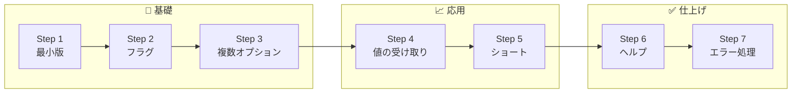
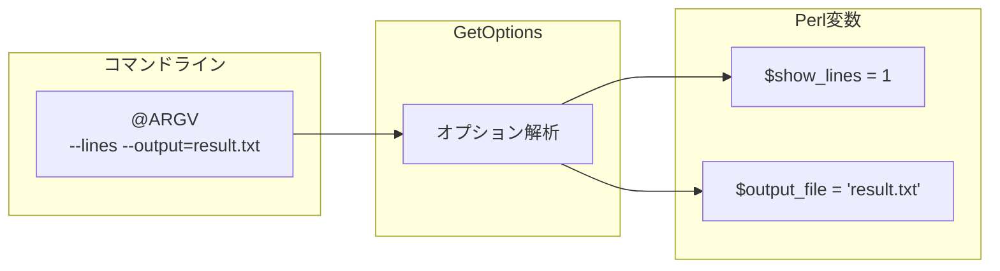
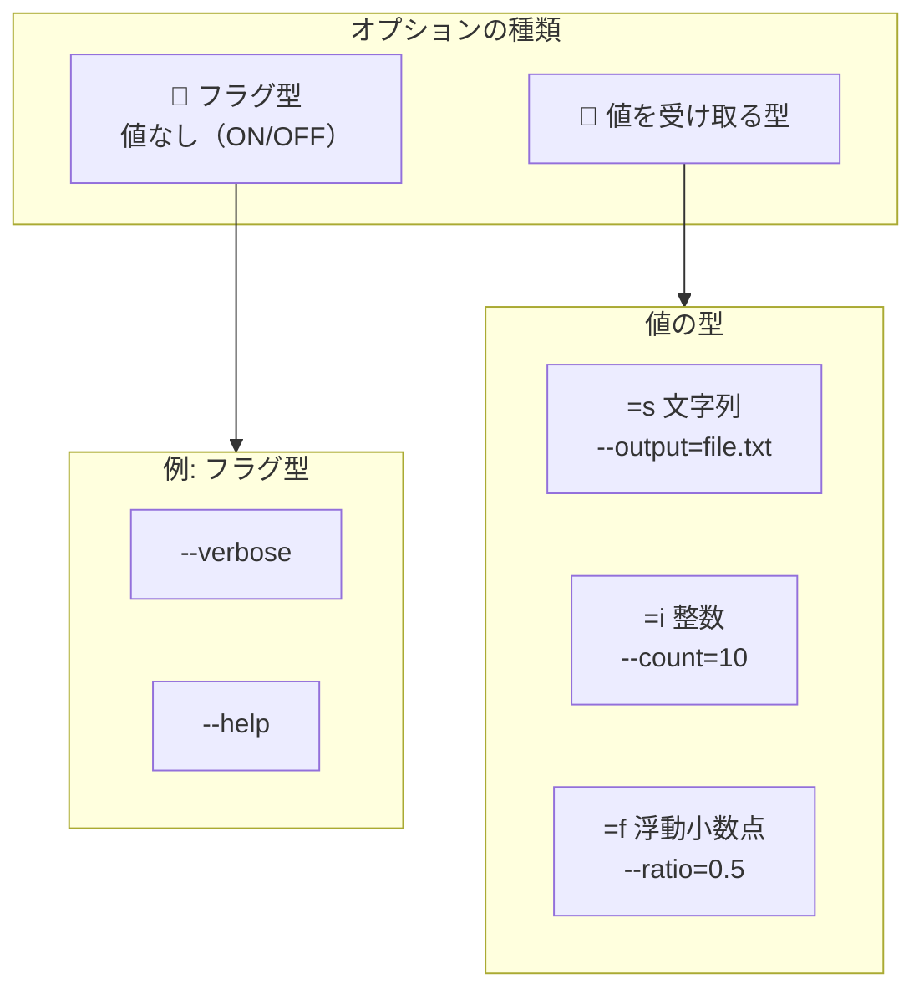

## はじめに - 作りながら覚える

この記事では、Perlの標準モジュール**Getopt::Long**を使って、実際に動くコマンドラインツールを作りながら学びます。「読んで理解する」のではなく「作って動かす」ことで、実践的なスキルが身につきます。

### 完成イメージ: wc-lite コマンド

今回作成するのは、Unixの`wc`（word count）コマンドを簡略化した**wc-lite**です。完成すると、次のように使えます。

```bash
# 行数をカウント
$ echo -e "Hello\nWorld" | perl wc-lite.pl -l
2

# 単語数をカウント
$ echo "Hello World Perl" | perl wc-lite.pl -w
3

# 複数オプションを組み合わせ
$ echo -e "Hello World\nPerl is great" | perl wc-lite.pl -l -w -c
2	5	26

# 結果をファイルに出力
$ cat sample.txt | perl wc-lite.pl --lines --output=result.txt

# ヘルプを表示
$ perl wc-lite.pl --help
```

### この記事で習得できること

この記事を読み終えると、以下のことができるようになります。

- Getopt::Longの基本的な使い方を理解する
- フラグオプション（`--verbose`など）を実装する
- 値を受け取るオプション（`--output=FILE`など）を実装する
- ショートオプション（`-l`, `-w`など）を追加する
- ヘルプメッセージとエラーハンドリングを実装する

### 学習の流れ

以下の7つのステップで、段階的に機能を追加していきます。



## 準備

### Perlスクリプトのひな形

すべてのPerlスクリプトは、以下のひな形から始めます。

```perl
#!/usr/bin/env perl
use strict;
use warnings;
use feature 'say';
```

Perlスクリプトのひな形についての詳細は、以下の記事も参考にしてください。



なお、**Getopt::Long**はPerlのコアモジュールなので、追加のインストールは不要です。

### プロジェクトフォルダの作成

作業用のディレクトリを作成します。

```bash
mkdir wc-lite
cd wc-lite
touch wc-lite.pl
chmod +x wc-lite.pl
```

## Step 1: 引数なしで動く最小版

まず、オプションを使わない最小限のスクリプトを作成します。

### 標準入力から行数をカウント

`wc-lite.pl`を以下の内容で作成してください。

```perl
#!/usr/bin/env perl
use strict;
use warnings;
use feature 'say';

my $lines = 0;

while (my $line = <STDIN>) {
    $lines++;
}

say "Lines: $lines";
```

### 動作確認

```bash
$ echo -e "Hello World\nPerl is great" | perl wc-lite.pl
Lines: 2
```

これで基本的なカウント機能ができました。次のステップでは、Getopt::Longを使ってオプションを追加していきます。

## Step 2: 最初のフラグオプション

### --lines オプションの追加

`--lines`オプションを指定したときだけ行数を表示するようにします。

```perl
#!/usr/bin/env perl
use strict;
use warnings;
use feature 'say';
use Getopt::Long;

my $show_lines = 0;

GetOptions(
    'lines' => \$show_lines,
) or die "Error in command line arguments\n";

my $lines = 0;
my $words = 0;
my $chars = 0;

while (my $line = <STDIN>) {
    $lines++;
    $words += scalar(split ' ', $line);
    $chars += length($line);
}

if ($show_lines) {
    say $lines;
}
```

動作確認をします。

```bash
$ echo -e "Hello\nWorld\nPerl" | perl wc-lite.pl --lines
3

$ echo -e "Hello\nWorld\nPerl" | perl wc-lite.pl
（何も表示されない）
```

### GetOptionsの基本構文

`GetOptions`は、コマンドライン引数を解析してPerlの変数に格納する関数です。

```perl
GetOptions(
    'オプション名' => \$変数,
) or die "Error in command line arguments\n";
```

- **'オプション名'** : ユーザーが指定するオプション（`--lines`の`lines`部分）
- **\$変数** : オプションの値を格納する変数へのリファレンス

リファレンスについては、以下の記事で詳しく解説しています。



`GetOptions`が失敗すると偽を返すため、`or die`でエラー処理をしています。

### GetOptionsの動作フロー

`GetOptions`がどのように動作するかを図で確認しましょう。



`GetOptions`は`@ARGV`からオプションを読み取り、対応する変数に値を格納します。処理済みのオプションは`@ARGV`から取り除かれます。

## Step 3: 複数のオプション

### --words, --chars の追加

行数だけでなく、単語数と文字数も表示できるようにします。

```perl
#!/usr/bin/env perl
use strict;
use warnings;
use feature 'say';
use Getopt::Long;

my $show_lines = 0;
my $show_words = 0;
my $show_chars = 0;

GetOptions(
    'lines' => \$show_lines,
    'words' => \$show_words,
    'chars' => \$show_chars,
) or die "Error in command line arguments\n";

my $lines = 0;
my $words = 0;
my $chars = 0;

while (my $line = <STDIN>) {
    $lines++;
    $words += scalar(split ' ', $line);
    $chars += length($line);
}

# 出力
my @output;
push @output, $lines if $show_lines;
push @output, $words if $show_words;
push @output, $chars if $show_chars;

if (@output) {
    say join("\t", @output);
}
```

### 組み合わせ処理

複数のオプションを組み合わせて使えます。

```bash
$ echo "Hello World Perl" | perl wc-lite.pl --lines --words
1	3

$ echo "Hello World Perl" | perl wc-lite.pl --words --chars
3	17

$ echo "Hello World Perl" | perl wc-lite.pl --lines --words --chars
1	3	17
```

## Step 4: 値を受け取るオプション

### --output=FILE の実装

結果をファイルに出力するオプションを追加します。

```perl
#!/usr/bin/env perl
use strict;
use warnings;
use feature 'say';
use Getopt::Long;

my $show_lines = 0;
my $show_words = 0;
my $show_chars = 0;
my $output_file;

GetOptions(
    'lines'    => \$show_lines,
    'words'    => \$show_words,
    'chars'    => \$show_chars,
    'output=s' => \$output_file,
) or die "Error in command line arguments\n";

my $lines = 0;
my $words = 0;
my $chars = 0;

while (my $line = <STDIN>) {
    $lines++;
    $words += scalar(split ' ', $line);
    $chars += length($line);
}

# 出力準備
my @output;
push @output, $lines if $show_lines;
push @output, $words if $show_words;
push @output, $chars if $show_chars;

my $result = join("\t", @output);

# ファイル出力または標準出力
if (defined $output_file) {
    open my $fh, '>', $output_file or die "Cannot open $output_file: $!\n";
    say $fh $result;
    close $fh;
    say "Result written to $output_file";
} else {
    say $result if @output;
}
```

動作確認をします。

```bash
$ echo "Hello World" | perl wc-lite.pl --lines --output=result.txt
Result written to result.txt

$ cat result.txt
1
```

### =s と =i の使い分け

オプションに値を受け取る場合、型を指定できます。

```perl
GetOptions(
    'output=s' => \$output_file,  # =s : 文字列（string）
    'count=i'  => \$count,        # =i : 整数（integer）
    'ratio=f'  => \$ratio,        # =f : 浮動小数点数（float）
);
```

| 指定子 | 意味 | 例 |
|--------|------|-----|
| `=s` | 文字列 | `--output=file.txt` |
| `=i` | 整数 | `--count=10` |
| `=f` | 浮動小数点数 | `--ratio=0.5` |

### オプション型の分類

オプションは大きく2種類に分けられます。



## Step 5: ショートオプション

### -l, -w, -c エイリアス

長いオプション名だけでなく、短いエイリアスも使えるようにします。

```perl
#!/usr/bin/env perl
use strict;
use warnings;
use feature 'say';
use Getopt::Long;

my $show_lines = 0;
my $show_words = 0;
my $show_chars = 0;
my $output_file;

GetOptions(
    'lines|l'    => \$show_lines,
    'words|w'    => \$show_words,
    'chars|c'    => \$show_chars,
    'output|o=s' => \$output_file,
) or die "Error in command line arguments\n";

my $lines = 0;
my $words = 0;
my $chars = 0;

while (my $line = <STDIN>) {
    $lines++;
    $words += scalar(split ' ', $line);
    $chars += length($line);
}

# 出力準備
my @output;
push @output, $lines if $show_lines;
push @output, $words if $show_words;
push @output, $chars if $show_chars;

my $result = join("\t", @output);

# ファイル出力または標準出力
if (defined $output_file) {
    open my $fh, '>', $output_file or die "Cannot open $output_file: $!\n";
    say $fh $result;
    close $fh;
    say "Result written to $output_file";
} else {
    say $result if @output;
}
```

### 'option|alias' 記法

`|`（パイプ）で区切ることで、複数のオプション名を同じ変数に紐づけられます。

```perl
'lines|l'     # --lines または -l
'output|o=s'  # --output=FILE または -o FILE
```

動作確認をします。

```bash
$ echo "Hello World Perl" | perl wc-lite.pl -l -w -c
1	3	17

$ echo "test" | perl wc-lite.pl -lwc
1	1	5
```

ショートオプションは連結して`-lwc`のように指定することもできます。

## Step 6: ヘルプメッセージ

### --help の実装

ユーザーがコマンドの使い方を確認できるよう、ヘルプオプションを追加します。

```perl
#!/usr/bin/env perl
use strict;
use warnings;
use feature 'say';
use Getopt::Long;

sub show_help {
    print <<'HELP';
Usage: wc-lite.pl [OPTIONS]

Count lines, words, and characters from standard input.

Options:
  -l, --lines        Print the line count
  -w, --words        Print the word count
  -c, --chars        Print the character count
  -o, --output=FILE  Write result to FILE instead of stdout
  -h, --help         Show this help message

Examples:
  echo "Hello World" | perl wc-lite.pl -l
  cat file.txt | perl wc-lite.pl -lwc
  cat file.txt | perl wc-lite.pl --lines --output=result.txt
HELP
    exit 0;
}

my $show_lines = 0;
my $show_words = 0;
my $show_chars = 0;
my $output_file;
my $help = 0;

GetOptions(
    'lines|l'    => \$show_lines,
    'words|w'    => \$show_words,
    'chars|c'    => \$show_chars,
    'output|o=s' => \$output_file,
    'help|h'     => \$help,
) or show_help();

show_help() if $help;

my $lines = 0;
my $words = 0;
my $chars = 0;

while (my $line = <STDIN>) {
    $lines++;
    $words += scalar(split ' ', $line);
    $chars += length($line);
}

# 出力準備
my @output;
push @output, $lines if $show_lines;
push @output, $words if $show_words;
push @output, $chars if $show_chars;

my $result = join("\t", @output);

# ファイル出力または標準出力
if (defined $output_file) {
    open my $fh, '>', $output_file or die "Cannot open $output_file: $!\n";
    say $fh $result;
    close $fh;
    say "Result written to $output_file";
} else {
    say $result if @output;
}
```

### 使いやすいヘルプの書き方

ヘルプメッセージには以下の要素を含めると使いやすくなります。

- **Usage**: コマンドの基本的な呼び出し方
- **説明**: コマンドの概要（1〜2行）
- **Options**: 各オプションの説明
- **Examples**: 具体的な使用例

ヒアドキュメント（`<<'HELP'`）を使うと、複数行のテキストを見やすく記述できます。

## Step 7: エラーハンドリング

### 必須引数のチェック

オプションが何も指定されていない場合にエラーを出すようにします。

```perl
#!/usr/bin/env perl
use strict;
use warnings;
use feature 'say';
use Getopt::Long;

sub show_help {
    print <<'HELP';
Usage: wc-lite.pl [OPTIONS]

Count lines, words, and characters from standard input.

Options:
  -l, --lines        Print the line count
  -w, --words        Print the word count
  -c, --chars        Print the character count
  -o, --output=FILE  Write result to FILE instead of stdout
  -h, --help         Show this help message

Examples:
  echo "Hello World" | perl wc-lite.pl -l
  cat file.txt | perl wc-lite.pl -lwc
  cat file.txt | perl wc-lite.pl --lines --output=result.txt
HELP
    exit 0;
}

sub show_error {
    my ($message) = @_;
    warn "Error: $message\n";
    warn "Use --help for usage information.\n";
    exit 1;
}

my $show_lines = 0;
my $show_words = 0;
my $show_chars = 0;
my $output_file;
my $help = 0;

GetOptions(
    'lines|l'    => \$show_lines,
    'words|w'    => \$show_words,
    'chars|c'    => \$show_chars,
    'output|o=s' => \$output_file,
    'help|h'     => \$help,
) or show_error("Invalid option");

show_help() if $help;

# 必須チェック: 少なくとも1つのカウントオプションが必要
unless ($show_lines || $show_words || $show_chars) {
    show_error("At least one of -l, -w, -c is required");
}

my $lines = 0;
my $words = 0;
my $chars = 0;

while (my $line = <STDIN>) {
    $lines++;
    $words += scalar(split ' ', $line);
    $chars += length($line);
}

# 出力準備
my @output;
push @output, $lines if $show_lines;
push @output, $words if $show_words;
push @output, $chars if $show_chars;

my $result = join("\t", @output);

# ファイル出力または標準出力
if (defined $output_file) {
    open my $fh, '>', $output_file or die "Cannot open $output_file: $!\n";
    say $fh $result;
    close $fh;
    say "Result written to $output_file";
} else {
    say $result if @output;
}
```

### 不正オプションへの対応

`GetOptions`は不正なオプションが指定されると偽を返します。

```bash
$ echo "test" | perl wc-lite.pl --invalid
Error: Invalid option
Use --help for usage information.

$ echo "test" | perl wc-lite.pl
Error: At least one of -l, -w, -c is required
Use --help for usage information.
```

エラーメッセージは標準エラー出力（`warn`）に出力し、標準出力を汚さないようにします。

## 完成コード

### 全ソースコード

```perl
#!/usr/bin/env perl
use strict;
use warnings;
use feature 'say';
use Getopt::Long;

sub show_help {
    print <<'HELP';
Usage: wc-lite.pl [OPTIONS]

Count lines, words, and characters from standard input.

Options:
  -l, --lines        Print the line count
  -w, --words        Print the word count
  -c, --chars        Print the character count
  -o, --output=FILE  Write result to FILE instead of stdout
  -h, --help         Show this help message

Examples:
  echo "Hello World" | perl wc-lite.pl -l
  cat file.txt | perl wc-lite.pl -lwc
  cat file.txt | perl wc-lite.pl --lines --output=result.txt
HELP
    exit 0;
}

sub show_error {
    my ($message) = @_;
    warn "Error: $message\n";
    warn "Use --help for usage information.\n";
    exit 1;
}

my $show_lines = 0;
my $show_words = 0;
my $show_chars = 0;
my $output_file;
my $help = 0;

GetOptions(
    'lines|l'    => \$show_lines,
    'words|w'    => \$show_words,
    'chars|c'    => \$show_chars,
    'output|o=s' => \$output_file,
    'help|h'     => \$help,
) or show_error("Invalid option");

show_help() if $help;

unless ($show_lines || $show_words || $show_chars) {
    show_error("At least one of -l, -w, -c is required");
}

my $lines = 0;
my $words = 0;
my $chars = 0;

while (my $line = <STDIN>) {
    $lines++;
    $words += scalar(split ' ', $line);
    $chars += length($line);
}

my @output;
push @output, $lines if $show_lines;
push @output, $words if $show_words;
push @output, $chars if $show_chars;

my $result = join("\t", @output);

if (defined $output_file) {
    open my $fh, '>', $output_file or die "Cannot open $output_file: $!\n";
    say $fh $result;
    close $fh;
    say "Result written to $output_file";
} else {
    say $result;
}
```

### 動作確認例

```bash
# 行数のカウント
$ echo -e "Line 1\nLine 2\nLine 3" | perl wc-lite.pl -l
3

# 単語数のカウント
$ echo "Perl is a powerful language" | perl wc-lite.pl -w
5

# 全てのカウント
$ echo "Hello World" | perl wc-lite.pl -lwc
1	2	12

# ファイルへの出力
$ cat /etc/passwd | perl wc-lite.pl -l --output=count.txt
Result written to count.txt

# ヘルプの表示
$ perl wc-lite.pl --help
Usage: wc-lite.pl [OPTIONS]
...
```

## まとめ

### 習得したスキル

この記事を通じて、以下のスキルを習得しました。

- **Getopt::Longの基本**: `use Getopt::Long`と`GetOptions`関数
- **フラグオプション**: `'verbose' => \$flag`の形式
- **値を受け取るオプション**: `'output=s'`（文字列）、`'count=i'`（整数）
- **ショートオプション**: `'lines|l'`のエイリアス記法
- **ヘルプメッセージ**: ヒアドキュメントを使った使いやすいヘルプ
- **エラーハンドリング**: 不正オプションと必須引数のチェック

### 次のステップ

Getopt::Longには、この記事で紹介した以外にも多くの機能があります。

- **配列オプション**: 複数回指定できるオプション（`--include=dir1 --include=dir2`）
- **ハッシュオプション**: キーと値のペア（`--define=DEBUG=1`）
- **否定オプション**: `--no-verbose`のような否定形
- **サブコマンド**: `git add`のようなサブコマンドパターン

これらの応用的な内容は、以下の記事で詳しく解説しています。



Getopt::Longを使いこなせば、プロフェッショナルなコマンドラインツールを簡単に作成できます。ぜひ自分だけのコマンドを作ってみてください。
