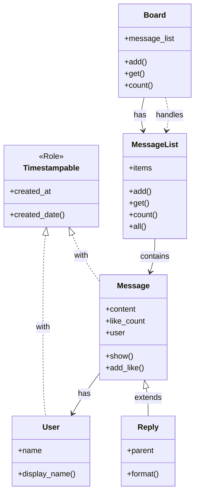

[@nqounet](https://x.com/nqounet)です。

「Mooで覚えるオブジェクト指向プログラミング」シリーズの第12回、最終回です。

## 前回の振り返り

前回は、属性として持っているオブジェクトにメソッド呼び出しを委譲する**handles**を学びました。



`handles`オプションを使うことで、クラスをスリムに保ちながら、内部オブジェクトの機能を直接呼び出せるようになりましたね。

今回は、属性に不正な値が入ることを防ぐ**型制約（isa）**を学びます。

## 問題：数値と文字列を取り違えるバグ

掲示板アプリに「いいね数」機能を追加しました。しかし、あるバグが発生しています。

```perl
package Message {
    use Moo;

    has content    => (is => 'ro', required => 1);
    has like_count => (is => 'rw', default => 0);

    sub add_like {
        my $self = shift;
        $self->like_count($self->like_count + 1);
    }
};

my $msg = Message->new(content => 'こんにちは！');
$msg->like_count('たくさん');  # 間違って文字列を設定！
$msg->add_like;                # 数値演算でおかしな結果に...
```

`like_count`は数値であるべきなのに、文字列`'たくさん'`が設定されてしまいました。このようなバグは、コードが大きくなると発見が難しくなります。

- 実行時まで問題に気づけない
- バグの原因が設定箇所から離れた場所で発覚する
- デバッグに時間がかかる

## 解決策：isaで型制約を指定

Mooでは`isa`オプションを使って、属性に設定できる値の型を制限できます。`Types::Standard`モジュールと組み合わせることで、強力な型チェックが可能になります。

```perl
package Message {
    use Moo;
    use Types::Standard qw(Int Str);  # 型をインポート

    has content => (
        is       => 'ro',
        isa      => Str,
        required => 1,
    );

    has like_count => (
        is      => 'rw',
        isa     => Int,  # 整数のみ許可！
        default => 0,
    );

    sub add_like {
        my $self = shift;
        $self->like_count($self->like_count + 1);
    }
};

my $msg = Message->new(content => 'こんにちは！');
$msg->add_like;
print $msg->like_count . "\n";  # 1

# $msg->like_count('たくさん');  # エラー！Intではない値は拒否される
```

`isa => Int`と指定することで、`like_count`には整数しか設定できなくなります。文字列を設定しようとすると、その場でエラーが発生します。

- バグを「設定しようとした瞬間」に検出できる
- エラーメッセージで何が間違っているか分かる
- 不正な値がシステム内部に入り込まない

`Types::Standard`には他にも便利な型が用意されています。

- `Str` - 文字列
- `Int` - 整数
- `Num` - 数値（小数含む）
- `Bool` - 真偽値
- `ArrayRef` - 配列リファレンス
- `HashRef` - ハッシュリファレンス
- `Object` - オブジェクト

型制約を活用することで、オブジェクトの整合性を保ち、バグを未然に防ぐことができます。

## シリーズのまとめ：掲示板のクラス構成

全12回で学んだ知識を使って、掲示板アプリのクラス構成を振り返りましょう。



このクラス図は、シリーズを通じて作り上げてきた掲示板アプリの全体像です。

## 学んだ概念の一覧

12回にわたって、オブジェクト指向プログラミングの基礎を学んできました。

| 回 | 概念 | キーワード |
|:--|:--|:--|
| 第2回 | データとロジックをまとめる | `has`、`sub` |
| 第3回 | オブジェクトを複数作る | `new`（コンストラクタ） |
| 第4回 | 読み書きを制限する | `is => 'ro'`、`is => 'rw'` |
| 第5回 | 必須と初期値を設定する | `required`、`default` |
| 第6回 | 内部の実装を隠す | カプセル化 |
| 第7回 | 複数のクラスを連携させる | オブジェクトの関連 |
| 第8回 | 親クラスの機能を引き継ぐ | `extends`（継承） |
| 第9回 | 親のメソッドを上書きする | オーバーライド |
| 第10回 | 継承なしで機能を共有する | `Moo::Role`、`with` |
| 第11回 | 持っているものに仕事を任せる | `handles`（委譲） |
| 第12回 | 型チェックでバグを防ぐ | `isa`（型制約） |

これらの概念は、Perlに限らず多くのプログラミング言語で通用する普遍的な知識です。

## 今後の学習へ

Mooで基礎を身につけたら、さらに深く学んでいくことができます。

### Moose

MooはMooseの軽量版として設計されています。より高度な機能（メタプログラミング、型の組み合わせなど）が必要になったら、Mooseへの移行を検討してください。Mooで書いたコードは、ほぼそのままMooseで動作します。



### Types::Standard

今回紹介した`Types::Standard`には、さらに多くの型と機能があります。型の組み合わせ（`ArrayRef[Int]`など）やカスタム型の定義も可能です。



### Moo公式ドキュメント

Mooには他にも`BUILD`（オブジェクト生成時のフック）、`BUILDARGS`（引数の前処理）、`trigger`（属性変更時の処理）など、便利な機能があります。



## おわりに

全12回にわたる「Mooで覚えるオブジェクト指向プログラミング」シリーズ、いかがでしたでしょうか。

オブジェクト指向は、最初は難しく感じるかもしれません。しかし、掲示板アプリという具体的な例を通じて、少しずつ概念を積み重ねてきました。

- データとロジックをまとめて整理する
- 変更されてはいけないものを守る
- 機能を分担して責務を分ける
- 共通の振る舞いを再利用する
- 不正な値を入り口で弾く

これらの考え方は、きっとあなたのコードをより読みやすく、保守しやすいものにしてくれるはずです。

最後まで読んでいただき、ありがとうございました。このシリーズが、あなたのプログラミングの旅の助けになれば幸いです。
