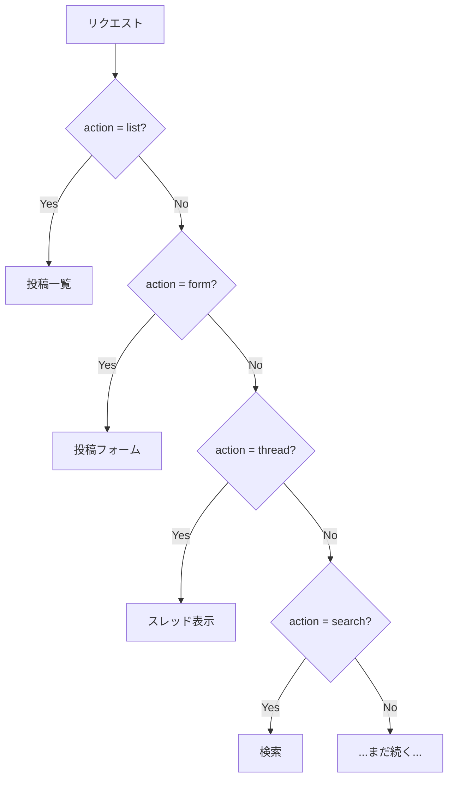

[@nqounet](https://x.com/nqounet)です。

「Mooを使ってディスパッチャーを作ってみよう」シリーズの第1回です。

このシリーズは、前シリーズ「Mooで覚えるオブジェクト指向プログラミング」の続編です。まだ読んでいない方は、先にこちらをご覧ください。



今回は、前シリーズで作ったBBSに複数の機能を追加してみます。

## やりたいこと

BBSに以下の3つの機能を追加したいと考えています。

- 投稿一覧を表示する
- 投稿フォームを表示する
- スレッドを表示する

ユーザーがどの機能を使いたいかは、`action`というパラメータで指定してもらいます。この「パラメータに応じて処理を振り分ける」仕組みをディスパッチと呼びます。

## if/elseで機能を切り替える

まずは、素直にif/elseで実装してみましょう。

```perl
package BBS {
    use Moo;

    sub dispatch {
        my ($self, $action) = @_;

        if ($action eq 'list') {
            print "投稿一覧を表示\n";
        }
        elsif ($action eq 'form') {
            print "投稿フォームを表示\n";
        }
        elsif ($action eq 'thread') {
            print "スレッドを表示\n";
        }
        else {
            print "不明なアクションです\n";
        }
    }
};

my $bbs = BBS->new();
$bbs->dispatch('list');    # 投稿一覧を表示
$bbs->dispatch('form');    # 投稿フォームを表示
```

動きますね。3つの機能なら、これで十分です。

## 機能が増えるとどうなる？

しかし、BBSが人気になって機能追加の要望が増えてきました。検索、ユーザー情報、お気に入り、通知、設定...。全部追加してみましょう。

```perl
sub dispatch {
    my ($self, $action) = @_;

    if ($action eq 'list') {
        print "投稿一覧を表示\n";
    }
    elsif ($action eq 'form') {
        print "投稿フォームを表示\n";
    }
    elsif ($action eq 'thread') {
        print "スレッドを表示\n";
    }
    elsif ($action eq 'search') {
        print "検索結果を表示\n";
    }
    elsif ($action eq 'user') {
        print "ユーザー情報を表示\n";
    }
    elsif ($action eq 'favorites') {
        print "お気に入りを表示\n";
    }
    elsif ($action eq 'notifications') {
        print "通知を表示\n";
    }
    elsif ($action eq 'settings') {
        print "設定画面を表示\n";
    }
    else {
        print "不明なアクションです\n";
    }
}
```

だいぶ長くなってきました。このif/elseチェーンには、いくつかの問題があります。

- 新しい機能を追加するたびに、このメソッドを修正しなければならない
- 機能が増えるほど、コードが読みにくくなる
- どこかで書き間違えると、全体に影響が出る可能性がある

## if/elseの分岐を図で見てみよう

今の処理の流れを図にしてみます。リクエストが来ると、if/elseで順番に条件をチェックしていきます。



分岐がどんどん深くなっていくのが分かります。これは「if/elseの肥大化問題」と呼ばれ、コードの見通しが悪くなる典型的なパターンです。

もっと良い方法はないのでしょうか？

## まとめ

- BBSに複数の機能を追加するため、if/elseで振り分けを実装した
- パラメータに応じて処理を振り分ける仕組みをディスパッチと呼ぶ
- 機能が増えるとif/elseが肥大化し、コードが読みにくくなる
- 新しい機能を追加するたびに既存のメソッドを修正する必要がある

## 次回予告

次回は、if/elseを使わずにハッシュで処理を振り分ける「ディスパッチテーブル」を学びます。コードがすっきりする感覚を体験しましょう。
