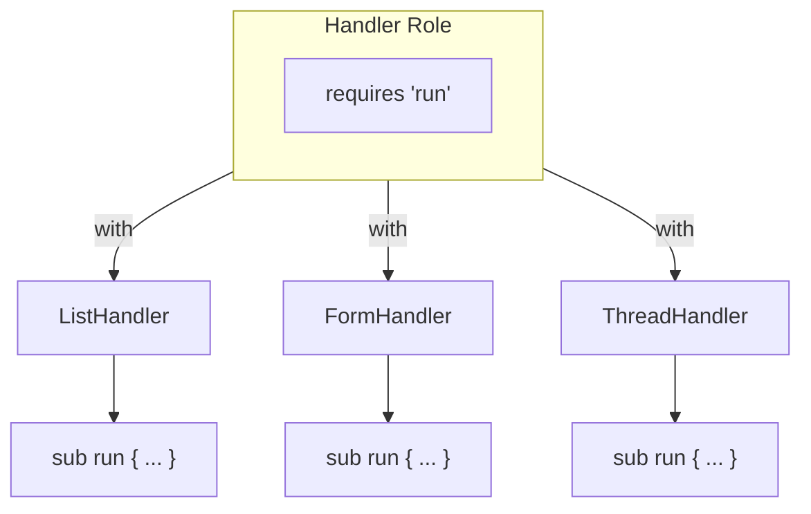

[@nqounet](https://x.com/nqounet)です。

前回は、処理を専用のハンドラークラスに切り出して、責任を分離する方法を学びました。`ListHandler`や`FormHandler`が共通の`run`メソッドを持つ設計でしたね。



今回は、「すべてのハンドラーは`run`メソッドを持つ」という約束をrequiresで明示的に定義します。

## 問題：約束が守られているかわからない

新しく`ThreadHandler`を追加するとき、`run`ではなく`execute`というメソッド名で作ってしまったらどうなるでしょうか？

```perl
package ThreadHandler {
    use Moo;

    sub execute {  # runじゃなくてexecute…
        my ($self) = @_;
        print "スレッドを表示\n";
    }
};
```

コードは動きますが、呼び出す側で`$handler->run()`とすると「メソッドがない」というエラーになります。実行時にしかミスに気づけないのは困りますね。

「すべてのハンドラーは`run`メソッドを持つ」という共通ルールを、コードで強制できないでしょうか。

## 解決策：Moo::Roleのrequiresで約束を定義

`Moo::Role`には`requires`という機能があります。これは「このロールを適用するクラスは、指定したメソッドを必ず実装しなければならない」という約束です。

前シリーズの第10回で`Moo::Role`と`with`を学びましたね。



前回は属性やメソッドを提供するロールでしたが、今回はメソッドを要求するロールを作ります。他のプログラミング言語では、このような仕組みを「インターフェース」と呼ぶことがあります。



## Handlerロールの作成

`requires 'run'`を使って、Handlerロールを作ります。

```perl
package Handler {
    use Moo::Role;

    requires 'run';
};
```

たった3行ですが、これで「`run`メソッドを持つこと」が約束として定義されました。このロールを`with`で適用したクラスは、`run`メソッドを実装していなければプログラム起動時にエラーになります。

## ハンドラークラスでのwith適用

作成したHandlerロールを各ハンドラークラスに適用します。

```perl
package Handler {
    use Moo::Role;

    requires 'run';
};

package ListHandler {
    use Moo;
    with 'Handler';  # Handlerロールを適用

    sub run {
        my ($self) = @_;
        print "投稿一覧を表示\n";
    }
};

package FormHandler {
    use Moo;
    with 'Handler';  # 同じロールを適用

    sub run {
        my ($self) = @_;
        print "投稿フォームを表示\n";
    }
};

my $list = ListHandler->new();
$list->run();  # 投稿一覧を表示

my $form = FormHandler->new();
$form->run();  # 投稿フォームを表示
```

もし`run`メソッドを実装し忘れたクラスに`with 'Handler'`を書くと、プログラム起動時にエラーが発生します。

```
Can't apply Handler to BrokenHandler - missing run
```

実行時ではなく起動時にエラーになるので、早い段階でミスに気づけます。

## まとめ

- `requires`で「このメソッドを必ず実装せよ」という約束を定義できる
- 約束を守らないクラスはプログラム起動時にエラーになる
- この仕組みは他の言語では「インターフェース」と呼ばれる
- 新しいハンドラーを追加する際の実装漏れを防げる

## 次回予告

次回は、ハンドラーを保持して処理を振り分けるディスパッチャークラスを作ります。`handles`を使った委譲も活用しながら、司令塔となるクラスを設計していきましょう。
