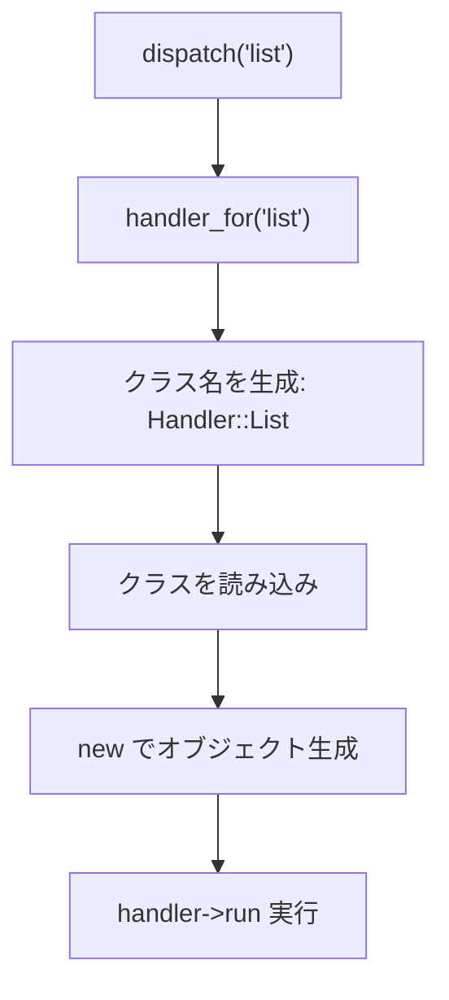

[@nqounet](https://x.com/nqounet)です。

前回は、複数のハンドラーを登録して管理するレジストリを作りました。



今回は、**アクション名から自動でハンドラーを選択・生成する仕組み**を作ります。

## 問題：ハンドラーを事前に全部登録するのは面倒

前回のレジストリでは、使うハンドラーを事前にすべて登録しておく必要がありました。

```perl
$dispatcher->register_handler('list', ListHandler->new);
$dispatcher->register_handler('form', FormHandler->new);
$dispatcher->register_handler('thread', ThreadHandler->new);
# まだまだ続く...
```

ハンドラーが10個、20個と増えてくると、登録コードも長くなってしまいます。もっと楽な方法はないでしょうか？

## 解決策：名前からハンドラーを自動生成する

アクション名から対応するハンドラークラスを特定し、必要なときに生成する仕組みを作ります。これは「Factory（ファクトリー）」と呼ばれるパターンの簡易版です。

```perl
package Dispatcher {
    use Moo;
    use Module::Load qw(load);

    has handler_namespace => (
        is      => 'ro',
        default => sub { 'Handler' },
    );

    sub handler_for {
        my ($self, $action) = @_;
        
        # 'list' → 'Handler::List' のように変換
        my $class = $self->handler_namespace . '::' . ucfirst($action);
        
        # クラスを読み込み
        eval { load $class };
        if ($@) {
            die "Handler not found: $class";
        }
        
        # オブジェクトを生成して返す
        return $class->new;
    }

    sub dispatch {
        my ($self, $action) = @_;
        my $handler = $self->handler_for($action);
        $handler->run;
    }
};
```

`handler_for`メソッドは、アクション名から対応するクラス名を組み立て、そのクラスを読み込んでオブジェクトを生成します。

## 使ってみよう

```perl
# ハンドラークラスを用意
# Handler/List.pm
package Handler::List {
    use Moo;
    with 'Handler';
    sub run { print "投稿一覧を表示\n" }
};

# Handler/Form.pm
package Handler::Form {
    use Moo;
    with 'Handler';
    sub run { print "投稿フォームを表示\n" }
};

# ディスパッチャーを使う
my $dispatcher = Dispatcher->new;

# 名前を指定するだけで自動的にハンドラーが生成される
$dispatcher->dispatch('list');   # Handler::List が自動で生成・実行される
$dispatcher->dispatch('form');   # Handler::Form が自動で生成・実行される
```

事前登録なしで、名前を指定するだけでハンドラーが使えるようになりました。



## まとめ

- 名前からハンドラーを自動生成する仕組みをFactoryパターンと呼ぶ
- アクション名からクラス名を組み立てて動的に読み込む
- `Module::Load`の`load`関数でクラスを動的に読み込める
- 事前登録なしで、必要なときにハンドラーを生成できる

## 次回予告

次回は、URLパターンでハンドラーを振り分ける機能を追加します。より実践的なルーティングの仕組みを学びましょう。お楽しみに。
