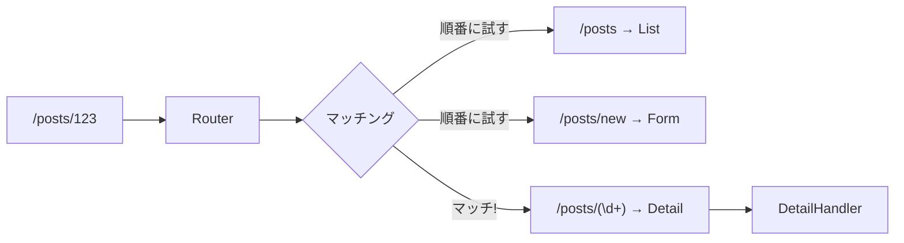

[@nqounet](https://x.com/nqounet)です。

前回は、アクション名から自動でハンドラーを生成する仕組みを作りました。



今回は、URLパターンでハンドラーを振り分ける機能を追加します。

## 問題：単純な名前だけでは足りない

これまでは`list`や`form`のような単純な名前でハンドラーを選んでいました。しかし、実際のWebアプリケーションでは、URLパターンで振り分けたい場面が多くあります。

例えば：
- `/posts` → 投稿一覧
- `/posts/123` → 投稿ID 123の詳細
- `/posts/new` → 新規投稿フォーム

URLの形式を見て、適切なハンドラーを選ぶ仕組みが必要です。

## 解決策：正規表現でURLパターンをマッチング

URLパターンと対応するハンドラーを登録し、正規表現でマッチングする仕組みを作ります。

```perl
package Router {
    use Moo;

    has routes => (
        is      => 'ro',
        default => sub { [] },
    );

    sub add_route {
        my ($self, $pattern, $handler) = @_;
        push @{$self->routes}, {
            pattern => $pattern,
            handler => $handler,
        };
    }

    sub match {
        my ($self, $path) = @_;
        for my $route (@{$self->routes}) {
            my $pattern = $route->{pattern};
            if ($path =~ /^$pattern$/) {
                return $route->{handler};
            }
        }
        return undef;  # マッチしなかった
    }
};
```

`add_route`でURLパターン（正規表現）とハンドラーを登録し、`match`でパスに一致するハンドラーを探します。

## 使ってみよう

```perl
# ルーターを作成
my $router = Router->new;

# ルートを登録
$router->add_route('/posts',        ListHandler->new);
$router->add_route('/posts/new',    FormHandler->new);
$router->add_route('/posts/(\d+)',  DetailHandler->new);

# マッチングしてハンドラーを取得
my $handler = $router->match('/posts');      # ListHandler
$handler->run if $handler;

$handler = $router->match('/posts/123');     # DetailHandler
$handler->run if $handler;

$handler = $router->match('/unknown');       # undef（マッチしない）
warn "Not Found" unless $handler;
```

URLの形式に応じて、適切なハンドラーが選ばれるようになりました。



## まとめ

- URLパターンでハンドラーを振り分ける仕組みをルーターと呼ぶ
- 正規表現を使ってURLパターンをマッチングする
- `add_route`でパターンとハンドラーを登録する
- `match`でパスに一致するハンドラーを探す

## 次回予告

次回は、これまで作ってきた機能を統合し、完成したディスパッチャーをBBSに組み込みます。いよいよ完成です。お楽しみに。
