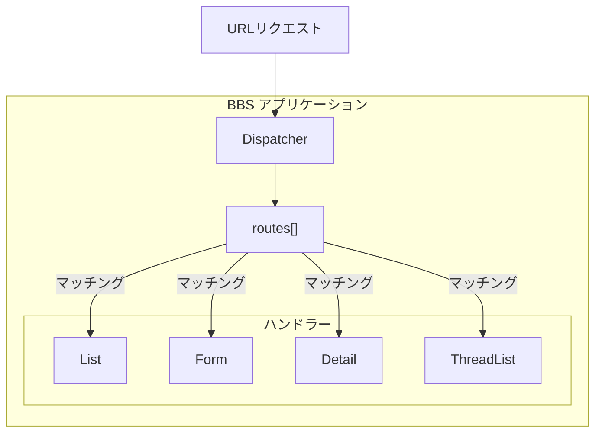

[@nqounet](https://x.com/nqounet)です。

前回は、URLパターンでハンドラーを振り分けるルーター機能を作りました。



今回は、これまで作ってきた機能を統合し、完成したディスパッチャーをBBSに組み込みます。

## 振り返り：ここまでの道のり

第1回から第10回まで、少しずつ機能を追加してきました。

1. if/elseで機能を切り替える（問題発見）
2. ハッシュで振り分ける（ディスパッチテーブル）
3. 処理を変数に入れる（コードリファレンス）
4. 処理をクラスに分ける（ハンドラークラス）
5. 共通の約束を決める（requires）
6. 司令塔クラスを作る（Dispatcher）
7. 動的に切り替える
8. ハンドラーを登録する（レジストリ）
9. 自動で選ぶ仕組み（Factory）
10. URLで振り分ける（ルーティング）

これらを組み合わせて、完成形を作りましょう。

## 完成したディスパッチャー

```perl
package BBS::Dispatcher {
    use Moo;
    use Module::Load qw(load);

    has routes => (
        is      => 'ro',
        default => sub { [] },
    );

    has handler_namespace => (
        is      => 'ro',
        default => sub { 'BBS::Handler' },
    );

    sub add_route {
        my ($self, $pattern, $handler_name) = @_;
        push @{$self->routes}, {
            pattern => $pattern,
            handler => $handler_name,
        };
    }

    sub dispatch {
        my ($self, $path) = @_;
        
        # ルートをマッチング
        for my $route (@{$self->routes}) {
            if ($path =~ /^$route->{pattern}$/) {
                my $handler = $self->_create_handler($route->{handler});
                return $handler->run;
            }
        }
        
        die "Not Found: $path";
    }

    sub _create_handler {
        my ($self, $name) = @_;
        my $class = $self->handler_namespace . '::' . $name;
        eval { load $class };
        die "Handler not found: $class" if $@;
        return $class->new;
    }
};
```

ルーティング、レジストリ、ファクトリーの機能を1つのクラスに統合しました。

## BBSで使ってみよう

```perl
# ディスパッチャーを作成
my $dispatcher = BBS::Dispatcher->new;

# ルートを登録
$dispatcher->add_route('/posts',        'List');
$dispatcher->add_route('/posts/new',    'Form');
$dispatcher->add_route('/posts/(\d+)',  'Detail');
$dispatcher->add_route('/threads',      'ThreadList');

# リクエストに応じてディスパッチ
$dispatcher->dispatch('/posts');       # BBS::Handler::List が実行される
$dispatcher->dispatch('/posts/new');   # BBS::Handler::Form が実行される
$dispatcher->dispatch('/posts/42');    # BBS::Handler::Detail が実行される
```

URLを渡すだけで、適切なハンドラーが選ばれて実行されます。



## if/elseとの比較

第1回で書いた、if/elseで機能を切り替えるコードを思い出してください。

Before（if/else）：
```perl
if ($action eq 'list') {
    show_list();
} elsif ($action eq 'form') {
    show_form();
} elsif ($action eq 'thread') {
    show_thread();
} elsif ($action eq 'detail') {
    show_detail();
} else {
    show_error();
}
```

After（ディスパッチャー）：
```perl
$dispatcher->dispatch($path);
```

コードがすっきりしただけでなく、新しい機能を追加するときも`add_route`でルートを追加するだけになりました。

## まとめ

- ルーティング、レジストリ、ファクトリーを統合してディスパッチャーを完成させた
- URLを渡すだけで適切なハンドラーが選ばれて実行される
- if/elseの羅列から、シンプルで拡張しやすい設計になった
- 新しい機能を追加するときは`add_route`でルートを追加するだけ

## 次回予告

次回は最終回です。実は、私たちが作ってきたこの仕組みには名前があります。「デザインパターン」の世界を覗いてみましょう。お楽しみに。
