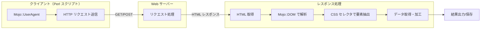
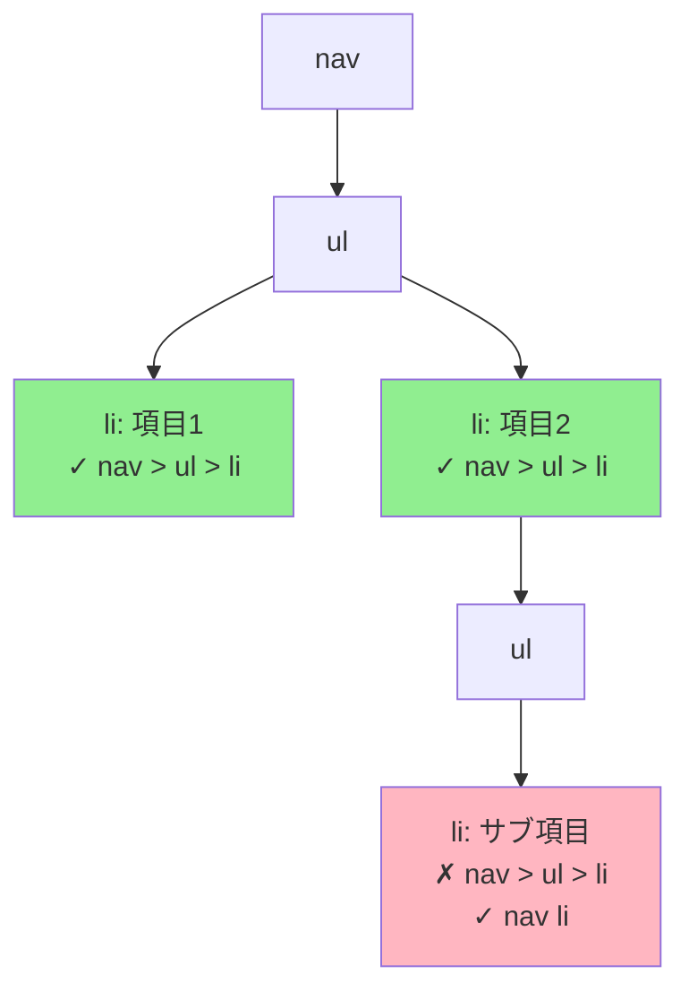
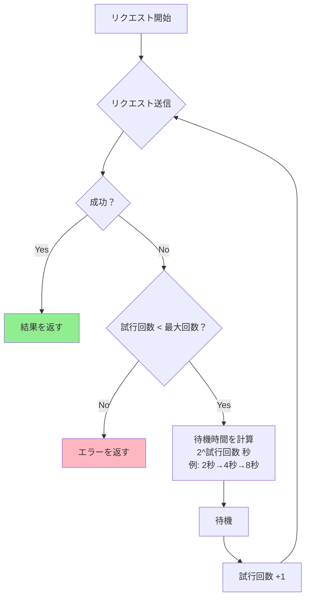
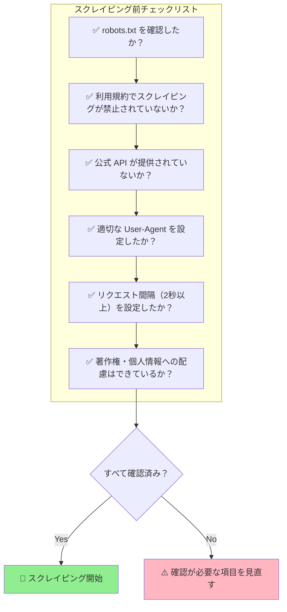

## はじめに - Perl で Web スクレイピングを始めよう

Web スクレイピングとは、Web サイトから自動的にデータを取得する技術のことです。ニュースサイトの見出しを収集したり、EC サイトの価格情報を取得したりと、さまざまな場面で活用されています。

以下の図は、Web スクレイピングの全体的な処理フローを示しています。



Perl には複数の HTTP クライアントライブラリがありますが、この記事では **Mojo::UserAgent** を使います。Mojo::UserAgent を選ぶ理由は以下のとおりです。

- **Mojo::DOM との統合**: HTTP リクエストと HTML 解析が一貫した API で行える
- **モダンな設計**: CSS セレクタで直感的に要素を抽出できる
- **活発な開発**: 2024-2025 年現在も継続的にアップデートされている
- **豊富な機能**: Cookie 管理、プロキシ対応、非同期処理までサポート

この記事を読み終えると、Perl で基本的な Web スクレイピングができるようになります。対象読者は、Perl の基礎（変数、配列、ハッシュ、サブルーチン）を理解している方です。

## 環境準備 - Mojolicious をインストールする

### cpanm でインストール

Mojo::UserAgent は Mojolicious ディストリビューションに含まれています。以下のコマンドでインストールできます。

```bash
cpanm Mojolicious
```

cpanm がインストールされていない場合は、まず cpanm をインストールしてください。

```bash
curl -L https://cpanmin.us | perl - App::cpanminus
```

Mojolicious が必要とする Perl のバージョンは **5.16 以上** です。お使いの Perl バージョンは以下のコマンドで確認できます。

```bash
perl -v
```

インストールが完了したら、以下のコマンドで確認しましょう。

```bash
perl -MMojolicious -e 'print $Mojolicious::VERSION, "\n"'
```

バージョン番号（例: `9.40`）が表示されれば、インストールは成功です。

### 最初のリクエストで動作確認

インストールが完了したら、5 行で動くサンプルコードを実行してみましょう。

```perl
#!/usr/bin/env perl
use strict;
use warnings;
use Mojo::UserAgent;

my $ua = Mojo::UserAgent->new;
my $res = $ua->get('https://example.com')->result;
print $res->dom->at('title')->text, "\n";
```

このコードを `test.pl` として保存し、実行します。

```bash
perl test.pl
```

`Example Domain` と表示されれば、Mojo::UserAgent は正常に動作しています。

## HTTP リクエストの基本を学ぶ

### GET リクエスト - Web ページを取得する

GET リクエストは、指定した URL からリソースを取得するための最も基本的な HTTP メソッドです。

```perl
#!/usr/bin/env perl
use strict;
use warnings;
use Mojo::UserAgent;

my $ua = Mojo::UserAgent->new;

# GETリクエストを送信
my $tx = $ua->get('https://example.com/');

# resultメソッドでレスポンスを取得
my $res = $tx->result;

# HTMLボディを取得
print $res->body;
```

`get` メソッドは `Mojo::Transaction::HTTP` オブジェクトを返します。`result` メソッドを呼び出すと `Mojo::Message::Response` オブジェクトを取得でき、`body` メソッドでレスポンスボディ（HTML）を取得できます。

クエリパラメータを付けたい場合は、URL に直接追加するか、ハッシュで渡します。

```perl
# URLに直接記述
my $tx = $ua->get('https://example.com/search?q=perl&page=1');

# またはクエリパラメータをハッシュで渡す
my $tx = $ua->get('https://example.com/search' => form => {
    q    => 'perl',
    page => 1,
});
```

### POST リクエスト - データを送信する

POST リクエストは、サーバーにデータを送信するために使います。フォームデータを送信する場合と JSON データを送信する場合の 2 つの方法があります。

**フォームデータの送信:**

```perl
#!/usr/bin/env perl
use strict;
use warnings;
use Mojo::UserAgent;

my $ua = Mojo::UserAgent->new;

# フォームデータをPOST（※実際のコードでは認証情報をハードコードしないこと）
my $tx = $ua->post('https://httpbin.org/post' => form => {
    username => 'myuser',
    password => 'mypassword',
});

my $res = $tx->result;
print $res->body;
```

> **注意:** 上記は動作確認用のサンプルです。実際のアプリケーションでは、認証情報をソースコードにハードコードせず、環境変数や設定ファイルから読み込むようにしてください。

**JSON データの送信:**

```perl
#!/usr/bin/env perl
use strict;
use warnings;
use Mojo::UserAgent;

my $ua = Mojo::UserAgent->new;

# JSONデータをPOST
my $tx = $ua->post('https://httpbin.org/post' => json => {
    name  => 'Taro',
    email => 'taro@example.com',
});

my $res = $tx->result;
print $res->body;
```

`form` オプションはフォームデータ（`application/x-www-form-urlencoded`）として送信し、`json` オプションは JSON（`application/json`）として送信します。

### レスポンスをチェックする

リクエストが成功したかどうかを確認するには、レスポンスオブジェクトのメソッドを使います。

```perl
#!/usr/bin/env perl
use strict;
use warnings;
use Mojo::UserAgent;

my $ua = Mojo::UserAgent->new;
my $tx = $ua->get('https://example.com/');
my $res = $tx->result;

# 成功判定（2xx系ステータスコード）
if ($res->is_success) {
    print "リクエスト成功\n";
    print "ステータスコード: ", $res->code, "\n";
} else {
    print "リクエスト失敗\n";
    print "ステータスコード: ", $res->code, "\n";
    print "メッセージ: ", $res->message, "\n";
}
```

主なチェックメソッドは以下のとおりです。

- `is_success`: 2xx 系のステータスコードなら真を返す
- `is_error`: 4xx または 5xx 系のステータスコードなら真を返す
- `code`: HTTP ステータスコード（200, 404, 500 など）を返す
- `message`: HTTP ステータスメッセージ（OK, Not Found など）を返す

## HTML 解析入門 - Mojo::DOM の使い方

### DOM オブジェクトを取得する

Mojo::UserAgent の大きな利点の一つは、レスポンスから直接 DOM オブジェクトを取得できることです。

```perl
my $ua = Mojo::UserAgent->new;
my $res = $ua->get('https://example.com/')->result;

# DOMオブジェクトを取得
my $dom = $res->dom;
```

DOM（Document Object Model）とは、HTML や XML ドキュメントをツリー構造として扱うためのインターフェースです。Mojo::DOM を使えば、CSS セレクタで HTML 要素を簡単に抽出できます。

### at メソッド - 1 つの要素を取得

`at` メソッドは、指定した CSS セレクタに最初にマッチした要素を 1 つだけ返します。

```perl
#!/usr/bin/env perl
use strict;
use warnings;
use Mojo::UserAgent;

my $ua = Mojo::UserAgent->new;
my $dom = $ua->get('https://example.com/')->result->dom;

# titleタグのテキストを取得
my $title = $dom->at('title')->text;
print "タイトル: $title\n";

# 最初のリンクのhref属性を取得
my $first_link = $dom->at('a');
if ($first_link) {
    print "最初のリンク: ", $first_link->attr('href'), "\n";
}
```

要素が見つからない場合、`at` は `undef` を返します。そのため、属性やテキストにアクセスする前に要素の存在を確認することを推奨します。

主なメソッドは以下のとおりです。

- `text`: 要素のテキストコンテンツを取得する
- `attr('属性名')`: 指定した属性の値を取得する
- `attr`: 全属性をハッシュリファレンスで取得する

### find メソッド - 複数の要素を取得

`find` メソッドは、指定した CSS セレクタにマッチするすべての要素をコレクションとして返します。

```perl
#!/usr/bin/env perl
use strict;
use warnings;
use Mojo::UserAgent;

my $ua = Mojo::UserAgent->new;
my $dom = $ua->get('https://example.com/')->result->dom;

# すべてのリンクを取得してループ処理
$dom->find('a')->each(sub {
    my $link = shift;
    print "リンク: ", $link->attr('href') // '(なし)', "\n";
});
```

`find` は `Mojo::Collection` オブジェクトを返します。このコレクションには便利なメソッドが用意されています。

```perl
# eachでループ処理
$dom->find('a')->each(sub {
    my ($elem, $index) = @_;
    print "$index: ", $elem->text, "\n";
});

# mapで値を収集
my @links = $dom->find('a')->map(attr => 'href')->each;
print join("\n", @links), "\n";

# grepでフィルタリング
my @external = $dom->find('a')
    ->grep(sub { ($_->attr('href') // '') =~ /^https?:/ })
    ->map(attr => 'href')
    ->each;
```

## CSS セレクタをマスターする

Mojo::DOM では、CSS セレクタを使って HTML 要素を抽出します。ここでは、よく使うセレクタのパターンを紹介します。

### 基本セレクタ - タグ・クラス・ID

```perl
#!/usr/bin/env perl
use strict;
use warnings;
use Mojo::UserAgent;

my $ua = Mojo::UserAgent->new;
my $dom = $ua->get('https://example.com/')->result->dom;

# タグ名で選択
my $h1 = $dom->at('h1');

# クラス名で選択（.クラス名）
my $articles = $dom->find('.article');

# IDで選択（#ID名）
my $main = $dom->at('#main');

# 組み合わせ（divタグでclassがarticleの要素）
my $div_articles = $dom->find('div.article');
```

基本セレクタの書き方は以下のとおりです。

- タグ名: `div`, `a`, `p`, `h1` など
- クラス名: `.classname`（ドットで始まる）
- ID: `#idname`（シャープで始まる）
- 組み合わせ: `div.article`, `a#home-link`

### 属性セレクタ - 属性で要素を絞り込む

属性セレクタを使うと、特定の属性を持つ要素や、属性値が条件に合致する要素を選択できます。

```perl
#!/usr/bin/env perl
use strict;
use warnings;
use Mojo::DOM;

my $html = <<'HTML';
<a href="https://example.com">外部リンク</a>
<a href="/about">内部リンク</a>
<a href="https://perl.org">Perl</a>

HTML

my $dom = Mojo::DOM->new($html);

# href属性を持つ要素
$dom->find('a[href]')->each(sub {
    print shift->attr('href'), "\n";
});

# href属性が完全一致
my $exact = $dom->at('a[href="https://example.com"]');

# href属性が部分一致（*=）
$dom->find('a[href*="example"]')->each(sub {
    print "部分一致: ", shift->attr('href'), "\n";
});

# href属性が前方一致（^=）
$dom->find('a[href^="https"]')->each(sub {
    print "https始まり: ", shift->attr('href'), "\n";
});

# href属性が後方一致（$=）
$dom->find('a[href$=".org"]')->each(sub {
    print ".org終わり: ", shift->attr('href'), "\n";
});
```

属性セレクタの種類は以下のとおりです。

- `[attr]`: 属性が存在する要素
- `[attr="value"]`: 属性値が完全一致
- `[attr*="value"]`: 属性値が部分一致（含む）
- `[attr^="value"]`: 属性値が前方一致（で始まる）
- `[attr$="value"]`: 属性値が後方一致（で終わる）

### 階層セレクタ - 親子関係で指定

階層セレクタを使うと、HTML の親子関係や先祖・子孫関係を指定して要素を選択できます。以下の図は、直接の子要素（`>`）と子孫要素（スペース）の違いを視覚的に示しています。



上図では、緑色（`nav > ul > li` で取得可能）とピンク色（`nav li` のみで取得可能）で要素を区別しています。

```perl
#!/usr/bin/env perl
use strict;
use warnings;
use Mojo::DOM;

my $html = <<'HTML';
<nav>
  <ul>
    <li>項目1</li>
    <li>項目2
      <ul>
        <li>サブ項目</li>
      </ul>
    </li>
  </ul>
</nav>
HTML

my $dom = Mojo::DOM->new($html);

# 直接の子要素（>）: navの直接の子のul
my $direct = $dom->at('nav > ul');
print "直接の子: ", $direct->tag, "\n";

# 子孫要素（スペース）: nav内のすべてのli
$dom->find('nav li')->each(sub {
    print "子孫li: ", shift->text, "\n";
});

# 直接の子と子孫の違い
print "nav > ul > li の数: ", $dom->find('nav > ul > li')->size, "\n";  # 2
print "nav li の数: ", $dom->find('nav li')->size, "\n";  # 3
```

階層セレクタの違いは以下のとおりです。

- `parent > child`: 直接の子要素のみ
- `ancestor descendant`: すべての子孫要素

### 擬似クラス - 特殊な条件で選択

```perl
#!/usr/bin/env perl
use strict;
use warnings;
use Mojo::DOM;

my $html = <<'HTML';
<ul>
  <li>1番目</li>
  <li class="special">2番目</li>
  <li>3番目</li>
  <li>4番目</li>
</ul>
HTML

my $dom = Mojo::DOM->new($html);

# n番目の子要素
my $second = $dom->at('li:nth-child(2)');
print "2番目: ", $second->text, "\n";

# 最初の子要素
my $first = $dom->at('li:first-child');
print "最初: ", $first->text, "\n";

# 最後の子要素
my $last = $dom->at('li:last-child');
print "最後: ", $last->text, "\n";

# 否定セレクタ（specialクラスを持たないli）
$dom->find('li:not(.special)')->each(sub {
    print "specialでない: ", shift->text, "\n";
});
```

よく使う擬似クラスは以下のとおりです。

- `:nth-child(n)`: n 番目の子要素（1 から開始）
- `:first-child`: 最初の子要素
- `:last-child`: 最後の子要素
- `:not(selector)`: セレクタに一致しない要素

## 実践パターン - よくあるスクレイピング処理

### パターン 1：Cookie/セッション管理

ログインが必要なサイトをスクレイピングする場合、Cookie を使ったセッション管理が必要です。Mojo::UserAgent は Cookie jar を自動的に管理するため、特別な設定なしにセッションを維持できます。

```perl
#!/usr/bin/env perl
use strict;
use warnings;
use Mojo::UserAgent;

my $ua = Mojo::UserAgent->new;

# 1. ログインPOSTを送信
my $login_res = $ua->post('https://example.com/login' => form => {
    username => 'myuser',
    password => 'mypassword',
})->result;

if ($login_res->is_success) {
    print "ログイン成功\n";
    
    # 2. 同じUAインスタンスでリクエストすればCookieが自動で送信される
    my $member_res = $ua->get('https://example.com/members')->result;
    
    if ($member_res->is_success) {
        print "会員ページ取得成功\n";
        print $member_res->dom->at('h1')->text, "\n";
    }
} else {
    print "ログイン失敗: ", $login_res->message, "\n";
}

# Cookie jarの内容を確認
for my $cookie ($ua->cookie_jar->all) {
    print "Cookie: ", $cookie->name, "=", $cookie->value, "\n";
}
```

ポイントは以下のとおりです。

- 同じ Mojo::UserAgent インスタンスを使い回す
- Cookie は自動的に保存・送信される
- ログアウトする場合は新しいインスタンスを作成するか、Cookie jar をクリアする

### パターン 2：エラーハンドリング

スクレイピングでは、接続エラーや HTTP エラーが発生することがあります。これらを適切に処理しましょう。

```perl
#!/usr/bin/env perl
use strict;
use warnings;
use Mojo::UserAgent;
use Try::Tiny;

my $ua = Mojo::UserAgent->new(
    max_redirects   => 5,        # 最大リダイレクト回数
    connect_timeout => 10,       # 接続タイムアウト（秒）
    request_timeout => 30,       # リクエストタイムアウト（秒）
);

sub safe_get {
    my ($url) = @_;
    
    my $tx = $ua->get($url);
    
    # 接続エラーをチェック（HTTPレスポンスが返らない場合）
    if (my $err = $tx->error) {
        if ($err->{code}) {
            # HTTPエラー（404, 500など）
            warn "HTTPエラー: $err->{code} $err->{message}";
            return;
        } else {
            # 接続エラー（タイムアウト、DNS解決失敗など）
            warn "接続エラー: $err->{message}";
            return;
        }
    }
    
    return $tx->result;
}

# 使用例
my $res = safe_get('https://example.com/');
if ($res) {
    print $res->dom->at('title')->text, "\n";
} else {
    print "ページ取得に失敗しました\n";
}
```

Try::Tiny を使った例外処理を組み合わせると、より堅牢なコードになります。

```perl
use Try::Tiny;

try {
    my $res = $ua->get($url)->result;
    # 処理
} catch {
    warn "例外が発生: $_";
};
```

### パターン 3：リトライ処理

一時的なネットワークエラーに対応するため、リトライ処理を実装しましょう。指数バックオフ（Exponential Backoff）を使うと、サーバーへの負荷を抑えながらリトライできます。

以下のフローチャートは、指数バックオフを使ったリトライ処理の流れを示しています。



```perl
#!/usr/bin/env perl
use strict;
use warnings;
use Mojo::UserAgent;

my $ua = Mojo::UserAgent->new(
    connect_timeout => 10,
    request_timeout => 30,
);

sub get_with_retry {
    my ($url, $max_retries) = @_;
    $max_retries //= 3;
    
    for my $attempt (1 .. $max_retries) {
        print "試行 $attempt/$max_retries: $url\n";
        
        my $tx = $ua->get($url);
        
        # 接続エラーをチェック
        if (my $err = $tx->error) {
            warn "エラー: " . ($err->{code} ? "$err->{code} " : "") . $err->{message};
            
            if ($attempt < $max_retries) {
                # 指数バックオフ: 2秒、4秒、8秒...
                my $wait = 2 ** $attempt;
                print "  ${wait}秒後にリトライします...\n";
                sleep $wait;
                next;
            }
        } else {
            # 成功
            return $tx->result;
        }
    }
    
    warn "$max_retries 回のリトライ後も失敗しました: $url";
    return;
}

# 使用例
my $res = get_with_retry('https://example.com/', 3);
if ($res) {
    print "取得成功: ", $res->dom->at('title')->text, "\n";
}
```

リトライ処理のポイントは以下のとおりです。

- リトライ回数に上限を設ける（無限ループ防止）
- 指数バックオフで待機時間を徐々に増やす
- 4xx エラー（クライアントエラー）はリトライしても意味がない場合がある

## スクレイピングのマナーと法的注意点

Web スクレイピングは便利な技術ですが、相手サーバーに負荷をかけたり、法律に抵触したりする可能性があります。マナーを守って利用しましょう。

以下のチェックリストは、スクレイピングを開始する前に確認すべき項目をまとめたものです。



### robots.txt を必ず確認する

robots.txt は、Web サイト管理者がクローラーやボットに対してアクセスのルールを示すファイルです。法的拘束力はありませんが、無視すると悪意ある行為とみなされる可能性があります。

```perl
#!/usr/bin/env perl
use strict;
use warnings;
use Mojo::UserAgent;
use WWW::RobotRules;

my $ua = Mojo::UserAgent->new;
$ua->transactor->name('MyBot/1.0 (contact@example.com)');

my $rules = WWW::RobotRules->new('MyBot/1.0');

# robots.txtを取得して解析
my $base_url = 'https://example.com';
my $robots_res = $ua->get("$base_url/robots.txt")->result;

if ($robots_res->is_success) {
    $rules->parse("$base_url/robots.txt", $robots_res->body);
}

# スクレイピング前にチェック
my $target_url = "$base_url/products";
if ($rules->allowed($target_url)) {
    print "許可されています: $target_url\n";
    # スクレイピング実行
} else {
    print "禁止されています: $target_url\n";
}
```

WWW::RobotRules は CPAN からインストールできます。

```bash
cpanm WWW::RobotRules
```

### 適切なリクエスト間隔を空ける

サーバーに負荷をかけないよう、リクエストの間隔を空けることが重要です。最低でも 2 秒以上の間隔を空けることを推奨します。

```perl
#!/usr/bin/env perl
use strict;
use warnings;
use Mojo::UserAgent;

my $ua = Mojo::UserAgent->new;

my @urls = (
    'https://example.com/page1',
    'https://example.com/page2',
    'https://example.com/page3',
);

for my $url (@urls) {
    print "取得中: $url\n";
    
    my $res = $ua->get($url)->result;
    if ($res->is_success) {
        print "  タイトル: ", $res->dom->at('title')->text, "\n";
    }
    
    # 2秒待機（サーバー負荷を考慮）
    sleep 2;
}
```

robots.txt に `Crawl-delay` ディレクティブがある場合は、その値に従いましょう。

### User-Agent を適切に設定する

スクレイピングボットは、適切な User-Agent を設定することがマナーです。ボット名と連絡先を含めると、サイト管理者が問い合わせできます。

```perl
#!/usr/bin/env perl
use strict;
use warnings;
use Mojo::UserAgent;

my $ua = Mojo::UserAgent->new;

# User-Agentを設定
$ua->transactor->name('MyScrapingBot/1.0 (contact: admin@example.com)');

my $res = $ua->get('https://example.com/')->result;
print $res->dom->at('title')->text, "\n";
```

### 法的・倫理的な注意事項

スクレイピングを行う前に、以下の点を確認してください。

- **利用規約の確認**: 多くのサイトは利用規約でスクレイピングを禁止している
- **著作権への配慮**: 取得したデータの再配布や商用利用には注意が必要
- **個人情報の取り扱い**: 個人情報を収集する場合は、個人情報保護法や GDPR への配慮が必要
- **API の優先利用**: 公式 API が提供されている場合は、スクレイピングよりも API を使うべき
- **過度なアクセスの禁止**: 大量のリクエストを短時間で送ると、DoS 攻撃とみなされる可能性がある

法的に問題がないか不安な場合は、専門家に相談することをお勧めします。

## まとめ - Web スクレイピングの第一歩を踏み出した

この記事では、Perl で Web スクレイピングを始めるための基礎を学びました。

**学んだこと:**

- Mojo::UserAgent で GET/POST リクエストを送信する方法
- Mojo::DOM で HTML を解析する方法
- CSS セレクタで要素を抽出する方法
- Cookie 管理、エラーハンドリング、リトライ処理の実装
- スクレイピングのマナーと法的注意点

**次のステップ:**

この記事で基礎を身につけたら、以下のトピックに挑戦してみてください。

- **非同期リクエスト**: Promise を使った並行処理で効率化
- **ページネーション対応**: 複数ページを自動的に巡回
- **データの永続化**: 取得したデータをファイルやデータベースに保存

**関連記事:**

Perl のスクレイピングについてさらに詳しく知りたい方は、以下の記事も参考にしてください。

- [Perl Webスクレイピング比較：Web::Scraper と Mojo::UserAgent](/2025/12/22/000000/) - スクレイピングライブラリの比較記事
- [Mojolicious入門](/2025/12/04/000000/) - Mojolicious フレームワークの基礎
- [Perl WebSocket入門：Mojoliciousで作る3つの実践アプリ](/2025/12/14/183305/) - リアルタイム通信への発展

**参考リソース:**









Mojo::UserAgent と Mojo::DOM の組み合わせは、Perl で Web スクレイピングを行うための強力なツールです。ぜひ活用して、Web からのデータ収集を自動化してください。
