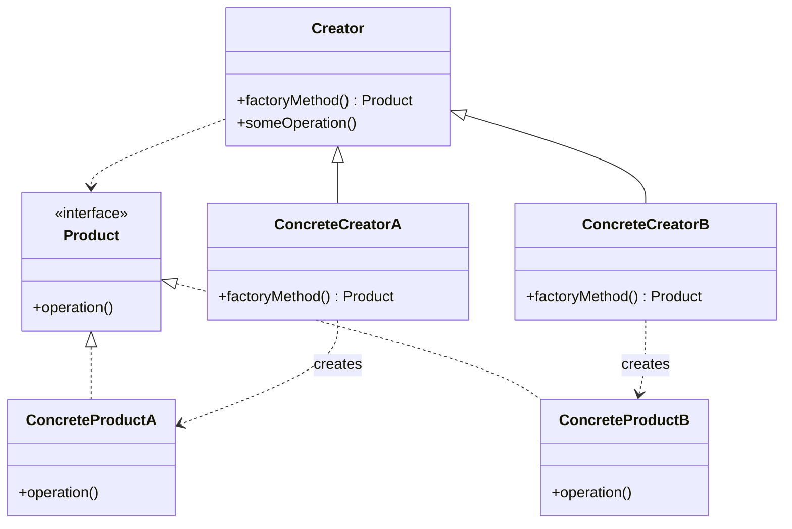
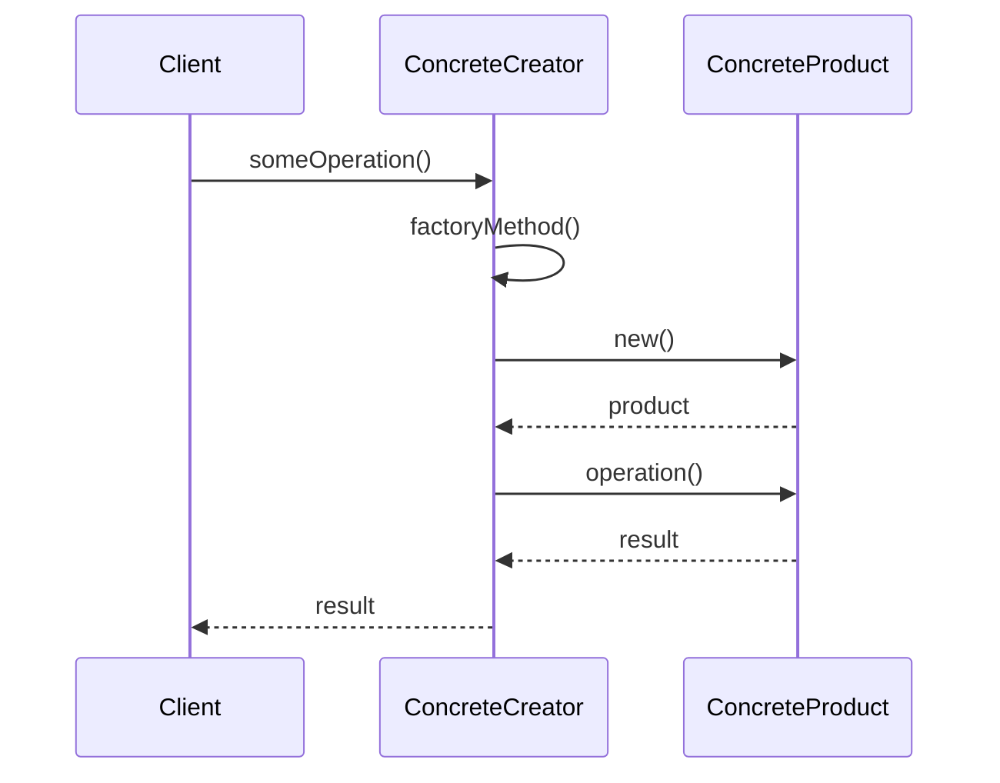

## はじめに

デザインパターンを学び始めると、必ずと言っていいほど登場するのが「Factory Method（ファクトリーメソッド）パターン」です。GoF（Gang of Four）の23パターンの中でも特に重要な生成パターンの1つであり、多くのフレームワークやライブラリで活用されています。

しかし、「なぜわざわざFactoryを使うのか？」「`new`で直接インスタンス化するのと何が違うのか？」という疑問を持つ方も多いのではないでしょうか。

この記事では、Factory Methodパターンの基本概念から、Perlでの具体的な実装方法、メリット・デメリット、使い分けのポイントまでを、図解を交えながらわかりやすく解説します。

### この記事で学べること

- Factory Methodパターンが必要な理由
- Factory Methodの基本構造と4つの構成要素
- Perlでの実装方法（Mooを使った実践例）
- メリット・デメリットの正確な理解
- 使うべき場面・使うべきでない場面の判断基準
- 関連パターンとの違い

## 【問題提起】なぜFactory Methodが必要なのか

まずは、Factory Methodパターンがどのような問題を解決するのか、具体例を通じて理解しましょう。

### 実例：通知システムの拡張要件

あなたが通知システムを開発しているとします。最初の要件は「メール通知」だけでした。

```perl
# 最初の実装
package NotificationService {
    use Moo;
    
    sub send_notification {
        my ($self, $message) = @_;
        my $notifier = EmailNotification->new;
        $notifier->send($message);
    }
}
```

シンプルで問題ありません。しかし、後から「SMS通知」と「プッシュ通知」も追加してほしいという要件が来ました。

### 直接インスタンス化の問題点

多くの場合、以下のように`if/else`や`switch`で分岐処理を追加してしまいます。

```perl
# 問題のある実装
package NotificationService {
    use Moo;
    
    sub send_notification {
        my ($self, $type, $message) = @_;
        
        my $notifier;
        if ($type eq 'email') {
            $notifier = EmailNotification->new;
        }
        elsif ($type eq 'sms') {
            $notifier = SMSNotification->new;
        }
        elsif ($type eq 'push') {
            $notifier = PushNotification->new;
        }
        else {
            die "Unknown notification type: $type";
        }
        
        $notifier->send($message);
    }
}
```

この実装には以下の問題があります。

#### 1. コードの硬直性（if/else地獄）

新しい通知タイプを追加するたびに、この`send_notification`メソッドを修正する必要があります。10種類、20種類と増えていくと、分岐処理が非常に長くなり、可読性が低下します。

#### 2. 拡張時の修正箇所の増大

通知タイプの追加が必要になるたびに、このクラスを修正しなければなりません。これは「オープン・クローズドの原則」（拡張に対して開いているが、修正に対して閉じている）に違反しています。

#### 3. テストの困難性

各通知タイプのテストを行うために、`NotificationService`クラス全体をテストしなければなりません。通知ロジック自体のテストが、サービスクラスのテストと密結合してしまいます。

これらの問題を解決するのが、Factory Methodパターンです。

## Factory Methodパターンとは

### 定義と基本概念

Factory Methodパターンは、GoF（Gang of Four）が提唱した23のデザインパターンの1つで、**生成パターン**に分類されます。

**定義**: オブジェクト生成のためのインターフェースを定義するが、どのクラスをインスタンス化するかはサブクラスに決めさせるパターン

簡単に言えば、「オブジェクトを作る責任を、専門のメソッド（Factory Method）に委譲する」ということです。

### GoFパターンにおける位置づけ（生成パターン）

GoFの23パターンは、目的によって以下の3つに分類されます。

- **生成パターン**（Creational Patterns）: オブジェクトの生成に関するパターン
- **構造パターン**（Structural Patterns）: クラスやオブジェクトの構成に関するパターン
- **振る舞いパターン**（Behavioral Patterns）: オブジェクト間の責任分担や協調に関するパターン

Factory Methodは**生成パターン**の1つであり、他に以下のようなパターンがあります。

- Singleton（シングルトン）
- Abstract Factory（抽象ファクトリー）
- Builder（ビルダー）
- Prototype（プロトタイプ）

### 4つの構成要素

Factory Methodパターンは、以下の4つの要素で構成されます。

#### 1. Product（製品インターフェース）

生成されるオブジェクトが実装すべきインターフェースを定義します。Perlでは、Roleやダックタイピングで表現できます。

#### 2. ConcreteProduct（具体的な製品）

`Product`インターフェースを実装した具体的なクラスです。実際に生成されるオブジェクトです。

#### 3. Creator（生成者）

`factoryMethod`を宣言するクラスまたはロールです。このメソッドが`Product`オブジェクトを返します。

#### 4. ConcreteCreator（具体的な生成者）

`factoryMethod`をオーバーライドして、特定の`ConcreteProduct`を生成します。

## 【図解】Factory Methodの仕組み

### UML構造図で理解する

Factory Methodパターンの構造を図で表すと、以下のようになります。



### シーケンス図：オブジェクト生成の流れ

実際にオブジェクトが生成される流れは以下のようになります。



### 登場人物の役割分担

- **Client**: `Creator`を使って、何らかの処理を依頼する
- **Creator**: `factoryMethod`を呼び出して`Product`を取得し、それを使った処理を実行する
- **ConcreteCreator**: 具体的な`Product`の生成方法を知っている
- **Product/ConcreteProduct**: 実際の処理を実行する

重要なのは、**Clientは具体的なProductのクラス名を知らない**という点です。すべて`Creator`のインターフェースを通じて処理されます。

## Perlでの実装例（ステップバイステップ）

それでは、Perlで実際にFactory Methodパターンを実装してみましょう。先ほどの通知システムを題材にします。

### Step1: Productロールの定義（Moo::Role）

まず、すべての通知クラスが実装すべきインターフェースを`Moo::Role`で定義します。

```perl
package Notification {
    use Moo::Role;
    
    requires 'send';  # すべての通知クラスはsendメソッドを実装する必要がある
}
```

### Step2: ConcreteProductの実装

次に、具体的な通知クラスを実装します。

```perl
package EmailNotification {
    use Moo;
    with 'Notification';
    
    sub send {
        my ($self, $message) = @_;
        print "📧 Sending email: $message\n";
        return 1;
    }
}

package SMSNotification {
    use Moo;
    with 'Notification';
    
    sub send {
        my ($self, $message) = @_;
        print "📱 Sending SMS: $message\n";
        return 1;
    }
}

package PushNotification {
    use Moo;
    with 'Notification';
    
    sub send {
        my ($self, $message) = @_;
        print "🔔 Sending push notification: $message\n";
        return 1;
    }
}
```

### Step3: Factory Methodの実装

ここが核心部分です。通知タイプに応じて適切な通知オブジェクトを生成するファクトリーを実装します。

```perl
package NotificationFactory {
    use Moo;
    use Module::Load qw(load);
    
    # ディスパッチテーブルで通知タイプとクラスをマッピング
    has notification_types => (
        is      => 'ro',
        default => sub {
            {
                email => 'EmailNotification',
                sms   => 'SMSNotification',
                push  => 'PushNotification',
            }
        },
    );
    
    # Factory Method
    sub create_notification {
        my ($self, $type) = @_;
        
        my $class = $self->notification_types->{$type}
            or die "Unknown notification type: $type";
        
        # 動的にクラスをロード
        load($class);
        
        # インスタンスを生成して返す
        return $class->new;
    }
}
```

### Step4: クライアントコードでの使用

ファクトリーを使って通知を送信するサービスクラスを実装します。

```perl
package NotificationService {
    use Moo;
    
    has factory => (
        is      => 'ro',
        default => sub { NotificationFactory->new },
    );
    
    sub send_notification {
        my ($self, $type, $message) = @_;
        
        # ファクトリーから適切な通知オブジェクトを取得
        my $notifier = $self->factory->create_notification($type);
        
        # 通知を送信
        $notifier->send($message);
    }
}
```

### 実行結果の確認

実際に動かしてみましょう。

```perl
use strict;
use warnings;

# サービスのインスタンス化
my $service = NotificationService->new;

# 各種通知の送信
$service->send_notification('email', 'Hello from Email!');
$service->send_notification('sms', 'Hello from SMS!');
$service->send_notification('push', 'Hello from Push!');
```

**出力**:
```
📧 Sending email: Hello from Email!
📱 Sending SMS: Hello from SMS!
🔔 Sending push notification: Hello from Push!
```

新しい通知タイプ（例えば、Slack通知）を追加する場合は、以下の手順だけで済みます。

1. `SlackNotification`クラスを作成（`Notification` Roleを実装）
2. `NotificationFactory`の`notification_types`に`slack => 'SlackNotification'`を追加

**`NotificationService`クラスは一切修正不要**です！これがFactory Methodパターンの威力です。

## Factory Methodのメリット

### 1. 疎結合の実現

クライアントコード（`NotificationService`）は、具体的な通知クラス（`EmailNotification`など）に依存していません。依存しているのは`Notification` Roleと`NotificationFactory`だけです。

これにより、通知の実装を変更しても、サービスクラスに影響を与えません。

### 2. 拡張性の向上（オープン・クローズドの原則）

新しい通知タイプを追加する際、既存のコードを修正する必要がありません。新しいクラスを追加するだけです。

これは、ソフトウェア設計の重要な原則である**オープン・クローズドの原則**（Open-Closed Principle）を実現しています。

> クラスは拡張に対して開いているべきであり、修正に対して閉じているべきである

### 3. テスタビリティの向上

各通知クラスは独立しているため、個別にテストできます。また、テスト時にモックファクトリーを使えば、サービスクラスのテストも容易になります。

```perl
# テスト用のモックファクトリー
package MockNotificationFactory {
    use Moo;
    
    sub create_notification {
        my ($self, $type) = @_;
        return MockNotification->new;
    }
}

# テスト
my $service = NotificationService->new(
    factory => MockNotificationFactory->new
);
$service->send_notification('email', 'test');
```

### 4. コードの保守性向上

生成ロジックが1箇所（ファクトリー）に集約されているため、変更が必要な場合もそこだけを修正すればよく、保守が容易です。

## Factory Methodのデメリット

すべてのパターンにはトレードオフがあります。Factory Methodパターンも例外ではありません。

### 1. クラス数の増加

Factory Methodパターンを導入すると、以下のようにクラスが増えます。

- 製品インターフェース（Role）
- 具体的な製品クラス（複数）
- ファクトリークラス

小規模なプロジェクトでは、これが過剰に感じられる場合があります。

### 2. 初期学習コストの高さ

デザインパターンに慣れていない開発者にとっては、「なぜこんなに複雑にするのか？」と感じられることがあります。

シンプルな`new`呼び出しと比較して、理解に時間がかかる場合があります。

### 3. 小規模プロジェクトでは過剰設計になりやすい

生成するオブジェクトが1種類しかない、または今後も増える見込みがない場合は、Factory Methodは不要です。

**YAGNI原則**（You Aren't Gonna Need It - 必要になるまで実装しない）に従い、本当に必要になってから導入すべきです。

## いつ使うべきか・使うべきでないか

### 使うべき場面

Factory Methodパターンは、以下のような場面で威力を発揮します。

#### 1. オブジェクトの種類が実行時に決まる

設定ファイルやユーザー入力によって、生成するオブジェクトのタイプが変わる場合です。

```perl
# 設定ファイルから通知タイプを読み込む
my $config = load_config();
my $notifier = $factory->create_notification($config->{notification_type});
```

#### 2. 拡張性が重視される

将来的に新しいタイプが追加される可能性が高い場合、Factory Methodを使うと拡張が容易になります。

プラグインシステムやモジュール型アーキテクチャでは必須のパターンです。

#### 3. フレームワーク設計

フレームワークやライブラリを設計する場合、利用者が独自の実装を追加できるようにするために、Factory Methodが活用されます。

例：ORMフレームワークのドライバー生成、Webフレームワークのハンドラー生成など。

### 使うべきでない場面

一方で、以下のような場面では、Factory Methodは過剰設計になります。

#### 1. 生成するオブジェクトが1つまたは固定

現在も将来も、生成するオブジェクトのタイプが1つしかない場合は、単純に`new`を呼べば十分です。

```perl
# これで十分な場合
my $notifier = EmailNotification->new;
```

#### 2. シンプルな`new`で十分な場合

オブジェクト生成に複雑なロジックがなく、パラメータも単純な場合は、Factory Methodは不要です。

```perl
# これで問題ない
my $user = User->new(name => 'Alice', age => 30);
```

#### 3. パフォーマンスが最重要な場合

Factory Methodは、間接的なメソッド呼び出しやクラスのロードが発生するため、わずかながらオーバーヘッドがあります。

超高速な処理が求められる場合は、直接インスタンス化の方が良い場合があります（ただし、現代のハードウェアでは、ほとんどの場合は無視できるレベルです）。

## 関連パターンとの比較

Factory Methodと似たパターンに、**Simple Factory**と**Abstract Factory**があります。混同しやすいので、違いを明確にしましょう。

### Simple Factoryとの違い

**Simple Factory**は、GoFのパターンではなく、より単純な生成パターンです。

```perl
package SimpleNotificationFactory {
    use Moo;
    use Module::Load qw(load);
    
    sub create {
        my ($class, $type) = @_;
        
        if ($type eq 'email') {
            return EmailNotification->new;
        }
        elsif ($type eq 'sms') {
            return SMSNotification->new;
        }
        else {
            die "Unknown type: $type";
        }
    }
}
```

**違い**:
- Simple Factory: 単一のクラスメソッド、継承を使わない
- Factory Method: 継承やRoleを使い、サブクラスで生成方法をカスタマイズできる

**使い分け**:
- Simple Factoryは、シンプルで十分な場合に使う
- Factory Methodは、拡張性や柔軟性が必要な場合に使う

### Abstract Factoryとの違い

**Abstract Factory**は、**関連する複数のオブジェクト**を生成するパターンです。

```perl
# Abstract Factory の例
package GUIFactory {
    use Moo::Role;
    
    requires 'create_button';
    requires 'create_checkbox';
}

package WindowsGUIFactory {
    use Moo;
    with 'GUIFactory';
    
    sub create_button   { WindowsButton->new }
    sub create_checkbox { WindowsCheckbox->new }
}

package MacGUIFactory {
    use Moo;
    with 'GUIFactory';
    
    sub create_button   { MacButton->new }
    sub create_checkbox { MacCheckbox->new }
}
```

**違い**:
- Factory Method: 単一のオブジェクトを生成
- Abstract Factory: 関連する複数のオブジェクトを一貫して生成

### 使い分けの基準

| パターン | 使う場面 | 生成対象 |
|---------|---------|---------|
| Simple Factory | 単純な生成ロジック、拡張性は低くてOK | 1種類のオブジェクト |
| Factory Method | 拡張性重視、サブクラスで生成方法をカスタマイズ | 1種類のオブジェクト |
| Abstract Factory | 関連する複数のオブジェクトを一貫して生成 | 関連する複数のオブジェクト |

## 実践例：JSON-RPC Request生成

最後に、実際のプロジェクトでFactory Methodパターンがどのように活用されるか、JSON-RPCリクエスト生成の例を紹介します。

### 実際のプロジェクトでの適用

JSON-RPCでは、リクエストとレスポンスという2つの異なるメッセージタイプがあります。これらを動的に生成する際に、Factory Methodが活用できます。

```perl
package JSONRPC::Message::Factory {
    use Moo;
    use Module::Load qw(load);
    
    sub from_hash {
        my ($class, $data) = @_;
        
        # リクエストかレスポンスかを判定
        my $message_class = exists $data->{method}
            ? 'JSONRPC::Message::Request'
            : 'JSONRPC::Message::Response';
        
        load($message_class);
        return $message_class->new($data);
    }
}
```

### from_hashファクトリーメソッド

この`from_hash`メソッドは、ハッシュデータから適切なメッセージオブジェクトを生成します。クライアントコードは、リクエストかレスポンスかを意識する必要がありません。

```perl
use JSON qw(decode_json);

my $json = '{"jsonrpc":"2.0","method":"echo","params":["hello"],"id":1}';
my $data = decode_json($json);

my $message = JSONRPC::Message::Factory->from_hash($data);
# $message は自動的に JSONRPC::Message::Request のインスタンスになる
```

### バリデーションの統合

ファクトリーメソッド内でバリデーションを行うこともできます。

```perl
sub from_hash {
    my ($class, $data) = @_;
    
    # バリデーション
    die "Invalid JSON-RPC version" unless $data->{jsonrpc} eq '2.0';
    
    # 適切なクラスの選択と生成
    my $message_class = exists $data->{method}
        ? 'JSONRPC::Message::Request'
        : 'JSONRPC::Message::Response';
    
    load($message_class);
    return $message_class->new($data);
}
```

これにより、生成ロジックとバリデーションを1箇所に集約でき、保守性が向上します。

## まとめ

### Factory Methodパターンの要点

この記事では、Factory Methodパターンについて詳しく解説しました。重要なポイントをおさらいしましょう。

**Factory Methodパターンとは**:
- オブジェクト生成の責任を専用のメソッドに委譲するパターン
- GoFの生成パターンの1つ
- Product、ConcreteProduct、Creator、ConcreteCreatorの4要素で構成

**メリット**:
- 疎結合の実現
- 拡張性の向上（オープン・クローズドの原則）
- テスタビリティの向上
- コードの保守性向上

**デメリット**:
- クラス数の増加
- 初期学習コストの高さ
- 小規模プロジェクトでは過剰設計になりやすい

**使うべき場面**:
- オブジェクトの種類が実行時に決まる
- 拡張性が重視される
- フレームワーク設計

**使うべきでない場面**:
- 生成するオブジェクトが1つまたは固定
- シンプルな`new`で十分な場合

### 次に学ぶべきパターン

Factory Methodパターンを理解したら、次は以下のパターンを学ぶとよいでしょう。

1. **Abstract Factory**: 関連する複数のオブジェクトを生成するパターン
2. **Builder**: 複雑なオブジェクトの構築プロセスを段階的に行うパターン
3. **Prototype**: オブジェクトのクローンを作成するパターン
4. **Strategy**: アルゴリズムをカプセル化して切り替え可能にするパターン

特にStrategyパターンは、Factory Methodと組み合わせて使われることが多く、相性が良いパターンです。

### 参考リソース

**書籍**:





**Webリソース**:





**関連記事**:







Factory Methodパターンは、最初は複雑に感じるかもしれませんが、一度理解すれば、コードの品質を大きく向上させる強力なツールです。ぜひ実際のプロジェクトで試してみてください。
