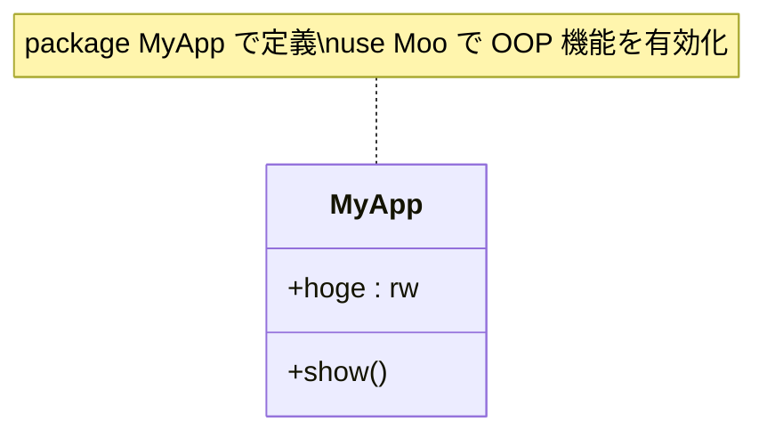

[@nqounet](https://twitter.com/nqounet)です。

前回は、Mooを使ったオブジェクト指向プログラミングの最初の一歩として、簡単なコードを書いて動かしてみました。

今回は、そのコードを1行ずつ解説していきます。

## 前回書いたコードを見直そう

まずは、前回のコードをもう一度見てみましょう。

```perl
package MyApp {
    use utf8;
    use Moo;
    has hoge => (is => 'rw');

    sub show {
        my $self = shift;
        print $self->hoge;
    }
};

my $app = MyApp->new;
$app->hoge('ほげ');
$app->show;
```

「ほげ」と表示されるこのコード、何が書いてあるのか順番に見ていきましょう。

## クラスの構造を理解しよう

まず、このコードの全体像を図で見てみましょう。



この図は、`MyApp` クラスが持つ要素を示しています。`hoge` というプロパティと `show` というメソッドがあることが分かります。

## packageで名前を付ける

```perl
package MyApp {
    ...
};
```

最初の `package MyApp` は、これから書くコードに「MyApp」という名前を付けています。

### クラスには名前が必要

オブジェクト指向では、「クラス」を定義する必要があります。

前回の用語で言えば、クラスは「属性」と「機能」を持った「まとまり」を定義するものでした。

Perlでは、`package` を使ってクラスに名前を付けます。この例では「MyApp」という名前のクラスを作っています。

波括弧 `{ }` で囲まれた中身が、このクラスの定義になります。

## use Mooで魔法をかける

```perl
use Moo;
```

この1行が、Mooの魔法を使うためのおまじないです。

`use Moo;` と書くことで、オブジェクト指向プログラミングに必要な機能が自動的に使えるようになります。

具体的には、以下のようなことができるようになります。

- `has` でプロパティを定義できる
- `new` でオブジェクトを作成できる

従来のPerlでは `bless` を使って複雑な処理を書く必要がありましたが、Mooを使えばそれらを意識する必要がありません。

## hasでデータを持たせる

```perl
has hoge => (is => 'rw');
```

`has` は、クラスに「プロパティ」を定義するためのキーワードです。

この行では、「hoge」という名前のプロパティを定義しています。

`is => 'rw'` の部分は、このプロパティが「読み書き可能（read-write）」であることを示しています。

- `rw` — 読み書き可能（Read-Write）
- `ro` — 読み取り専用（Read-Only）

今回は `rw` なので、値を取得することも、値を設定することもできます。

もう1つプロパティを追加した例を見てみましょう。

```perl
package MyApp {
    use utf8;
    use Moo;
    has hoge => (is => 'rw');
    has fuga => (is => 'ro');

    sub show {
        my $self = shift;
        print $self->hoge;
        print $self->fuga;
    }
};

my $app = MyApp->new(fuga => 'ふが');
$app->hoge('ほげ');
$app->show;
```

`fuga` は `ro`（読み取り専用）なので、オブジェクトを作成するときに値を渡します。後から変更することはできません。

## subで動きを与える

```perl
sub show {
    my $self = shift;
    print $self->hoge;
}
```

`sub` は、クラスに「メソッド」を定義するためのキーワードです。

メソッドは、オブジェクトの「機能」を実現するものです。この例では「show」という名前のメソッドを定義しています。

`my $self = shift;` は、メソッドが呼ばれたときに、オブジェクト自身を受け取る決まり文句です。`$self` を通じて、そのオブジェクトのプロパティやメソッドにアクセスできます。

`$self->hoge` で、`hoge` プロパティの値を取得しています。

## まとめ

今回は、前回書いたコードを1行ずつ解説しました。

- `package` — クラスに名前を付ける
- `use Moo` — オブジェクト指向の機能を使えるようにする
- `has` — プロパティを定義する
- `sub` — メソッドを定義する

これらの要素を組み合わせることで、オブジェクト指向プログラミングができるようになります。

次回は、実際にオブジェクトを作って使う部分を詳しく見ていきます。
