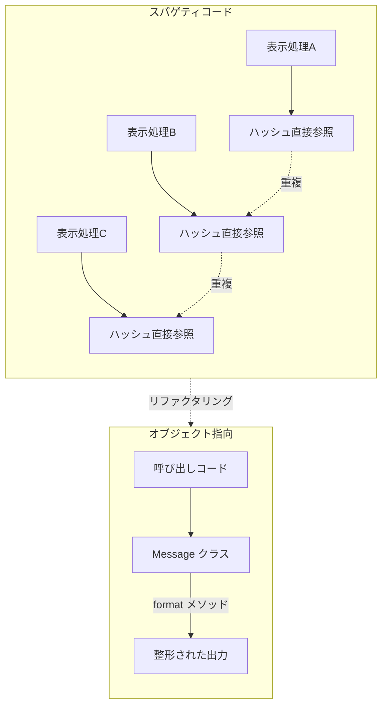

[@nqounet](https://twitter.com/nqounet)です。

前回は、`BBS::Message` クラスにメソッドを追加して、チャットらしく動かしてみました。複数のメッセージを扱えるようになりましたね。

今回は少し視点を変えて、「オブジェクト指向を使わなかったらどうなるか」を見てみましょう。比較することで、オブジェクト指向のメリットがはっきり分かります。

## もしオブジェクト指向を使わなかったら

これまで作ってきた `BBS::Message` クラスですが、実はオブジェクト指向を使わなくても同じことはできます。

では、オブジェクト指向を使わないとどうなるか、見てみましょう。

### よくあるスパゲティコード

オブジェクト指向を使わずにチャットのメッセージを処理すると、こんなコードになりがちです。

```perl
use strict;
use warnings;
use utf8;

# メッセージをハッシュで管理
my @messages = (
    { content => 'こんにちは！', author => 'nqounet',    timestamp => time },
    { content => 'はじめまして', author => 'perl_lover', timestamp => time },
    { content => 'よろしく！',   author => 'moo_fan',    timestamp => time },
);

# メッセージを表示
for my $msg (@messages) {
    my $time_str = localtime($msg->{timestamp});
    print "[$time_str] $msg->{author}: $msg->{content}\n";
}

# 別の場所でも同じような処理...
for my $msg (@messages) {
    # あれ、authorとcontentの順番どっちだっけ？
    print "$msg->{author}さんが言いました: $msg->{content}\n";
}

# また別の場所でも...
for my $msg (@messages) {
    # timestampのフォーマット、さっきと同じにしないと...
    my $time_str = localtime($msg->{timestamp});
    print "投稿時刻: $time_str\n";
    print "投稿者: $msg->{author}\n";
    print "内容: $msg->{content}\n";
}
```

一見動きますが、このコードにはいくつかの問題が潜んでいます。

## 何が問題なのか

上のコードは動作しますが、プログラムが大きくなると様々な問題が出てきます。

以下の図で、2つのアプローチの違いを比較してみましょう。



スパゲティコードでは、同じような処理があちこちに散らばってしまいます。一方、オブジェクト指向では処理を1箇所にまとめられます。

### 変更が大変

たとえば、メッセージに「編集済み」フラグを追加したくなったとします。

オブジェクト指向を使わない場合、すべての場所でハッシュのキーを確認し、必要な箇所を修正しなければなりません。

- `{ content => ..., author => ..., timestamp => ..., edited => 1 }` を追加
- 表示部分を全部探して `$msg->{edited}` の処理を追加
- フォーマット処理を書いている場所を全部探して修正

コードが散らばっていると、どこを直せばいいのか分からなくなります。

### バグが見つけにくい

ハッシュのキー名を間違えても、Perlはエラーを出しません。

```perl
# typo: auther → author
print $msg->{auther};  # 何も表示されないだけ
```

このようなバグは、実行してみないと気づきません。しかも、エラーメッセージが出ないので、どこが間違っているのか探すのに時間がかかります。

表示処理がコード全体に散らばっていると、同じミスを何度も繰り返す可能性があります。

## オブジェクト指向だと何が嬉しいのか

それでは、オブジェクト指向で書いた場合と比べてみましょう。

```perl
use strict;
use warnings;
use utf8;
use BBS::Message;

my @messages = (
    BBS::Message->new(content => 'こんにちは！', author => 'nqounet'),
    BBS::Message->new(content => 'はじめまして', author => 'perl_lover'),
    BBS::Message->new(content => 'よろしく！',   author => 'moo_fan'),
);

for my $msg (@messages) {
    print $msg->format, "\n";
}
```

コードがすっきりしていますね。表示処理は `format` メソッドに任せているので、ここでは「何を表示するか」だけを考えればよいのです。

### 役割が明確

オブジェクト指向の最大のメリットは、**責任の分離**です。

- `BBS::Message` クラス — メッセージのデータと表示方法を知っている
- 呼び出し側のコード — どのメッセージを表示するかを決める

「編集済み」フラグを追加したい場合も、`BBS::Message` クラスだけを修正すればよいのです。

```perl
has edited => (is => 'rw', default => sub { 0 });

sub format {
    my $self = shift;
    my $edited_mark = $self->edited ? ' (編集済み)' : '';
    return sprintf "[%s] %s: %s%s",
        scalar(localtime($self->timestamp)),
        $self->author,
        $self->content,
        $edited_mark;
}
```

呼び出し側のコードは一切変更する必要がありません。`$msg->format` を呼ぶだけで、新しい表示形式が適用されます。

また、プロパティ名を間違えると、Mooがエラーを出してくれます。

```perl
$msg->auther;  # エラー: Can't locate object method "auther"
```

バグを早期に発見できるのも、オブジェクト指向の利点です。

## まとめ

今回は、スパゲティコードとオブジェクト指向のコードを比較して、オブジェクト指向のメリットを確認しました。

- オブジェクト指向を使わないと、同じような処理がコード全体に散らばる
- 変更が必要なとき、すべての場所を探して修正しなければならない
- オブジェクト指向なら、クラスに責任を集約できる（責任の分離）
- 変更はクラス内で完結し、呼び出し側に影響しない

次回は、ユーザー機能を追加しながら「継承」を学んでいきます。
