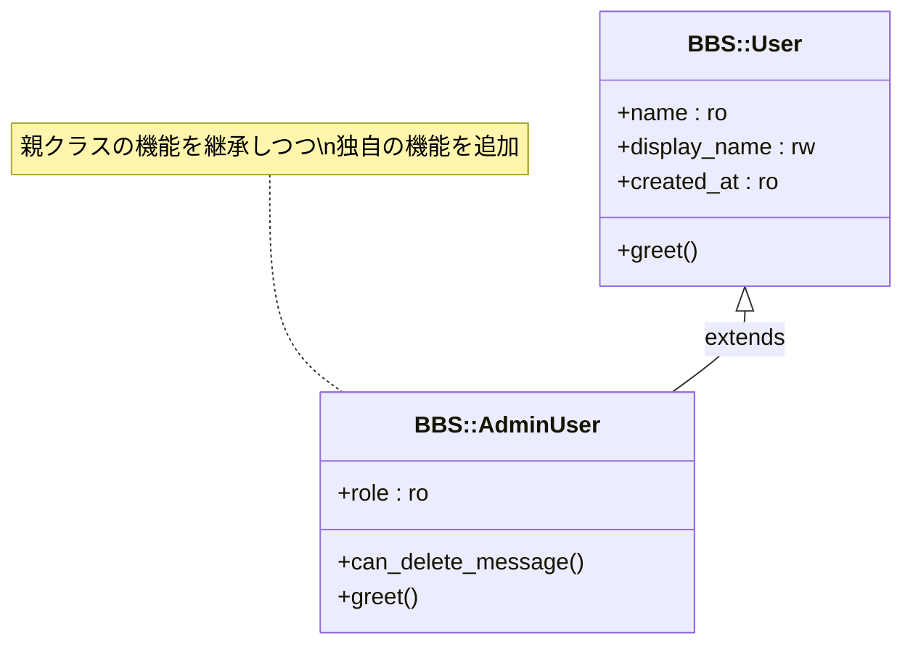

[@nqounet](https://twitter.com/nqounet)です。

前回は、スパゲティコードとオブジェクト指向のコードを比較して、オブジェクト指向のメリットを確認しました。

今回は、チャットアプリにユーザー機能を追加します。その過程で、オブジェクト指向の重要な概念である「継承」を学んでいきましょう。

## ユーザー情報を扱いたい

これまで作ってきた `BBS::Message` クラスでは、投稿者を単なる文字列（`author`）として扱っていました。でも、実際のチャットアプリでは、ユーザーにはもっと多くの情報がありますよね。

- ユーザー名
- 表示名
- 登録日時

さらに、管理者ユーザーには特別な権限が必要かもしれません。このような情報を管理するために、ユーザーを表すクラスを作ってみましょう。

### Userクラスを作る

まずは、基本的なユーザー情報を持つ `BBS::User` クラスを作ります。

```perl
package BBS::User {
    use Moo;

    has name         => (is => 'ro', required => 1);
    has display_name => (is => 'rw', required => 1);
    has created_at   => (is => 'ro', default => sub { time });

    sub greet {
        my $self = shift;
        return sprintf "こんにちは、%s さん！", $self->display_name;
    }
};
```

このクラスには3つのプロパティがあります。

- `name` — ユーザー名（変更不可）
- `display_name` — 表示名（変更可能）
- `created_at` — 登録日時（自動設定）

そして、挨拶を返す `greet` メソッドも追加しました。

## 継承とは何か

さて、ここで管理者ユーザーのことを考えてみましょう。

管理者ユーザーは、普通のユーザーと同じ情報を持ちつつ、さらに特別な権限を持っています。たとえば、他のユーザーのメッセージを削除できる、といった機能です。

この場合、`BBS::User` とほとんど同じコードをもう一度書くのは面倒ですし、同じコードが複数の場所にあると、修正が必要なときに両方を直さなければなりません。

そこで登場するのが「継承」です。



この図は、`BBS::AdminUser` が `BBS::User` を継承している関係を示しています。矢印の方向が「継承元（親）」を指しています。

### 共通部分を親クラスに

継承とは、あるクラス（親クラス）の機能を、別のクラス（子クラス）が引き継ぐ仕組みです。

- 親クラス（基底クラス）— 共通の機能を持つ
- 子クラス（派生クラス）— 親の機能を引き継ぎつつ、独自の機能を追加できる

普通のユーザーが持っている機能は、管理者ユーザーにもそのまま使えます。管理者ユーザーは、その上に「管理者専用の機能」を追加するだけでよいのです。

## extendsで継承する

Mooでは、`extends` を使って継承を実現します。

```perl
extends '親クラス名';
```

この1行を書くだけで、親クラスのプロパティとメソッドをすべて引き継ぐことができます。とても簡単ですね。

## 管理者ユーザーを作る

それでは、`BBS::User` を継承した `BBS::AdminUser` クラスを作ってみましょう。

### AdminUserクラス

```perl
package BBS::AdminUser {
    use Moo;
    extends 'BBS::User';

    has role => (is => 'ro', default => sub { 'admin' });

    sub can_delete_message {
        my $self = shift;
        return 1;  # 管理者はメッセージを削除できる
    }

    sub greet {
        my $self = shift;
        return sprintf "こんにちは、管理者の %s さん！", $self->display_name;
    }
};
```

`extends 'BBS::User';` の1行で、`BBS::User` クラスを継承しています。

このクラスには、以下の特徴があります。

- `BBS::User` のプロパティ（`name`、`display_name`、`created_at`）をすべて持つ
- 新しいプロパティ `role` を追加（デフォルトは `'admin'`）
- 新しいメソッド `can_delete_message` を追加
- `greet` メソッドを上書き（オーバーライド）

`greet` メソッドを見てください。親クラスの `BBS::User` にも同じ名前のメソッドがありましたが、子クラスで同じ名前のメソッドを定義すると、子クラスのメソッドが優先されます。これを「オーバーライド」と呼びます。

実際に使ってみましょう。

```perl
use BBS::User;
use BBS::AdminUser;

my $user = BBS::User->new(
    name         => 'tanaka',
    display_name => '田中太郎',
);

my $admin = BBS::AdminUser->new(
    name         => 'yamada',
    display_name => '山田管理者',
);

print $user->greet, "\n";
# こんにちは、田中太郎 さん！

print $admin->greet, "\n";
# こんにちは、管理者の 山田管理者 さん！

print $admin->can_delete_message, "\n";
# 1
```

`$admin` は `BBS::AdminUser` のインスタンスですが、`name` や `display_name` といった親クラスのプロパティも普通に使えます。これが継承の力です。

## まとめ

今回は、ユーザー機能を追加しながら、継承について学びました。

- 継承とは、親クラスの機能を子クラスが引き継ぐ仕組み
- Mooでは `extends '親クラス名';` で継承を実現
- 子クラスは親クラスのプロパティとメソッドをすべて持つ
- 子クラスで同じ名前のメソッドを定義すると、親のメソッドを上書きできる（オーバーライド）

次回は、メッセージをまとめて管理するスレッド機能を作っていきます。
