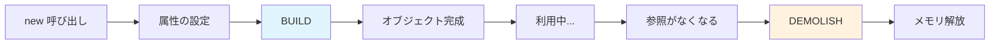

[@nqounet](https://twitter.com/nqounet)です。

前回は、メソッド修飾子（`before`、`after`）を使って、既存の処理を拡張する方法を学びました。

今回は、オブジェクトが作られるときと消えるときに自動的に呼ばれる特別なメソッド、`BUILD` と `DEMOLISH` について詳しく学びましょう。

## オブジェクトが作られるとき

Mooでは、`new` メソッドでオブジェクトを作成します。このとき、内部では以下のような流れで処理が進みます。

1. 引数をもとに属性が設定される
2. `BUILD` メソッドが呼ばれる（定義されていれば）

つまり、`BUILD` は「オブジェクトが作られた直後」に実行される特別なメソッドなのです。



この図は、オブジェクトのライフサイクルを示しています。`BUILD` は生成直後、`DEMOLISH` は破棄直前に呼ばれます。

### BUILDメソッド

`BUILD` は、属性の設定だけでは足りない初期化処理を書くためのメソッドです。

たとえば、以下のような場面で使います。

- 属性をもとに別の値を計算したい
- ログに記録を残したい
- 外部リソースへの接続を確立したい

`BUILD` には、`new` に渡された引数がハッシュリファレンスとして渡されます。また、`$self` を通じて、すでに設定された属性にアクセスできます。

## 初期化処理を書く

実際に `BUILD` を使ってみましょう。掲示板アプリのメッセージに、自動で連番IDを振る機能を追加します。

### IDの自動採番

メッセージごとに一意のIDがあると、後から特定のメッセージを参照するときに便利です。`BUILD` を使って、オブジェクトが作られるたびに自動でIDを割り当てます。

```perl
package BBS::Message {
    use Moo;

    my $id_counter = 0;

    has id      => (is => 'ro');
    has content => (is => 'ro', required => 1);
    has author  => (is => 'ro', required => 1);

    sub BUILD {
        my ($self, $args) = @_;
        $id_counter++;
        $self->{id} = $id_counter;
    }

    sub format {
        my $self = shift;
        return sprintf "[#%d] %s: %s",
            $self->id,
            $self->author,
            $self->content;
    }
};

# 使用例
my $msg1 = BBS::Message->new(content => 'こんにちは', author => 'nqounet');
my $msg2 = BBS::Message->new(content => 'おはよう',   author => 'guest');

print $msg1->format, "\n";  # [#1] nqounet: こんにちは
print $msg2->format, "\n";  # [#2] guest: おはよう
```

ポイントは以下の通りです。

- `my $id_counter = 0` — パッケージ内でカウンターを保持している
- `$self->{id}` — `BUILD` 内では、属性に直接代入できる
- 呼び出しごとにカウンターが増えるため、各メッセージに一意のIDが付く

`has id => (is => 'ro')` は読み取り専用ですが、`BUILD` の中では内部構造に直接アクセスして設定しています。これは初期化時のみ許される特別な書き方です。

## オブジェクトが消えるとき

`BUILD` がオブジェクト作成時に呼ばれるのに対し、`DEMOLISH` はオブジェクトが破棄されるときに呼ばれます。

Perlでは、オブジェクトへの参照がなくなると、ガベージコレクションによって自動的にメモリが解放されます。`DEMOLISH` は、その直前に実行されるのです。

### DEMOLISHメソッド

`DEMOLISH` は、以下のような後始末処理で使われます。

- ファイルハンドルを閉じる
- データベース接続を切断する
- 一時ファイルを削除する
- ログに終了を記録する

簡単な例を見てみましょう。

```perl
package BBS::Connection {
    use Moo;

    has host => (is => 'ro', required => 1);

    sub BUILD {
        my $self = shift;
        warn "[接続] ${\$self->host} に接続しました\n";
    }

    sub DEMOLISH {
        my $self = shift;
        warn "[切断] ${\$self->host} から切断しました\n";
    }
};

# 使用例
{
    my $conn = BBS::Connection->new(host => 'db.example.com');
    # => [接続] db.example.com に接続しました

    # ここでオブジェクトを使った処理...

}   # スコープを抜けると $conn は破棄される
# => [切断] db.example.com から切断しました
```

波括弧 `{ }` でスコープを作っています。スコープを抜けると `$conn` への参照がなくなり、オブジェクトが破棄されます。そのタイミングで `DEMOLISH` が呼ばれます。

## いつ使うと便利か

`BUILD` と `DEMOLISH` は、どんなときに使うとよいのでしょうか。

`BUILD` を使う場面は以下の通りです。

- 属性の組み合わせから新しい値を計算するとき
- オブジェクト作成時にIDや連番を振りたいとき
- 初期化時にログを記録したいとき

`DEMOLISH` を使う場面は以下の通りです。

- ファイルやデータベース接続などの外部リソースを解放するとき
- 一時的に作成したファイルを削除するとき
- 終了時にログを記録したいとき

ただし、通常のアプリケーションでは `DEMOLISH` を使う機会はそれほど多くありません。Perlのガベージコレクションは優秀なので、ほとんどの場合は何もしなくてもリソースは適切に解放されます。明示的な後始末が必要な場面でのみ使いましょう。

## まとめ

今回は、オブジェクトのライフサイクルに関わる `BUILD` と `DEMOLISH` を学びました。

- `BUILD` — オブジェクト作成直後に呼ばれる初期化メソッドである
- `DEMOLISH` — オブジェクト破棄直前に呼ばれる後始末メソッドである
- `BUILD` はIDの自動採番やログ記録に便利である
- `DEMOLISH` は外部リソースの解放に使う

次回は、`around` 修飾子を使って、メソッドの処理自体をラップする方法を学びます。
