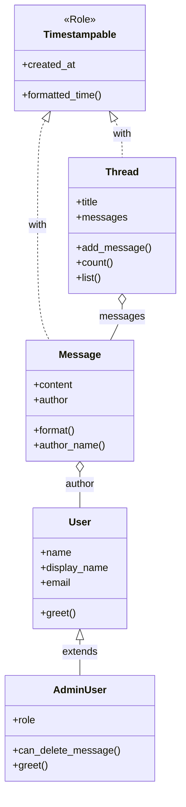

[@nqounet](https://twitter.com/nqounet)です。

前回は、`BUILD` と `DEMOLISH` を使って、オブジェクトの初期化と後始末を学びました。

今回は最終回です。これまでに作ってきた掲示板システムを振り返り、次のステップについてお話しします。

## これまでに作ったもの

第1回から第11回まで、Mooを使ってオブジェクト指向プログラミングを学んできました。その過程で、シンプルな掲示板システムを作り上げてきました。

### 全体の構成を振り返る

作成したクラスとロールを一覧で見てみましょう。

```perl
# ロール
BBS::Role::Timestampable  # 作成日時を自動記録する共通機能

# クラス
BBS::Message              # メッセージ（投稿内容）
BBS::User                 # 一般ユーザー
BBS::AdminUser            # 管理者ユーザー（Userを継承）
BBS::Thread               # スレッド（メッセージをまとめる）
```

それぞれのクラスで、以下のことを学びました。

- `BBS::Message` — プロパティ定義、メソッド実装、ロール適用、委譲
- `BBS::User` — 基本的なクラス設計
- `BBS::AdminUser` — 継承とオーバーライド
- `BBS::Thread` — オブジェクトの集約
- `BBS::Role::Timestampable` — ロールによる機能の共有

## クラス図で見る掲示板

全体像をクラス図で確認しましょう。



この図から、いくつかの関係が読み取れます。

- `Message` と `Thread` は `Timestampable` ロールを適用している
- `AdminUser` は `User` を継承している
- `Message` は `User` を持っている（委譲）
- `Thread` は複数の `Message` を持っている（集約）

## オブジェクト指向で何が変わったか

第5回で「スパゲティコード」と比較しましたが、改めてオブジェクト指向のメリットを整理しましょう。

- 責任の分離 — 各クラスが自分のデータと処理に責任を持つ
- 変更の局所化 — 修正が必要なとき、該当クラスだけを直せばよい
- コードの再利用 — 継承やロールで共通機能を使い回せる
- 拡張しやすい — メソッド修飾子で元のコードを変えずに機能を追加できる

これらは、コードが大きくなればなるほど効果を発揮します。チームで開発するときも、役割分担がしやすくなります。

## 次のステップ

Mooでオブジェクト指向の基礎を学びました。ここからさらにステップアップする道を紹介します。

### Mooseへの移行

Mooは軽量で高速ですが、より多くの機能が必要になったら `Moose` を検討してください。

Mooseは、Mooの元になったモジュールで、より豊富な機能を持っています。

- 型制約（Type Constraints）— プロパティに入る値の型を厳密にチェックできる
- イントロスペクション — クラスの構造をプログラムから調べられる
- MooseX系モジュール — 様々な拡張機能が利用可能である

MooからMooseへの移行は簡単です。`use Moo;` を `use Moose;` に変えるだけで、ほとんどのコードはそのまま動きます。

### 新しいclass構文

Perl 5.38から、実験的な機能として `class` 構文が導入されました。

```perl
use v5.38;
use feature 'class';

class BBS::Message {
    field $content :param;
    field $author  :param;

    method format {
        return "$author: $content";
    }
}
```

この構文は、MooやMooseを使わなくても、Perl本体だけでオブジェクト指向プログラミングができるようになる試みです。

まだ実験的な段階ですが、Perlの未来の姿を垣間見ることができます。興味があれば、ぜひ試してみてください。

## おわりに

全12回にわたって、Mooを使ったオブジェクト指向プログラミングを学んできました。

最初は `bless` を忘れることから始め、最後には掲示板システムを完成させました。その過程で、以下の概念を身につけました。

- プロパティとメソッド — データと振る舞いの定義
- 継承 — 親クラスの機能を引き継ぐ
- ロール — 複数のクラスで機能を共有する
- 委譲 — 別のオブジェクトに処理を任せる
- メソッド修飾子 — 既存の処理を拡張する
- BUILD/DEMOLISH — オブジェクトのライフサイクル

オブジェクト指向は、最初はとっつきにくく感じるかもしれません。でも、一度理解すれば、コードを整理して保守しやすくするための強力な道具になります。

この連載が、みなさんのPerlプログラミングの一助になれば幸いです。

ここまでお読みいただき、ありがとうございました。
