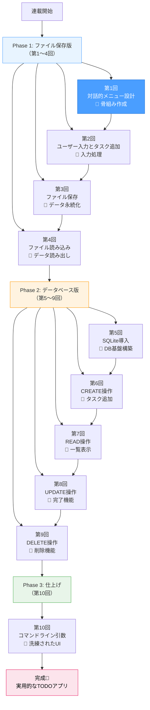
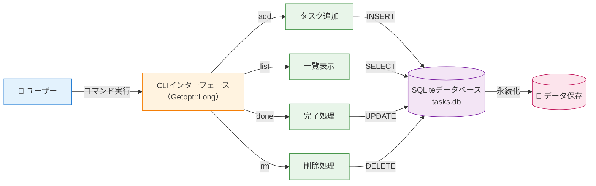
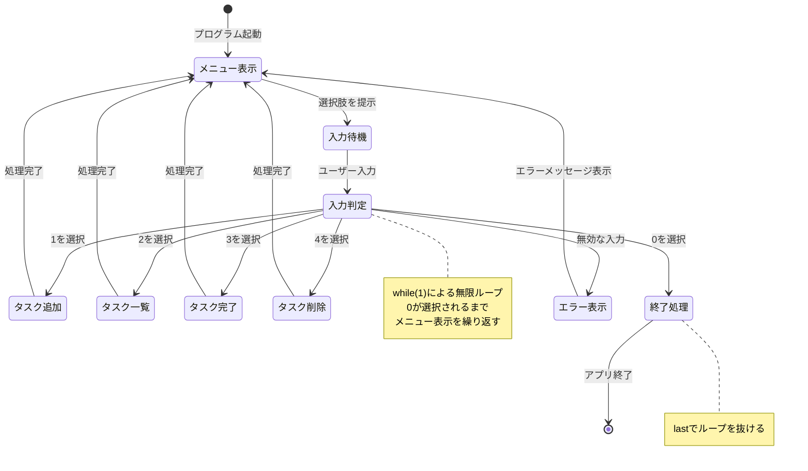
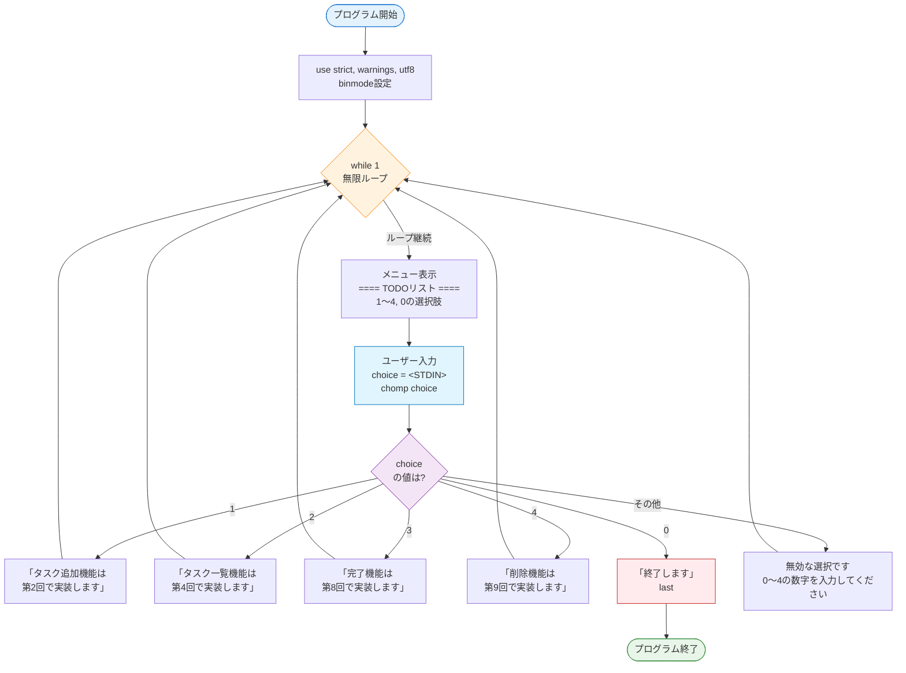

## はじめに

この連載では、PerlでTODOリストを管理するCLIアプリケーションを一緒に作っていきます。全10回の連載を通じて、ファイル入出力からデータベース操作、コマンドライン引数処理まで、実践的なPerl開発スキルを身につけることができます。

### このシリーズで作るもの

最終的には以下の機能を持つTODOアプリが完成します:

- タスクの追加・一覧表示・完了・削除（CRUD操作）
- データベース（SQLite）による永続化
- コマンドライン引数によるサクサク操作

### 想定読者と前提知識

この連載は、Perl入学式を卒業した方、または同等のPerl基礎知識をお持ちの方を対象としています。

想定している既知事項:

- 変数（スカラー、配列、ハッシュ）
- 制御構造（if、for、while）
- サブルーチンの基本
- 正規表現の基礎
- 標準入出力の基本

### 連載の全体構成（10回予定）

本連載は3つのフェーズで構成されています:

**Phase 1: ファイル保存版（第1〜4回）**

- 第1回（今回）: 完成イメージと対話的メニュー設計
- 第2回: ユーザー入力とタスク追加
- 第3回: ファイルへのタスク保存
- 第4回: ファイルからのタスク読み込み

**Phase 2: データベース版（第5〜9回）**

- 第5回: SQLiteデータベースの導入
- 第6回: タスクの追加（CREATE）
- 第7回: タスク一覧の表示（READ）
- 第8回: タスクの完了（UPDATE）
- 第9回: タスクの削除（DELETE）

**Phase 3: 仕上げ（第10回）**

- 第10回: コマンドライン引数による洗練されたUI

### 連載の学習ロードマップ

以下の図は、10回の連載を通じてどのように機能を積み上げていくかを示しています：



**図の見方**：
- 青色（Phase 1）：ファイルベースの基礎を学ぶ段階
- オレンジ色（Phase 2）：データベースでCRUD操作を習得する段階
- 緑色（Phase 3）：UIを洗練させて実用レベルに仕上げる段階
- ピンク色：最終ゴール

## 完成形デモ：10回後のゴールを見てみよう

まずは、この連載で最終的に完成するTODOアプリの動作を見てみましょう。完成形をイメージすることで、学習のモチベーションを高めることができます。

### こんなTODOアプリが完成します

完成版のアプリは以下のような特徴を持ちます:

- **データベースで永続化**: タスクはSQLiteデータベースに保存されるため、アプリを終了してもデータは消えない
- **直感的な操作**: コマンドライン引数で素早くタスクを管理できる
- **検索・フィルタリング**: 未完了タスクのみ表示するなど、柔軟な操作が可能

### 完成形の動作イメージ

**【コード例1：完成形の使用イメージ（実行結果例）】**

```bash
# Perl 5.38以降
# 外部依存: DBI, DBD::SQLite, Getopt::Long（第10回で導入）

# タスクを追加
$ perl todo.pl add "買い物に行く"
タスクを追加しました: [ID: 1] 買い物に行く

# タスク一覧を表示
$ perl todo.pl list
[1] 買い物に行く (未完了)
[2] 記事を書く (未完了)

# タスクを完了にする
$ perl todo.pl done 1
タスクを完了にしました: [1] 買い物に行く

# 完了済みも含めて表示
$ perl todo.pl list --all
[1] 買い物に行く (完了)
[2] 記事を書く (未完了)

# タスクを削除
$ perl todo.pl rm 1
タスクを削除しました: [1] 買い物に行く
```

### 完成形アプリの機能構成

最終的に完成するTODOアプリは、以下のような構成になります：



**アーキテクチャのポイント**：
- **CLIインターフェース**：コマンドライン引数を解析してサブコマンドを振り分け
- **CRUD操作**：4つの基本機能をそれぞれ独立したサブルーチンで実装
- **SQLiteデータベース**：タスクデータを永続化し、アプリ終了後もデータを保持
- **データフロー**：ユーザー→CLI→処理→DB→ストレージという一方向の流れ

### この連載で学べる技術

各フェーズで以下の技術を段階的に習得できます:

**Phase 1（ファイル保存版）**:

- ユーザー入力の処理（`<STDIN>`）
- ファイルへの書き込み（`open` with `>`）
- ファイルからの読み込み（`open` with `<`）
- UTF-8エンコーディング対応

**Phase 2（データベース版）**:

- DBIによるデータベース接続
- SQLiteテーブルの設計とCREATE文
- プレースホルダを使った安全なSQL実行
- CRUD操作の実装

**Phase 3（仕上げ）**:

- Getopt::Longによるコマンドライン引数処理
- サブコマンド方式のUI設計

データベース操作の詳細については、以下の記事で予習できます:



## 第1回のゴール：対話的メニューの基本を作る

第1回では、アプリの「骨組み」となる対話的メニューシステムを実装します。まだタスクの追加や削除はできませんが、メニュー表示とユーザー入力の受付という基本構造を作ります。

### なぜ最初は対話的メニュー形式？

完成形ではコマンドライン引数による操作を実現しますが、学習の初期段階では対話的メニュー形式から始めます。その理由は:

- **初心者にわかりやすいUI**: 選択肢が明示されるため、何ができるか一目でわかる
- **実装が簡単**: コマンドライン引数処理より学習コストが低い
- **段階的な進化**: 後でコマンド形式に移行することで、リファクタリングの経験も得られる

### 対話的メニューの基本的な仕組み

対話的メニューシステムは以下の4つの要素で構成されます:

1. **メニュー表示**: ユーザーに選択肢を提示する
2. **入力受付**: ユーザーの選択を受け取る
3. **処理のディスパッチ**: 選択に応じた処理を実行する
4. **ループ**: 終了が選択されるまで繰り返す

### メニューシステムの状態遷移図

対話的メニューがどのように動作するかを、状態遷移図で視覚化します：



**状態遷移のポイント**：
- **メニュー表示→入力待機→入力判定→処理**のサイクルを繰り返す
- **0を選択するまで無限ループ**が継続する（`while(1)`）
- **各処理が完了したら必ずメニューに戻る**設計
- **無効な入力**にもエラーメッセージで応答し、メニューに戻る

## 実装：最初のTODOアプリの骨組み

それでは、実際にコードを書いていきましょう。今回実装するのは、メニュー表示と選択受付の基本構造です。

### 必要な機能を洗い出す

第1回で実装する機能は以下の通りです:

- メニューを表示する
- ユーザーの選択を受け取る
- 選択に応じたメッセージを表示する（実際の処理は次回以降）
- 終了オプション（`0`を選択でプログラム終了）
- 無効な入力へのエラーメッセージ

### アプリの基本構造を設計する

**【コード例2：アプリの基本構造（while無限ループ）】**

```perl
#!/usr/bin/env perl
# Perl 5.38以降
# 外部依存: なし

use strict;
use warnings;
use utf8;

# 標準入出力をUTF-8に設定
binmode STDOUT, ':utf8';
binmode STDIN,  ':utf8';

# メイン処理
while (1) {
    # メニューを表示
    print "\n==== TODOリスト ====\n";
    print "1. タスクを追加\n";
    print "2. タスク一覧を表示\n";
    print "3. タスクを完了にする\n";
    print "4. タスクを削除\n";
    print "0. 終了\n";
    print "選択してください: ";

    # ユーザー入力を受け取る
    my $choice = <STDIN>;
    chomp $choice;

    # 選択に応じた処理
    if ($choice eq '1') {
        print "（タスク追加機能は第2回で実装します）\n";
    }
    elsif ($choice eq '2') {
        print "（タスク一覧機能は第4回で実装します）\n";
    }
    elsif ($choice eq '3') {
        print "（完了機能は第8回で実装します）\n";
    }
    elsif ($choice eq '4') {
        print "（削除機能は第9回で実装します）\n";
    }
    elsif ($choice eq '0') {
        print "終了します。\n";
        last;  # ループを抜ける
    }
    else {
        print "無効な選択です。0〜4の数字を入力してください。\n";
    }
}
```

### コード解説：重要なポイント

#### UTF-8対応

```perl
use utf8;                    # ソースコード内の文字列がUTF-8であることを宣言
binmode STDOUT, ':utf8';     # 標準出力をUTF-8に設定
binmode STDIN,  ':utf8';     # 標準入力をUTF-8に設定
```

日本語を正しく扱うために必須の設定です。`use utf8;` はソースコード内の文字列リテラルがUTF-8であることをPerlに伝えます。また、`binmode` は標準入出力のエンコーディングをUTF-8に設定します。

#### 無限ループと脱出

```perl
while (1) {
    # ... メニュー表示と処理 ...
    
    if ($choice eq '0') {
        last;  # ループを抜けてプログラム終了
    }
}
```

`while (1)` は条件が常に真なので、無限にループします。`last` を使うことでループを抜け、プログラムが終了します。これは対話的アプリケーションの典型的なパターンです。

#### chompの重要性

```perl
my $choice = <STDIN>;
chomp $choice;
```

`<STDIN>` で読み込んだ文字列には、Enterキーによる改行文字（`\n`）が末尾に含まれています。`chomp` を使って改行を取り除かないと、`$choice eq '1'` のような文字列比較が正しく動作しません。

例えば、`chomp` を省略すると、ユーザーが `1` を入力しても `$choice` の値は `"1\n"` となるため、`$choice eq '1'` は偽になってしまいます。

#### if-elsif-else による分岐

各メニュー項目に対して、`elsif` で分岐処理を記述しています。最後の `else` で、0〜4以外の無効な入力に対するエラーメッセージを表示します。これにより、ユーザーフレンドリーなエラーハンドリングが実現できます。

### プログラムの実行フロー

実装したコードの処理の流れを、フローチャートで確認しましょう：



**フローチャートのポイント**：
- **while(1)で無限ループ**：条件が常に真なので繰り返し続ける
- **chomp**：入力から改行を除去する重要な処理
- **多分岐**：if-elsif-elseで5つの選択肢に対応
- **last**：0が選択されたときだけループを抜けて終了
- **エラーハンドリング**：無効な入力にも適切に対応

## 実際に動かしてみよう

### ファイルを保存して実行

1. 上記のコードを `todo.pl` という名前で保存します
2. Linux/Macの場合、ターミナルで実行権限を付与します:
   ```bash
   chmod +x todo.pl
   ```
3. 実行します:
   ```bash
   perl todo.pl
   ```

### 動作確認のポイント

以下の動作を確認してみましょう:

- メニューが正しく表示されるか
- 数字（1〜4）を入力してEnterを押すと、対応するメッセージが表示されるか
- `0` を入力すると「終了します。」と表示されてプログラムが終了するか
- 無効な入力（`a` や `5` など）でエラーメッセージが表示されるか
- 日本語が文字化けせずに表示されるか

### トラブルシューティング

**文字化けする場合**:

- `use utf8;` と `binmode` の設定を確認してください
- ターミナルのエンコーディング設定がUTF-8になっているか確認してください

**メニューが繰り返し表示されない場合**:

- `while (1)` のループが正しく記述されているか確認してください
- `last` が `if ($choice eq '0')` の中に書かれているか確認してください

## 次回予告：ユーザーからの入力を受け取る

第2回では、メニュー選択だけでなく、タスクのタイトルなど自由なテキストをユーザーから受け取る方法を学びます。

### 次回学ぶこと

- `<STDIN>` を使った自由テキスト入力
- 入力バリデーション（空文字チェック、文字数制限）
- タスクを配列に保存する基本的な方法
- タスクIDの自動採番

タスクはまだファイルには保存せず、配列に一時的に保存します。ファイル保存は第3回で実装します。

### 関連記事

将来的にはコマンドライン引数処理も導入します。事前に読んでおくと理解が深まります:



## まとめ

### 今回学んだこと

第1回では、以下の内容を学びました:

- TODOアプリの完成形をイメージし、10回の連載全体の見通しを持った
- 対話的メニュー形式のCLIアプリの基本構造を理解した
- `while` 無限ループと `last` による脱出方法を学んだ
- UTF-8対応の基本（`use utf8;` と `binmode`）を実践した
- `chomp` の重要性と、ユーザー入力処理の基礎を習得した

### 次回以降の学習内容

今後の連載では、以下の内容を段階的に学んでいきます:

- **第2回**: ユーザー入力の詳細と配列へのタスク保存
- **第3〜4回**: ファイル入出力でタスクを永続化
- **第5〜9回**: データベース（SQLite）でCRUD操作を実装
- **第10回**: コマンドライン引数で洗練されたツールに仕上げる

1記事1概念の原則を守り、無理なく学習を進めていきましょう。次回もお楽しみに！
