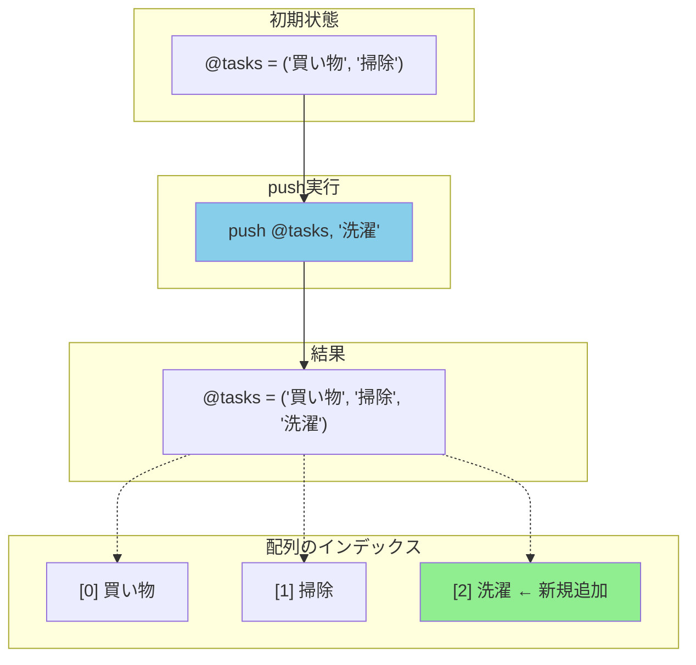
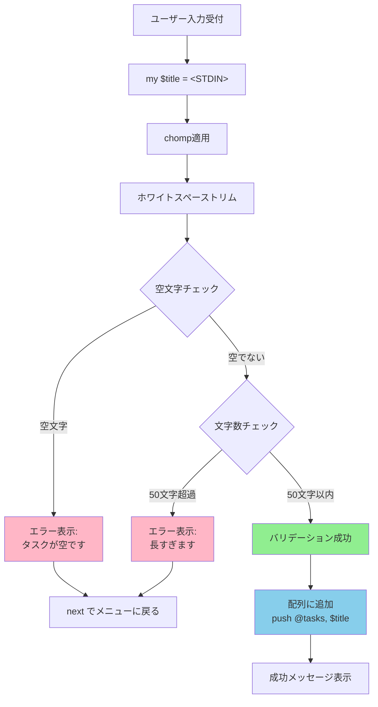
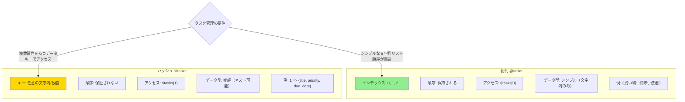
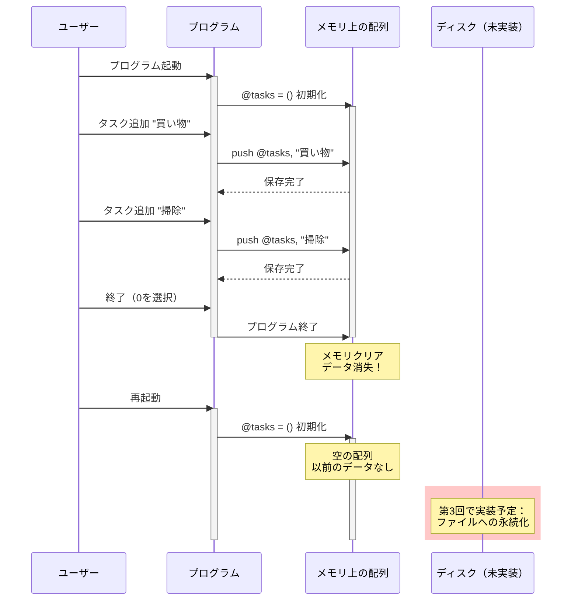

## はじめに

連載「PerlでTODOリストCLIアプリを作ろう」の第2回です。前回は対話的メニューの基本構造を実装し、アプリの骨組みが完成しました。今回はいよいよ「タスク追加」機能を実装していきます。

### 第1回のおさらい

[第1回の記事](/2025/perl-cli-todo-episode01/)では、以下を実装しました：

- `while(1)` による無限ループでメニューを繰り返し表示
- `<STDIN>` でメニュー選択を受け付け
- `chomp` で改行を除去
- `if-elsif-else` で選択に応じた分岐処理

第1回のコードでは、メニューで「1」を選択すると「（タスク追加機能は第2回で実装します）」とメッセージが表示されるだけでした。今回はこの部分を実際に動くコードに置き換えていきます。

### 第2回のゴール

今回の記事を読み終えると、以下ができるようになります：

- **タスクタイトルを入力する**: ユーザーから自由なテキスト入力を受け取る
- **入力バリデーション**: 空文字や長すぎる入力を適切に処理する
- **配列に保存**: 入力されたタスクを配列に格納する
- **一覧表示**: 保存したタスクを見やすく表示する

ファイルへの保存は第3回で実装します。今回は配列に一時的に保存するところまでを扱います。

## `<STDIN>` の基本を復習する

### 標準入力とは何か

標準入力（STDIN）は、プログラムがユーザーからデータを受け取るための基本的な仕組みです。ターミナルでキーボードから入力した内容を、プログラムが読み取ることができます。

Perlでは `<STDIN>` というファイルハンドルを通じて標準入力にアクセスします。これは特別な変数で、ユーザーがEnterキーを押すまでの1行分のテキストを読み取ります。

### なぜファイルハンドル形式なのか

`<STDIN>` の `<...>` という記法は、「行入力演算子」と呼ばれます。これはファイルから1行読み取るときと同じ記法です：

```perl
# ファイルから1行読む
my $line = <$fh>;

# 標準入力から1行読む
my $line = <STDIN>;
```

この統一された記法により、「入力元がファイルでもキーボードでも同じように扱える」という一貫性が生まれます。Perlらしい設計思想です。

### 第1回で学んだこと

第1回では、メニュー選択の受付で `<STDIN>` を使いました：

```perl
my $choice = <STDIN>;
chomp $choice;
```

この2行で「ユーザーの入力を受け取り、改行を除去する」という処理を実現していました。今回はこのパターンをタスクタイトルの入力にも応用していきます。

### STDINの動作フロー

ユーザー入力から変数への格納までの流れを視覚化すると、以下のようになります：

```mermaid
flowchart LR
    A[ユーザーがキーボード入力] -->|"買い物に行く" + Enter| B[STDIN]
    B -->|文字列 + 改行\n"買い物に行く\n"| C["my $title = &lt;STDIN&gt;"]
    C --> D{chomp適用}
    D -->|改行除去| E["$title = '買い物に行く'"]
    D -.->|chompしないと| F["$title = '買い物に行く\n'"]
    
    style E fill:#90EE90
    style F fill:#FFB6C6
    style D fill:#87CEEB
```

この図のポイント：

- **STDIN**は改行文字（`\n`）を含む文字列を返す
- **chomp**を適用することで末尾の改行のみを除去
- **chompを忘れる**と改行が残ったまま変数に保存される（不具合の原因）

## タスクタイトルを入力する

それでは、メニューで「1」を選択したときにタスクタイトルを入力できるようにしましょう。

### 【コード例1：タスクタイトルの入力処理とchomp】

```perl
#!/usr/bin/env perl
# Perl 5.38以降
# 外部依存: なし

use strict;
use warnings;
use utf8;

# 標準入出力をUTF-8に設定
binmode STDOUT, ':utf8';
binmode STDIN,  ':utf8';

# タスクを保存する配列
my @tasks = ();

# メイン処理
while (1) {
    # メニューを表示
    print "\n==== TODOリスト ====\n";
    print "1. タスクを追加\n";
    print "2. タスク一覧を表示\n";
    print "0. 終了\n";
    print "選択してください: ";

    # ユーザー入力を受け取る
    my $choice = <STDIN>;
    chomp $choice;

    # 選択に応じた処理
    if ($choice eq '1') {
        # タスク追加処理
        print "タスクを入力してください: ";
        my $title = <STDIN>;
        chomp $title;  # 改行を除去
        
        # 配列に追加
        push @tasks, $title;
        print "タスクを追加しました！\n";
    }
    elsif ($choice eq '2') {
        # タスク一覧を表示
        if (@tasks == 0) {
            print "タスクはまだ登録されていません。\n";
        }
        else {
            print "\n--- タスク一覧 ---\n";
            my $index = 1;
            foreach my $task (@tasks) {
                print "[$index] $task\n";
                $index++;
            }
        }
    }
    elsif ($choice eq '0') {
        print "終了します。\n";
        last;
    }
    else {
        print "無効な選択です。0〜2の数字を入力してください。\n";
    }
}
```

### コード解説：重要なポイント

#### タスクを保存する配列の宣言

```perl
my @tasks = ();
```

ループの外（プログラムの先頭付近）で配列を宣言しています。これにより、ループを何度繰り返しても配列のデータは保持され続けます。もしループの中で宣言すると、毎回空の配列として初期化されてしまいます。

#### chomp の必須性を再確認

```perl
my $title = <STDIN>;
chomp $title;
```

`<STDIN>` で読み込んだ文字列には、Enterキーによる改行文字（`\n`）が必ず末尾に含まれています。`chomp` を忘れると、タスク一覧で表示したときに不自然な改行が入ってしまいます：

```
# chompを忘れた場合の表示
[1] 買い物に行く
     ← 不自然な空行が入る
[2] 記事を書く
```

実際には、`"買い物に行く\n"` という文字列が保存されているため、`print` で出力したときに改行が2回表示されるのです（`print` 文の最後の `\n` と、文字列内の `\n` の合計2つ）。

`chomp` は「文字列の末尾の改行だけを取り除く」という専門的な役割を持つ関数です。一般的な文字列操作関数ではないため、標準入力を扱うときには必ず意識する必要があります。

#### push で配列に追加

```perl
push @tasks, $title;
```

`push` は配列の末尾に要素を追加する関数です。以下のように動作します：

```perl
my @tasks = ('買い物', '掃除');
push @tasks, '洗濯';
# @tasks は ('買い物', '掃除', '洗濯') になる
```

配列の操作には他にも `unshift`（先頭に追加）、`pop`（末尾から取り出し）、`shift`（先頭から取り出し）などがありますが、タスクリストでは「新しいタスクを末尾に追加する」という動作が自然なので `push` を使います。

### pushによる配列への追加イメージ



新しい要素は常に配列の末尾（最大インデックス + 1）に追加されます。

#### foreach でタスク一覧を表示

```perl
my $index = 1;
foreach my $task (@tasks) {
    print "[$index] $task\n";
    $index++;
}
```

`foreach` ループで配列の各要素を順番に処理しています。`$index` 変数を用意して、タスクに番号を振っています。配列のインデックスは0から始まりますが、ユーザーに見せる番号は1から始める方が自然です。

### 実際に動かしてみよう

このコードを `todo.pl` として保存し、実行してみましょう：

```bash
$ perl todo.pl

==== TODOリスト ====
1. タスクを追加
2. タスク一覧を表示
0. 終了
選択してください: 1
タスクを入力してください: 買い物に行く
タスクを追加しました！

==== TODOリスト ====
1. タスクを追加
2. タスク一覧を表示
0. 終了
選択してください: 2

--- タスク一覧 ---
[1] 買い物に行く
```

タスクの追加と表示ができました。ただし、このコードにはまだ問題があります。

## 入力バリデーションで堅牢性を高める

現在のコードには、以下のような問題があります：

- **空のタスクが追加できてしまう**: 何も入力せずにEnterを押すと、空文字列が保存される
- **長すぎるタスクも追加できる**: 1000文字のタスクなど、表示が崩れるほど長い入力も受け付けてしまう
- **スペースだけの入力**: 「   」（スペース3つ）のような入力も有効なタスクとして保存される

これらの問題を解決するため、入力バリデーション（検証）を追加しましょう。

### 入力バリデーションの処理フロー

入力をどのように検証し、適切にエラー処理するかの流れを示します：



このフローにより、不正な入力を事前に防ぎ、堅牢なアプリケーションを実現します。

### 【コード例2：入力バリデーションと配列への保存】

```perl
#!/usr/bin/env perl
# Perl 5.38以降
# 外部依存: なし

use strict;
use warnings;
use utf8;

# 標準入出力をUTF-8に設定
binmode STDOUT, ':utf8';
binmode STDIN,  ':utf8';

# タスクを保存する配列
my @tasks = ();

# タスクタイトルの最大文字数
my $MAX_TITLE_LENGTH = 50;

# メイン処理
while (1) {
    # メニューを表示
    print "\n==== TODOリスト ====\n";
    print "1. タスクを追加\n";
    print "2. タスク一覧を表示\n";
    print "0. 終了\n";
    print "選択してください: ";

    # ユーザー入力を受け取る
    my $choice = <STDIN>;
    chomp $choice;

    # 選択に応じた処理
    if ($choice eq '1') {
        # タスク追加処理
        print "タスクを入力してください（${MAX_TITLE_LENGTH}文字以内）: ";
        my $title = <STDIN>;
        chomp $title;
        
        # ホワイトスペース（空白、タブ、改行など）をトリム
        $title =~ s/^\s+|\s+$//g;
        
        # バリデーション
        if ($title eq '') {
            print "エラー: タスクが空です。もう一度入力してください。\n";
            next;  # メニューに戻る
        }
        
        if (length($title) > $MAX_TITLE_LENGTH) {
            print "エラー: タスクが長すぎます（${MAX_TITLE_LENGTH}文字以内）。\n";
            next;  # メニューに戻る
        }
        
        # バリデーション通過：配列に追加
        push @tasks, $title;
        print "✓ タスクを追加しました: $title\n";
    }
    elsif ($choice eq '2') {
        # タスク一覧を表示
        if (@tasks == 0) {
            print "タスクはまだ登録されていません。\n";
        }
        else {
            print "\n--- タスク一覧（全" . scalar(@tasks) . "件）---\n";
            my $index = 1;
            foreach my $task (@tasks) {
                print "[$index] $task\n";
                $index++;
            }
        }
    }
    elsif ($choice eq '0') {
        print "終了します。\n";
        last;
    }
    else {
        print "無効な選択です。0〜2の数字を入力してください。\n";
    }
}
```

### コード解説：バリデーションのポイント

#### ホワイトスペースのトリム

```perl
$title =~ s/^\s+|\s+$//g;
```

この正規表現は、文字列の先頭と末尾の空白類文字（スペース、タブ、改行など）を削除します：

- `^\s+`: 先頭の空白類文字（1個以上）
- `\s+$`: 末尾の空白類文字（1個以上）
- `|`: または
- `//g`: マッチした部分を空文字に置き換え（グローバル置換）

これにより、「   買い物   」という入力は「買い物」に正規化されます。

#### 空文字チェック

```perl
if ($title eq '') {
    print "エラー: タスクが空です。もう一度入力してください。\n";
    next;  # メニューに戻る
}
```

トリム後に空文字になっていないかチェックします。`next` を使うことで、以降の処理をスキップしてループの先頭（メニュー表示）に戻ります。

別の書き方として `if (!$title)` も可能ですが、空文字列を明示的にチェックするため `$title eq ''` の方が意図が明確です。

#### 文字数制限

```perl
my $MAX_TITLE_LENGTH = 50;

# ...

if (length($title) > $MAX_TITLE_LENGTH) {
    print "エラー: タスクが長すぎます（${MAX_TITLE_LENGTH}文字以内）。\n";
    next;
}
```

`length()` 関数で文字列の文字数を取得し、上限を超えていないかチェックします。上限値は定数として変数に格納しておくことで、後で変更しやすくなります。

注意点として、`length()` は**文字数**を返します（バイト数ではありません）。UTF-8フラグが立っている文字列に対しては、「あいう」は3文字とカウントされます。

#### エラーメッセージの書き方

良いエラーメッセージの条件：

- **具体的**: 何が問題なのかを明示する
- **建設的**: どうすれば解決できるか示す
- **丁寧**: ユーザーを責めない

悪い例：
```perl
print "Error: Invalid input\n";
```

良い例：
```perl
print "エラー: タスクが空です。もう一度入力してください。\n";
```

#### scalar context での配列要素数の取得

```perl
print "--- タスク一覧（全" . scalar(@tasks) . "件）---\n";
```

`scalar(@tasks)` で配列の要素数を取得できます。`scalar` はコンテキストを明示的にスカラーコンテキストに変換する関数です。

実は、文字列連結の中では自動的にスカラーコンテキストになるため、`scalar` は省略可能です：

```perl
print "--- タスク一覧（全" . @tasks . "件）---\n";  # これでもOK
```

ただし、`scalar` を明示することで「意図的に要素数を取得している」ことが明確になるため、可読性が向上します。

## 配列とハッシュの選択：なぜ配列を使うのか

タスクを保存するデータ構造として、今回は配列 `@tasks` を選びました。ハッシュ `%tasks` という選択肢もありますが、なぜ配列なのでしょうか？

### 配列を選んだ理由

- **順序が重要**: タスクは追加された順番で表示したい
- **シンプル**: タスクタイトルだけを保存するなら配列で十分
- **インデックスがID代わり**: 配列のインデックス（0, 1, 2...）をタスクIDとして使える

### ハッシュが適している場合

もしタスクに複数の情報（タイトル、期限、優先度など）を持たせたい場合は、ハッシュのハッシュ（ネストしたハッシュ）が適しています：

```perl
my %tasks = (
    1 => {
        title    => '買い物',
        priority => 'high',
        due_date => '2025-12-31',
    },
    2 => {
        title    => '掃除',
        priority => 'low',
        due_date => '2026-01-05',
    },
);
```

将来的にデータベース（第5回〜第9回）に移行する際は、このような複雑な構造も扱えるようになります。

### 配列 vs ハッシュの比較

データ構造を選択する際の判断基準を視覚化します：



**今回は配列を選択**：タスクタイトルのみを順序付きで管理するため、配列がシンプルで適切。

## 動作確認：実際に使ってみよう

改良したコードを実行して、バリデーションが正しく動作することを確認しましょう。

### 正常系：タスク追加→一覧表示

```bash
$ perl todo.pl

==== TODOリスト ====
1. タスクを追加
2. タスク一覧を表示
0. 終了
選択してください: 1
タスクを入力してください（50文字以内）: 買い物に行く
✓ タスクを追加しました: 買い物に行く

==== TODOリスト ====
1. タスクを追加
2. タスク一覧を表示
0. 終了
選択してください: 1
タスクを入力してください（50文字以内）: 記事を書く
✓ タスクを追加しました: 記事を書く

==== TODOリスト ====
1. タスクを追加
2. タスク一覧を表示
0. 終了
選択してください: 2

--- タスク一覧（全2件）---
[1] 買い物に行く
[2] 記事を書く
```

### 異常系：空文字入力のエラー

```bash
選択してください: 1
タスクを入力してください（50文字以内）: 
エラー: タスクが空です。もう一度入力してください。
```

何も入力せずにEnterを押すと、エラーメッセージが表示されてメニューに戻ります。

### 異常系：スペースだけの入力

```bash
選択してください: 1
タスクを入力してください（50文字以内）:    
エラー: タスクが空です。もう一度入力してください。
```

スペースだけ入力しても、トリム後に空文字になるため、適切にエラーが表示されます。

### 異常系：長すぎるタスク

```bash
選択してください: 1
タスクを入力してください（50文字以内）: これは非常に長いタスクのタイトルで、50文字を超えてしまうため、エラーになるはずです。
エラー: タスクが長すぎます（50文字以内）。
```

50文字を超える入力は拒否されます。

## 配列の限界：プログラム終了でデータが消える

ここまでで、タスクの追加と一覧表示ができるようになりました。しかし、重要な問題が残っています。

プログラムを終了（`0` を選択）して、再度起動してみてください：

```bash
選択してください: 0
終了します。

$ perl todo.pl

==== TODOリスト ====
1. タスクを追加
2. タスク一覧を表示
0. 終了
選択してください: 2
タスクはまだ登録されていません。
```

せっかく追加したタスクが消えてしまいました！

### なぜデータが消えるのか

配列 `@tasks` はプログラムのメモリ上に存在するため、プログラムが終了するとメモリから削除されます。これを**揮発性**（volatile）のデータと言います。

実用的なTODOアプリにするためには、データを**永続化**（persist）する必要があります。つまり、プログラムが終了してもデータが残る仕組みが必要です。

### データの揮発性と永続化の概念



**問題点**：メモリ上のデータはプログラム終了と共に消失  
**解決策**：第3回でファイルシステム（ディスク）への保存を実装

### 次回予告：ファイルに保存する

第3回では、タスクをテキストファイルに保存する方法を学びます。ファイルはプログラム終了後もディスク上に残るため、データの永続化が実現できます。

具体的には以下の機能を実装します：

- **ファイルへの書き込み**: `open` 関数を使って、タスクをファイルに保存する
- **UTF-8エンコーディング**: 日本語タスクを正しく保存する
- **追記モード**: 既存のタスクを保持しながら新しいタスクを追加する

また、第4回ではファイルからタスクを読み込む機能を実装し、プログラム起動時に保存済みタスクを復元できるようにします。

## まとめ

### 今回学んだこと

第2回では、以下の内容を学びました：

- **`<STDIN>` の実践的な使い方**: メニュー選択だけでなく、自由テキスト入力にも活用できる
- **chomp の必須性**: 標準入力には必ず改行が含まれるため、chomp で除去する必要がある
- **入力バリデーションの基本**: 空文字チェック、文字数制限、ホワイトスペースのトリム
- **配列操作**: `push` で要素を追加、`foreach` で一覧表示、`scalar` で要素数取得
- **データ構造の選択**: 配列とハッシュの使い分け
- **配列の限界**: メモリ上のデータは揮発性であり、永続化が必要

### 完成したコード

今回完成したコードで、以下の機能が動作するようになりました：

- タスクの追加（入力バリデーション付き）
- タスク一覧の表示
- エラーハンドリング

ただし、プログラム終了時にデータが消えるという制限があります。

### 次回の内容

第3回では、以下の内容を学びます：

- **ファイルへの書き込み**: `open` 関数の基本と書き込みモード
- **UTF-8対応**: `:encoding(UTF-8)` でエンコーディング指定
- **追記モード**: `>>` で既存データを保持
- **エラーハンドリング**: ファイルが開けない場合の処理

次回で、ついに「データが残るTODOアプリ」が完成します。お楽しみに！

## 関連記事

将来的には、配列の代わりにデータベースを使うことで、より高度な機能（検索、更新、削除）が実現できます：



また、連載の最終回（第10回）では、コマンドライン引数を使った洗練されたUIを実装します：


