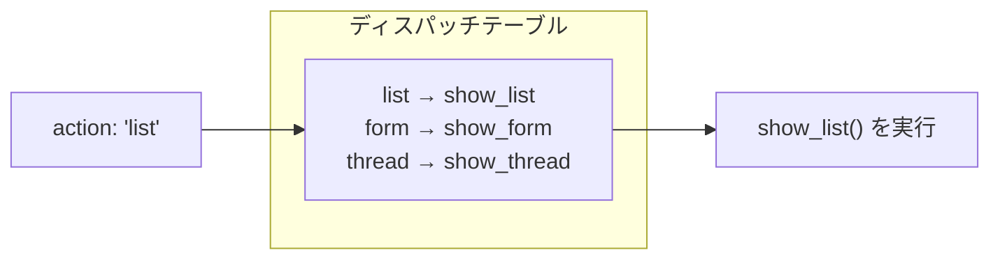

[@nqounet](https://x.com/nqounet)です。

前回は、BBSに機能を追加する過程でif/elseが肥大化する問題を体験しました。



今回は、その問題を解決する第一歩として、ディスパッチテーブルを学びます。

## ディスパッチテーブルとは

ディスパッチテーブルとは、キーと処理の対応をハッシュで管理する仕組みです。if/elseで条件を順番にチェックする代わりに、ハッシュから直接処理を取り出して実行できます。



## ハッシュに処理名を登録する

まずは、どのアクションでどのメソッドを呼ぶかをハッシュに登録してみましょう。

```perl
my %handlers = (
    list   => 'show_list',
    form   => 'show_form',
    thread => 'show_thread',
);
```

`%handlers`というハッシュに、アクション名とメソッド名の対応を定義しています。これがディスパッチテーブルです。

## ハッシュから処理を取り出して実行する

次に、このハッシュを使ってdispatchメソッドを実装します。

```perl
package BBS {
    use Moo;

    my %handlers = (
        list   => 'show_list',
        form   => 'show_form',
        thread => 'show_thread',
    );

    sub show_list   { print "投稿一覧を表示\n"; }
    sub show_form   { print "投稿フォームを表示\n"; }
    sub show_thread { print "スレッドを表示\n"; }

    sub dispatch {
        my ($self, $action) = @_;

        if (exists $handlers{$action}) {
            my $method = $handlers{$action};
            $self->$method();
        }
        else {
            print "不明なアクションです\n";
        }
    }
};

my $bbs = BBS->new();
$bbs->dispatch('list');    # 投稿一覧を表示
$bbs->dispatch('form');    # 投稿フォームを表示
```

`$handlers{$action}`でメソッド名を取り出し、`$self->$method()`で実行しています。if/elseが1つだけになりました！

新しい機能を追加するときは、ハッシュに1行追加し、対応するメソッドを書くだけです。dispatchメソッドを修正する必要はありません。

## まとめ

- ハッシュを使った振り分けの仕組みをディスパッチテーブルと呼ぶ
- if/elseのチェーンがなくなり、コードがすっきりする
- 新しい機能の追加はハッシュに1行追加するだけで済む
- dispatchメソッドの修正が不要になる

## 次回予告

次回は、処理自体を変数に入れる「コードリファレンス」を学びます。メソッド名ではなく、処理そのものをハッシュに登録できるようになります。
