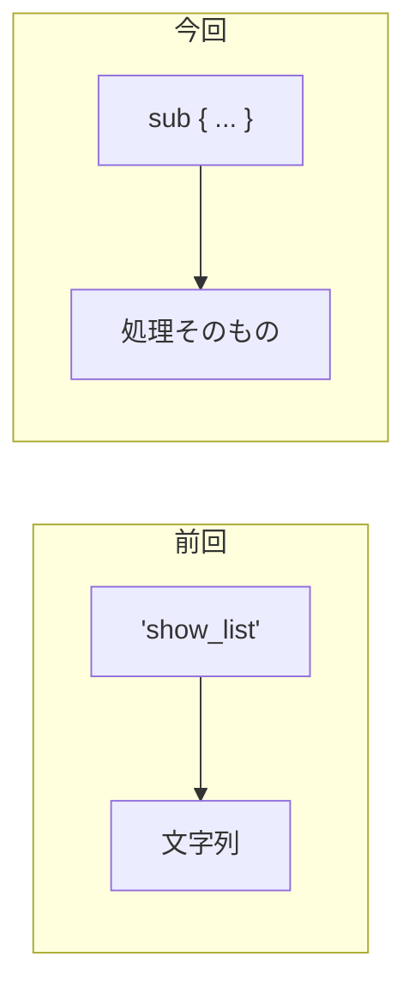

[@nqounet](https://x.com/nqounet)です。

前回は、ハッシュを使って処理を振り分ける「ディスパッチテーブル」を学びました。



今回は、処理そのものを変数に入れるコードリファレンスを学びます。

## コードリファレンスとは

前回のコードでは、ハッシュにメソッド名（文字列）を登録していました。

```perl
my %handlers = (
    list => 'show_list',  # メソッド名の文字列
);
```

コードリファレンスを使うと、メソッド名ではなく処理そのものを変数に入れることができます。



## 基本的な使い方

サブルーチン（関数）を変数に代入するには、`sub { ... }`という書き方を使います。これを「無名サブルーチン」と呼びます。

```perl
my $handler = sub {
    print "こんにちは！\n";
};

# 実行するには、->() をつける
$handler->();  # こんにちは！
```

`$handler`にはサブルーチンへの参照（リファレンス）が入っています。実行するときは`->()`をつけます。これがコードリファレンスの基本です。

## ハッシュに格納して呼び出す

では、前回のディスパッチテーブルをコードリファレンスで書き換えてみましょう。

```perl
package BBS {
    use Moo;

    my %handlers = (
        list   => sub { print "投稿一覧を表示\n"; },
        form   => sub { print "投稿フォームを表示\n"; },
        thread => sub { print "スレッドを表示\n"; },
    );

    sub dispatch {
        my ($self, $action) = @_;

        if (exists $handlers{$action}) {
            $handlers{$action}->();
        }
        else {
            print "不明なアクションです\n";
        }
    }
};

my $bbs = BBS->new();
$bbs->dispatch('list');    # 投稿一覧を表示
$bbs->dispatch('form');    # 投稿フォームを表示
```

メソッド名の代わりに`sub { ... }`を直接登録しています。実行するときは`$handlers{$action}->()`で呼び出せます。

メソッドを別途定義する必要がなくなり、処理とアクション名の対応が一目でわかるようになりました。

## まとめ

- コードリファレンスは、サブルーチンを変数に入れる仕組みである
- `sub { ... }`で無名サブルーチンを作り、変数に代入できる
- 実行するには`->()`をつける
- ハッシュに処理そのものを登録できるようになる
- 関数をデータとして扱う第一歩である

## 次回予告

次回は、処理をクラスに分ける方法を学びます。各機能を別々のクラスに切り出して、責任を分離していきましょう。
