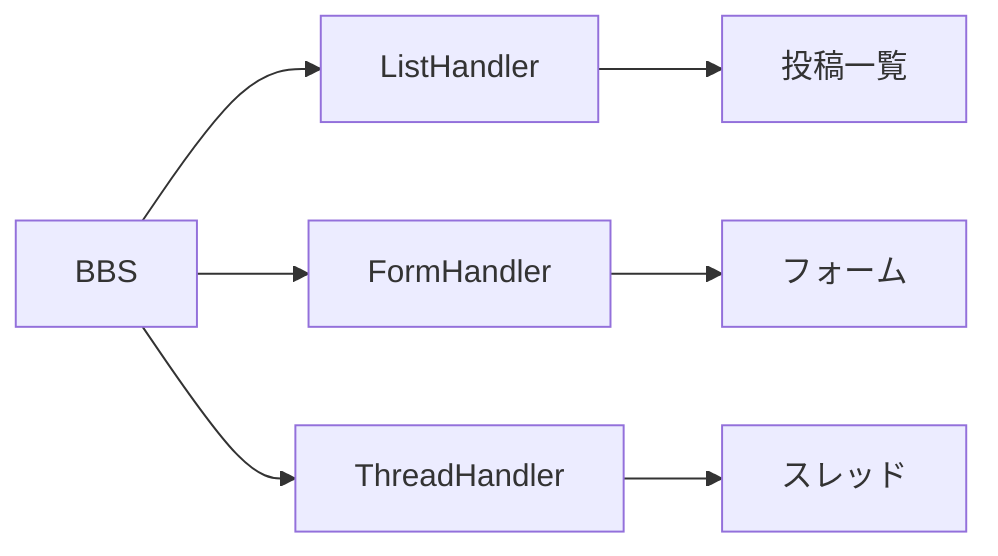

[@nqounet](https://x.com/nqounet)です。

前回は、コードリファレンスを使って処理そのものを変数に入れる方法を学びました。



今回は、処理をハンドラークラスに分ける方法を学びます。

## 処理をクラスに切り出す

前回のコードでは、処理を無名サブルーチンとして書いていました。

```perl
my %handlers = (
    list   => sub { print "投稿一覧を表示\n"; },
    form   => sub { print "投稿フォームを表示\n"; },
);
```

シンプルな処理ならこれで十分ですが、実際のWebアプリケーションでは各機能がもっと複雑になります。データベースへのアクセス、バリデーション、テンプレートの描画など、様々な処理が必要です。

そこで、各機能を専用のクラスに切り出します。このようなクラスをハンドラークラスと呼びます。



## ListHandler クラスの作成

まず、投稿一覧を表示する`ListHandler`クラスを作ります。

```perl
package ListHandler {
    use Moo;

    sub run {
        my ($self) = @_;
        print "投稿一覧を表示\n";
        # ここにデータベース取得などの処理を書く
    }
};

my $handler = ListHandler->new();
$handler->run();  # 投稿一覧を表示
```

処理を担当する`run`メソッドを定義しました。クラスなので、後から属性を追加してデータベース接続などを持たせることもできます。

## FormHandler クラスの作成

同じパターンで、フォーム表示用の`FormHandler`クラスも作ります。

```perl
package FormHandler {
    use Moo;

    sub run {
        my ($self) = @_;
        print "投稿フォームを表示\n";
        # ここにフォーム生成などの処理を書く
    }
};

my $handler = FormHandler->new();
$handler->run();  # 投稿フォームを表示
```

どちらのクラスも`run`という同じ名前のメソッドを持っています。これにより、呼び出す側は「どのハンドラーか」を意識せずに`run`を呼べます。

これが責任の分離です。BBSクラスは「どの処理を選ぶか」だけを担当し、「処理の中身」は各ハンドラークラスに任せます。

## まとめ

- 処理を専用クラス（ハンドラークラス）に切り出す
- 各ハンドラーは共通の`run`メソッドを持つ
- 責任を分離することでコードが整理される
- 機能追加や修正がしやすくなる

## 次回予告

次回は、各ハンドラークラスに「必ず`run`メソッドを持つ」という約束を`Moo::Role`で定義します。共通のルールを作って、より堅牢な設計にしていきましょう。
