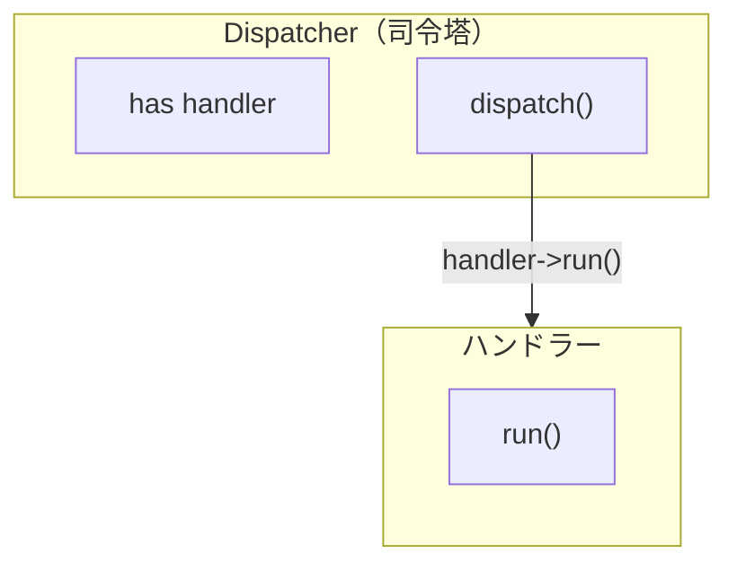

[@nqounet](https://x.com/nqounet)です。

前回は、すべてのハンドラーが`run`メソッドを持つという約束を`Moo::Role`の`requires`で定義し、インターフェースを作りました。



今回は、ハンドラーを保持して処理を振り分けるディスパッチャークラスを作ります。このクラスが「司令塔」として働き、適切なハンドラーに処理を委ねます。

## 問題：ハンドラーを誰が管理するのか

前回までに`ListHandler`や`FormHandler`などのハンドラークラスを作りました。でも、これらのハンドラーを管理して、適切なタイミングで呼び出す役割は誰が担うのでしょうか？

今のところ、利用側のコードで直接ハンドラーを生成して呼び出しています。

```perl
my $handler = ListHandler->new();
$handler->run();
```

一見シンプルですが、アプリケーションが大きくなると問題が生じます。

- どのハンドラーを使うか判断するロジックがあちこちに散らばる
- ハンドラーの生成と呼び出しが分離されておらず、テストしにくい
- 新しいハンドラーを追加するたびに、呼び出し側も変更が必要

ハンドラーを一元管理して、処理を振り分ける「司令塔」が必要です。

## 解決策：ディスパッチャークラスを作る

ハンドラーを保持し、処理を振り分ける専用のクラスを作りましょう。前シリーズの第11回で学んだ「委譲（handles）」を活用すると、ディスパッチャーがハンドラーのメソッドをスムーズに呼び出せます。





## Dispatcherクラスの作成

まずはシンプルなDispatcherクラスを作ります。

```perl
package Handler {
    use Moo::Role;
    requires 'run';
};

package ListHandler {
    use Moo;
    with 'Handler';

    sub run {
        my ($self) = @_;
        print "投稿一覧を表示\n";
    }
};

package Dispatcher {
    use Moo;

    has handler => (
        is       => 'ro',
        required => 1,
    );

    sub dispatch {
        my ($self) = @_;
        $self->handler->run();
    }
};

my $dispatcher = Dispatcher->new(
    handler => ListHandler->new()
);
$dispatcher->dispatch();  # 投稿一覧を表示
```

`has handler`でハンドラーオブジェクトを保持し、`dispatch`メソッドでそのハンドラーの`run`メソッドを呼び出します。Dispatcherが司令塔として「どのハンドラーに処理を任せるか」を管理する設計です。

## handlesを使った委譲

`dispatch`メソッドを書く代わりに、`handles`を使えばさらにシンプルになります。

```perl
package Handler {
    use Moo::Role;
    requires 'run';
};

package ListHandler {
    use Moo;
    with 'Handler';

    sub run {
        my ($self) = @_;
        print "投稿一覧を表示\n";
    }
};

package FormHandler {
    use Moo;
    with 'Handler';

    sub run {
        my ($self) = @_;
        print "投稿フォームを表示\n";
    }
};

package Dispatcher {
    use Moo;

    has handler => (
        is       => 'ro',
        required => 1,
        handles  => ['run'],  # ハンドラーに委譲
    );
};

my $list_dispatcher = Dispatcher->new(handler => ListHandler->new());
$list_dispatcher->run();  # 投稿一覧を表示

my $form_dispatcher = Dispatcher->new(handler => FormHandler->new());
$form_dispatcher->run();  # 投稿フォームを表示
```

`handles => ['run']`によって、`$dispatcher->run()`と呼び出すと、内部で`$dispatcher->handler->run()`が実行されます。Dispatcherに渡すハンドラーを変えるだけで、異なる処理が実行されるのがポイントです。

## まとめ

- ハンドラーを管理する司令塔としてDispatcherクラスを作成した
- `has handler`でハンドラーを保持し、`dispatch`メソッドで処理を振り分ける
- `handles`を使えばハンドラーのメソッドに直接委譲できる
- Dispatcherに渡すハンドラーを変えれば、実行される処理も変わる

## 次回予告

次回は、実行時にハンドラーを動的に切り替える機能を追加します。`is => 'rw'`を使って、柔軟にハンドラーを差し替えられるようにしていきましょう。
