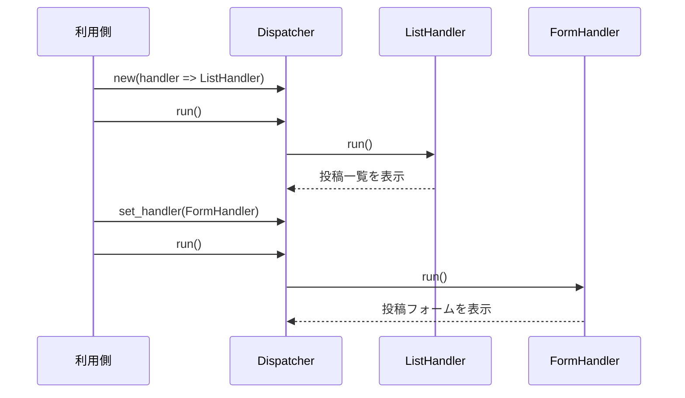

[@nqounet](https://x.com/nqounet)です。

前回は、ハンドラーを保持して処理を振り分けるDispatcherクラスを作りました。



今回は、実行時にハンドラーを動的に切り替える機能を追加します。

## 問題：ハンドラーを途中で変えられない

前回のDispatcherでは、`has handler => (is => 'ro')`としていたため、一度セットしたハンドラーは変更できませんでした。

しかし、実際のアプリケーションでは、ユーザーの操作に応じて表示を切り替えたい場面がよくあります。例えば「一覧を見ていたけど、投稿フォームを表示したい」といった場合です。

## 解決策：`is => 'rw'`で動的に変更可能にする

前シリーズの第4回で学んだ`is => 'rw'`を思い出してください。書き込み可能な属性にすれば、実行時にハンドラーを差し替えられます。





## set_handlerメソッドの追加

`is => 'rw'`に変更し、`set_handler`メソッドを追加しましょう。

```perl
package Handler {
    use Moo::Role;
    requires 'run';
};

package ListHandler {
    use Moo;
    with 'Handler';

    sub run {
        my ($self) = @_;
        print "投稿一覧を表示\n";
    }
};

package FormHandler {
    use Moo;
    with 'Handler';

    sub run {
        my ($self) = @_;
        print "投稿フォームを表示\n";
    }
};

package Dispatcher {
    use Moo;

    has handler => (
        is       => 'rw',      # roからrwに変更
        required => 1,
        handles  => ['run'],
    );

    sub set_handler {
        my ($self, $new_handler) = @_;
        $self->handler($new_handler);
    }
};
```

`is => 'rw'`にすることで、`handler`属性を後から変更できるようになりました。

「`$dispatcher->handler($new)`で直接変更できるのに、なぜ`set_handler`を作るの？」と思うかもしれません。これは、コードを読む人に「ここでハンドラーを切り替えている」という意図を明確に伝えるためです。

## 実行時にハンドラーを差し替えるデモ

実際に動かしてみましょう。

```perl
# 最初はListHandlerで起動
my $dispatcher = Dispatcher->new(handler => ListHandler->new());
$dispatcher->run();  # 投稿一覧を表示

# FormHandlerに切り替え
$dispatcher->set_handler(FormHandler->new());
$dispatcher->run();  # 投稿フォームを表示

# またListHandlerに戻す
$dispatcher->set_handler(ListHandler->new());
$dispatcher->run();  # 投稿一覧を表示
```

1つのDispatcherオブジェクトで、ハンドラーを自由に切り替えられるようになりました。ユーザーの操作やリクエストに応じて、動的に振る舞いを変えられます。

## まとめ

- `is => 'rw'`を使えば、実行時にハンドラーを切り替えられる
- `set_handler`メソッドで意図を明確にした切り替えが可能
- 1つのDispatcherで複数のハンドラーを使い分けられる柔軟性を獲得した

## 次回予告

次回は、複数のハンドラーをあらかじめ登録しておく「レジストリ」の仕組みを作ります。ハンドラーを名前で管理できるようになります。
