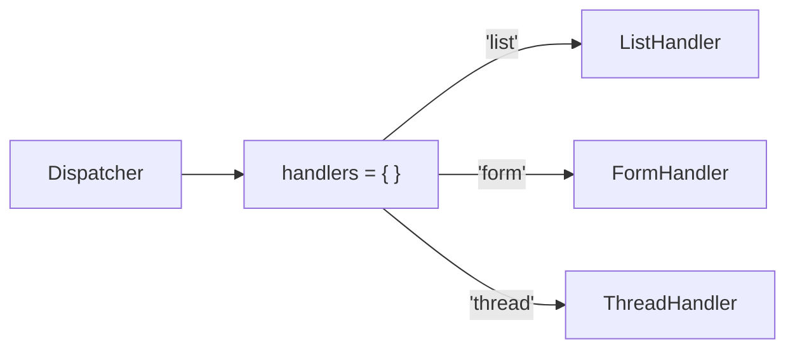

[@nqounet](https://x.com/nqounet)です。

前回は、実行時にハンドラーを動的に切り替える機能を追加しました。



今回は、複数のハンドラーを登録して管理する仕組みを作ります。

## 問題：ハンドラーが増えると管理が大変

これまでのディスパッチャーでは、ハンドラーを1つずつ`set_handler`で切り替えていました。しかし、ハンドラーが増えてくると、どこかでハンドラーの一覧を管理したくなります。

例えば「listという名前でListHandlerを、formという名前でFormHandlerを登録しておき、名前を指定するだけで切り替えたい」というニーズが出てきます。

## 解決策：レジストリでハンドラーを管理する

「レジストリ」とは、オブジェクトを名前付きで登録しておく仕組みです。ハッシュを使って、名前とハンドラーの対応を管理します。

```perl
package Dispatcher {
    use Moo;

    has handlers => (
        is      => 'ro',
        default => sub { {} },
    );

    has current_handler => (
        is => 'rw',
    );

    sub register_handler {
        my ($self, $name, $handler) = @_;
        $self->handlers->{$name} = $handler;
    }

    sub dispatch {
        my ($self, $name) = @_;
        my $handler = $self->handlers->{$name};
        if ($handler) {
            $self->current_handler($handler);
            $handler->run;
        } else {
            die "Unknown handler: $name";
        }
    }
};
```

`handlers`属性はハッシュリファレンスを持ち、`register_handler`メソッドで名前とハンドラーの対応を登録します。

## 使ってみよう

```perl
# ハンドラーを登録
my $dispatcher = Dispatcher->new;
$dispatcher->register_handler('list', ListHandler->new);
$dispatcher->register_handler('form', FormHandler->new);
$dispatcher->register_handler('thread', ThreadHandler->new);

# 名前を指定してディスパッチ
$dispatcher->dispatch('list');    # 一覧を表示
$dispatcher->dispatch('form');    # フォームを表示
$dispatcher->dispatch('thread');  # スレッドを表示
```

これで、名前を指定するだけで適切なハンドラーに処理を振り分けられるようになりました。



## まとめ

- 複数のハンドラーを管理するにはレジストリパターンが便利である
- ハッシュを属性として持ち、名前とハンドラーの対応を管理する
- `register_handler`メソッドでハンドラーを登録する
- `dispatch`メソッドで名前を指定してハンドラーを呼び出す

## 次回予告

次回は、名前からハンドラーを自動で選ぶ仕組みを作ります。ファクトリー的な生成パターンを学びましょう。お楽しみに。
