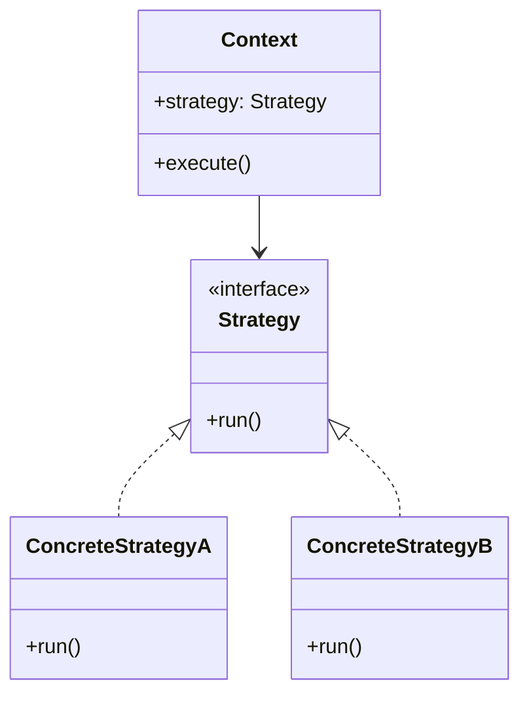

[@nqounet](https://x.com/nqounet)です。

前回は、これまで作ってきた機能を統合し、ディスパッチャーを完成させました。



最終回の今回は、私たちが作ってきたものの正体を明かします。

## 実は「Strategy パターン」だった

驚くかもしれませんが、私たちがこのシリーズで作ってきたディスパッチャーは、「Strategy パターン」と呼ばれるデザインパターンの実装でした。

デザインパターンとは、ソフトウェア設計における「定石」や「お約束」のことです。将棋や囲碁に定石があるように、プログラミングにも「こういう問題にはこう設計するとうまくいく」というパターンがあります。

## Strategy パターンの構造

Strategy パターンは、以下の3つの要素で構成されます。

- Context（文脈）: 私たちが作ったDispatcher
- Strategy（戦略）: Handler ロール
- Concrete Strategy（具体的な戦略）: ListHandler、FormHandlerなど

実行時に「どの戦略（ハンドラー）を使うか」を切り替えられる仕組み。これがStrategy パターンの本質です。

## 私たちが作ったものを振り返る

シリーズを通じて、私たちは無意識のうちにStrategy パターンを実装していました。

| Strategy パターンの要素 | 私たちが作ったもの |
|:------------------------|:-------------------|
| Context | Dispatcher |
| Strategy Interface | Handler ロール（requires 'run'） |
| Concrete Strategy | ListHandler、FormHandler、ThreadHandler |
| 戦略の切り替え | dispatch() メソッド |

if/elseの問題を解決しようとした結果、自然とこのパターンに辿り着いたのです。

## なぜデザインパターンを学ぶのか

デザインパターンを知っていると、以下のメリットがあります。

- 共通の語彙: 「Strategyパターンで実装しよう」と言えば、チームメンバーに設計意図が伝わる
- 車輪の再発明を避ける: 先人が考えた良い設計を活用できる
- 拡張しやすい設計: パターンに従うと、変更に強いコードになる

## 他のデザインパターンへ

GoF（Gang of Four）と呼ばれる4人の著者が書いた本では、23のデザインパターンが紹介されています。

Strategy パターンの次に学ぶとよいパターンをいくつか紹介します。

- Command パターン: 操作自体をオブジェクトにカプセル化する
- Factory Method パターン: オブジェクトの生成をサブクラスに任せる
- Chain of Responsibility パターン: 処理を連鎖させる



## シリーズのまとめ

全12回を通じて、以下のことを学びました。

1. if/elseの問題点と、それを解決する方法
2. ハッシュとコードリファレンスを使ったディスパッチ
3. 処理をクラスに分離して責任を明確にする方法
4. Moo::Roleでインターフェースを定義する方法
5. 委譲を使ってシンプルに設計する方法
6. 動的にオブジェクトを切り替える方法
7. URLルーティングの基本
8. そして、これらがStrategy パターンだったこと

## おわりに

「気がつけばそれがデザインパターンだった」——これが本シリーズの目標でした。

デザインパターンは、暗記するものではありません。問題を解決しようと試行錯誤するうちに、自然と辿り着くものです。

今回学んだことを活かして、より良いコードを書いていきましょう。シリーズをお読みいただき、ありがとうございました。

## 関連リンク

前シリーズ「Mooで覚えるオブジェクト指向プログラミング」もぜひご覧ください。


