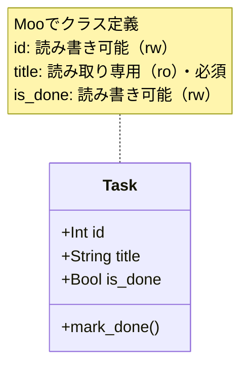

[@nqounet](https://x.com/nqounet)です。

シリーズ「シンプルなTodo CLIアプリ」の第2回です。

## 前回の振り返り



前回は、if-elsif分岐でシンプルなTodo CLIを作成しました。

- `@ARGV` からコマンドライン引数を取得
- if-elsif分岐でサブコマンドを振り分け
- テキストファイル（todo.txt）でタスクを永続化
- 約50行のシンプルなスクリプトが完成

動くものはできましたが、タスクは単なる文字列として扱っていました。今回はこのタスクをクラスにして、オブジェクト指向の力を借りましょう。

## 今回のゴール - Taskクラスを作成する

前回は、タスクを「文字列の配列」として管理していました。

```perl
my @tasks = ('牛乳を買う', 'メールを返信する');
```

しかし、この方法だとタスクに関連する情報（完了状態、作成日時、優先度など）を追加するのが困難です。

今回は、タスクを表す Taskクラス を作成し、データと操作をひとまとめにします。「Mooで覚えるオブジェクト指向プログラミング」で学んだMooの知識を活かしていきましょう。

## Taskクラスの設計

今回作成するTaskクラスの構造を図で確認しましょう。



この図は、Taskクラスが持つ3つの属性（id, title, is_done）と1つのメソッド（mark_done）を示しています。Mooの`has`でそれぞれの属性を定義し、`sub`でメソッドを実装します。

### どんな情報を持たせるか

Taskクラスに持たせる情報を整理します。

| 属性 | 役割 | 型 |
|------|------|-----|
| `id` | タスクを識別する一意の番号 | 整数 |
| `title` | タスクの内容 | 文字列 |
| `is_done` | 完了状態 | 真偽値 |

最小限ですが、Todoアプリとして必要な情報は揃っています。

### どんな操作を持たせるか

Taskクラスに持たせるメソッドは1つだけです。

| メソッド | 役割 |
|---------|------|
| `mark_done()` | タスクを完了状態にする |

シンプルに始めましょう。必要になったら後から追加できます。

## Taskクラスの実装

### クラスの定義

Mooを使ってTaskクラスを定義します。

```perl
package Task {
    use Moo;

    has id => (
        is       => 'rw',
        default  => sub { 0 },
    );

    has title => (
        is       => 'ro',
        required => 1,
    );

    has is_done => (
        is      => 'rw',
        default => sub { 0 },
    );

    sub mark_done {
        my $self = shift;
        $self->is_done(1);
    }
}
```

それぞれの属性について確認しましょう。

### id - タスクの識別子

```perl
has id => (
    is       => 'rw',
    default  => sub { 0 },
);
```

- `is => 'rw'` : 読み書き可能（後から設定できるようにする）
- `default => sub { 0 }` : デフォルトは0（保存時に正式なIDを振る）

IDは「後から設定する」ケースがあるため、`rw`（読み書き可能）にしています。新しいタスクを作成する時点ではIDは未定で、保存時に決まるからです。

### title - タスクの内容

```perl
has title => (
    is       => 'ro',
    required => 1,
);
```

- `is => 'ro'` : 読み取り専用（一度設定したら変更しない）
- `required => 1` : 必須（タスク内容なしのタスクは意味がない）

タスクの内容は作成後に変更しない想定です。編集機能を追加する場合は `rw` に変更することもできます。

### is_done - 完了状態

```perl
has is_done => (
    is      => 'rw',
    default => sub { 0 },
);
```

- `is => 'rw'` : 読み書き可能（完了状態を変更できる）
- `default => sub { 0 }` : デフォルトは未完了（0は偽、1は真）

完了状態は `mark_done()` メソッドで変更します。直接 `$task->is_done(1)` としても良いですが、メソッドを通すことで意図が明確になります。

## mark_done()メソッドの実装

### タスクを完了にする

```perl
sub mark_done {
    my $self = shift;
    $self->is_done(1);
}
```

シンプルですね。`is_done` を真（1）に設定するだけです。

「なぜわざわざメソッドにするのか」と思うかもしれません。理由は2つあります。

1. 意図が明確になる - `$task->mark_done()` は「完了にする」という意図がすぐ分かる
2. 拡張しやすい - 完了時に何か処理を追加したくなったら、このメソッドに書けばよい

例えば、将来「完了日時を記録する」機能を追加するなら、このメソッドを拡張するだけで済みます。

```perl
sub mark_done {
    my $self = shift;
    $self->is_done(1);
    $self->completed_at(time());  # 将来の拡張
}
```

## Taskクラスを使ってみる

### オブジェクトの生成

新しいタスクを作成してみましょう。

```perl
my $task = Task->new(title => '牛乳を買う');
print $task->title;    # 牛乳を買う
print $task->is_done;  # 0（未完了）
print $task->id;       # 0（未設定）
```

`title` だけを指定すれば、他の属性はデフォルト値が使われます。

### 完了状態にする

```perl
$task->mark_done();
print $task->is_done;  # 1（完了）
```

`mark_done()` を呼ぶだけでタスクが完了状態になります。

### IDを設定する

```perl
$task->id(1);
print $task->id;  # 1
```

IDは後から設定できます。これは保存時にリポジトリが割り当てる想定です（後の回で実装します）。

## todo.plをTaskクラス対応に修正する

### ファイル構成の変更

Taskクラスを別ファイルに分けることもできますが、今回は1ファイルのまま進めます。

```perl
#!/usr/bin/env perl
use strict;
use warnings;
use utf8;

# === Taskクラスの定義 ===
package Task {
    use Moo;

    has id => (
        is       => 'rw',
        default  => sub { 0 },
    );

    has title => (
        is       => 'ro',
        required => 1,
    );

    has is_done => (
        is      => 'rw',
        default => sub { 0 },
    );

    sub mark_done {
        my $self = shift;
        $self->is_done(1);
    }
}

# === メイン処理 ===
package main;

my $file    = 'todo.txt';
my $command = shift @ARGV // 'help';

# ... 以下続く
```

`package Task { ... }` でクラスを定義し、`package main;` でメイン処理に戻ります。

### 保存形式の変更

Taskオブジェクトを保存するには、オブジェクトの情報をテキストに変換する必要があります。今回は簡易的にタブ区切り形式を使います。

```
1	牛乳を買う	0
2	メールを返信する	1
```

各行は「ID、タイトル、完了状態」をタブで区切った形式です。

### ファイル読み込みの修正

```perl
sub load_tasks {
    my ($file) = @_;
    my @tasks;
    
    return @tasks unless -e $file;
    
    open my $fh, '<', $file or die "Cannot open $file: $!";
    while (my $line = <$fh>) {
        chomp $line;
        my ($id, $title, $is_done) = split /\t/, $line;
        push @tasks, Task->new(
            id      => $id,
            title   => $title,
            is_done => $is_done,
        );
    }
    close $fh;
    
    return @tasks;
}
```

タブ区切りの行を読み込んで、Taskオブジェクトを生成します。

### ファイル書き込みの修正

```perl
sub save_tasks {
    my ($file, @tasks) = @_;
    
    open my $fh, '>', $file or die "Cannot open $file: $!";
    for my $task (@tasks) {
        print $fh join("\t", $task->id, $task->title, $task->is_done), "\n";
    }
    close $fh;
}
```

Taskオブジェクトからデータを取り出して、タブ区切りで保存します。

## 修正後のtodo.pl

### 完成コード

```perl
#!/usr/bin/env perl
use strict;
use warnings;
use utf8;

# === Taskクラスの定義 ===
package Task {
    use Moo;

    has id => (
        is       => 'rw',
        default  => sub { 0 },
    );

    has title => (
        is       => 'ro',
        required => 1,
    );

    has is_done => (
        is      => 'rw',
        default => sub { 0 },
    );

    sub mark_done {
        my $self = shift;
        $self->is_done(1);
    }
}

# === メイン処理 ===
package main;

my $file    = 'todo.txt';
my $command = shift @ARGV // 'help';

sub load_tasks {
    my ($file) = @_;
    my @tasks;
    
    return @tasks unless -e $file;
    
    open my $fh, '<', $file or die "Cannot open $file: $!";
    while (my $line = <$fh>) {
        chomp $line;
        my ($id, $title, $is_done) = split /\t/, $line;
        push @tasks, Task->new(
            id      => $id,
            title   => $title,
            is_done => $is_done,
        );
    }
    close $fh;
    
    return @tasks;
}

sub save_tasks {
    my ($file, @tasks) = @_;
    
    open my $fh, '>', $file or die "Cannot open $file: $!";
    for my $task (@tasks) {
        print $fh join("\t", $task->id, $task->title, $task->is_done), "\n";
    }
    close $fh;
}

sub next_id {
    my @tasks = @_;
    my $max = 0;
    for my $task (@tasks) {
        $max = $task->id if $task->id > $max;
    }
    return $max + 1;
}

if ($command eq 'add') {
    my $title = shift @ARGV;
    die "Usage: $0 add <task>\n" unless defined $title && $title ne '';
    
    my @tasks = load_tasks($file);
    my $task = Task->new(
        id    => next_id(@tasks),
        title => $title,
    );
    push @tasks, $task;
    save_tasks($file, @tasks);
    
    print "Added: $title\n";
}
elsif ($command eq 'list') {
    my @tasks = load_tasks($file);
    
    if (@tasks == 0) {
        print "No tasks.\n";
        exit;
    }
    
    for my $task (@tasks) {
        my $status = $task->is_done ? '[x]' : '[ ]';
        printf "%d. %s %s\n", $task->id, $status, $task->title;
    }
}
elsif ($command eq 'complete') {
    my $id = shift @ARGV;
    die "Usage: $0 complete <id>\n" unless defined $id && $id =~ /^\d+$/;
    
    my @tasks = load_tasks($file);
    my $found = 0;
    
    for my $task (@tasks) {
        if ($task->id == $id) {
            $task->mark_done();
            $found = 1;
            print "Completed: " . $task->title . "\n";
            last;
        }
    }
    
    die "Task $id not found.\n" unless $found;
    save_tasks($file, @tasks);
}
else {
    print "Usage: $0 <command> [args]\n";
    print "Commands:\n";
    print "  add <task>      - Add a new task\n";
    print "  list            - List all tasks\n";
    print "  complete <id>   - Complete a task by ID\n";
}
```

### 動作確認

```bash
$ perl todo.pl add "牛乳を買う"
Added: 牛乳を買う

$ perl todo.pl add "メールを返信する"
Added: メールを返信する

$ perl todo.pl list
1. [ ] 牛乳を買う
2. [ ] メールを返信する

$ perl todo.pl complete 1
Completed: 牛乳を買う

$ perl todo.pl list
1. [x] 牛乳を買う
2. [ ] メールを返信する
```

前回と違い、完了したタスクを削除せず「完了マーク」が付くようになりました。

## クラス化で何が良くなったか

### データと操作がまとまった

タスクに関する情報（id, title, is_done）と操作（mark_done）が1つのクラスにまとまりました。

```perl
# Before: バラバラに管理
my @tasks = ('牛乳を買う', 'メールを返信する');
my @done = (0, 1);

# After: オブジェクトで一括管理
my $task = Task->new(title => '牛乳を買う');
$task->mark_done();
```

### 拡張が容易になった

新しい属性（例: 優先度、期限）を追加するのが簡単になりました。

```perl
# 将来の拡張例
has priority => (
    is      => 'rw',
    default => sub { 'normal' },
);

has due_date => (
    is => 'rw',
);
```

Taskクラスを変更するだけで、アプリ全体に反映されます。

### 意図が明確になった

`$task->mark_done()` は「タスクを完了にする」という意図がすぐに分かります。

```perl
# Before: 何をしているか分かりにくい
$done[$index] = 1;

# After: 意図が明確
$task->mark_done();
```

## 次回予告 - JSONで永続化

今回、保存形式をタブ区切りにしました。しかし、この形式には問題があります。

- タブを含むタスク名に対応できない
- 属性が増えると順番の管理が大変
- 他のプログラムとの連携が難しい

次回は、より汎用的な JSONフォーマット で永続化する方法を学びます。

## まとめ

今回は、タスクをクラスにしてオブジェクト指向の力を借りました。

- `Task` クラスを Moo で定義
- `id`, `title`, `is_done` の3つの属性を保持
- `mark_done()` メソッドでタスクを完了状態にする
- データと操作がまとまり、拡張しやすくなった

「Mooで覚えるオブジェクト指向プログラミング」で学んだ知識が活きてきましたね。

次回は、JSONファイルでタスクを保存する方法を学びます。お楽しみに！
