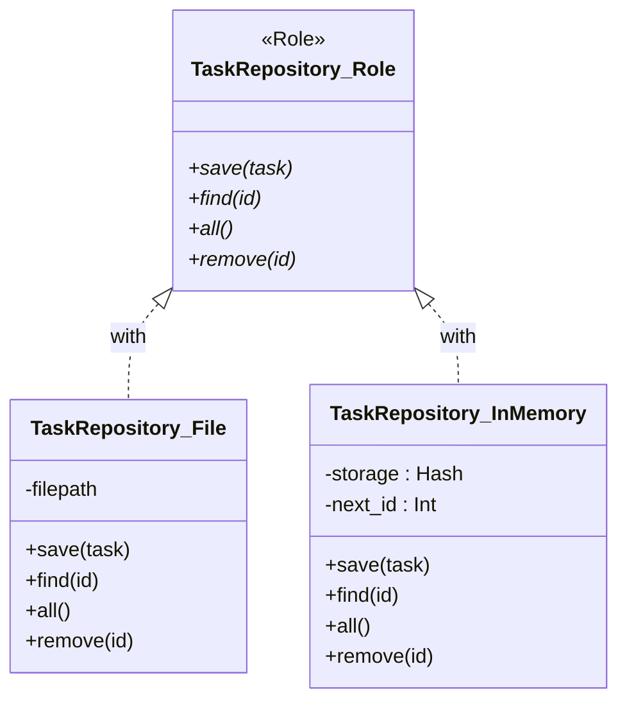
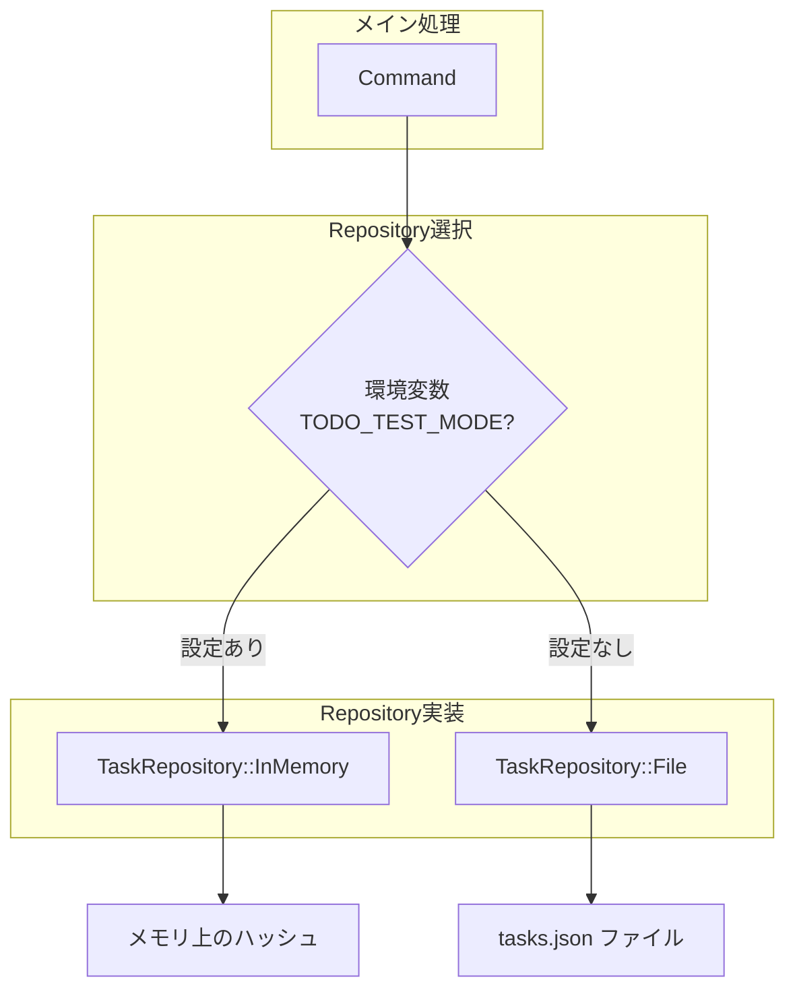

[@nqounet](https://x.com/nqounet)です。

シリーズ「シンプルなTodo CLIアプリ」の第5回です。

## 前回の振り返り



前回は、Repositoryパターンで永続化処理を分離しました。

- `TaskRepository::Role` でインターフェースを定義
- `TaskRepository::File` でJSON永続化を実装
- メイン処理が「何をするか」に集中できるようになった

永続化処理が1箇所にまとまりましたが、テストを書こうとすると問題があります。今回は InMemoryRepository を実装してテスト容易性を高めます。

## ファイルI/Oの問題

### テストでファイルを使う困難さ

`TaskRepository::File` を使ってテストを書くと、以下の問題が発生します。

```perl
# テストコード
my $repo = TaskRepository::File->new(filepath => 'test_tasks.json');
my $task = Task->new(title => 'テストタスク');
$repo->save($task);

# 検証
my @tasks = $repo->all;
is(scalar @tasks, 1, 'タスクが1件保存された');

# クリーンアップが必要！
unlink 'test_tasks.json';
```

問題点:
- テストごとにファイルが作成される
- テスト失敗時にファイルが残る可能性がある
- 並列テストでファイル競合の危険がある
- CI環境でパス問題が発生する可能性がある

### 理想的なテスト

テストはファイルI/Oなしで、メモリ内で完結するのが理想です。

```perl
my $repo = TaskRepository::InMemory->new;
my $task = Task->new(title => 'テストタスク');
$repo->save($task);

my @tasks = $repo->all;
is(scalar @tasks, 1, 'タスクが1件保存された');
# クリーンアップ不要！テスト終了時に自動的に消える
```

## InMemoryRepositoryの設計

InMemoryRepositoryを追加した構造を確認しましょう。



この図は、同じRoleを適用した2つのRepository実装を示しています。どちらも同じインターフェース（save, find, all, remove）を持つため、呼び出し側のコードを変更せずに実装を切り替えられます。

### 同じインターフェースを実装する

`TaskRepository::InMemory` は `TaskRepository::File` と同じRoleを適用します。

```perl
package TaskRepository::InMemory {
    use Moo;

    with 'TaskRepository::Role';

    # save, find, all, remove を実装
}
```

これにより、メイン処理を変更せずにRepositoryを差し替えられます。

### 内部ストレージ

ファイルの代わりに、ハッシュリファレンスをストレージとして使用します。

```perl
has storage => (
    is      => 'rw',
    default => sub { {} },
);

has next_id => (
    is      => 'rw',
    default => sub { 1 },
);
```

- `storage` : タスクを保持するハッシュ（IDをキーにする）
- `next_id` : 次に割り当てるID

## InMemoryRepositoryの実装

### saveメソッド

```perl
sub save {
    my ($self, $task) = @_;

    if (!$task->id || $task->id == 0) {
        $task->id($self->next_id);
        $self->next_id($self->next_id + 1);
    }

    $self->storage->{$task->id} = $task;
    return $task;
}
```

- IDが未設定なら新しいIDを割り当てる
- ハッシュにタスクを格納

### findメソッド

```perl
sub find {
    my ($self, $id) = @_;
    return $self->storage->{$id};
}
```

ハッシュから直接取得するだけです。存在しなければ `undef` が返ります。

### allメソッド

```perl
sub all {
    my $self = shift;
    return values %{$self->storage};
}
```

ハッシュの全値をリストで返します。

### removeメソッド

```perl
sub remove {
    my ($self, $id) = @_;

    if (exists $self->storage->{$id}) {
        delete $self->storage->{$id};
        return 1;
    }
    return 0;
}
```

存在確認してから削除。成功すれば真を返します。

## 完成したInMemoryRepository

### 全体コード

```perl
package TaskRepository::InMemory {
    use Moo;

    with 'TaskRepository::Role';

    has storage => (
        is      => 'rw',
        default => sub { {} },
    );

    has next_id => (
        is      => 'rw',
        default => sub { 1 },
    );

    sub save {
        my ($self, $task) = @_;

        if (!$task->id || $task->id == 0) {
            $task->id($self->next_id);
            $self->next_id($self->next_id + 1);
        }

        $self->storage->{$task->id} = $task;
        return $task;
    }

    sub find {
        my ($self, $id) = @_;
        return $self->storage->{$id};
    }

    sub all {
        my $self = shift;
        return values %{$self->storage};
    }

    sub remove {
        my ($self, $id) = @_;

        if (exists $self->storage->{$id}) {
            delete $self->storage->{$id};
            return 1;
        }
        return 0;
    }
}
```

`TaskRepository::File` より遥かにシンプルです。ファイルI/Oがないため、エラー処理も不要です。

## リポジトリ切り替えのデモ

### 同じコードで動作確認

両方のRepositoryが同じインターフェースを持つため、呼び出し側のコードは同一です。

```perl
# FileRepositoryを使う場合
my $file_repo = TaskRepository::File->new(filepath => 'tasks.json');
demo($file_repo);

# InMemoryRepositoryを使う場合
my $memory_repo = TaskRepository::InMemory->new;
demo($memory_repo);

sub demo {
    my $repo = shift;

    # タスク追加
    my $task1 = Task->new(title => '牛乳を買う');
    my $task2 = Task->new(title => 'メールを返信する');
    $repo->save($task1);
    $repo->save($task2);

    # 一覧表示
    print "--- All tasks ---\n";
    for my $task ($repo->all) {
        printf "%d. %s\n", $task->id, $task->title;
    }

    # 完了処理
    my $task = $repo->find(1);
    $task->mark_done();
    $repo->save($task);

    print "Completed: " . $task->title . "\n";
}
```

`demo` サブルーチンは、渡されたRepositoryがFileでもInMemoryでも同じように動作します。

### 実行結果

```
--- All tasks ---
1. 牛乳を買う
2. メールを返信する
Completed: 牛乳を買う
```

どちらのRepositoryでも同じ結果が得られます。これが インターフェースの力 です。

## テストコードを書いてみる

### Test::Moreを使ったテスト

InMemoryRepositoryを使えば、ファイルを気にせずテストが書けます。

```perl
#!/usr/bin/env perl
use strict;
use warnings;
use Test::More;

# Taskクラスと TaskRepository::InMemory を読み込んでいる前提

subtest 'save and find' => sub {
    my $repo = TaskRepository::InMemory->new;

    my $task = Task->new(title => 'テストタスク');
    $repo->save($task);

    is($task->id, 1, 'IDが割り当てられた');

    my $found = $repo->find(1);
    is($found->title, 'テストタスク', 'タスクが取得できた');
};

subtest 'all' => sub {
    my $repo = TaskRepository::InMemory->new;

    $repo->save(Task->new(title => 'タスク1'));
    $repo->save(Task->new(title => 'タスク2'));
    $repo->save(Task->new(title => 'タスク3'));

    my @tasks = $repo->all;
    is(scalar @tasks, 3, '3件のタスクがある');
};

subtest 'remove' => sub {
    my $repo = TaskRepository::InMemory->new;

    my $task = Task->new(title => '削除するタスク');
    $repo->save($task);

    ok($repo->remove(1), '削除成功');
    ok(!$repo->find(1), '削除後は取得できない');
};

subtest 'mark_done' => sub {
    my $repo = TaskRepository::InMemory->new;

    my $task = Task->new(title => '完了するタスク');
    $repo->save($task);

    $task->mark_done();
    $repo->save($task);

    my $found = $repo->find(1);
    ok($found->is_done, 'タスクが完了状態');
};

done_testing;
```

### テストの特徴

- 各subtestで新しいRepositoryを作成
- ファイルのクリーンアップが不要
- 並列実行しても競合しない
- 高速に実行できる

## todo.plへの組み込み

### 環境変数でRepositoryを切り替える

本番ではFile、テストではInMemoryを使うように切り替えられます。

```perl
my $repository;
if ($ENV{TODO_TEST_MODE}) {
    $repository = TaskRepository::InMemory->new;
}
else {
    $repository = TaskRepository::File->new(filepath => 'tasks.json');
}
```

環境変数 `TODO_TEST_MODE` が設定されていればInMemoryを使用します。

### 完成したtodo.pl

```perl
#!/usr/bin/env perl
use strict;
use warnings;
use utf8;
use JSON;

# === Taskクラスの定義 ===
package Task {
    use Moo;

    has id => (
        is       => 'rw',
        default  => sub { 0 },
    );

    has title => (
        is       => 'ro',
        required => 1,
    );

    has is_done => (
        is      => 'rw',
        default => sub { 0 },
    );

    sub mark_done {
        my $self = shift;
        $self->is_done(1);
    }
}

# === TaskRepository::Role ===
package TaskRepository::Role {
    use Moo::Role;

    requires 'save';
    requires 'find';
    requires 'all';
    requires 'remove';
}

# === TaskRepository::File ===
package TaskRepository::File {
    use Moo;
    use JSON;

    with 'TaskRepository::Role';

    has filepath => (
        is      => 'ro',
        default => sub { 'tasks.json' },
    );

    sub _load {
        my $self = shift;
        my @tasks;

        return @tasks unless -e $self->filepath;

        open my $fh, '<:encoding(UTF-8)', $self->filepath or die $!;
        my $json = do { local $/; <$fh> };
        close $fh;

        my $data = decode_json($json);

        for my $item (@$data) {
            push @tasks, Task->new(
                id      => $item->{id},
                title   => $item->{title},
                is_done => $item->{is_done} ? 1 : 0,
            );
        }

        return @tasks;
    }

    sub _save_all {
        my ($self, @tasks) = @_;

        my @data = map {
            {
                id      => $_->id,
                title   => $_->title,
                is_done => $_->is_done ? \1 : \0,
            }
        } @tasks;

        open my $fh, '>:encoding(UTF-8)', $self->filepath or die $!;
        print $fh encode_json(\@data);
        close $fh;
    }

    sub save {
        my ($self, $task) = @_;
        my @tasks = $self->_load;

        if ($task->id && $task->id > 0) {
            my $found = 0;
            for my $t (@tasks) {
                if ($t->id == $task->id) {
                    $t->is_done($task->is_done);
                    $found = 1;
                    last;
                }
            }
            push @tasks, $task unless $found;
        }
        else {
            my $max_id = 0;
            for my $t (@tasks) {
                $max_id = $t->id if $t->id > $max_id;
            }
            $task->id($max_id + 1);
            push @tasks, $task;
        }

        $self->_save_all(@tasks);
        return $task;
    }

    sub find {
        my ($self, $id) = @_;
        my @tasks = $self->_load;

        for my $task (@tasks) {
            return $task if $task->id == $id;
        }
        return;
    }

    sub all {
        my $self = shift;
        return $self->_load;
    }

    sub remove {
        my ($self, $id) = @_;
        my @tasks = $self->_load;
        my $original_count = @tasks;

        @tasks = grep { $_->id != $id } @tasks;

        if (@tasks < $original_count) {
            $self->_save_all(@tasks);
            return 1;
        }
        return 0;
    }
}

# === TaskRepository::InMemory ===
package TaskRepository::InMemory {
    use Moo;

    with 'TaskRepository::Role';

    has storage => (
        is      => 'rw',
        default => sub { {} },
    );

    has next_id => (
        is      => 'rw',
        default => sub { 1 },
    );

    sub save {
        my ($self, $task) = @_;

        if (!$task->id || $task->id == 0) {
            $task->id($self->next_id);
            $self->next_id($self->next_id + 1);
        }

        $self->storage->{$task->id} = $task;
        return $task;
    }

    sub find {
        my ($self, $id) = @_;
        return $self->storage->{$id};
    }

    sub all {
        my $self = shift;
        return values %{$self->storage};
    }

    sub remove {
        my ($self, $id) = @_;

        if (exists $self->storage->{$id}) {
            delete $self->storage->{$id};
            return 1;
        }
        return 0;
    }
}

# === メイン処理 ===
package main;

my $repository;
if ($ENV{TODO_TEST_MODE}) {
    $repository = TaskRepository::InMemory->new;
}
else {
    $repository = TaskRepository::File->new(filepath => 'tasks.json');
}

my $command = shift @ARGV // 'help';

if ($command eq 'add') {
    my $title = shift @ARGV;
    die "Usage: $0 add <task>\n" unless defined $title && $title ne '';

    my $task = Task->new(title => $title);
    $repository->save($task);

    print "Added: $title (ID: " . $task->id . ")\n";
}
elsif ($command eq 'list') {
    my @tasks = $repository->all;

    if (@tasks == 0) {
        print "No tasks.\n";
        exit;
    }

    for my $task (sort { $a->id <=> $b->id } @tasks) {
        my $status = $task->is_done ? '[x]' : '[ ]';
        printf "%d. %s %s\n", $task->id, $status, $task->title;
    }
}
elsif ($command eq 'complete') {
    my $id = shift @ARGV;
    die "Usage: $0 complete <id>\n" unless defined $id && $id =~ /^\d+$/;

    my $task = $repository->find($id);
    die "Task $id not found.\n" unless $task;

    $task->mark_done();
    $repository->save($task);

    print "Completed: " . $task->title . "\n";
}
else {
    print "Usage: $0 <command> [args]\n";
    print "Commands:\n";
    print "  add <task>      - Add a new task\n";
    print "  list            - List all tasks\n";
    print "  complete <id>   - Complete a task by ID\n";
}
```

## Repositoryパターンの真価

リポジトリ切り替えの概念を図で確認しましょう。



この図は、環境変数によってRepositoryを切り替える仕組みを示しています。テスト時はInMemoryRepository、本番時はFileRepositoryを使用します。どちらのRepositoryも同じインターフェースを持つため、Commandクラスのコードは変更不要です。

### 同じインターフェースの威力

今回、2つのRepositoryを作成しました。

| クラス | 用途 | ストレージ |
|--------|------|-----------|
| `TaskRepository::File` | 本番 | JSONファイル |
| `TaskRepository::InMemory` | テスト | メモリ（ハッシュ） |

どちらも `TaskRepository::Role` を適用しているため、同じメソッドで操作できます。

### 将来の拡張

同じパターンで、他の保存先も追加できます。

- `TaskRepository::SQLite` : SQLiteデータベース
- `TaskRepository::API` : REST API経由で保存
- `TaskRepository::Redis` : Redisキャッシュ

メイン処理を変更せず、Repositoryクラスを追加するだけです。

### 依存性注入（DI）の基礎

Repositoryを外部から注入するパターンは「依存性注入」と呼ばれる設計パターンです。

```perl
# 外部からRepositoryを渡す
sub run_app {
    my ($repository) = @_;
    # $repository を使って処理
}

# 本番
run_app(TaskRepository::File->new);

# テスト
run_app(TaskRepository::InMemory->new);
```

テスト時にモック（テスト用のダミー）を差し込みやすくなります。

## まとめ

今回は、InMemoryRepositoryを実装してテスト容易性を高めました。

- `TaskRepository::InMemory` を実装
- ファイルI/Oなしでテストが可能に
- 同じインターフェースで実装を切り替え可能
- Repositoryパターンの真価を体感

同じインターフェースを持つ複数の実装があることで、用途に応じて切り替えられるようになりました。これは今後の拡張（SQLiteへの移行など）にも役立ちます。

次回以降は、Commandパターンでサブコマンドの処理をオブジェクト化していきます。if-elsif分岐から脱出し、より拡張しやすい構造を目指しましょう！

お楽しみに！
