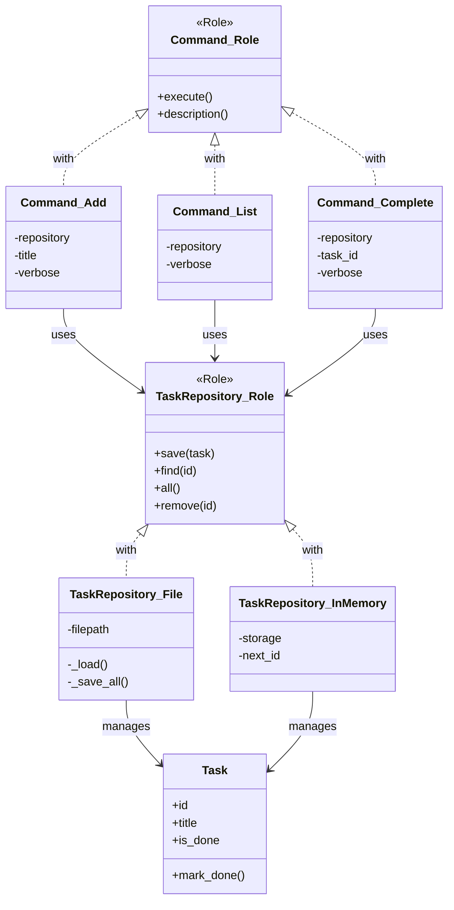

[@nqounet](https://x.com/nqounet)です。

シリーズ「シンプルなTodo CLIアプリ」の第9回です。

## 前回の振り返り



前回は、Getopt::Longでコマンドライン引数を整理しました。

- `Getopt::Long` でオプションを解析
- `--verbose`, `--file`, `--help` オプションを追加
- サブコマンドとオプションを組み合わせた構造

今回は シリーズ全体を振り返り 、最初の素朴な実装と完成した設計を比較します。

## 完成したtodoコマンドの使用例

### 基本的な使い方

```bash
$ perl todo.pl add "牛乳を買う"
Added: 牛乳を買う (ID: 1)

$ perl todo.pl add "メールを返信する"
Added: メールを返信する (ID: 2)

$ perl todo.pl list
1. [ ] 牛乳を買う
2. [ ] メールを返信する

$ perl todo.pl complete 1
Completed: 牛乳を買う

$ perl todo.pl list
1. [x] 牛乳を買う
2. [ ] メールを返信する
```

### オプションを使う

```bash
$ perl todo.pl --file=work.json add "会議の準備"
Added: 会議の準備 (ID: 1)

$ perl todo.pl --verbose add "報告書を書く"
[DEBUG] Saved to repository
[DEBUG] Task ID: 3
Added: 報告書を書く (ID: 3)

$ perl todo.pl --help
Usage: todo.pl [options] <command> [args]

Options:
  -v, --verbose     Verbose output
  -f, --file=PATH   Task file path (default: tasks.json)
  -h, --help        Show this help

Commands:
  add <task>        Add a new task
  list              List all tasks
  complete <id>     Complete a task by ID
```

## Before vs After

### 第1回の素朴な実装

```perl
#!/usr/bin/env perl
use strict;
use warnings;

my $file = 'todo.txt';
my $command = shift @ARGV // 'help';

if ($command eq 'add') {
    my $task = shift @ARGV;
    die "Usage: $0 add <task>\n" unless defined $task;

    open my $fh, '>>', $file or die $!;
    print $fh "$task\n";
    close $fh;

    print "Added: $task\n";
}
elsif ($command eq 'list') {
    # ... 一覧表示
}
elsif ($command eq 'complete') {
    # ... 完了処理
}
else {
    # ヘルプ
}
```

特徴:

- 約50行で完結
- if-elsif分岐で処理を振り分け
- ファイル操作がメイン処理に直接記述
- テキストファイルで永続化

### 最終的な設計

```perl
# Taskクラス - ドメインモデル
package Task { ... }

# TaskRepository::Role - 永続化のインターフェース
package TaskRepository::Role { ... }

# TaskRepository::File - JSON永続化
package TaskRepository::File { ... }

# TaskRepository::InMemory - テスト用
package TaskRepository::InMemory { ... }

# Command::Role - コマンドのインターフェース
package Command::Role { ... }

# Command::Add, Command::List, Command::Complete
package Command::Add { ... }
package Command::List { ... }
package Command::Complete { ... }

# メイン処理
package main;
my $repository = TaskRepository::File->new(filepath => $filepath);
my $command = $command_map{$cmd_name}->();
$command->execute;
```

## クラス構成図

完成したTodo CLIアプリのクラス構成を図で確認しましょう。



この図は、シリーズを通じて構築した完成版のクラス構成を示しています。大きく分けて3つの層があります：

1. ドメインモデル: Taskクラス（データと振る舞い）
2. 永続化層: TaskRepository::Role + 実装クラス群
3. アプリケーション層: Command::Role + 実装クラス群

各層がRoleを通じて抽象化されているため、実装の詳細を隠蔽しつつ、拡張性を確保しています。

## 導入したデザインパターン

### 1. Repositoryパターン

目的: データの永続化処理を抽象化する

```perl
package TaskRepository::Role {
    use Moo::Role;

    requires 'save';
    requires 'find';
    requires 'all';
    requires 'remove';
}
```

効果:

- 永続化処理が1箇所にまとまった
- ストレージを差し替え可能（File → InMemory → SQLite）
- テストが書きやすくなった

### 2. Commandパターン

目的: 各操作をオブジェクトとしてカプセル化する

```perl
package Command::Role {
    use Moo::Role;

    requires 'execute';
    requires 'description';
}
```

効果:

- if-elsif分岐が整理された
- 新機能追加がクラス追加だけで完了
- 各コマンドを独立してテスト可能

## 設計改善の効果

### 拡張性の比較

| 項目 | Before | After |
|------|--------|-------|
| 新コマンド追加 | if-elsif分岐に追記 | クラスを追加するだけ |
| 永続化方式変更 | メイン処理を全面改修 | Repositoryクラスを差し替え |
| テスト実行 | ファイルI/Oが必要 | InMemoryで高速テスト可能 |

### 保守性の比較

| 項目 | Before | After |
|------|--------|-------|
| バグ調査 | どこにコードがあるか探す | 対応するクラスを見る |
| 影響範囲 | 変更が他に波及しやすい | クラスごとに分離されている |
| コードの見通し | 長大なif-elsif | 責務が明確なクラス群 |

### コード量の比較

| 項目 | Before | After |
|------|--------|-------|
| 行数 | 約50行 | 約300行 |
| ファイル数 | 1ファイル | 1ファイル（論理的には分離可能） |
| クラス数 | 0 | 8クラス/Role |

コード量は増えましたが、それぞれの部品が小さく、責務が明確になっています。

## 振り返り: 各回で学んだこと

### 第1回: まずは動くものを作る

- if-elsif分岐でシンプルに実装
- 「動くこと」を最優先
- 拡張性の課題を確認

### 第2回: タスクをクラスにする

- Mooでドメインオブジェクトを定義
- データと操作をまとめる
- オブジェクト指向の基本

### 第3回: JSONで永続化

- JSON形式でデータを保存
- テキストファイルの限界を解決
- 構造化データの利点

### 第4回: Repositoryパターン導入

- 永続化処理を分離
- インターフェースをRoleで定義
- 変更に強い設計

### 第5回: InMemoryRepository

- テスト用リポジトリを追加
- 同じインターフェースの威力
- 依存性注入の基礎

### 第6回: Commandパターン導入

- 操作をオブジェクトに
- if-elsif分岐から脱出
- 拡張性の向上

### 第7回: コマンドを増やす

- Command::Completeを追加
- 新機能追加の容易さを体験
- オープン・クローズド原則

### 第8回: Getopt::Long

- オプション解析を整理
- --verbose, --fileに対応
- 堅牢なCLIに仕上げ

## 学んだ設計原則

### 単一責任の原則 (SRP)

各クラスは1つの責務だけを持つ。

- `Task` - タスクのデータと状態変更
- `TaskRepository::File` - ファイルへの永続化
- `Command::Add` - タスク追加の操作

### オープン・クローズド原則 (OCP)

拡張に対して開いている、変更に対して閉じている。

- 新しいコマンド追加時、既存のCommandクラスは変更不要
- 新しいストレージ追加時、既存のRepositoryクラスは変更不要

### 依存性逆転の原則 (DIP)

具体ではなく抽象に依存する。

- CommandクラスはRepositoryの具体的な実装を知らない
- `TaskRepository::Role` という抽象に依存している

## 今後の発展

### さらなる改善の可能性

1. ファイル分割: 各クラスを別ファイルに分離
2. 設定ファイル: デフォルト設定を外部ファイルで管理
3. カラー出力: ターミナルに色付きで表示
4. 日付管理: 期限や作成日を追加
5. 優先度: タスクに優先度を設定

### 次回予告

次回（最終回）は 演習 として、SQLiteでの永続化に挑戦します。

Repositoryパターンの応用で、既存コードをほとんど変更せずにSQLite対応を追加します。パターンの威力を自分の手で体感してください！

## まとめ

今回は、シリーズ全体を振り返りました。

- 第1回の素朴な実装と最終的な設計を比較
- Repositoryパターン、Commandパターンの効果を確認
- 設計原則（SRP, OCP, DIP）を実践
- コード量は増えたが保守性・拡張性が向上

約50行の素朴なスクリプトから、約300行の設計されたアプリケーションへ。コード量は増えましたが、それぞれの部品が小さく、責務が明確になりました。

「Mooで覚えるオブジェクト指向プログラミング」で学んだ知識が、実践的なアプリケーション開発に活きていることを実感できたでしょうか。

次回は演習として、SQLite永続化に挑戦します。お楽しみに！
