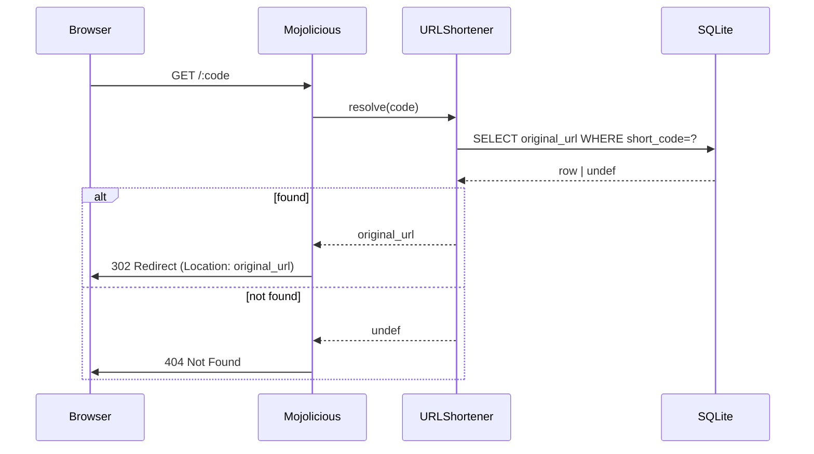

[@nqounet](https://x.com/nqounet)です。

連載「URL短縮サポーターを作ってみよう」の第10回です。

## 前回の振り返り

第9回では、SELECT文とfetchrow_hashrefを使って、短縮コードから元のURLを検索する方法を学びました。



前回学んだ内容を簡単に振り返ります。

- SELECT文とプレースホルダでデータベースからデータを安全に検索できる
- `$sth->fetchrow_hashref`で検索結果をハッシュリファレンスとして取得できる
- 結果が見つからない場合は`undef`が返されるため、`if ($row)`で分岐する
- 見つからない場合は404エラーを返すのが適切である

今回は、取得した元のURLへ自動的にリダイレクトする方法を学びます。

## 今回のゴール

第10回では、以下を達成することを目標とします。

- HTTPリダイレクトの仕組みを理解する
- `$c->redirect_to()`で元のURLへ転送する
- 存在しない短縮コードに対して404エラーを返す

## おお、自動で元のサイトに飛んだ！

### タカシさんの感動

元のURLを検索できるようになったタカシさん。いよいよURL短縮サービスの核心機能に挑戦します。

「短縮コード`abc123`にアクセスしたら、保存してある元のURLに自動的に飛ぶようにしたいんだけど、どうすればいい？」

この「自動的に飛ぶ」という動作こそが、HTTPリダイレクトです。URL短縮サービスの最も重要な機能であり、この連載のクライマックスとも言える部分です。

### HTTPリダイレクトとは

HTTPリダイレクトとは、Webサーバーがブラウザに対して「このURLではなく、別のURLを見てください」と指示する仕組みです。

具体的には、サーバーがHTTPステータスコード3xx（リダイレクト系）とともに、移動先のURLを`Location`ヘッダーで返します。ブラウザはこの応答を受け取ると、自動的に指定されたURLへ移動します。

### 301と302の違い

リダイレクトには主に2種類あります。

- 301 Moved Permanently（恒久的リダイレクト）
  - コンテンツが永久に新しいURLへ移動した
  - ブラウザや検索エンジンは新しいURLを記憶する
  - 使用例：サイトのドメイン変更、ページの完全移転
- 302 Found（一時的リダイレクト）
  - コンテンツは一時的に別のURLにある
  - ブラウザや検索エンジンは元のURLを記憶し続ける
  - 使用例：URL短縮サービス、メンテナンスページへの転送

URL短縮サービスでは、短縮URLは単なる「仲介役」であり、元のURLが本来のコンテンツの所在地です。そのため、302 Found（一時的リダイレクト）を使うのが適切です。

## redirect_toでリダイレクトを実装する

### Mojoliciousでのリダイレクト

Mojoliciousでは、`$c->redirect_to()`メソッドを使うことで、簡単にHTTPリダイレクトを実装できます。

```perl
#!/usr/bin/env perl
# app.pl（抜粋）
# Perl: 5.20以上（サブルーチンシグネチャ使用）
# 依存: Mojolicious, DBI, DBD::SQLite（cpanmでインストール）
$c->redirect_to($original_url);
```

たった1行で、ブラウザを指定したURLへ転送できます。Mojoliciousはデフォルトで302ステータスコードを使用するため、URL短縮サービスに最適です。

もし301リダイレクト（恒久的）を使いたい場合は、以下のように明示的に指定します。

```perl
$c->res->code(301);
$c->redirect_to($url);
```

しかし、今回は302を使うので、シンプルに`redirect_to`を呼ぶだけで問題ありません。



### 存在しない短縮コードへの対応

第9回で学んだとおり、データベースに存在しない短縮コードでアクセスされた場合は、404エラーを返すのが適切です。

```perl
#!/usr/bin/env perl
# app.pl（抜粋）
# Perl: 5.20以上（サブルーチンシグネチャ使用）
# 依存: Mojolicious, DBI, DBD::SQLite（cpanmでインストール）
$c->render(status => 404, text => 'Not Found');
```

HTTPステータスコード404は「リソースが見つからない」ことを示す標準的な応答です。存在しない短縮コードにアクセスしたユーザーに、明確なエラーメッセージを表示できます。

## 完成したルートの実装

### 前回のコードと組み合わせる

第9回で実装したSELECT処理と、今回のリダイレクト処理を組み合わせると、URL短縮サービスの核心機能が完成します。

```perl
#!/usr/bin/env perl
# app.pl（抜粋）
# Perl: 5.20以上（サブルーチンシグネチャ使用）
# 依存: Mojolicious, DBI, DBD::SQLite（cpanmでインストール）
use Mojolicious::Lite -signatures;
use DBI;

my $dbh = DBI->connect(
    "dbi:SQLite:dbname=urls.db",
    "",
    "",
    { RaiseError => 1, AutoCommit => 1 }
);

get '/:code' => sub ($c) {
    my $code = $c->param('code');

    my $sth = $dbh->prepare("SELECT original_url FROM urls WHERE short_code = ?");
    $sth->execute($code);
    my $row = $sth->fetchrow_hashref;

    if ($row) {
        my $original_url = $row->{original_url};
        $c->app->log->info("リダイレクト: $code -> $original_url");
        $c->redirect_to($original_url);
    } else {
        $c->app->log->warn("存在しない短縮コード: $code");
        $c->render(status => 404, text => 'Not Found');
    }
};

app->start;
```

コードの流れを解説します。

#### データベース検索

```perl
my $sth = $dbh->prepare("SELECT original_url FROM urls WHERE short_code = ?");
$sth->execute($code);
my $row = $sth->fetchrow_hashref;
```

第9回で学んだとおり、プレースホルダを使って安全にSELECT文を実行し、結果を取得します。

#### 結果に応じた処理の分岐

```perl
if ($row) {
    $c->redirect_to($original_url);
} else {
    $c->render(status => 404, text => 'Not Found');
}
```

検索結果が見つかればリダイレクトし、見つからなければ404エラーを返します。ログ出力も追加しているため、開発中の動作確認やトラブルシューティングにも役立ちます。

## 動作確認

### morboで起動する

ファイルを保存したら、morboで起動しているサーバーが自動的にリロードされます。もしサーバーを停止していた場合は、再度以下のコマンドを実行してください。

```bash
morbo app.pl
```

### ブラウザで確認する

まず、第7回で登録した短縮コード（例: `abc123`）でアクセスしてみましょう。

1. `http://localhost:3000/abc123`にアクセスします
2. 自動的に元のURLにリダイレクトされることを確認します
3. ターミナルのログに「リダイレクト: abc123 -> https://...」と出力されていることを確認します

次に、存在しない短縮コードでアクセスしてみましょう。

1. `http://localhost:3000/notexist`にアクセスします
2. 画面に「Not Found」と表示されることを確認します
3. ターミナルのログに「存在しない短縮コード: notexist」と出力されていることを確認します

### ブラウザの開発者ツールで確認

リダイレクトの動作をより詳しく確認するには、ブラウザの開発者ツールが便利です。

1. ブラウザの開発者ツールを開きます（F12キーまたは右クリック→「検証」）
2. 「ネットワーク」タブを選択します
3. 短縮URLにアクセスします
4. リクエスト一覧に302ステータスコードが表示されることを確認します

302応答には`Location`ヘッダーが含まれており、リダイレクト先のURLが指定されていることがわかります。

## まとめ

### 今回学んだこと

第10回では、以下のことを学びました。

- HTTPリダイレクトとは、サーバーがブラウザに別のURLへ移動するよう指示する仕組みである
- 301は恒久的リダイレクト、302は一時的リダイレクトであり、URL短縮サービスでは302を使う
- `$c->redirect_to($url)`でリダイレクトを実装できる
- 存在しない短縮コードには`$c->render(status => 404, text => 'Not Found')`で404エラーを返す

これで、URL短縮サービスの核心機能が完成しました。短縮URLにアクセスすると、元のURLに自動的に転送されるようになりました。

### 次回予告

次回は「変なURLは断ろう — バリデーションで安全に」をテーマに、不正なURL入力を防ぐバリデーション機能を実装します。セキュリティを強化して、より安全なサービスを目指しましょう。お楽しみに。
