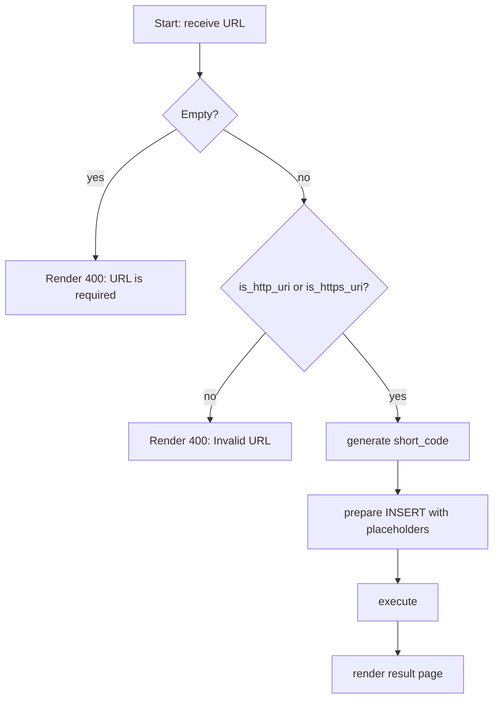

[@nqounet](https://x.com/nqounet)です。

連載「URL短縮サポーターを作ってみよう」の第11回です。

## 前回の振り返り

第10回では、`$c->redirect_to()`を使って、短縮URLから元のURLへリダイレクトする方法を学びました。



前回学んだ内容を簡単に振り返ります。

- HTTPリダイレクトとは、サーバーがブラウザに別のURLへ移動するよう指示する仕組みである
- 301は恒久的リダイレクト、302は一時的リダイレクトであり、URL短縮サービスでは302を使う
- `$c->redirect_to($url)`でリダイレクトを実装できる
- 存在しない短縮コードには404エラーを返すのが適切である

今回は、不正なURL入力を防ぐバリデーション機能を実装します。

## 今回のゴール

第11回では、以下を達成することを目標とします。

- なぜURL入力のバリデーションが必要なのかを理解する
- Data::Validate::URIモジュールを使ったスキーム検証を学ぶ
- HTTP/HTTPSスキームのみを許可するバリデーション処理を実装する

## 変なURLを入力されたらどうなる？

### タカシさんの気づき

URL短縮サービスの核心機能が完成して喜んでいたタカシさん。しかし、ふとした疑問が浮かびました。

「ところで、フォームには何でも入力できるよね？ 例えば、`javascript:alert(1)`みたいなのを入力されたらどうなるの？」

鋭い指摘です。現時点のアプリケーションでは、入力されたURLをほぼそのまま保存し、リダイレクト先として使用しています。これは非常に危険な状態です。

### XSS（クロスサイトスクリプティング）の脅威

`javascript:`スキームを含むURLをリダイレクト先として使用すると、XSS（クロスサイトスクリプティング）攻撃の踏み台になる可能性があります。

例えば、悪意のあるユーザーが以下のようなURLを登録したとします。

```
javascript:alert('悪意のあるスクリプト')
```

この短縮URLにアクセスしたユーザーのブラウザで、意図しないJavaScriptが実行されるかもしれません。最悪の場合、Cookieの盗難やフィッシング詐欺につながります。

### 許可すべきスキーム

URL短縮サービスとして許可すべきスキームは、基本的に`http`と`https`のみです。以下のようなスキームは拒否すべきです。

- `javascript:` — スクリプト実行
- `data:` — データURLスキーム（悪意のあるコンテンツを埋め込める）
- `file:` — ローカルファイルへのアクセス
- `ftp:` — FTPプロトコル（用途が限定的）

## Data::Validate::URIを使う

### モジュールのインストール

URLのスキームを検証するには、`Data::Validate::URI`モジュールが便利です。このモジュールはCPANからインストールする必要があります。

ターミナルで以下のコマンドを実行してください。

```bash
cpanm Data::Validate::URI
```

インストールが完了したら、Perlスクリプトで使用できるようになります。

### is_http_uriとis_https_uri

`Data::Validate::URI`には、URLが有効なHTTP/HTTPS URLかどうかを検証する関数があります。

```perl
#!/usr/bin/env perl
# validation_example.pl
# Perl: 5.10以上
# 依存: Data::Validate::URI（cpanmでインストール）
use Data::Validate::URI qw(is_http_uri is_https_uri);
```

これらの関数は、URLが有効であれば正規化されたURLを返し、無効であれば`undef`を返します。

使い方はシンプルです。

```perl
my $url = 'https://example.com/path';

if (is_http_uri($url) || is_https_uri($url)) {
    print "有効なURLです: $url\n";
} else {
    print "無効なURLです: $url\n";
}
```

### 無効なURLの例

以下のようなURLは`is_http_uri`と`is_https_uri`の両方で`undef`を返します。

- `javascript:alert(1)` — javascriptスキーム
- `ftp://example.com/file` — ftpスキーム
- `not-a-url` — スキームがない
- 空文字列

## バリデーション処理を実装する

### app.plにバリデーションを追加

第3回で作成したPOSTルート（`/shorten`）にバリデーション処理を追加しましょう。

```perl
#!/usr/bin/env perl
# app.pl（抜粋）
# Perl: 5.20以上（サブルーチンシグネチャ使用）
# 依存: Mojolicious, DBI, DBD::SQLite, Data::Validate::URI（cpanmでインストール）
use Mojolicious::Lite -signatures;
use DBI;
use Data::Validate::URI qw(is_http_uri is_https_uri);

post '/shorten' => sub ($c) {
    my $url = $c->param('url');

    # バリデーション: HTTP/HTTPSスキームのみ許可
    if (!is_http_uri($url) && !is_https_uri($url)) {
        $c->render(status => 400, text => 'Invalid URL');
        return;
    }

    # 以下、短縮処理（省略）
    # ...
};
```

コードの流れを解説します。



#### モジュールのインポート

```perl
use Data::Validate::URI qw(is_http_uri is_https_uri);
```

`is_http_uri`と`is_https_uri`関数をインポートします。

#### バリデーションの実装

```perl
if (!is_http_uri($url) && !is_https_uri($url)) {
    $c->render(status => 400, text => 'Invalid URL');
    return;
}
```

入力されたURLがHTTPでもHTTPSでもない場合、HTTPステータスコード400（Bad Request）を返して処理を中断します。`return`を忘れると、無効なURLでも後続の処理が実行されてしまうので注意してください。

### HTTPステータスコード400とは

400 Bad Requestは「クライアントからのリクエストに問題がある」ことを示すステータスコードです。今回のケースでは「入力されたURLの形式が不正」という意味で使用しています。

他の選択肢として422 Unprocessable Entity（セマンティックエラー）もありますが、シンプルな入力エラーには400で十分です。

## 動作確認

### morboで起動する

ファイルを保存したら、morboで起動しているサーバーが自動的にリロードされます。もしサーバーを停止していた場合は、再度以下のコマンドを実行してください。

```bash
morbo app.pl
```

### 有効なURLをテストする

まず、正常なURLが受け付けられることを確認します。

1. `http://localhost:3000`にアクセスし、フォームを表示する
2. `https://example.com/test`を入力して送信する
3. 短縮URLが正常に発行されることを確認する

### 無効なURLをテストする

次に、不正なURLが拒否されることを確認します。

1. フォームに`javascript:alert(1)`を入力して送信する
2. 画面に「Invalid URL」と表示されることを確認する
3. ターミナルのログで400エラーが返されていることを確認する

同様に、以下のURLでもテストしてみましょう。

- `ftp://example.com/file` — 400エラー
- `data:text/html,<h1>Hello</h1>` — 400エラー
- 空文字列 — 400エラー

すべて「Invalid URL」と表示されれば、バリデーションが正しく動作しています。

## 第7回との違い

第7回では、簡易バリデーションとして空文字チェックを実装しました。

```perl
if (!$url) {
    $c->render(status => 400, text => 'URL is required');
    return;
}
```

今回のバリデーションはより厳密で、URLの形式とスキームまでチェックしています。両方を組み合わせることで、より堅牢なバリデーションになります。

```perl
# 空文字チェック（第7回）
if (!$url) {
    $c->render(status => 400, text => 'URL is required');
    return;
}

# スキームチェック（今回）
if (!is_http_uri($url) && !is_https_uri($url)) {
    $c->render(status => 400, text => 'Invalid URL');
    return;
}
```

## まとめ

### 今回学んだこと

第11回では、以下のことを学びました。

- `javascript:`スキームなどの不正なURLはXSS攻撃の踏み台になる危険性がある
- URL短縮サービスではHTTP/HTTPSスキームのみを許可すべきである
- `Data::Validate::URI`モジュールの`is_http_uri`と`is_https_uri`でスキームを検証できる
- 無効なURLには400 Bad Requestを返して処理を中断する

セキュリティは後回しにしがちですが、公開するサービスでは必須の対策です。今回の実装で、タカシさんのURL短縮サービスはより安全になりました。

### 次回予告

次回は「完成！そして次へ — 仕上げとMooで拡張」をテーマに、EPテンプレートで見た目を整え、Mooで学んだクラス設計を活用してリファクタリングします。いよいよ連載の最終回です。お楽しみに。
